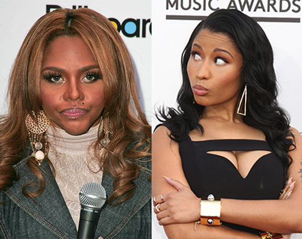

Rap has always been a boys club, identified by the masculinity of its roots, but that isn’t the case anymore.

Women in hip-hop have come a long way from the songstress on the chorus or eye candy in the video. Every so often there’s a gem of a female rapper who demands the attention of mainstream fans — rappers like Lil Kim, Foxy Brown, Trina, Remy Ma and Eve are household names and are some candidates for the woman rapper’s Mount Rushmore — but the talent pool is better than it’s ever been.

The new crop look like serious contenders though, led by Nicki Minaj and ignited once again by the likes of Iggy Azalea. Most exciting of all is Remy Ma’s release from prison; as we can see from the [“They Don’t Love You Know” remix](https://www.youtube.com/watch?v=BrkRtaKlWI8), Remy is coming for heads.

Refer back to those candidates for the women’s Mount Rushmore — Lil Kim: she stands as a living legend, her career is storied, her talent needs no validation, and she’s arguably the best female rapper there ever was. Now in the face of all this it would be understandable if Lil Kim just laughed off Nicki Minaj’s alleged poor attitude and attributed it to her as being wet behind the ears. But it looks like Nicki really irks Lil Kim.

Nicki recently released a [Flawless remix with Beyonce](http://www.billboard.com/articles/columns/the-juice/6206968/nicki-minaj-explains-beyonce-flawless-remix) and uttered the words, “Queen Bee." This incited Kim to put a few bars to track where she raps, [“Damn, it’s a shame, I gave you the rope bitch, I want you to hang.”](https://soundcloud.com/lilkimofficial/lil-kim-identity-theft)

The barbs have been flying between these two for a while. Since Nicki’s success with _Pink Friday, _Kim has been putting Nicki on blast for copying her style with little credit. Kim put on _Black Friday_ which fell sort of…flat. Almost immediately after this Nicki Minaj released "Tragedy" and if you haven’t heard the song I’ll warn you now it is a tragedy and Kim was the only casualty.

At this point, I wouldn’t call Kim’s attacks pathetic but they’re all lacking a particular flair, a flair that Nicki seems to come with exclusively. Nicki’s brio could be credited to her youth and just the fact that she’s been in a groove for the better part of three years. In this aspect, it seems like Lil Kim is fighting an uphill battle. No one can deny the similarities between Nicki Minaj and Lil Kim — I mean NO ONE: wigs, Barbie references, sex appeal. The list goes on and this kind of parody for Lil Kim, unfortunately, happens all the time.

With all of Kim’s status behind her it’s safe to say we won’t forget what she did for hip-hop but I don’t think this is what she wants to be remembered for. On the other hand, Nicki Minaj, who is still in the ascension of her legacy’s path, loves every second of this — the attention, the competition and more importantly the results, all which seem to be going Nicki’s way.

This all raises the question, are these female rappers becoming too big for their breeches or does rap need to grow in advent of these proven female commodities? Some would say the former but in reality it’s the latter, but no one seems to have told these women that there is enough room for them because the shots have been flying all between them. Keep in mind though, beef always supplies rap with a much needed storyline and a general increase in competition.

Nicki Minaj is expected to release _The Pinkprint _in 2014.

 