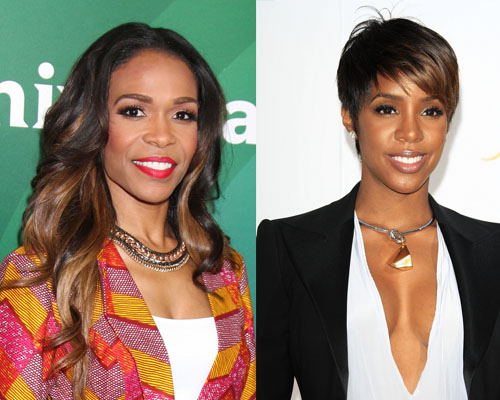
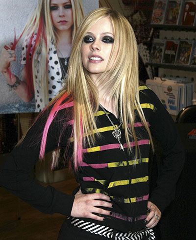

Whether you loved or hated _The Simple Life_ back in 2003, it's no surprise to see Nicole Richie on reality TV again with her new show _Candidly Nicole_. It's nice to see her with a purple hair, don't care attitude because she’s clearly a strong independent woman who don’t need no hotel chain heiress. Perhaps some fellow celebrities from the 2000s would like to crawl out from under last decade's rock and grace us with their presence. You can thank me later Vh1.

**Hoedown Showdown, hosted by Ashlee Simpson**

Just because she awkwardly danced her way off Saturday Night Live and out of our lives, doesn’t mean she can’t dance herself back into existence. No one likes to deal with conflict, so why not dance your way out of a breakup, job you hate, or parental obligations? Life is full of painful situations, and she’ll be there for contestants every dance step of the way out the door.

**Destiny’s Other Children, starring the members of Destiny’s Child that aren’t famous**

Before Beyonce was Queen Bey, she was singing and dancing with Kelly Rowland or Michelle Williams. But before that, she was singing and dancing with girls named LaTavia Roberson, LeToya Luckett, and Farrah Franklin. Life after Beyonce must be a rough one; these forgotten R&B pop stars are the true Survivors.

**Sk8er Men, narrated by Avril Lavigne **

Even sk8er boys have to grow up. Watch as ex-sk8er boys trade in their skateboards, skinny jeans, and shaggy hair for office jobs, suits that sort of fit, and a sensible haircut that won’t obstruct their view with greasy long hair. Sk8er boi wasn’t good enough for her, but maybe 401ker man will be. 

\[caption id="attachment\_366" align="alignnone" width="450"\] Sidenote: Tom has a great Instagram account!\[/caption\]

**CrySpace, a documentary by Tom from MySpace**

Participants share stories of how their past internet presence still haunts them to this day. Recovering from Top 8 drama and posing in weird angles with your parent’s digital camera is a major healing process. Embarrassing story for embarrassing story.

**Jon Dates 8, starring Jon Gosselin **

The ‘00s were nothing without competitive dating shows. Contestants are judged based on their ability to balance a romantic date while babysitting all eight of the Gosselin children.  And, of course, nothing's complete without a elimination ceremony catchphrase: "You have been...subtracted."

The true challenge isn't revealed until the final elimination where the last contestant must battle Kate Gosselin which then spawns off into its own reality show, "The Fate of Some Poor Woman's Life Is Literally in the Hands of Kate."  
