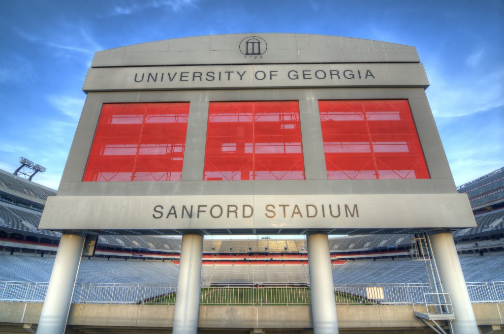

Whoever invented musical chairs was clearly not a sharer in grade school. The game pits participants in a round-by-round elimination. The point? To grab one of the remaining chairs — there are always less chairs than contestants —before an arbitrary amount of time is up. How brutal.

The inaugural modern College Football Playoff only includes four teams, and there are five major conferences. That means one of the elite conferences, and perhaps more, will be left standing when the music stops this winter.

The Big 10 had a chance early this season to prove that they deserve consideration for one of those four slots. Instead, the Midwest-based conference was practically eliminated from playoff consideration after the second weekend of the season.

Michigan State, the conference’s best bet to run the table, lost by three touchdowns at Oregon despite leading by nine in the second half. The Spartans looked like the better team through two and a half quarters, but the Ducks actually took control of the game on the defensive side of the ball. The Spartans exploded for 24 points in the second quarter, but they were held to just three points in the second half. Oregon has struggled against more physical teams the last few years, but they looked dominant against Michigan State.

Ohio State’s chances at winning a national title were over promptly after it was announced Braxton Miller would be out for the season. After watching the Buckeyes look hopeless on both sides of the ball against good-not-great Virginia Tech, it seems like Urban Meyer’s team probably wouldn’t have won it even with Miller.

The offensive line was helpless against Virginia Tech’s complex blitz packages, and the defense had trouble getting off the field. While having Miller would obviously help the flow of the offense, this team (or any team) can’t go far without at least a serviceable offensive line. Oddly enough, this could work out for Urban Meyer and the Buckeyes in the long run. Miller will be back next year, and most of the offensive line will return. The defense will bring back seven starters, and Ohio State will likely be favored to win the Big 10.

Notre Dame obliterated Michigan, Northwestern lost to Northern Illinois and Central Michigan lost by three touchdowns to Purdue. Hey, the Big 10 did have one signature win last weekend, though... Nebraska held off McNeese State, 31-24, on a spectacular late touchdown from Ameer Abdullah. (Well, maybe that's not quite signature...)

Luckily for college football fans, this is probably the last week we’ll hear about the Big 10 for some time.

\[caption id="attachment\_652" align="alignnone" width="620"\] Georgia is really good. South Carolina has looked very bad. And yet... Couldn't Steve Spurrier find a way to pull out a huge victory on Saturday?\[/caption\]

Week Three of the college football season includes the first SEC on CBS game of the year — another chance for Bob Stoops to beat a SEC team (and probably talk about it for a year).

#6 Georgia at #24 South Carolina, CBS (3:30 EST)

It’s great to have Verne and Gary back in our lives. The broadcasting duo is both loved and hated among SEC fans, but it signifies something much more important: SEC football is officially back.

Though Georgia has only played one game, they were so impressive that people, myself included, started considering them a national title contender, and perhaps even the favorite. [Todd Gurley is unstoppable when healthy](http://www.sbnation.com/college-football/2014/9/11/6136087/todd-gurley-georgia-south-carolina-game-2014), and he compiled nearly 300 total yards and three touchdowns on only 16 touches. The Bulldogs had a poor first half defensively against Clemson, but they shut out the Tigers in the second half.

South Carolina was terrible in its opening game against Texas A&M, and they submitted a lackluster performance in a win over East Carolina last week. The offense has been out of sync, and the defense gave up over 450 yards to the Pirates. For some reason, though, I like South Carolina in this game. Perhaps it’s because [I picked the Gamecocks to win the East](http://www.thehighscreen.com/2014/08/ins-and-outs-of-sec-football/), and now I’m just doubling down on my prediction. I’m also a member of the Steve Spurrier Fan Club, and Spurrier has been known to win games like this when people count him out.

South Carolina is likely going to put seven to eight defenders in the box to stop the Georgia running game. Georgia quarterback Hutson Mason is relatively untested, and Carolina defensive coordinator Lorenzo Ward should make Mason beat them. Gurley is great out of the backfield in the passing game, and that’s one area Georgia can attack if they’re unsuccessful with the run.

It’s only been two games, but the Gamecock’s offense has yet to get in a rhythm. Running back Mike Davis has been limited due to several minor injuries, and he’s the catalyst of the offense. Dylan Thompson has been average at quarterback, and the Gamecocks obviously can’t win the East unless he improves his play.

The loss to Texas A&M would quickly be forgotten if Spurrier’s team knocked off Georgia, and a win would put the Gamecocks back in the driver’s seat in the East. Georgia is the logical pick and will probably win by 30, but I have to give Spurrier one more chance.

Prediction: South Carolina 34, Georgia 31.

Tennessee at #4 Oklahoma, ABC (8:00 EST)

This game won’t be close. Tennessee has already made improvements in year two of the Butch Jones-era, but the Vols aren’t ready to compete on this stage just yet. This game will only serve as another message from Bob Stoops to the SEC that it’s a top-heavy league, and it’s not nearly as dominant as some suggest. Since Oklahoma handled Alabama in the Sugar Bowl, Stoops has made it very clear how he feels about the SEC. After the Sooners blow out the Volunteers this Saturday in Norman, it will only give Stoops more ammunition.

This might be the best team Stoops has had at Oklahoma. The Sooners don’t really have a weakness, and ironically, they’re built like a SEC team. They have plenty of speed, and a great quarterback in Trevor Knight, a physical defensive line, and a much-improved secondary.

Oklahoma faces plenty of difficult games ahead, but this Sooner team should be in the playoffs. And if they get there, hopefully, they get a shot at a real SEC powerhouse.

Prediction: Oklahoma 48, Tennessee 20.

#12 UCLA at Texas, FOX (8:15 EST)

UCLA was a trendy pick to represent the Pac-12 in the playoffs this year, but the Bruins have looked anything but elite in the first two games. The offensive line hasn’t been able to protect Brett Hundley, and UCLA squeaked by Virginia and Memphis. Obviously they can fix the issues they’re having now, but the schedule doesn’t get easier from here. A road game at Arizona State next week starts a difficult conference schedule, and the Bruins have to clean up problems on both sides of the ball quickly.

UCLA’s opponent this week has far more problems. Texas was embarrassed a week ago by BYU, and the Longhorns looked lost without David Ash at quarterback. Ash isn’t playing this week either, but the Longhorns also had major issues on the defensive side of the ball. BYU had over 400 yards of offense, and they forced four Texas turnovers. Charlie Strong’s debut season has already involved the dismissal of eight players, and the Longhorns have a long season ahead of them if they can’t upset the Bruins on Saturday.

No one expected Texas to compete for a national title this year, but losing by 34 to BYU in Austin isn’t a promising look for the future. The Big 12 has improved, and the Longhorns are [losing the recruiting battle now to in-state rival Texas A&M](http://www.orlandosentinel.com/sports/florida-recruiting/blog/os-texas-am-enters-jacques-patrick-sweepstakes-20140912-post.html), who is, of course, in the SEC.

Both of these teams have problems that need to be addressed as quickly as possible, and a win for either team this weekend would be extremely valuable for either Jim Mora or Charlie Strong.

Prediction: UCLA 37, Texas 24.

The Big 10 (Ironically, this week’s top 14 doesn’t include a Big 10 team.)

1\. Oregon 2. Georgia 3. Auburn 4. Florida State 5. Oklahoma 6. Texas A&M 7. LSU 8. Baylor 9. Alabama 10. USC 11. Notre Dame 12. Missouri 13. Virginia Tech 14. Ole Miss

Just Missed the Cut: UCLA, Michigan State, Stanford, Arizona State, Kansas State, Louisville

Extra Points • It was only against Eastern Michigan, but Florida’s offense looked dynamic again last week in a 65-0 rout. [Jeff Driskel isn’t a pro style quarterback](http://espn.go.com/blog/sec/post/_/id/88154/driskel-thrives-in-return-as-gators-qb), which is why he fits in nicely in Kurt Roper’s offense. • Alabama still hasn’t decided on a starting quarterback, but Blake Sims looks much more comfortable than Jacob Coker. Sims still hasn’t proven he can throw effectively downfield, but he’s been very accurate on short passes – especially to Amari Cooper. • Breaking News: [Auburn is good at running the football](http://www.al.com/auburnfootball/index.ssf/2014/09/finding_trends_stars_as_we_exa.html). • What’s worse for Rutgers — That they had to [distance themselves from one of the most decorated players in school history](http://www.thehighscreen.com/2014/08/a-consistent-failure-roger-goodell-does-not-care-about-janay-palmer/), or that they’re in the Big 10 now? • Virginia Tech’s win over Ohio State was massive for Frank Beamer and the program, but don’t be surprised if East Carolina gives them a tight game on Saturday. • Kansas at Duke Saturday? If only it was basketball season… • Great win for Steve Sarkisian and USC on Saturday, and I think the Pat Haden situation was overblown. Like every AD in the country, he really wants his team to win. I don’t think that will interfere with his objectivity when deciding on the best four teams for the playoffs. • Bo Pelini really likes testing the phrase “job security,” it seems. • Bret Bielema vs. Kliff Kingsbury on Saturday. Have there ever been two coaches so different in [every way possible](http://espn.go.com/blog/big12/post/_/id/89150/tale-of-the-tape-kingsbury-vs-bielema)? • Texas A&M’s Kenny Hill wants to be called “Kenny Trill,” which wins this week’s award of “Worst Nickname in Sports.”
