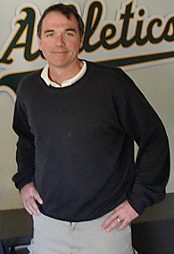

The recently-developed one-game wild card playoff in baseball has created a “do or die” or “one and done” mentality. After 162 games, suddenly, only one game matters. Never has this been more appropriate than for this year’s American League matchup. Kansas City and Oakland are entrenched in win now seasons more so than the rest of the playoff field. For most fan bases, sans New York Yankees, it’s never really World Series or bust, but these two teams are as close as it gets this year.

[Kansas City hasn’t made the playoffs in 29 years](http://www.thehighscreen.com/2014/09/the-royals-might-actually-pull-this-off/), which you know if you’ve been paying attention to baseball at all this week but can’t really verify unless you’re middle-aged or older. The Royals have been stockpiling prospects for years as the baseball community has eagerly anticipated their climb back into relevance.

General Manager Dayton Moore decided he was sick of waiting for his prospects to mature (Eric Hosmer and Mike Moustakas specifically) and expedited the process by trading baseball’s top prospect, Wil Myers, to Tampa Bay for starting pitcher James Shields and reliever Wade Davis before the 2013 season. While Myers was under team control for six more seasons, Shields had only two years remaining on his contract.

The 2013 season was the best Kansas City season in years, but didn’t result in a playoff appearance as the team fell just short. Meanwhile, Myers earned the rookie of the year award for a Tampa Bay team that did make the playoffs. (Ouch.) The trade, which was unpopular from the moment it happened, looked even worse in the offseason. Why was it worth it to trade for two years of a very good starting pitcher for six years of the best prospect in baseball?

Things have been slightly different in 2014. Hosmer and Moustakas still haven’t lived up to potential and the offense as a whole has been punchless — the team only hit 95 home runs this season. But the team got by anyway due to speed, quality base running, excellent defense and some of the game’s best pitching. Shields and the young Yordano Ventura provided a very good one-two punch while trade throw-in Davis morphed into the [best relief pitcher in the world.](http://bleacherreport.com/articles/2148521-royals-wade-davis-finally-allows-extra-base-hit-in-44th-appearance-of-season) He pitched 72 innings and allowed just eight earned runs on 38 hits. His 1.00 ERA is barely fathomable.

It’s the kind of season that seems impossible to repeat. Which means it probably won’t be repeated. Just as Kansas City probably won’t have the money to resign Shields (or a pitcher of a similar caliber) in the off-season. The Royals still will have plenty of young talent, but it’s hard to rely on speed, defense and a bullpen to carry you when there are not many bats in the lineup.

Kansas City had to fight to game 161 this year just to get in the playoffs. Next year will be harder. The Tigers are still the Tigers, Billy Beane always has something up his sleeve, Cleveland will be heard from, as will Boston and Tampa Bay. Texas won’t lose 95 games again next year. This really might be Kansas City’s best chance to win it all. It all hangs in the balance of one game.

If not, I’m sure it was just fun for Kansas City fans to root for a team that matters again.

\[caption id="attachment\_927" align="alignnone" width="195"\] Billy Beane went all in with the recent Jon Lester trade. Now Oakland has one game to prove it paid off.  
(copyright pl.wikipedia.org)\[/caption\]

 

Billy Beane is all in on winning the World Series this year. He’s also been quoting as saying his “shit doesn’t work in the playoffs.”

The A’s have made the playoffs in eight of the past 14 seasons but have yet to win so much as a pennant in that time. The playoffs are a small sample, which makes them prone to random noise. But after two consecutive years of falling to the Tigers in the ALDS, Beane had enough and decided to do all he could to ensure the A’s had the best chance at winning a championship this year, even if it meant the future would be put on the line. He added arms Jeff Samardzija and Jason Hammel before trading power-hitting outfielder Yoenis Cespedes for ace Jon Lester.

I’ve covered this [in depth](http://www.thehighscreen.com/2014/09/narrative-vs-reality-defending-billy-beane/) but I’ll reiterate it here: the only role this trade played in Oakland’s subsequent slump was to soften its blow. Lester has started 11 games for the A’s (all quality starts) and has posted an ERA of 2.35. He’s not just a good get, he’s a Cy Young candidate.

Like Shields, Lester will be a free agent this offseason. And like Kansas City, Oakland probably won’t have the money to resign him. While Beane will certainly be plenty busy this off-season making sure the A’s stay competitive, he’s made it clear the team’s all in on winning this year. Beane might be the best bargain hunter in baseball but there aren’t usually any spare Jon Lesters laying around. This might be Oakland’s best chance.

It’s fitting, really. Not just that the “do or die” wild card game features two “do or die” teams. More so that it features two teams who can’t seem to catch a break, whose fans have suffered through seemingly endless regular season woes. Neither team has won a World Series since the Reagan administration. The A’s have lost in the ALDS six of the past seven times they’ve made the playoffs. Kansas City hasn’t even been that lucky. And in a year where both teams went all in on winning, one won’t get to play more than one playoff game.

It all comes down to the two guys the teams seemingly mortgaged their futures for – Lester and Shields.

Doesn’t that just feel like October?
