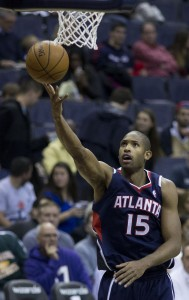
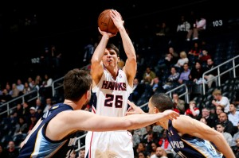
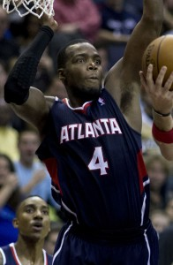

\[caption id="attachment\_915" align="alignnone" width="189"\] All-Star Al Horford returning to the floor means a whole lot of good for Atlanta, a team that figures to be a whole lot better than many think.  
(Photo taken by Keith Allison)\[/caption\]

 

Following its pleasant performance against overwhelmed top-seed Indiana in April, Atlanta spent the opening months of the NBA’s off-season — which has become, in a way, an even more rowdy time for teams than the actual basketball season — as a sleeping giant. Head coach Mike Budenholzer, formerly a student of Father Greg Popovich and the church of Spurs basketball, was impressive in his first season, as the Hawks began ’13-’14 in splendid form before losing franchise player Al Horford to a season-ending pectoral injury and still made the playoffs. (Granted, in the East.)

Atlanta took a tremendous amount of cap space into the summer, and while many believed it was to make a major play at a star, it appears their growing wad of cash is just the Hawks practicing financial discipline. After the modest signings of Thabo Sefolosha and Kent Bazemore, and adding first round pick Adreian Payne, Atlanta is well underneath the salary cap this season, and has just $39.5 million in salary committed next season, freeing the organization to do feasibly anything — participate in blockbuster trades, collect assets in exchange for cruddy contracts, and/or make a power play in the summer of 2015 or 2016 for a big-name free agent.

The organization’s flexibility suffered a huge blow, however, when the story broke in September about separate, racially insensitive comments made by then-Owner Bruce Levenson (who has since decided to sell the team) and General Manager Danny Ferry (whose future with the team is largely undecided). Ferry has garnered much support over the past weeks, as current and former NBA players and executives have offered their review of Ferry as both a colleague and a man. While the opinions of Luol Deng and [Masai Ujiri](http://www.theglobeandmail.com/sports/basketball/masai-ujiri-weighs-in-on-the-danny-ferry-controversy/article20558085/) on this matter specifically mean a lot, the Hawks will likely have a devil of a time convincing NBA players on the open market to come and play for Ferry in the aftermath of this controversy. Atlanta, which has had a large enough problem as it is getting top-shelf free agents to consider playing there, might have fractured their chance of using its cap space in the bountiful summers to come as long as Ferry is GM. The team’s hands may be tied.

It has become a pun amongst basketball fans how little fanfare exists for the Hawks outside of Atlanta, and with the negative press surrounding the team’s front office this summer, it appears from the outside looking in that everything is going poorly. On the court, though, the Hawks appear to be as steady as they’ve been in years. Budenholzer returns his entire core from last season, and with Horford back, as well as the role players added to sure up the bench, Atlanta enters the ’14-’15 campaign quietly with one of the most talented groups in the East. During a recent interview with the [Atlanta Journal-Constitution](http://www.ajc.com/news/sports/basketball/q-and-a-with-hawks-coach-mike-budenholzer/nhT3z/), Budenholzer said he is “significantly more focused” on his team than the rest of the league. He acknowledges LeBron James switched teams — almost as if it wasn’t the largest story in sports this summer — and that Chicago “added some good players” but otherwise seems disinterested with the operations of any team outside of the Peach State.

Taking that one bit further, I get the impression that Budenholzer is tired of the attention his franchise is receiving for its mess of a front office, and not for the players he coached into the post-season last year. Hell, even Kyle Korver and Paul Millsap were left off Team USA when both players seemed to be ideal replacements for the long list of All-Stars that turned down the team. Were they left off the final roster _because _they are Atlanta Hawks? No. But the fact that two perfectly suitable players for the international game were left off a depleted Team USA roster, and thus not a single Atlanta Hawk was selected this summer, or any summer in recent USA Basketball history. The Atlanta Hawks have seemingly become synonymous with a lack of exposure; only in the midst of a race-related controversy can they garnish any coverage whatsoever.

The Hawks are playing with a chip the size of Korver’s three-point range this season. And they might just be a contender in the East because of it.

Atlanta has the feel of a team on the rise but its core has a great deal of NBA experience. Jeff Teague is the team’s youngest starter at 26 but Teague has been the starting point guard for Atlanta the past three seasons, missing just six games, and has appeared in the playoffs in all five seasons of his NBA career. Seven of the team’s core players, including Sefolosha and his abundance of playoff experience in Oklahoma City, are 28 or older. Even Atlanta’s rookie Payne is “old” at 23, a graduate of Michigan State under renown coach Tom Izzo.

In 29 games with Horford last season, Atlanta was 16-13, and spent a large portion of that stretch as the No. 3 seed in the East. Horford was enjoying the best basketball of his career in Budenholzer’s offense; in a cool 33 minutes per game, Horford averaged career-highs in points (18.6 points) and field-goal percentage (.567). The 6-10, 250 pounder even went 4 for 11 from deep after never making more than 3 three-pointers in a season. His Tim Duncan-light offensive game was coupled, per usual, with a handsome haul of rebounds (8.4), blocks (1.5) and assists (2.6).

Horford’s injury was less of a road block and more the edge of a cliff for Atlanta. The team sputtered to a 22-31 record over the duration of the season, barely clinging to the No. 8 seed in a mystifying battle of suck between the Hawks, Knicks and Cavaliers. Atlanta was a Top 10 offense with Horford but finished the year 23rd; it’s impossible to replace All-Star production with a “Keep Getting Them Checks” version of Elton Brand and Pero Antic.

And to his credit, Budenholzer tried. In fact, the starting lineup with Antic posted an offensive efficiency of 108 over 298 minutes, and maybe more impressively, the starting lineup with Brand outscored opponents by a dozen points per 100 possessions over 200 minutes. But sliding Antic and Brand up to pseudo starting spots truncated Atlanta’s bench, and opposing teams murdered them whenever Mike Scott and Brand shared the floor.

Ironically, it was the makeshift version of Atlanta with Antic, a free-spirited jump shooter starting at center, that thrived against the emotionally damaged, plodding defense of Indiana. The Hawks nearly shot their way into the second-round before Paul George took his play into high-gear, dominating both ends of the court as a long-armed, two-way menace, something the Hawks personnel couldn’t account for. But Atlanta was lucky to make the post-season at all, and had no business winning that series without Horford — a shame on you to the New York Knicks and Pacers, respectively.

\[caption id="attachment\_916" align="alignnone" width="300"\] Kyle Korver is in a league of his own as an offensive threat.  
(Copyright thesportspost.com)\[/caption\]

 

There’s a lot to be excited about for Atlanta. For starters, at the age of 33, Korver is playing his greatest basketball. As [Zach Lowe wrote about in his brilliant feature](http://grantland.com/features/kyle-korver-nba-atlanta-hawks/), Korver has become a one-man offense and the most unique shooting threat in the game. My favorite stat from last season? A Korver stationary three-pointer went in 58 percent of the time. Dear lord.

The Hawks scored 108.7 points per 100 possessions when Korver was on the floor, which would have made them the fourth-best offense in basketball. But Korver’s impact was also felt on the defensive end, where he is sorely undervalued. He is a great scheme defender, rarely missing an assignment, and the Hawks let up a disgusting 110.3 points per 100 possessions whenever he hit the bench, which would have made them worst in basketball. According to [82games.com](http://82games.com), Korver made the Hawks 8.5 net points better.

\[caption id="attachment\_917" align="alignnone" width="196"\] Paul Millsap represented Atlanta in the 2014 All-Star game, his first career appearance.  
(Copyright commons.wikimedia.org)\[/caption\]

 

In his first year with the team, the always undervalued Millsap represented Atlanta in the All-Star game, averaging 18.6 points, 8.6 rebounds, 3.4 assists and 1.8 steals in the absence of Horford. Millsap was brought in as a compliment to Horford, a hyper-productive second option on a cheap deal. But just like in Utah, Millsap blew away all expectations. Under Budenholzer, Millsap is employing a reliable three-point shot, something he didn’t use at all in Utah. After never attempting more than 39 three-pointers in a season, Millsap made 76 of 212 long-range shots on 35.8 percent shooting. Good for you, Paul!

Look a little bit closer, however, and you can feel Horford’s injury even in those overall solid shooting numbers. In Millsap’s 28 games beside Horford, he hit on 45.7 percent of his three-pointers — more than one 3PM per game. He was particularly deadly on spot-up threes above the break, as he made 21 of 47 (44.7 percent) of those shots. Millsap greatly benefited from Horford’s vision as a passer and the space he creates as the biggest target of opposing defenses. Horford assisted to Millsap 14 times over the first 28 games, per NBA.com, the third-highest mark on the team, and most of any non-guard. Horford commands much attention on the block, and Millsap was more than willing to launch open jumpers when his man sneaked toward Horford.

While Millsap enjoyed a fantastic season, and was well-deserving of his All-Star spot, everything came harder for him without Horford. He shot just 44.5 percent from the field in his 46 games without Horford, as his efficiency suffered without the extra room to operate. He went ice cold on jumpers inside the arc, shooting 55 for 165 (33.3 percent) between 8-24 feet, down from 38 percent with Horford. His long-range numbers went flat, as well. In nearly twice the games, Millsap only made 44 threes without Horford on 31 percent shooting. His percentage on three-pointers above the break fell to 32.3 percent, a mighty drop of 12.3 percentage points. Millsap had even experienced limited success on left corner threes with Horford, making 5 of 8, but in the 46 games without the big man, he made just two left corner threes on a puny eight attempts.

With Millsap as their defacto best player, the Hawks went 20-26, which is bad enough, but they were miserable in seven games without him. Atlanta went 2-5 in games without Millsap during the second half of the season, and were outscored by their opponents 749-707 — which includes a questionable late-game effort by the Milwaukee Bucks in the final game of the season. Horford and Millsap are sneakily one basketball’s best frontcourt duos; that we only saw them together for 28 games before Horford’s injury only adds mystery to Atlanta’s season.

Eric Bledsoe’s shiny new contract places a spotlight on Teague heading into his fourth year as the full-time starter in Atlanta, and his second under Budenholzer. [Say what you want about Bledsoe’s annual salary](http://www.thehighscreen.com/2014/09/eric-bledsoe-to-stay-in-phoenix/) — he will be the sixth-highest paid point guard in basketball — but the impact the former Kentucky Wildcat makes on both ends as an electric slab of rock is worth the pricy investment. Bledsoe is not a first-tier point guard in basketball, but when healthy, he can play his way into the second-tier ranks — among the John Walls, Damian Lillards, Kyrie Irvings and Kyle Lowrys — and in coach Jeff Hornacek's offense, having guards like Bledsoe, Goran Dragic and Isaiah Thomas is invaluable.

Teague is a very different player and is paid like it. At $8 million per year, Teague is paid to be a model of consistency in an offense that is much more skilled at other positions — notably forward (Horford, Millsap) and on the wing (Korver). So much of the Hawks current makeup is Spurs-esq, and much has been written about Teague playing the Tony Parker [role in Budenholzer’s plans](http://grantland.com/the-triangle/mike-budenholzer-is-hoping-jeff-teague-can-become-atlantas-tony-parker/).

The only problem is that he is not Parker, and it’s not really close.

Parker lives around the league-high in finishing at the rim each season, and is one of the game’s best shooters inside the arc — long his safeguard against a limited three-point stroke. But Teague isn’t a finisher in the same realm as the Frenchman, and his mid-range and three-point shot are both below Parker as well. Teague had his worst long-range shooting season of his career, finishing at a clip of .329 and making less than a full 3PM per contest. Some of that dip can be attributed to the loss of Horford, presumably, as the offense never recovered its zenith in spacing without the big guy. But Teague has seen his field-goal percentage drop the past two seasons (from 47.6 to 43.8) and he was [one of just eleven players who shot as poorly as he did on 2’s and 3’s and started 50 games or more](http://www.basketball-reference.com/play-index/psl_finder.cgi?request=1&match=single&type=per_game&per_minute_base=36&per_poss_base=100&lg_id=NBA&is_playoffs=N&year_min=2014&year_max=2014&franch_id=&season_start=1&season_end=-1&age_min=0&age_max=99&height_min=0&height_max=99&shoot_hand=&birth_country_is=Y&birth_country=&is_active=&is_hof=&is_as=&as_comp=gt&as_val=&pos_is_g=Y&pos_is_gf=Y&pos_is_f=Y&pos_is_fg=Y&pos_is_fc=Y&pos_is_c=Y&pos_is_cf=Y&qual=&c1stat=fg_pct&c1comp=lt&c1val=44&c2stat=gs&c2comp=gt&c2val=50&c3stat=fg3_pct&c3comp=lt&c3val=33&c4stat=fg3a_per_g&c4comp=gt&c4val=2.5&c5stat=&c5comp=gt&c6mult=1.0&c6stat=&order_by=ws) last season.

To Teague’s credit, he did set a career-high in scoring last season (16.5) in large part to getting to the foul line more often. He attempted 4.8 FTA after never taking more than 2.8 FTA in a season. His 84.6 percent clip at the line is excellent, and grabbing four free points every game is a nice way for Teague to stay involved in the offense. He’s probably never going to be Tony Parker from mid-range or at the basket, but if he can synthesis points with trips to the charity stripe, Teague is a solid value at $8 million.

It should also be noted that assists per game alone is a suspect way to rank point guards. There are a lot of reasons why Chris Paul is better than Teague, and his assist count has little to do with it. Ricky Rubio averages a substantial number of assists more per game, but considering [he might be the worst shooter in NBA history](http://grantland.com/the-triangle/courtvision-whats-the-matter-with-ricky-rubio/), Teague is ultimately the more well-rounded guard, if not a better player outright. Atlanta has been the top assisting team in the NBA the past two seasons, and was Top 6 in Teague’s first season as starting point guard. Offenses led by Teague keep the ball moving, as do team’s running Budenholzer’s scheme, and with Horford back, Teague’s efficiency should recover.

Atlanta was 13th in defensive efficiency in 29 games with Horford, a figure the team should replicate with its top interior defender back and an influx of long-armed wings (Sefolosha, Payne). The Hawks were mostly league-average on the defensive end even after Horford’s injury, and as we saw from Miami during the backend of the Heatles-era, regular season defense only means so much in the East.

Much more crucial to the team’s success will be regaining its Top 10 offensive form. The projected starting lineup logged 390 minutes together last season, and familiarity from year-to-year can make a huge difference, especially as several teams Atlanta will be competing with for playoff position (Washington, Charlotte, Miami) are dealing with varying degrees of roster reinvention. Regardless of the madness taking place atop the organization, and the looming sale of the team, Atlanta is a healthy basketball team with one of the best collections of veteran talent in the East. A run at home court in round one has Budenholzer and company terrifically focused, even as the Atlanta Hawks Co. remains all over the place.

