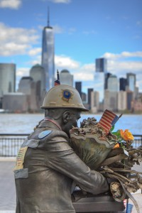

\[caption id="attachment\_906" align="alignnone" width="200"\] 9/11 connects Americans in a way that is often indescribable. As we learn about Western traitors assisting I.S.I.S., it begs the question how could an American turn its back on the country?  
(Copyright 2005 The Sculpture Foundation)\[/caption\]

 

Over the past couple of months, there have been whispers about a shadow returning to Mordor... Well, that’s not true, but from listening to the conversation surrounding I.S.I.S, that is how it seems, anyway.

Anyone who will read this will remember with some clarity some sensation from his or her experience of 9/11.  Not because of the historical, social, political, and economic consequences 9/11 has made on our world but because 9/11, as an event, was an experience of difference, void of these critical significances at the moment of its occurring. This is especially true for readers my own age who would not become conscience of such significances until much later in their lives.

And even for those who began speculating of the political and societal tribulations to come on the morning of Sept. 11, 2011 — it would take someone with unbelievable pragmatism — over the past thirteen years, for all of us, there is a process of applying significance to the Horror experienced that day retrospectively. As we learn more (are told more?) the experience grows.

Although our intellects have woven these significances into the fabric of our individual memories of 9/11, our experience of the Horror was an experience of difference — an intrusion of something unknown. In my experience and the experiences of most of my peers, the tragedy of 9/11 was something unspoken — adults in my life remained silent about what was going on for what felt like an unendurable amount of time — that sliced its way into our otherwise familiar routines.

When we "remember" 9/11 — which is to ignore how post-9/11 American life has become in thirteen years — names like Taliban, Osama Bin Laden and George W. Bush are conjured up. It's the process of remembering the tragedy that makes it impossible to actually return to the emotional state of that morning. As a date and noun, "September 11" had no cultural relevance before the terrorists attacks; for thirteen years now the end of summer has become synonymous with adding a tally to the 9/11 anniversary count.

For Americans, young and old, 9/11 has been a 13-year-old nightmare; by the looks of the current Middle East, we won't be waking up anytime soon.

So now, whispers that began in the summer of an evil rising again in the Middle East are intensifying. This summer we were given the unbelievable news that Gondor had fallen when we heard that [the Iraqi military in northern Iraq, which the United States military had exerted exhaustive energy to train, had collapsed against I.S.I.S](http://www.washingtonpost.com/world/iraqi-military-facing-psychological-collapse-after-losses-desertions/2014/06/22/88ed659a-fa4a-11e3-8176-f2c941cf35f1_story.html) after minimal opposition.  The latent extremist Islamic threat had been made actual.

The traitors who have been leaving western nations to join I.S.I.S are the subject of much of the conversation concerning the Islamic State. These traitors invoke a feeling of fantasy and unreality for me; they are like those nameless called into Legion or Randall Flagg in Las Vegas. I can not understand them, yet still I try to.

An unhealthy skepticism and cynicism is and has been prevalent in the American consciousness since Nixon and Watergate. This American cynicism was strengthened by the aftermath of 9/11. What were Bush’s real motives in the Middle East? Were Osama Bin Laden and the Taliban trained by the C.I.A? Why did the Obama administration refuse to release a picture of Bin Laden’s body?

What I am struggling to understand is whether or not these questions can be intoxicating and obsessed about enough by an American citizen to make him antagonistic against his president and country. 

Maybe.

But then why not attempt to reform the United States from within? What makes the prospect of attempting to destroy a nation more desirable than reforming it? Some men just want to watch the... Oh, you know: http://www.youtube.com/watch?v=efHCdKb5UWc

There is no America except for what one thinks of it as a country — the perception of America. That perception ranges dramatically depending on wherever you are in the world. The Redwood forests do not exist anywhere except for in picture books and song. This is true of all nations’s landmarks. Mount Sinai is as Egyptian as Mars.

I say that because much criticism has been directed at the United States military over the past decade. This is probably a good sign, that the American moral heart still beats beside its war drums.  Americans respect our military not because we envy what our military men and women do — that is very often kill, and put themselves in the position to be killed — but we respect them because they willingly sacrifice themselves to the act of killing. By doing so they sacrifice their morality.

If 9/11 has taught Americans anything, though, it's that the sentiment surrounding America's military transforms from one of unrelenting respect to absolute hatred depending on an individual's vantage point. When President Obama orders airstrikes to defend the world against I.S.I.S. it makes some parts of the world feel safe, and others, very literally, terrified for their lives.

Some view the United States as a protector of humanity, and others believe America is the ultimate destroyer of that very principle.

To turn against America is to turn toward a belief that the United States is a great evil, something that is impossible for the vast majority of Americans who lived through 9/11 — who saw New York City on fire and bodies falling from the sky — to understand. And yet, for Western traitors, if you asked them, I assume they would say otherwise.

I still do not understand these traitors, but I will try: American traitors who seek I.S.I.S do so because they must. May they remain unknown to us.

