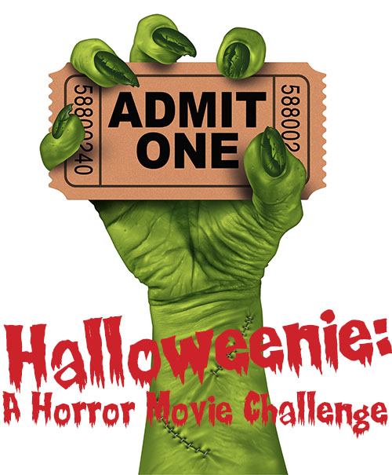
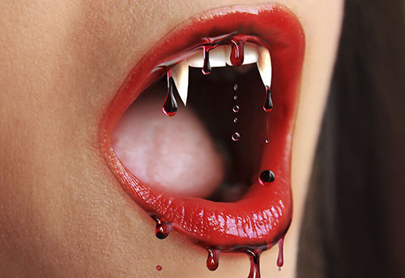
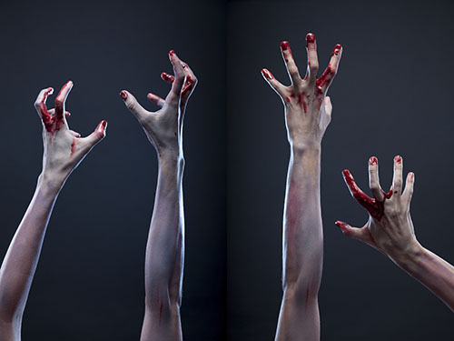
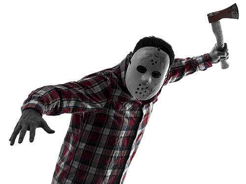
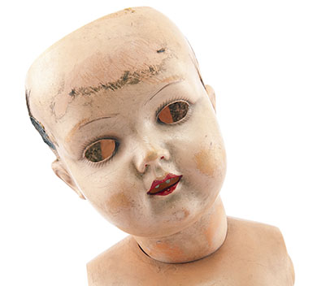

Remember that Green Day song “Wake Me Up When September Ends?" I feel this way about the month of October.

Growing up, I always opted out of the horror of Halloween and focused on the fun parts — eating candy, wearing pretty outfits that straddle the line of appropriateness. (That's what Halloween is all about, right?)

Scary movies have always been a no-go for me, and yet, in the digital age, I can’t escape them. It used to be simple as turning the TV off whenever a creepy preview came on but those days are long gone. I’ll be scrolling through Tumblr, one minute there’s a nice steady feed of puppy pictures and BAM someone had to post an entire .gif set’s worth of the most terrifying shit ever. Just trying to watch a nice YouTube video of hamsters eating burritos, can’t get to the cuteness until I’m forced against my will to sit through a horror movie preview.

I can’t shut myself off from the world until I have to get dolled up in some half assed sexy cat costume just so I can possibly get free drinks at a bar. I’m a grown ass woman who needs to face her fears, and most importantly not violently shut her laptop down whenever a horror movie ad appears. Therefore, I’ve challenged myself to watch a number of horror movies throughout the month of October.

It’s not like I’ve never seen a horror movie and I have successfully sat through a few of them. I’ve seen a small fraction of what’s out there, but perhaps you’ll be surprised at how many classics and cult favorites I haven’t seen. I have my friends to thank for what I’ve seen so far, it’s a miracle they’re not deaf.  To be honest, I’m pretty calm during the whole experience. I don’t think I’ve ever cried, an occasional scream is inevitable, and my apologies to any date who’s had to endure a painful hand squeeze.

Perhaps it’s my neurotic nature but my fear of horror movies is more of a mind game. I’ll sit there nice and calm, look away a few times, but it’s everything afterwards that gets to me. I’ll be a total paranoid android and the movie will just stay with me, especially if it’s realistic.

Here’s a definitive ranking of things that freak me out. Judge me all you want, if you already haven’t:

 

**Monsters** - I’m not even sure if this counts as a category, that’s how clueless I am to this entire genre. I don’t know, monsters seem a bit too ridiculous for me. Like I feel disturbed, but they’re also on the same level of unicorns in terms of existence, so then I’m all good. Then again, I think aliens get lumped into this category and I’m not going to completely rule them out.

 

**Zombies** - Although a zombie apocalypse is possibly one of the most realistic scenarios, I think binge watching every episode of _The Walking Dead_ this past summer just kind of desensitized me toward them. Sign me up for more zombie killing classes please.

 

**Serial Killers** - Obviously (and unfortunately) this is a thing that exists in the real world. However, movie serial killers have such a strange range. Like if Freddy Kreuger approached me I’d scream at first but then ask him where he likes to shop for sweaters. But would I ever call up Hannibal Lector to come meet up at Starbucks for Pumpkin Spiced Lattes? Absolutely not.

 

**Ghosts/demons/etc..** - Basically if you can’t shoot, stab, or call the cops on it, you’re probably fucked. That’s how I see it at least. But let’s break this down a bit further: **Possessed children** - noooooope. **Haunted dolls** - more noooooope. **Angry vengeful spirits** - I didn’t even do anything to you, can you not?

I’ve decided to watch a whole range of horror movies covering what I’m afraid of, and perhaps what I didn’t know I was completely terrified of. Every week, I’ll watch a couple and then of course give a review based on all of my scaredy cat feels and hopefully some triumphs. Halloween hilarity and terror ensues.

 
