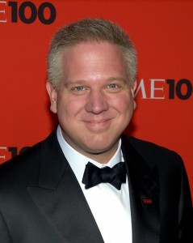

https://www.youtube.com/watch?v=2IW8OK4\_1gQ&feature=youtu.be

I watched a video the other day that a friend of mine had posted on Facebook.  In the video, Glenn Beck talked about nihilism and pop-nihilism.  His conclusion was that nihilism is bad — that there _is_ meaning in the world if we pay enough attention to find it — and that pop-nihilism should be combatted by himself and others in the conservative, christian, religious, spiritual sphere.

The people who identify themselves within the conservative, christian, religious, spiritual sphere — and who listen to Glenn Beck regularly — are the same people who vote in the Republican primary election. This is a group of predominantly white, middle to upper class christian men and women with, of course, many exceptions. (Glenn Beck is, of course, a white upper class christian man.)

When people want to talk about nihilism, do they really want to talk about it with Glenn Beck? The feelings of despair and fatigue that lead me sometimes toward a nihilistic attitude will never be assuaged by Glenn Beck, for the same reason that these same feelings were probably not entirely assuaged in peasants living in the middle ages by the priests of their regions.

\[caption id="attachment\_973" align="alignright" width="239"\] Glenn Beck is a man of many messages. So when he critiques the art of Jay Z and TV's finest auteurs, what is actually motivating him?  
(Photo taken by David Shankbone)\[/caption\]

When we talk about nihilism, what are we talking about? Glenn Beck’s video is almost entirely concerned with pop-nihilism — with nihilistic messages that are sent to people who have the time, and apparently the extra money, to receive them from HBO. Pop-nihilism and nihilism are not topics of the same conversation.

I have never met a real nihilist because I live a privileged life. But I imagine that a true nihilist is someone who has built and maintained enough hate against everything and everyone around him/her as a result of being beat and neglected by a racist economic and political system. This system is not perpetuated (directly) by artists and scientists; it's perpetuated in the interests of men like Glenn Beck.

A final thought: Since I graduated college, I have been working at Starbucks. One of my coworkers is a girl who immigrated from Germany a couple of years ago. Her family followed her over to America this summer, in time for Germany to win the World Cup.

She works 80 hours a week between Starbucks and her other job. 80. I work 40 and I barely have time to write this article. 

She works 80 hours a week and she is one of the happiest people I know.
