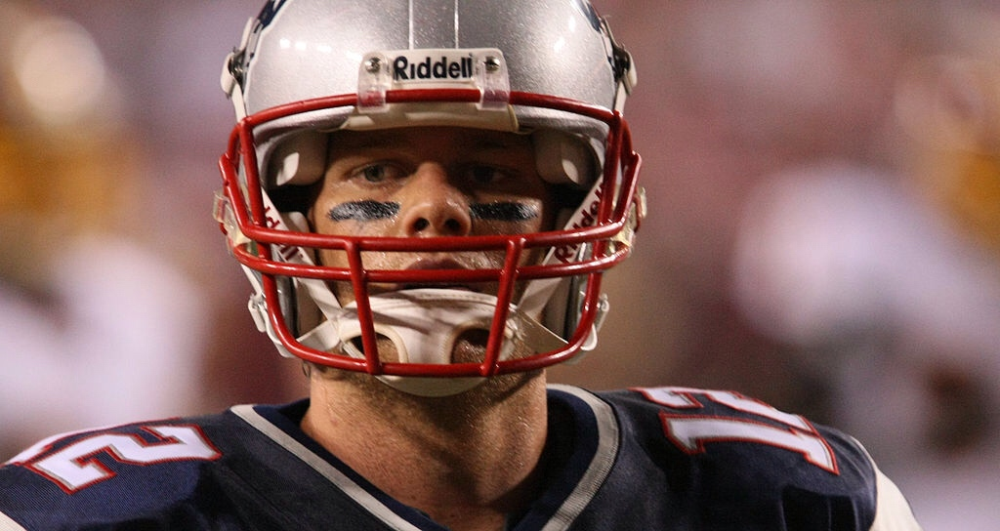

\[caption id="" align="alignnone" width="514"\] (Photo taken by Keith Allison)\[/caption\]

 

I think I’ve found the sole silver-lining with the NFL’s farce of a mid-week match up. With the bar being set so perpetually low each and every Thursday, we can’t possibly be disappointed with the overall competitiveness of Sunday.

A brief recap of my pick record this year:

Season Record: 35-27

Last week: 7-6

We’ll do things a bit differently this week. Instead of the arbitrary listing of games in the order they are to be played, let’s spice it up a bit-I know the non-baseball fan readers have been asleep since the second quarter at Lambeaux-and pit them against each other in order of least interesting games to most.

14\. Tampa Bay at New Orleans

What’s more shocking? The Bucs’ last second win a week ago or the fact that Saints are 0-3? In either case, this game may have little staying power with Drew Bree’s out for blood. Sure it’s a divisional matchup but Tampa has little chance in the dome Brees built. The Saints aren’t very good on the road but they’re next to invincible on their own turf.

Saints 35 Buccaneers 24

13\. St. Louis at Philadelphia

Austin Davis has another decent match up against a poor NFC East secondary but something tells me he’ll be hard pressed to duplicate the success he had against Dallas two weeks ago. Philly is wounded after blowing their own double-digit lead in a loss to the 49ers, a contest in which their offense failed to score a single point. With Jeremy Maclin on the rise and a super-talented, albeit quiet backfield, Nick Foles should be able to keep his team atop the NFC East for another week.

Eagles 28 Rams 14

12\. Cincinnati at New England

Despite this being the Sunday Night Football game, expect a lot of back and forth between Al Michaels and Chris Collinsworth that details Brady’s storied career compared to where the Pats find themselves limping around now. Michaels will ponder if this is the end of the Belichik-Brady era and Collinsworth will chuckle and say something along the lines of “At the end of the day it’s hard to bet against the man wearing that number 12 on the back of his jersey.” I don’t disagree but I’m running dangerously low on chips to bet with. After tonight I may be out entirely with a rough and tough Bengals team that is better than New England in nearly every way. If Tom can find a way to move his admittedly mediocre offense up the field and if the Pats defense can recover from their Kansas City thrashing we may be in for a game. Don’t bet on it.

Bengals 30 Patriots 20

11\. Chicago at Carolina

This one gets demoted because DeAngelo Williams and Jonathan Stewart are both out for today’s game. Darrin Reaves and Tauren Poole? No thank you. With a lack of a running game and a defense that has mysteriously been gashed for a total of 76 points in the past two weeks, Cam Newton will have to be Superman, Batman, and the Avengers to carry his team to a win. It’s not even like the Bears are a Joker-level “bad guy either; their defense is porous, Brandon Marshall is hurting, Jay Cutler has been inconsistent, and Matt Forte, with the exception of last week, has been largely held in check. That all said, with Carolina’s defense giving up 391 yards on the ground in the past two matches, Forte should be able to supply the necessary balance to Jay Cutler’s air assault which will make this a tough Bears team to beat.

Bears 27 Panthers 20

10\. Buffalo at Detroit

The competitiveness of this game rest squarely on the shoulders of Kyle Orton. In the past, Orton has proven to be capable and in Sammy Watkins, C.J. Spiller, Fred Jackson and Scott Chandler, he possesses some legitimate weapons. If the Bills can find consistency on offense coupled with a talented defensive line, they could prove to be formidable opponent. The Lions are already that. If the once-retired Orton is not up to par the Stafford-Megatron-Tate connections will be sharks flocking to blood in the water. Orton will have his work cut out for him against the league’s top-ranked defense. It shouldn’t be an entirely single-sided affair but the potential for a blowout is there.

Lions 31 Bills 17

9\. Houston at Dallas

The battle for Texas certainly has star power but ultimately lacks sizzle. The Texans would-be high-powered offense is held down by a mediocre quarterback with an outstanding beard. Then again the Cowboys did make Austin Davis look like Joe Montana in week three, but last week they frustrated Drew Brees for the better part of four quarters, limiting the very-talented Saints offense to just seven points. The way the Cowboys defense plays will likely dictate the level of entertainment provided in this one. Dallas must be wary though; led by mega-star J.J. Watt, this defense has the ability to shut down DeMarco Murray and his league-leading, 602 scrimmage yards. Clearly the centerpiece of the Cowboys offense (I’ll be expecting your angry email Dez Bryant), if Murray struggles, Dallas may be up a creek with mending paddle in Tony Romo, I don’t doubt his ability to be dangerous with weapons like Bryant, Williams and Witten at his disposal, but the Cowboys are an undeniably different tea, when Murray is contained.

Cowboys 27 Texans 20

8\. Atlanta at NY Giants

Eli Manning has regained his form and that spells trouble for the Giants’ opposition. Couple that with the fact that the Falcons can’t stop the run nor get after the quarterback and you have a miserable matchup brewing for the Falcons. All that said, it would be unwise to totally discount the Ryan-Jones connection. Throw in a resurgent Devin Hester, Steven Jackson, Roddy White and perhaps a major find in complimentary running back Antone Smith and you can see why the Falcons are averaging over 30 points a game. The Giants can nullify these pieces to an extent if the control the clock with the effective duo of Jennings and Williams. Against the 25th-ranked run defense, this should be probable let alone feasible. The only way Atlanta can compensate for their punchless defense is by sustaining long drives of their own. The Falcons are currently ranked 2nd in the league with a third down conversion rate of 55 percent.

Giants 31 Falcons 21

7\. Pittsburgh at Jacksonville

This game shouldn’t be this high on this list. The Steelers shouldn’t keep losing these types of games. After last week’s debacle against Tampa Bay, no contest for the Steelers is a gimme. Not one. With an injured defense that neither rush the passer nor force turnovers, Blake Bortles stands a fighter’s chance against the normally rookie-crushing Dick LeBeau defense. That said, the defense will not stand a chance against the Todd Haley three B (Ben, Bell, Brown) offense. The Jaguar defense is lousy in most spots save for a few pass rushers that could chase Big Ben, but when has that not been the case in the gun-slinger’s career? The challenge for the Steelers will not be moving the ball but the lackluster defense getting it back into the hands of their far-superior offense. Don’t sleep on Bortles’ weapons. Allen Hurns, and Allen Robinson are two big-bodied rookies who can make up for the injury absences of Marqis Lee and Cecil Shorts. Toby Gerhart hasn’t been much of anything through four games, but the bellcow back could provide a huge boost to his team’s chances should he have a breakout game.

Steelers 31 Jaguars 20

6\. Cleveland at Tennessee

In all honesty, this game likely means little in the grand scheme of things. Neither team will be playing in January but the parity of this match up is intriguing. Both teams rotate their back fields effectively and lean on them heavily. Ben Tate’s return adds to an already talented backfield and the increased role of Bishop Sankey for Tennessee over recent weeks adds another element of speed and hands to go along with workhorse Shonne Greene and the speedy Dexter McCluster. The quarterbacking nod goes to Brian Hoyer for his gritty play and avoidance of falling into the Johnny Vortex the way Mark Sanchez fell into Tebow’s. Jake Locker has proven to be no more than backup material in his young career, so a talented receiving corps pretty much falls by the wayside. The Browns aren’t exactly loaded in that capacity either but Hoyer has largely made do. Titans defensive coordinator held the same position in Cleveland a year ago before owner Jimmy Haslem blew it all up, so you can bet there’s some added incentive for the Titans’ up-and-down defense to perform well. The Cleveland defense is similarly a bit of a roller coaster but hasn’t been a doormat in any of its three contests.

Browns 20 Titans 17

5\. NY Jets at San Diego The Jets handle one aspect of football pretty well; running the ball and stopping the run. The Chargers are very good at passing the ball and stopping the pass. Guess what each team struggles with? The other’s strength. Subsequently I feel that this game could be one of week five’s best. Rex Ryan will bring plenty of pressure in an attempt to compensate for his lousy secondary. Seattle tried similar tactics with better personnel (though admittedly less pressure than Rex will bring) and still lost. I’m not sold that the Jets will fare any better against the pick-your-poison passing attack of Keenan Allen’s size, Eddie Royal’s speed and Antonio Gates’ savvy. If by chance they do contain these options they will effectively topple the Charger’s game plan. The loss of former Jets castoff Danny Woodhead has put a damper on San Diego’s ground game. Ryan Mathews has been mostly ineffective this year, and he won’t have any easier if a task against a Jets defense that allows an average of just 63 rushing yards a game. New York will need the currently questionable Eric Decker to suit up if they want to take some of San Diego’s defenders out of the box and open more lanes for their running backs. If they can sustain the ground game sprinkled in with play action they’ll have a real chance to put up points.

Chargers 27 Jets 23

4\. Seattle at Washington

I have faith that the real Kirk Cousins is closer to what we saw against the Eagles than what we saw from him against the Giants. For all its luster, Seattle’s defense is ranked 19th against the pass through three games played. Washington has the weapons to challenge the legion of Boom but will have to do so against a defense that been preparing for the better part of two weeks. Seattle’s offense may actually be the most talented unit on their squad which is a scary thought. The trio of Wilson, Lynch and Harvin has given teams fits and with the Washington defense being inconsistent and hampered with injuries in the secondary, it figures to be in for a big day again. Don’t underestimate the chippy-ness factor in this one either. Remember how the last match up ended? Here’s a refresher. As we saw in the fracas against the Eagles, Washington is indeed a chippy bunch ready to toss hands. We know Seattle’s propensity for talking smack, the team that commits less penalties will be doing themselves a big favor.

Seattle 27 Washington 17

3\. Arizona at Denver

Get your popcorn ready. Two powerhouses of the season’s first quarter are coming off bye weeks, ready and eager to go out and hit somebody. despite the huge disparity between Peyton Manning and Drew Stanton, there’s plenty of reason to believe there’s serious barn burner potential in this contest. For one, Denver’s defense has been a disappointment. They’ll have their issues matching up with the trio of Fitzgerald, Floyd and Brown. Andre Ellington has the speed to give the Denver linebackers fits and should be effective both as a runner and receiver. Two, Arizona’s defense won’t make things easy for a struggling Demaryius Thomas, the free agent hit Emmanuel Sanders and the recently returned from suspension Wes Welker. Things working in Denver’s favor? Julius Thomas. Without Daryl Washington, Expect Peyton to target Julius immediately if ever he’s mismatched with savvy run defender but coverage liability Larry Foote. Add into the equation that the Cardinals have generated next to no pass rush this year (they rank 31st in sacks with three) and all of a sudden a good secondary becomes beatable. Peyton doesn’t need much time to throw but given more than he’s use to he becomes next to impossible to contain.

Denver 28 Cardinals 24

2\. Baltimore at Indianapolis

The battle of new Baltimore and old, this one figures to be great. Andrew Luck is on fire of late, throwing 11 touchdowns and two interceptions in his last 12 quarters. Baltimore, currently averaging just 15 points allowed per game, figures to be one of Luck’s more difficult challenges in 2014. The Ravens haven’t been exactly stout in any defensive category otherwise but their veteran makeup has yielded disciplined results. On offense the Ravens have run the ball effectively and passed the ball well to Steve Smith. Someone besides the elder Smith has to step up. There was a Torrey Smith sighting last week, as one of his two catches went for six, but he’ll have to be more present with Steve likely matched up against one of the league’s better corners in Vontae Davis. Flacco can engage in a shootout to an extent, especially against a Colts defense that is largely mediocre, but Luck has proven time and again that he thrives in those situations, though he’s had a few poor outings in those scenarios in 2014, he’s since corrected his errors and leads a Colts offense that leads the league in points, averaging 34 a game.

Colts 24 Ravens 21

1\. Kansas City at San Francisco

Both the Chiefs and Niners are a bit of an enigma. Both teams sitting at .500 after slow starts, both pride themselves with physical defense and a strong ground game. In a league now flush with absurd illegal contact and defensive holding in the secondary penalties this game is the most watchable because it figures to bring back some true blue football with less officiating influence and more smash-mouth highlights. Add in the shared history and respective career paths of Alex Smith and Colin Kaepernick and there’s even more intrigue. I’ll be looking on with earnest to see how e Chiefs fare, if they can pull out a win in a tough San Francisco environment, they’ll have proven me wrong in my assumption that they’re not playoff contenders. The Niners can’t afford to lose while playing in a division with Seattle and Arizona. Urgency and smash-mouth makes for a fantastic combo.

Chiefs 23 49ers 20

Enjoy your Sunday football fans.
