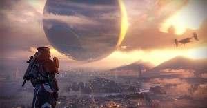

The first new Bungie intellectual property since _Halo_, _Destiny_ stands as probably the most hyped new franchise in the modern video game era. Published by Activision (the same publisher of _Call of Duty_) _Destiny_ has been built up to be their next mega franchise — a gaming universe that will exist for the next ten years with multiple sequels. _Destiny_ is an incredible first step for the franchise, a game that truly lays the ground work for years to come.

(But with that being said, _Destiny_ has many flaws that prevent it from achieving the greatness that it had built itself up for. While _Destiny_ has its limitations, it is dangerously addictive and incredibly fun to play. You may not get lost in _Destiny_, but you will almost definitely get hooked into playing it for countless hours.)

The voice acting and character work of _Destiny_ is hit and miss. At some points throughout the game the voice work is dynamic and immersive, but those points are few and far between. Almost every mission is engaged with a brief one paragraph monologue; these readings not only lack content and meaning, but they also lack the ability to hook and draw in the player. These monologues only confused me and brought up more questions rather than answers about where I was going. They choose to have your ghost (voiced by Peter Dinkleage) or other non-important secondary characters read off mission descriptions to you, using vocabulary and jargon within the world that is never explained or expanded upon to the player within the game.

Throughout the game, Dinkleage is usually the only individual talking, and his lines vary on a spectrum of good to terrible — more to due with the game's lack of creative direction then to his acting abilities. Dinkleage is a proven actor with his work on Game of Thrones, but Bungie decided to make your ghost an emotionless AI as compared to the deeper and more well rounded characters seen in other games (Cortana or Claptrap).

For the most part, the cut scenes of _Destiny_ are incredible. They are breathtaking and immersive with characters that play off each other in smart and funny ways. The problem with the cut scenes is that the game is lacking them. The characters portrayed here are animated and intriguing, from the queen of the awoken to the opening intro. The cut scenes dig hooks into the player. Their limited use though only highlights the flaws in the overall storytelling of the game.

_Destiny_ has lore with great depth and breadth, but you wouldn’t be able to tell that by just playing the game. Destiny does a great job of bringing out the desire within the player to know as much as possible about the world. From its characters to alien races, history and classes, _Destiny_ is a complete world just waiting for the player to explore it. Unfortunately, the game offers little ability for the player to explore and learn more about all of what the world has to offer. In order to learn more about the aliens and beings within the game, players must go online to the website and go through grimoire cards to read additional information. There are many easy ways to integrate this essential information into the game, but in its decision to put all of this information in a secondary source, _Destiny_ only sacrifices its own storytelling and immersion in the process.

With these attributes in combination, the campaign told in _Destiny_ is pretty anticlimactic. Much like _Titanfall_ before it, _Destiny_ does a great job of creating a world that people want to know more about, but both games choose to focus more on multiplayer rather than telling a story. For those looking for an epic space adventure, you will be disappointed in how _Destiny_ chooses to passively tell its story — by choosing to rely on players to go and research information outside of the game, the main story missions become vague and confusing.

\[caption id="attachment\_1021" align="alignnone" width="300"\] Destiny is a beautiful game, but it has no shortage of aspects to improve in its future versions.  
(Image courtesy of BagoGames.)\[/caption\]

 

The RPG elements of the game help differentiate _Destiny_ from other first person shooters, but they seem half done in comparison to the RPG skill trees used in other games. Classes do feel distinct and unique; and even sub classes feel and play drastically different from each other. While all classes shoot and handle in the same manner, the different classes allow for special abilities and mobility options that drastically change how people play. This allows for great replayability as individuals will be motivated to try all three of the classes and max out all six different subclasses. All characters can equip all weapons, and while certain characters benefit certain play styles and thus certain weapons, all characters essentially have the same ability.

How the characters differ though are in the special ability and mobility perks given to the classes. Even Titans of a different subclass feel drastically different in how they will be played. The specials, melee abilities, movement abilities, and grenade options of all classes and sub classes differ providing great variety in customizing how you play _Destiny_. Unfortunately, the customization of characters within a certain sub class is extremely limited and entirely linear. If you play the same sub class as another person you are more than likely playing in the same way; there is little to no differentiation within a specific sub class.

RPG skill trees are all about customizing a character to become personal, and changing them to match your play style; _Destiny_ varies its classes and trees from each other, but characters within the same sub class feel and play almost identical to one another, taking away from the customization and personalization that is the heart and root of an RPG system. To go along with this flaw, the progression system within subclasses is entirely linear. Skills unlock in specific order over time meaning that if there are skills you don’t care for or won’t use, you have to unlock them anyway and ignore them in order to continue on the path. Once you unlock all of the skills you can choose between three different skills per perk or ability, but these differences carry little weight or differentiation from one another and leave a lot more to be desired from this skill tree and RPG system.

The loot system on the other hand is a highlight. _Borderlands_ is an incredible example of a first person RPG done right; while _Destiny_ definitely lacks the weapon variety that _Borderlands_ does, it adds great armor customization to the mix. In _Destiny_ there are really only ten different guns to use in the game (primary weapons, special weapons, heavy weapons); among these 10 guns though are an endless number of variations in clip, fire rate, upgrades, perks, and elemental perks. All of these different factors keep you hunting for a better weapon that has a more substantial upgrade perk or a higher magazine.

The same goes with armor — it varies not only in defense power but also in attribute perks (which increase power usage) and special perks (like reload speed or increases in magazine size). On top of the perks, stats and variations in appearance, armor rating (light rating) is also how you level your character up after 20. The level process is no longer about experience but entirely on how good your armor is, so the game becomes a quest for the best legendary armor. It should be noted that for both armor and weapons the loot game happens later in, after level 12-15, and it begins very slowly.

There is a wealth of content in _Destiny_, and more arrives on a weekly basis, but even still repetition is inevitable. There are twenty different missions throughout the game, and during your time with _Destiny_ you will replay those levels over and over again. After that there are 5 great strikes in the game, which you will endlessly repeat. Missions are about 20-30 minute adventures that offer a challenge based on mission level, while strikes are 30-45 minute dungeons that offer significant challenge and large boss fights. More content like this is added weekly, such as the new raid, and while the content becomes repetitive quickly, the combat is always fun and engaging.

It should be noted that the raid is unanimously thought to be the best piece of content in the game, but cannot be accessed until you are extremely high in levels (level 26 minimum recommended). The multiplayer content while small in breadth, is extremely well polished. Matches of any game mode are fun, competitive and the maps are perfect in both size and diversity. The multiplayer content is exactly what you would expect from the developers of _Halo 2_ and _3_. The issues with multiplayer are that there are only four different game modes with little variation (there are special weekend game modes) and that maps are sometimes repeated in lobbies, meaning you may play the same Mars map three times in a row. You take all single player content (weapons, armor, perks, and abilities) into the multiplayer content, which means your character doesn’t change at all, making for an extremely fun and competitive experience.

After discussing its flaws, we finally come to the parts of _Destiny_ that need little to no improvement. Graphically this game is flawless. Each planet is beautiful and feels distinct and original; from the deserts of Mars to the jungles of Venus, the planets each have their own life and energy to them. You will be blown away from the moment Earth loads just how beautifully breathtaking this game is. To go along with the beautiful worlds and characters, all menus within the game are easy to use and navigate. Traveling from world to world is extremely easy (there is just a lot of loading in between world exploration).

Open world events and the city hub are forgettable. Open world events are quick and extremely easy for high level players so they really hold no test of skill, along with that not many players actually appear from around the map because they are over so quickly. The city hub is used for items, to sell loot, to grab bounties, but after running around turning in quests there is nothing to do. There is really no communication between players, there will be random points of connected gameplay, but especially in the hub you run in, do your thing, run out and there is no real conversation or dialogue anywhere to be found. That isn’t an issue with the game; I don’t mind that there is no talking. (I'm only in the city to turn my bounties in, damn it!)

It’s just another promise not really delivered on. On the same note, the ship changes are purely aesthetic; the ship is merely part of the many loading screens of _Destiny_, there is no value in upgrading it throughout the course of the game.

Finally we get to the gameplay, and this is what makes _Destiny_ so great. Up until this point, all of this being said, _Destiny_ would be an ok to average game by many reviews, but the diverse and engaging gameplay make _Destiny_ a great game. First off, combat is fun, quick, responsive and challenging. This is a first person Halo-esque shooter but with sprinting, jet packs and a variety of mobility perks such as quick teleportation. Getting around the world and the small multiplayer maps is fun and easy; jet packing, teleporting, double jumps and sprinting make traversing across _Destiny_ a blast.

When it comes to the combat it’s this same mobility that make _Destiny_ so much fun. Running around dodging bullets and popping headshots makes everyone feel like a legend; _Destiny_ empowers the player without overpowering them throughout the harder missions. The game always makes combat fun and due to its quick, fast-paced nature combat is always a blast to rush into or run away from. This is the same for the crucible multiplayer maps which use vertical terrain better than any multiplayer maps I have ever seen.

Shooting just feels great in _Destiny_, and that’s a good thing because you are going to be doing a lot of it. All guns have weight; you can feel every bullet and guns all have their own unique feel and control to them. It is noticeably different firing the many assault rifles and it requires significant ability to adjust to the pulse rifle. Not only do all the guns and bullet animations look beautiful, but so do the kills. Popping headshots on enemies is rewarding no matter how many times you do it, as their heads just explode and pop. The enemies themselves come in great variation and you actually have to adapt your play style when facing different aliens. You will come across the jet packing, great shielded, missile shooting, energy blasting cabal and then be thrown against the Vex that teleport around the map, and then on top of you. (At one point, a Vex teleported through my rocket to get in closer to me: frightening.) Each enemy feels unique and requires an adjustment accordingly, and the AI are all moderately intelligent running and hiding in cover, even leading your character into ambushes with other enemies. The AI play nicely off each other and act within their class and role in battle. The missions may get repetitive in _Destiny_, but the combat never gets old.

Destiny has a lot of parts and has tried to integrate many different gaming genres into one massive experience. In terms of combat, world creation, visuals and the loot system, _Destiny_ is an incredible experience. On these merits alone I recommend the game to anyone with a next generation console; _Destiny_, while with its faults, is a game that I was playing every single day for weeks just because it was fun. The problems with Destiny come from its repetitive nature, lack of content, weak RPG system and poor campaign. _Destiny_ sacrificed a great and epic space adventure in exchange for shallow and poorly explained story missions. _Destiny_ has a lot to improve and change over the years, but Bungie is continuing to promise and offer weekly content for players. While _Destiny_ is great now, it is a game that is only going to get better and better over time as more content is added.

Score: 8.5/10

