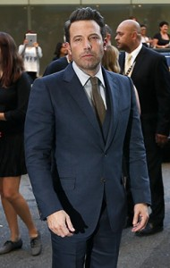
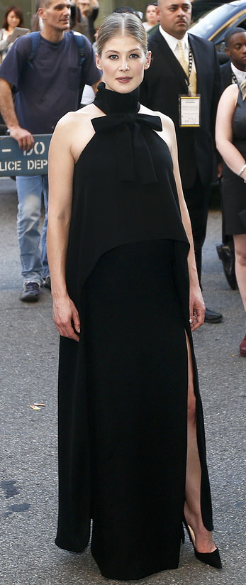

_(This piece contains heavy spoilers from the 2014 film Gone Girl.)_

These days, any film David Fincher directs will pull the noses of cinephiles and academics alike out of their many leather-bound books — he's earned that much. That Ben Affleck is the star of Fincher's 2014 film _Gone Girl_ ensures millions and millions of others will watch the film too, and maybe, just maybe, at the actual movie theatre.

What makes _Gone Girl_ a phenomenal, if not plainly disturbing, movie, however, is Rosamund Pike, and her unrelenting will as Amy Elliot-Dunne.

\[caption id="attachment\_1052" align="alignright" width="190"\] Ben Affleck at the New York City world premiere of Gone Girl  
(Photo provided by BigStock)\[/caption\]

The film begins and ends with Affleck's husband character reciting a tight, lyrical monologue off camera as he plays with Amy's hair in bed. In both the prologue and epilogue of the film, Amy turns toward him and stares forever into his eyes — essentially the camera: us. In the opening of the movie, knowing what we know (assuming (a) you haven't read the book and (b) nobody has spoiled the film for you), her thousand-yard stare captures her "gone-ness" — the absence of her in which the film is named.

By the film's conclusion, the stare has transformed into _Gone Girl_'s thesis statement: Amy Elliot-Dunne is a crazy person.

Labeling someone as crazy creates a negative connotation, which is unintended. Amy Elliot-Dunne is not a bad person; but she is a psychopath. (It should be noted, however, that framing old lovers with first-degree rape, leading authorities on a wild, goose chase that promises to land your husband with the death penalty, and slitting the throat of a childhood friend who has loved you for decades are all, if not wicked, certainly impudent.)

Fincher's choice to begin and end his film with a clear homage to Norman Bates — secretly in the prologue, and with gusto in the epilogue — was simply the cherry to Pike's sundae of an insanely committed performance. But what's fascinating to me is the difference in how the "stare" is used in _Gone Girl_ against _Psycho._

From its name to its director, _Psycho_, and by extension Norman Bates, is transparent to its audience about the horror that is to come. The bone-chilling thrill of _Psycho_ is how helpless Janet Leigh's character is trapped inside that motel room and shower. She is living inside a bubble, and the threat of Bates and his psychosis go undetected until his blade bursts through. The audience is left to deal with the trauma of what we saw coming but couldn't do anything about ([an example of the distancing effect](http://en.wikipedia.org/wiki/Distancing_effect)).

_Gone Girl_ is the polar opposite. The audience begins the film unsure of the nature of what's happened to Amy, and while Nick Dunne doesn't appear to be a murderer, until the film's reveal in Act II, the audience is forced to consider any of the men in Amy's past a suspect in her disappearance. This is embodied through Desi Collings — portrayed as an aloof creepster by Neil Patrick Harris; Collings is essentially bizarro Barney Stinson — the mysterious ex-boyfriend who dabbled with stalking Amy for large portions of her adult life, and who just happens to show up in town after Amy has gone missing.

What we learn, of course, is that no man can bring down Amy Elliot-Dunne. Some combination of Angelina Jolie in _Mr. and Mrs. Smith_ and Patrick Bateman, Amy has planned, to a T, the framing of her husband for her own murder as a revenge-plot for the years of emotional pain he has inflicted upon her and the affair he is having with one of his students. Collings amounts to just a stupendously naive rich guy. Fincher, who spends half the movie setting Collings up as the audiences' leading suspect, is exercising a [Chandler Parsons-level pump fake](http://www.youtube.com/watch?v=_wR49F1CQ4Y) as the director is completely in his element with this dark, twisting tale.

At the conclusion of _Psycho_, Bates famously throws a deep, insidious look into the camera, which amounts to a period — an "I'm finished" or a "you've figured me out." But the repetition of Amy staring back at her husband feels like something else (an ellipse, perhaps?), and I believe that something else lies in _Gone Girl's _power as a work of modern feminism.

https://www.youtube.com/watch?v=lNcJg5svv9A

_"I know it's crazy but.. I don't care I'll never give it up," _Beyonce sings in the beautiful duet between she and husband Jay-Z on "Part II (On the Run)." The ballad is a nod to its predecessor, "03 Bonnie & Clyde," which captivated both megastars' fans in the earliest stages of La Familia. "On the Run" seems to be a marker in time, a song where both Beyonce and Jay-Z allow themselves to reflect on more than a decade of ascending to the King and Queen of American pop culture, creating much of society's soundtrack and dealing with the unimaginable stress that keeping up a billion-dollar marriage creates.

If you're Beyonce, listening to the outside world critique and pick at your marriage must equate to the annoyance of seven billion mosquitos buzzing around you. An every day talking point on social media, in barbershops, in the mall — anywhere — has become, "Do you think Jay-Z is cheating on Beyonce?" This is a very complicated phenomena.

First, it reveals the masses desire to turn their heroes into something tangible, something they can reach. By attaching an "every man" problem (the act of cheating) to Beyonce's marriage, people synthesis the process of relating to their icons as if they were friends or acquaintances — people they have actually met.

Secondly, they are applying (subtly I might add) sexism to their obsession. The wonder about Jay Z cheating on Beyonce ignores the reality that Beyonce has as many suitors, and probably more, than Mr. Carter does. But the reason why its always Jay Z being accused of adultery by the media, and not Bey, has nothing to do with physical attractiveness or even opportunity. It is because of Jay Z's stature as a wealthy man that no matter how much money Beyonce is worth — she was yet again this year's [highest earning female entertainer](http://www.forbes.com/profile/beyonce-knowles/) — he has the power, not her, to choose where his penis goes.

While it can be argued that Jay Z isn't asking for speculation as to where he places his manhood, even if he is an adulator, that would simply put him on a long list of people, men and women, who are not above temptation. But the subtext of all of these "stories" is that Beyonce is foolish for staying with him — that she is somehow not in control of her own life because she allows him to take advantage of her. (Like she is asking for this petty gossip to circulate.)

That is completely unfair. None of us know the truth about their marriage; they are allowed, as people, to live their own lives and make their own decisions. It would seem, however, that Beyonce is choosing to stay with her husband because, if her music is an accurate reflection — which it may or may not be, of course — what they are as a couple is bigger than any traditional interpretation of what marriage is supposed to be. In "On the Run" she sings, "Who wants that perfect love story anyway? Cliche, cliche, cliche."

No one asks to be cheated on in as many words; that we, as a public, have an obsession with assuming Jay Z would go outside of his marriage with the [modern day Mona Lisa](http://rap.genius.com/Jay-z-picasso-baby-lyrics#note-1935615) seems in poor spirit, as if the masses want to know it's true for the sake of juicy gossip. Beyonce is forced, then, to consider her marriage a reverse of a cliche, traditional marriage because the world wants to see it fail. Diving a bit deeper, she also seems to be making a commentary on how Americans are so used to marriages failing at large, that they assume all marriages will ultimately fail no matter what — and Beyonce and Jay Z's status as celebrities only heightens the expectation that they will eventually split up. (Something, as artists, [Beyonce and Jay Z have not run away from](http://rap.genius.com/Kanye-west-new-day-lyrics#note-313934).)

\[caption id="attachment\_1051" align="alignleft" width="347"\] Fincher and Affleck make Gone Girl a must see film in 2014, but it is Pike's performance as Amy Elliot-Dunne that will be the movie's legacy.  
(Photo provided by BigStock)\[/caption\]

I bring all of this up because of the most powerful scene in _Gone Girl._ After Amy has returned from her staged kidnapping (she brutally murders Collings; his blood remains painted all over her body), she and Nick finally find themselves alone in their home. Nick is stunned to find Amy acting like his wife again, as if she _hadn't_ just framed him for murder. Days and weeks go by; Amy is pregnant (perhaps by Desi or possibly from an old sperm of Nick — it is unclear) and wants Nick to raise the child as its father. This is all too much for Nick, who in a fit of rage, pushes Amy against the wall of their bedroom and undresses her — calling her, among other things, [a cunt](http://www.imdb.com/title/tt2267998/quotes?item=qt2256868). Instead of breaking down in tears, begging for forgiveness or even screaming out in pain, Amy matches his intensity with a seriousness only someone who was "all in" could muster.

_"I have killed for you, darling,"_ Amy says, coolly. _"Who else can say that?"_

Amy, if you follow her deep into the rabbit hole, believes she is defending her marriage with everything she has. So what if she was getting robbed by a pair of rednecks away from leaving her husband to die? Here they are, in their home, and Amy and Nick can save their marriage. She implies Nick is a quitter for wanting to leave her, exclaiming that the best part of his life, when he was happiest, was when he was an active husband to her.

Here Amy stands with a new start for Nick and a child they can raise as their own. Fincher is not making light of her offer to Nick; this scene is the most straightforward in the entire film. That Amy was willing to come back — and kill Collings in the process — is her offering to her husband that she would do anything for him, for them. It is in this scene that we truly feel how crazy Nick has been all along, and how far he pushed his wife in the past three years of their sinking marriage.

Nick dragged an attractive, successful woman of purpose to the middle of the country, where she didn't know a soul; he did so to care for his ailing Mother, and any attention he wasn't already giving to his Mom, he forgot to pay to his own wife; after his Mother passed away, Nick continued to neglect Amy for years; and after being reduced to a cold witch, Amy is forced to deal with the despair of catching her husband cheating on her with someone half her age.

Nick even uses the same "romantic" trick to kiss the girl that Nick and Amy shared on their first date. How crazy is that?

As a public, we are used to stories that reduce the female into a loony bin and push all sensibility toward the male. In _Gone Girl_, the clarity arrives once we stop making excuses for Nick Dunne — a bastard of a husband — and start to relate with Amy, a person pushed to the edge of her sanity by a cold husband, and who decided to jump off herself before he finished her.

And yet, there she is, waiting for him to make a leap of faith with her — to honor their marriage, what they started.

Nick decides to stay with Amy, telling his sister that he cannot leave his wife or this child. This is much to the chagrin of his sister, played to a T by Carrie Coon, who captures the fear of someone outside the marriage brilliantly — "this woman has driven my brother crazy." But what the sister is refusing to see is how crazy — psycho, loony, etc. — Nick has driven Amy. The brilliance of _Gone Girl_ is in its modern approach to both feminism and marriage. Any version of this story where Nick leaves Amy and returns to a version of his life before — an adulator, a loser — would be archaic.

We live in a time where the majority of American marriages fail. Statistically speaking, Nick and Amy are crazy for even trying, right? In 2014, American love is as hopeless as ever, and yet we are all still trying. Why? Anyone who has ever been in love can offer a million incoherent reasons, all of which are nutty, but are nonetheless rooted in a colorful hope. The world seems better when you're in love. Who cares if anyone thinks you're a nutcase, right?

For someone like Beyonce — whose 2013 masterpiece _Beyonce_ was a gem of modern feminism — being _on the run_ with her husband is the only life she can imagine. Life is not worth living without striving for something higher with him. While she and Jay Z aren't actually robbing banks and firing guns (we think), that's what love in 2014 — and on that stage — must feel like.

How do you fight through the rumors and the tabloids and the doubts and fears? Just keep running.

And the same goes for our fictional representation of the American marriage, Nick and Amy, who after all, have found themselves to be crazy in love.

http://youtu.be/ViwtNLUqkMY

