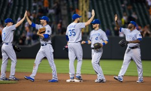

\[caption id="attachment\_802" align="alignnone" width="300"\] The Royals are representing Kansas City in the playoffs for the first time in 29 years.  
(Copyright Keith Allison)\[/caption\]

 

[Dave Holcomb](https://twitter.com/dmholcomb) comes on the show to talk MLB playoffs, why the play-in game is the most innovative baseball has made in years and Roger Goodell. (This podcast uses parts of a song called “Break the Ground” by friend of the show Jamie Cunningham. Follow Jamie on [Twitter](https://twitter.com/JmeCunningham).) Thanks for listening!

https://www.youtube.com/watch?v=B8DPmS93drE&feature=youtu.be

