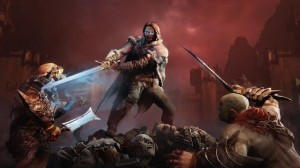

\[caption id="attachment\_1168" align="alignnone" width="500"\] (Image property of BAGOgames)\[/caption\]

 

_Middle-Earth: Shadow of Mordor_ is a great example of how to take a beloved and well known intellectual property and turn it into an incredible game. Video games based on films are almost always shallow, poorly made games attempting to cash in on a well-known franchise. _Shadow of Mordor_ differs from these games because it builds its own story and world away from the movies, and in the process creates a narrative that rivals that of the films instead of just building off of them. _Shadow of Mordor_ is the best Lord of the Rings game ever made, and it is an immersive and entertaining experience for both the average gamer and Tolkien fan alike.

From the opening scene until the credits roll, _Shadow of Mordor_ is a dark and gritty, unrelenting narrative. The game begins with the slaughter of our hero Talion's family, and the game shows this gruesome scene in full detail — [shout out to Gladiator](https://www.youtube.com/watch?v=TpGFF3hXPkY). This is part of what makes _Shadow of Mordor_ work so well; it refuses to withhold the intoxicating evil that makes Mordor a world of pain. By showcasing the blood, war and savagery that controls Mordor, the game creates an unforgiving and violent world.

The story centers on revenge: both for Talion who witnessed his wife and son brutally murdered; and revenge for the wraith controlling him. Locked out of the afterlife and forced to wander Mordor, Talion will only find peace if he can avenge his family. Summoned back to the world of the living, the wraith which possesses Talion struggles not only to regain his memory, but to also take revenge on the dark lord Sauron. Talion and his wraith counterpart are the strongest characters in the game and are what make this journey so memorable. Voiced by the great Troy Breaker (_The Last of Us_, _Infamous: Second Son_) Talion is an easy hero to sympathize and rout for; Talion and the wraith will banter throughout the game outside of cut scenes, and these small effects go a long way in the immersion process.

Talion and the wraith are juxtaposed with despicable enemies, ones that deem even the most disturbing of revenge plots appropriate. Often questioning whether their actions are justified, Talion acts as the angel to the wraith's devil on the game player's shoulders. But when the enemy orcs are slaughtering and enslaving innocent humans, however, it becomes easy to support their efforts to make haste of their destruction. We learn more about our hero’s through loading screens and memory flashbacks, and the depth and backstory given to these characters are a reason why this game functions so nicely.

\[caption id="attachment\_1169" align="alignright" width="300"\] (Image property of BAGOgames)\[/caption\]

The cast of side characters are a highlight, although the game foolishly disbands one group halfway through the campaign for a much weaker collection. (You are forced to leave one location for another and none of the initial sidekicks come along for the ride — well, except for Gollum.) Even still, whether it is Ratbag the comic relief that walks our character through the process of killing war chiefs, or Hirgon a ranger that exposes more of Talions past, the characters are deep and well voiced. By finding the game's collectibles you learn a great deal more about the side characters — another layer to _Shadow of Mordor's _terrific immersion.

The primary villains of this game are extremely disappointing. In theory, the Hammer, the Tower and the Black Hand are all artfully crafted and interesting enemies with great depth to them. But here's the problem: you only encounter these dark lords when it is time to whack them. That's no fun! Much like proverbial wisdom suggests to [wine 'em and dine 'em](http://www.cafepress.com/+wine_em_dine_em_69_em_trucker_hat,7006464?utm_medium=cpc&utm_term=7006464&utm_source=google&utm_campaign=sem-cpc-product-ads&utm_content=search-pla) before completing a certain three-step process, I am not alone when it comes to desiring some alone time with my villains before offing their heads later on in the game. There is only one satisfying boss fight, while the other two make you spend most of your energy on small armies of orcs before promptly killing the boss in a quick time event.

These villains are well crafted — I'd just prefer pumping them with Merlot and a steak dinner before I force them to meet their maker. If the game had better integrated them into the entire story they truly could have been something great.

\[caption id="attachment\_1171" align="alignleft" width="300"\] (Image property of BAGOgames)\[/caption\]

Luckily these are the only real flaws found in _Shadow of Mordor_. Visually the game is stunning; from cut scenes to open world exploration, the game is gorgeous and both character models and Mordor are brought to life in beautiful detail. The games two maps are filled with fortresses and open plains to explore, and no matter where your character is you will be impressed by not only the graphics on display but the amount happening in the background.

As you play the game the world plays out around you, and this is one of the biggest hooks to _Shadow of Mordor_. Standing on a watch tower overlooking the game, I could see orcs fighting each other for territory; wild beasts hunting down and devouring those orcs; and slaves running for their freedom. The game possess a nemesis system which names every orc in the world and gives them a personality. Orc captains each have their own traits and characteristics making each fight and act differently than the last. If an orc kills you, they become a captain, and receive special perks and armor, or they will be promoted in power and rank.

Playing with this dynamic system kept me hooked for hours. Traveling the world you will gather Intel, learn the attributes and locations of target captains, and then hunt them down. Your primary objective is to eliminate or control the war chiefs, and this is down by controlling or eliminating their body guards (captains). Nothing is more satisfying then learning the weakness of a captain then exploiting for an instant kill, or capitalizing on their fear to send them screaming away from the fight. What is even better though is branding and controlling captains. After taking control of them, you can have them issue death threats, betray a war chief, infiltrate a war chief’s squad, or kill another captain. Playing with this system and watching the orc captain’s battle for position is addicting. Movement in the game is fluid and well done. Hunting down captains across the map is hardly a chore when travelling across the country side is so quick and easy to do; to go along with that, climbing the towers and rooftops of fortresses is tight and simple, making hunting down captains a fun process to play out on repeat.

\[caption id="attachment\_1170" align="alignnone" width="620"\] (Image property of BOGOgames)\[/caption\]

 

All of the different orc captains sport different armor, visual character appearances, and voice acting making each one individual and unique. Taking revenge upon the captain that killed you is devilishly satisfying. Sometimes though multiple captains will be hunting you and the only option will be to flee a fight; the next time you then encounter those captains they will mock you and remember every past encounter yelling out how you ran away like a coward the previous time. (Imagine if that's how Pokémon worked? If every waste-of-time Rattata banned together, waited to find you walking around Johto after dark and jumped you — ridiculing you for being a pussy. Jeez.) The nemesis system is truly an amazing game creation that I would love to see used across the games industry as a whole.

At the end of the day, _Shadow of Mordor_ is extremely fun to play because of its advanced fighting — you'd put up with lesser side characters and a lack of depth so long as you could rumble like this. The combat is controlled like _Sleeping Dogs_ or _Arkham Asylum_, but it is even tighter and more refined then those games. Talion has the options for frontal assault with his sword, stealth with his dagger, or ranged with his wraith bow. As you level your character and your weapons you will unlock combos and powers that make Talion god-like, but that are to my pleasant surprise never too overpowering.

Abilities will unlock that allow you to teleport to enemies, giving you the power to immediately kill them (because who wants to wait these days?) and a large variety of combo moves are added to your arsenal making even the most basic combat interaction engaging and exciting. They keep Talion grounded, though, by having plenty of powerful orc captains with immunities to certain abilities and combat strategies.

Combat is bloody and graphic; kills and executions will slow down time and give close ups as you behead an enemy. These graphic executions continue to empower the player; it's admittedly fun and addicting. Killing captains also unlocks the player with special runes, items that completely change the way I played the game, and will make my play style different from someone else’s. In my time with the game, I unlocked a large quantity of runes that gave me bonuses and rewards for playing in certain manners, but the ones I was awarded were drastically different from what other players found. The game features a robust leveling system with a large amount of unique powers and abilities, and a great item and rune customization system to go along with it.

You will slaughter and brand thousands of orcs throughout your journey across Mordor, but you will never get bored doing so. Controlling an orc army to go to war against their comrades is just as satisfying as it sounds. During your time with _Shadow of Mordor,_ you will have a large variety and quantity of side quests, collectibles and main story missions to keep you busy. But to go along with that you may well dedicate hours to the nemesis system and conquering the armies of Mordor. Combat only becomes more engaging the more you play; by the end of it you will be able to mount and ride the wild animals inhabiting the world, [on some crazy Avator shit.](http://www.youtube.com/watch?v=CeNhsaRwVpg)

I strongly recommend _Shadow of Mordor_ to any action gamer and say that is a must have for any fan of Lord of the Rings. It is an incredible open-world action game with addictive combat and a great story — easily my favorite new intellectual property of the year (over titles like _Watch Dogs_ and [_Destiny_](http://www.thehighscreen.com/2014/10/what-a-wonderful-world-gameplay-graphics-shine-in-destiny/)). The great nemesis and addictive combat of this game alone warrant a purchase for any fan of the genre.

Score: 9/10

