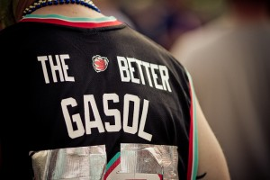
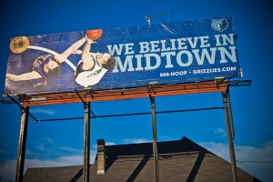

Somewhere between upsetting the San Antonio Spurs as a no. 8 seed in 2011 and nearly taking down league MVP Kevin Durant and the Oklahoma City Thunder this past spring, the Grit and Grind-era of Memphis Grizzlies basketball sealed its fate as a critically-acclaimed team. ([Let Mr. Simmons explain.](http://sports.espn.go.com/espn/page2/story?page=simmons/080501)) Fifteen years from now, when 2K30 is more time machine than video game franchise, little boys will strap on full body suits that allow them to become Zach Randolph or Tony Allen — who should probably have their own video game anyway — and push their friends out of the way in their mission for pick-pockets and gang rebounds.

While there is no doubt that Randolph and Allen best personify the [Grit and Grind ideology](http://grantland.com/the-triangle/a-night-with-future-z-bo-tony-allen-and-the-memphis-grizzlies/), the ascension of Mike Conley and Marc Gasol — the former is perhaps the NBA's greatest bargain at point guard, the later is a Defensive POY winner — gives Memphis a quartet of bull dog, playoff experienced veterans.

Gasol, specifically, has to be the most fascinating Grizzlie. While Randolph, Allen and Conley are known commodities, and their numbers after each season are honest reflections of their level of production, Gasol's counting stats mostly lie about him as a player. That's because it's incredibly difficult, if it's possible at all, to quantify all the things Gasol is doing each night on the floor: hockey assists, perfect spacing on both ends, gauging the threat of his man, deciding when to help on defense, etc. A glance at Gasol's counting stats would suggest Gasol has plateaued over the past three seasons, but he just had his best offensive season, by far, and defensively he is an upper-echelon presence without being an elite shot blocker.  

[As Andrew Sharp said back in 2013](http://grantland.com/the-triangle/remembering-the-grizzlies-grit-and-grind-until-the-end-of-time/), Memphis has "Gasol, the underrated superstar designed specifically for basketball addicts to fall in love with and praise with every set screen." Sharp is alluding to the media's take-it-and-run-with-it approach to covering Gasol's "candidacy" for Defensive POY during that season — Note: Sharp's colleague, Zach Lowe, [famously spear-headed that campaign](http://grantland.com/features/lebron-james-kevin-durant-marc-gasol-jarrett-jack-nba-mid-season-awards/) — which even in the moment felt like a microcosm of analytics overtaking old school basketball philosophy.  

Gasol won the award in 2013 and his team subsequently advanced to the NBA's final four before being swept off the floor by San Antonio. The following year of his basketball life was initially disrupted by injury and concluded with the taste of vinegar in his home country. But unlike 2012-13 when basketball media came running to Gasol's side to explain why [he was something special](http://grantland.com/features/memphis-grizzlies-center-marc-gasol-most-overlooked-big-man-nba-maybe-best/), he and the Memphis Grizzlies were an afterthought in 2013-14, as his time away from the floor kept Memphis down in the standings for much of the season.

I want to take a look at the past year for Marc Gasol, a player who makes as large an impact on both ends of the floor as anyone in the NBA without averaging Top 10 figures in any major stat category. How much better does Gasol make his team by simply being on the floor?

\[caption id="attachment\_1194" align="alignnone" width="300"\] (Photo by Sean Davis)\[/caption\]

 

**A Year in the Life of Marc Gasol:**

**October 30 - Nov. 13, 2013:**

Memphis lost its season debut to its rival (more refined older brother?) San Antonio, 101-94. Again, this coming off the conference finals sweep. Gasol shot below 40 percent from the field against San Antonio in the conference finals, but he did average 14 points, 10 rebounds and a couple blocks. Against San Antonio in the debut? 14 points, nine rebounds and two blocks. The Grizz went 3-4 over the next seven games, and Gasol's performance was uneven, averaging 16.3 points and 6.4 rebounds. This includes a ghastly 11 point, one board effort in a 15-point loss to New Orleans; Memphis also lost back-to-back games against sub-par East offenses, Indy and Toronto (w/ Rudy Gay), by 16 points each.

**Nov. 15 - Nov. 20, 2013:**

Memphis goes on a four-game road winning streak, beating the Clippers and Warriors in two very different games: a 106-102 win over Los Angeles, and holding Stephen Curry-less Golden State to 81 points. Gasol averaged 19.5 points on 16.3 FGA per game; this is uncharacteristic for a man whose career FGA average remains under double-digits, and who sometimes appears to be daring himself not to shoot. But Gasol is not a bad shooter (as we will get too), and his play-making abilities, elite for a big man, are enhanced when the defense, ya know, has to take his shooting seriously.

Gasol flirted with a triple-double in three consecutive games on this road trip, posting 18 points, 8 rebounds and 8 assists on the Lakers; 23, 8 and 9 on the Kings; and 23, 8 and 9 against the Clippers. He was 22 for 23 from the foul line over the four games. In what I assume was out of pure boredom, Gasol refused another triple-double attempt against the Warriors, but he did swat four shots, and blocked three more in the Lakers game.

**Nov. 22, 2013:**

Memphis was red hot when it entered their second contest of the season with San Antonio. That game began with Gasol winning a jump ball against Tim Duncan; the game was 14-13, Spurs, when Gasol came up lame on defense and immediately left for the locker room. Sprained left knee — and just like that, Memphis lost its footing in the game, and for many games to come.

**Nov. 25, 2013 - Jan. 12, 2014:**

Over 23 games without Gasol, Memphis went 10-13. At its low point, Memphis had a 10-15 record, third-worst in the West. The Grizzlies lost home contests to the Clippers and Warriors, teams they had just beaten on the road, by 20 and 26 points. The Grizzlies scored less than 90 points in five of their first seven games without him, and none of those lackluster performances were part of the team's five-game losing streak to West opponents in December, which included home losses to the Lakers and Wolves.

It should be noted, though, that Memphis had a slight uptick once in the new calendar year, beating Phoenix and destroying Detroit on the road, battling the Spurs within two points and then winning two in a row before Gasol returned. In the final 11 games without Gasol, Memphis either won or lost by single digits (7-4). Even still, the Grizz were stuck in 11th place out West, and were going to need a rich combination of luck and improved performance to make it back to the Top 8 by April.

**Jan. 14 - Jan. 17:**

After two abbreviated appearances in wins against OKC (24 minutes, 12 points, 4 rebounds) and Milwaukee (14 minutes, 0-4 FG, 0 points, 5 boards), Gasol stuffed a stat sheet full of 16 points, three rebounds, two assists, four blocks and two steals over 31 minutes in a one-point victory against Sacramento. And with Memphis' defensive leader back, Boogie Cousins tossed up an ugly 6 for 20 shooting night as Sacramento shot 40.7 percent from the field.

**Jan. 20 - Feb. 1: **

After another loss to New Orleans, who apparently have Memphis' number, the Grizz rattled off six wins in a row. They beat Houston twice on consecutive nights; Dwight scored a combined 21 points on 9 for 21 shooting, and Houston shot 62 for 160 (38.8 percent) from the field.

Memphis beat Portland by 17, despite a great LaMarcus Aldridge game, and Gasol had a classic 15, 8, 4 and 3 steals. Winning 11 of 12 games dating back to before Gasol returned, Memphis was back inside the West's playoff field at 26-20.

**Feb. 3 – Feb 9:**

The Grizz came back to Earth a bit, losing three of their next four. They managed just 77 points in a loss to Oklahoma City, squeaked out a 79-76 win against Atlanta and scored 83 in a loss against Cleveland. The other loss was a 14-point whooping from Dallas, the very team they were battling for a playoff spot against.

This stretch is a chance to look into just how important Gasol is to what Memphis does. He shot terribly in these four games (15 for 42 FGA, 35.7 percent), and with limited spacing and a dearth of shooters as it is, Memphis can't afford its most creative player to come up cold when he takes such a small portion of the team's shots. When Carmelo Anthony shoots 35.7 percent, he is still scoring around 20 points on the game after free throws. Efficiency aside, basketball teams rely on their best players for scoring. That's how it's always been; need I remind you of Bill Russell's wisdom!

http://youtu.be/MLyvkBifQ3w?t=21s

Does Marc Gasol need to score 20 points a night for this team? No. And it's common knowledge what Grit and Grind has always lacked is additional three-point shooting. But a Gasol mid-range jump shot is among the best plays Memphis can muster up, and adding even a couple more of these shots each game can be the difference between Memphis keeping the other team honest or losing the battle for spacing all together.

During this four-game stretch, the last rough spot of the regular season, Memphis had no spacing to speak of. Gasol did have 18 assists, but he also committed 11 turnovers, a ghastly mark for any big man. That's not a sudden wave of carelessness by Gasol, that's his opponent daring him to shoot and denying passing lanes when he holds on to the ball too long.

**Feb. 11 – March. 26:**

Over the next 21 games, Memphis won 16 of 21, holding opponents to 99.4 points per 100 possessions, which would have been no. 3 in the NBA for the year. Opponents shot just 43.3 percent from the field, and the Grizzlies posted a 52.4 REB%, which projects to the top mark in the NBA. Memphis held opponents to 96 points or less in 16 games.

Gasol averaged 14.5 points, 7.5 rebounds and 3.7 assists — how _Gasol_ of him — but it was his uber-efficiency that changed things around offensively for the Grizz. He finished 69.4 percent of his shots around the basket, what Blake Griffin shots for the season; and he was 29 for 59 (49.2%) from 10-14 feet, which projects to no. 3 in the NBA.

**March 28 – April 16:**

Memphis finished the regular season 7-4 over its final 11 games, including five wins in a row to guarantee a playoff spot. (How awesome was it that Memphis had to play Phoenix and Dallas to end the season? The playoffs, literally, came early.) Gasol averaged 17.6 points, 8.5 boards and 3.6 assists, counting stats that are superior to any of his full seasons of work, and yet they are figures that Gasol could reasonably maintain if he demanded a scooch more usage within the offense.

He was damn impressive shooting the basketball to close out the season, making 68.2 percent of his shots around the basket, and an extraordinary 17 for 28 between 10-14 feet (60.7 percent). That would have been the no. 1 rate in the NBA, more than 12 percentage points above Dirk Nowitzki's figure. Aided by his sweet jump-shooting, Gasol assisted on nearly 21 percent of his team’s FGM, territory only the game's best big man passers (Joakim Noah, Kevin Love) reach. (Imagine what Gasol's assists could look like if Memphis was a better shooting team overall?)

Peak Gasol was on display during the five-game winning streak: He strung together 20-14, 21-10, 18-15 double-doubles in three straight games; he then went for 18 points, 8 boards and 3 assists to eliminate Phoenix before going 19-9-9 on 9 for 13 shooting in a one-point victory against Dallas to grab the no. 7 seed — and, more importantly, drawing Oklahoma City over San Antonio.

Memphis finished the regular season with 50 wins. Some no. 7 seed: no team won more games (33) than Memphis did after Gasol returned on Jan. 14; and the Grizz had the third-highest win percentage (Spurs, Clippers) and no. 2 defensive efficiency (Chicago) in all of basketball.

**April 19 – May 3:**

Fortunate enough to avoid the Spurs in round one, Memphis had the misfortune of playing against Steven Adams, which is like placing Zach Randolph near a gas leak with a lit match and asking him not to get burned. All things considered, the Grizzlies almost won this series in five games, but they were beaten badly in Game 6, and the ill-timed Randolph suspension tilted Game 7 in the Thunder's favor. Memphis probably wins this series 50 out of 100 times, and maybe more, but, alas, they played it just once, and the team with a pair of Top 10 players, including the reining MVP, won. Shit happens.

Gasol was nowhere near the shooter he was to close out the season, a credit to Ibaka and OKC’s length. He managed just 40.5 percent shooting on all field goals and just 21.7 percent from 10-14 feet. But in his team's three wins, the Grizz posted an offensive efficiency of 105.7 and a defensive efficiency of 102.9 with Gasol on the floor — both borderline Top 10 marks against one of the best teams in the league. In a Game 4 loss, Gasol had his best individual performance (23 points, 11 rebounds, 4 assists and 2 steals on 10/21 FG in 49 minutes). And even without Randolph in Game 7, Gasol fought through terrible shooting (7 for 20) to piece together a 24-2-6 and four steals and a 10 for 11 night at the charity stripe.

So to chalk up the defeat as "Gasol didn't play well" would be excusing poor play elsewhere, and that Oklahoma City was really lucky to come out of round one alive. Even still, that Memphis was a few bounces of the ball from beating OKC in five games makes the beat downs in Games 6 and 7 all the more painful.

**Aug. 30 – Sept. 6:**

Months later, Marc Gasol was a member of Team Spain in the FIBA World Cup of basketball, possibly the most feared single foreign team that America has prepared for since the height of Argentina's Golden Age. That Spain was also the host country placed even more pressure on Team USA to come to them and win — [and in the face of much roster uncertainty](http://www.pickinsplinters.com/?p=38764).

Spain is the world's second-best basketball playing country, and Gasol, his brother and their teammates proved as much through the first six games of the tournament, winning by an average of 26.5 points. For the entire tournament, Marc averaged 10.1 points, 6.3 rebounds and 2.1 assists in 26.9 minutes. A product of excellent spacing, team chemistry and ball movement — Spain plays basketball exactly how the Gasol brothers seem to see the game — Marc posted wonderful shooting splits of .611/.600/.818.  (Note: His three-point figures are enhanced by the shorter international line. Gasol still has not added an NBA three-pointer to his arsenal, although he probably could hit more than the majority of his teammates in Memphis.)

Spain whooped France in Group play, 88-64, and Marc Gasol was a force, scoring 17 points on 6 for 9 shooting, and collecting six rebounds, two assists and three steals.

**Sept. 10:**

Considering the total embarrassment of Spain's loss to France — they were the host team, it was only the quarterfinals, it was to France who was playing without Tony Parker, and it was a 13-point dismantling — Spain simply shot themselves out of it. They were a woeful 2 for 22 on 3's (France was 6 for 24) and made only 45 percent of their 2's (France made 50 percent). France even made 15 foul shots compared to just 10 for Spain.

Gasol seemed to embody his country's struggles: He was 1 for 7 from the field, finished with more rebounds (4) than points (3) and he didn’t make a bucket in the second half. Team Spain was outscored 23-9 in the 4th quarter.

\[caption id="attachment\_1195" align="alignnone" width="300"\] (Photo by Sean Davis)\[/caption\]

 

It's unclear if Gasol can sustain his peak-performance on both ends of the floor over a full season. That's not a diss, or a suggestion his health may begin tapering off as he turns 30, but me looking at his career stats. For three-consecutive seasons his per-game counting stats have plateaued; his 12 FGA in 2013-14 were a career-high — and that mark just feels too low. The team simply plays at a higher level when he is shooting and hitting the 10-14 foot jumper at league-high rates. His ability to create offense with the pass separates him even further from his peers, and while Conley is among the most underrated guards in the NBA, Memphis desperately relies on Gasol's knack for creating offense out of the high post and at the nail.

Considering that Randolph/Allen aren’t getting any younger, and Gasol is a free agent at season’s end, this is probably Memphis' last chance to make a real run in the West; its conference finals appearance in 2013 will always be prefaced with Westbrook’s injury and the subsequent shellacking it received by the Spurs. Memphis matches up terribly with San Antonio but interestingly enough they match up great against everyone else. They also have NO FEAR of Oklahoma City or the Clippers. Any playoff bracket where Memphis can avoid San Antonio in 2014-15 could spell trouble for the rest of the West.

In 2013, [Gasol told Grantland's Jordon Ritter Conn](http://grantland.com/features/memphis-grizzlies-center-marc-gasol-most-overlooked-big-man-nba-maybe-best/) that when he submitted his name for the NBA draft at age 22 he refused to come to the United States and work out for teams. “I didn’t care about the draft,” he says. “I didn’t want to do the workouts — they put you in two-on-two full-court drills with guards. That’s not going to help me. I thought if someone wants to see who I am and how I play, they have to come here. That’s not being cocky. You just have to see me in five-on-five, in a real game, to understand.”

_You have to see me in five-on-five... in a real game... to understand..._

Very few players affect each basketball game as much as Gasol does, something that manifested itself into the 2012-13 Defensive POY award despite him not being an elite shot-blocker. Team Spain losing before it could play Team USA was a huge let down for many reasons but possibly the largest reason was that we couldn’t see Gasol take on the American-born players. There would have been something really interesting about seeing if his impact on both ends could chip away at the supreme athleticism — albeit, a JV version — of Team USA.

He might not be the world's greatest athlete but he overcomes any purely physical shortcomings with the methodology of an accomplished chess player. There is a gravity to Gasol's game, as his teammates, four at a time, seem better off having him to play with.

We, meaning basketball fans and writers, talk about the best basketball players in the world all the time. The list starts with LeBron James and Kevin Durant, and then it moves to the Chris Pauls and Blake Griffins, the Stephen Currys and Dirk Nowitzkis and Carmelo Anthonys. These are all great players. Marc Gasol doesn't really get put up on that list, though. Maybe it's because he has yet to show a true aggression for creating offense at an elite level, and maybe it's because his teams have lost their fair share of first round series. Maybe everyone is waiting for Grit and Grind to make a run at the NBA Finals before putting Marc Gasol on that list.

I'm just having a harder and harder time believing that Gasol isn't one of the best basketball players in the NBA, period.
