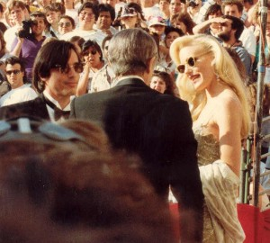

\[caption id="attachment\_1214" align="alignleft" width="300"\] (Photo taken by Alan Light)\[/caption\]

Jackson Browne released a new album entitled _Standing in the Breach_ this month.  If you haven’t listened to it yet, I recommend that you sit down in one of your favorite chairs after work tonight, armed with a drink — coffee or otherwise — and whatever you might smoke, and really listen to Browne do what he’s been on the brink of doing since his first album since in 1972.

In 1972, Browne introduced himself to us as a young man and artist through _Saturate Before Using_. His interests on SBU included love, politics, and self-realization. (Sidebar: His debut album was, in actuality, self-titled _Jackson Browne._ But I'm going with _Saturate Before Using_ because that's what many of us call it.)

2014’s _Standing in the Breach_ is still concerned with these topics, but the way he addresses them in 2014 has changed from how he addressed them in 1972.In 2014, Browne has shed his Orpheus lyre, which we heard recollect melodies of a past lover on the first track of SBU, “Jamaica Say You Will” and others. His most recent mediations on love are buried within the tracks of his new album. And whereas before love was a way to self-realization for him (consider these lyrics: “Jamaica say you will help me find a way to fill these empty hours. Say you will come again tomorrow”), Browne has now distinguished love from his process of becoming.

Browne’s main concern in _Standing in the Breach_ is political. Since SBU, Browne has been concerned with politics, but he had a tentative approach to political issues. Often, as in “Rock Me On the Water,” it seemed that Browne was unwilling to fully confront political issues. At times, he even created the sense that he was capable of somehow escaping the issues that both threatened and confronted the rest of us. This is a very Dylan-esque move, and the posed indifference that motivates it runs rampant through rock n’ roll and the entirety of pop-culture. 

Consider the opening lyrics of “Rock Me On the Water”: “Oh people, look around you, the signs are everywhere.You’ve left it for somebody other than you to be the one to care. You’re lost inside your houses, there’s no time to find you now. While your walls are burning, and your towers are turning, I’m gonna leave you here and try to get down to the sea somehow.”  

The weariness that motivated the sentiments of “Rock Me On the Water” are still present in _Standing in the Breach_.In “The Long Way Around,” Browne writes, “I could feel my memory letting go some two or three disasters ago.” This lyric echoes everyman’s problem of how “I” can cope with, and possibly confront, the enormity of what is happening simultaneously with my existence. The world weariness that made Browne so relatable to us in SBU is still present in the new album, but he makes a powerful literary move to confront our political problems when he writes, “It’s hard to say which did more ill, Citizens United or the Gulf oil spill.” Instead of creative metaphoric images of “towers turning,” and of “walls burning,” as he did in “Rock Me On the Water,” Browne explicitly names our political enemies, and by doing so, prepares us to make a stand.

His willingness to name his enemies is an important and courageous artistic move. Art can be ruined by being too political, however, Browne balances the political overtness of _Standing in the Breach_ well within his music  — which is as smooth and rhythmic as ever before. “The Birds of St. Marks,” which opens the album, is perhaps the album’s finest, pure literary achievement. He offers us this song as Odysseus might offer us a fine wine before embarking with us on a voyage to show us the difficulties that we face at our present historic moment.

There is a battle being waged, and Jackson Browne wants to know which side we’re on. Are we aligned with “The bankers and their special friends who rob you time and again? Who like to pretend they’re the only game in town. Or the people who hope with everything they do, they can build something new, and turn this world around.”

The artistic career of Jackson Browne has been a “there and back again” kind of story._Standing in the Breach_ feels like the completion of what Browne started with _Saturate Before Using_. With the completion of one thing comes the beginning of something new; hopefully we can make it better for all of us.

