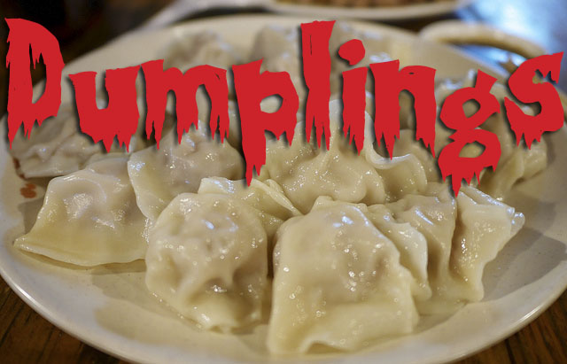

https://www.youtube.com/watch?v=5ixdhYr3a6g

While I was eating delicious dumplings for dinner one night, an old memory popped into my head. My best friend from high school tried to make me watch a horror movie called _Dumplings_ and I refused for reasons that will make sense soon. Luckily for me, it’s currently on Netflix. I just hope that I didn’t permanently ruin my love for dumplings by watching this.

_Dumplings _(2004) is a Chinese horror film and the main villain, Aunt Mei (Bai Ling), has a rather unique beauty routine to help her maintain her youthful appearance despite her true elderly age. There are no crazy diets, expensive beauty products, or exercise fads. This woman stuffs herself with home made dumplings to stay forever young.

An aging TV star, Mrs. Li (Miriam Yeung Chin Wah), decides to pay a visit to the cannibal queen herself in order to learn her secret. Money is no issue here, but is anything worth the price of eternal youth? The secret ingredient to her age defying dumplings are human baby fetuses. One does not simply walk into a grocery store, go to aisle six, and load their cart up with fetuses. Aunt Mei was a prominent gynecologist back in the day and knew her way around an abortion. She uses her connections and sneakiness to load up on her “special ingredient."

What would bring Mrs. Li to such an insane option? Aging gracefully in the public eye isn’t easy, and it’s especially difficult when you’ve got a cheating, lying silver fox of a husband. Mrs. Li is well aware of Mr. Li’s (Tony Leung Ka Fai) infidelity, but is still willing to do anything to win him back. The whole film centers around Mrs. Li’s growing appetite. As soon as she develops an acquired taste for Aunt Mei’s dumplings, she’s craving for something more.

A desperate mother and her teen daughter beg Aunt Mei to perform an illegal abortion. The young girl’s father had raped and impregnated her and left with very few options. It’s unclear if Aunt Mei goes through with the risky operation for sympathy toward the poor girl or to get her hands on a very rare ingredient in order to please Mrs. Lei.

Despite the unfortunate circumstances, her youthful glow is impeccable and her husband seems to have finally noticed his wife again. However, awful side effects begin to plague Mrs. Lei which infuriates her. Things are only beginning to get worse for her as her husband finds out and seeks out Aunt Mei himself.

The plot takes an unexpected twist when the two betray Mrs. Lei by having sex and essentially running off with one another in an affair. However, she gets her revenge and attempts to maintain her youth by hunting down Mr. Lei’s former younger mistress. She outbids her husband’s offer for the abortion in order to keep the fetus. Perhaps revenge is a dish best served hot and filled with your cheating husband’s bastard child?

More than anything I was impressed by the heavy social commentary this film dished out. It really showcased the extreme pressure society puts on women to look a certain way. Men are more encouraged to embrace aging into a silver fox while women are supposed to do everything in their power to not turn into an old cougar. Our culture is obsessed with youth, and it could come at a cost.

Despite the outrageousness of _Dumplings_, it also brings up some important reproductive rights issues. Abortions are still a very hot button issue and we see a horrifying example where it’s an option. Going through something as awful as rape is horrifying within itself. The steps that must be taken afterwards shouldn’t be just as horrifying and cause further damage.

Although this is only the second installment of my Halloweenie challenge, this is by far one of the most graphic horror movies I’ve ever seen. I squirmed, I yelled in disgust, I paused and left the room a few times — I was a hot mess. Nothing popped out of no where in order to generate scares. It was just disturbing and creepy. I had no justifiable reason to sleep with the lights on that night, but I totally did.

Strangely enough, I couldn’t help but think of Sweeney Todd while watching for some reason. Perhaps it was the whole cannibalism in baked goods thing, because other than that they’re on completely different levels. I’m not going to swear dumplings off forever or automatically assume I’m about to consume a dead baby. But can you really blame me for wanting to take a break?

\[caption id="attachment\_1316" align="alignnone" width="640"\] (Photo provided by [Flickr-msucoo93](http://www.flickr.com/photos/srgtravel/14496393650/in/photolist-o5ZNMy-ntNLFH-bk3e2f-5ML3fv-bWbx7-9gqfc-nu8pYL-dU5UGX-jiK2BS-a3HjSt-4xTqq-buiQ6d-6ofpRA-dzoMvK-5WCte-69f9Ao-aCva2K-a4j5Eo-dzoMzc-hJf9cY-cR5V6C-aBjcGz-6s7rPB-7idJxS-6neCXE-b8mq38-8dX3PF-dVnLsT-cZesQQ-8dX5FT-8VYH9P-8RKfjZ-8e1jw1-5bRPFr-2isyPj-6s2nfA-5ZSe8J-8dX5TD-dVtpwq-d5Ptmw-9nEcY-2n1Cw4-otZegf-m5bTQ4-fvhQdu-dx3SMV-7jUMuF-4vc4HX-iEh45X-iy88Hu), modified by Moraima Capellán Pichardo)\[/caption\]

**Horrifying Highlights:**

- It only took two movies to get to some gratuitous horror movie sex scenes. It was 0% real and 100% awkward.
- Anytime dumplings were being prepared. That squishing and chopping noise will haunt me.
- Mrs. Lei looking directly into the camera while eating was so subtly creepy. Girl, can you not?
- The illegal abortion scene. Need I say more?
- Which then lead to this poor girl bleeding out and leaving a puddle of blood behind on the bus and then some poor dude just sits in it. ALWAYS LOOK BEFORE YOU SIT PEOPLE!

**What I Learned:**

- If it’s too good to be true, then it is. I’m floored that someone who’s old enough to be my grandmother looks my age (and better than me at my age) but that’s not worth getting into cannibalism and the black market.
- Turning into a hottie isn’t guaranteed to save a marriage. If you’re going to do something crazy for beauty, do it for you and not your cheating husband. It probably would’ve been cheaper and less cannibalistic to just file for divorce.
- If it’s illegal and it’s taking place in a sketchy apartment, RUN.

**What I Would’ve Done Differently:**

- Divorced that good for nothing son of a bitch and used all of the money toward crazy, but legal, beauty products and routines.
- Not actually give Aunt Mei the real deal. Just give her tons of random shit and hope she never catches on.
- Team up with younger mistress and Aunt Mei to get back at Mr. Lei for being an asshole. (Did I just loosely summarize the plot to _John Tucker Must Die_ or _The Other Woman_ ?)
- I shouldn’t have eaten dumplings right before watching this. That was a bad move. Should've stuck to Chipotle.

More from Celina's Horror Movie Challenge:

[Halloweenie: A Horror Movie Challenge Preview](http://www.thehighscreen.com/2014/10/halloweenie-a-horror-movie-challenge-preview/)

[The Halloweenie watches Annabelle](http://www.thehighscreen.com/2014/10/halloweenie-horror-movie-challenge-annabelle/)
