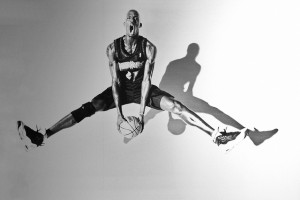

\[caption id="attachment\_1342" align="alignnone" width="300"\] (Photo taken by Cliff)\[/caption\]

 

38-year-old Kevin Garnett is without question a first-ballot Hall-of-Famer.  He has fantastic career averages of 18.6 points, 10.3 rebounds, and 1.5 blocks; many consider him the father of modern interior defense. But most importantly, he knows what it takes to win.

The Celtics would not have their 17th NBA championship banner if it was not for Garnett. Pierce was ultimately the leader of that team because of his tenure with that organization, but Garnett's arrival in Boston after 12 unforgettable years in Minnesota opened the door for the Celts. Garnett averaged 18.8 points, 9.2 rebounds, 1.4 steals, and 1.3 blocks in his first year there. He provided the team with invaluable post defense just about every game. On top of that, his size and offensive awareness made him a dangerous force on offense. By his sixth year in Boston, Garnett was playing less than 30 minutes per game, which is understandable due to his aging.

Last year in Brooklyn, Garnett never really seemed comfortable.  He played only 54 games while averaging just 20 minutes a game.  His numbers took a huge decline as he averaged just about six and a half points and rebounds while shooting a disappointing 44 percent from the field. When [Joe Mags and I talked about the Atlantic Division earlier this week](http://www.thehighscreen.com/2014/10/the-joe-mags-show-zach-tennen-atlantic-division-2/), we were both largely unsure if Brooklyn was even a playoff team anymore.

If at all possible, and I am not asking too much, The Big Ticket needs to turn the clock back just a year or two. He needs to somehow manage what Tim Duncan and Dirk Nowitzki do so well and continue to play at an impressively high level well past his prime. Now, of course K.G. is not going to miraculously be a walking double-double again. But the energy, effort, and concentration need to be there this year.  The Brooklyn Nets may have no hope unless Garnett tremendously improves in those areas this season.

"The Big Ticket" has made well over $300 million dollars in his career. Therefore, we know earning more money is of little importance to him. But think about Dirk Nowitzki and Tim Duncan. Are they satisfied with one ring (or six in Duncan's case)? Of course not. That is a no-brainer. Duncan and Nowitzki are hungry for more rings to add to their already fantastic legacies. Since they have emerged as superstars about 15 years ago, Duncan and Nowitzki's respective teams have taken a simple strategy year-in and year-out: build around them. In other words, a championship is not possible without these franchise cornerstones.

While he may no longer be capable of being a superstar, granted even an All-Star, Garnett needs to act like he still runs the NBA. Very few players have the career endurance and longevity that Nowitzki and Duncan have. Garnett needs to pull some old tricks out of his book or else the Brooklyn Nets could be in serious trouble.

Now the rest of the team also needs to stay healthy. Three-time All-Star Deron Williams seemed to run into a brick wall last season. I have got to believe his ankles, which may be shattering as we speak, played a big part in Williams' downfall.  However, people are still watching Williams with high expectations following his five-year, nearly 100-million dollar deal with the Nets a couple years ago.  But that is a whole different story.

Nothing against Garnett at all. He is a power forward, not a center (courtesy of Garnett), to be remembered for the ages.  He arguably had [the most emotion-filled post championship interview of all-time](https://www.youtube.com/watch?v=jSmD5oAhTmo) following his 2008 title in which the Celtics defeated the L.A. Lakers. I mean, I had never seen anything like it. I don't think interviewer Michelle Tafoya was expecting a rampage of mixed emotions either.  K.G. pretty much went psychotic with a combination of screaming, tears, prayers, you name it. Garnett needs to bring that emotion back to the court in 2014-15.

Fake it until you make it, KG. The NBA is a better league with you playing at a high level, even it's just one last time.

