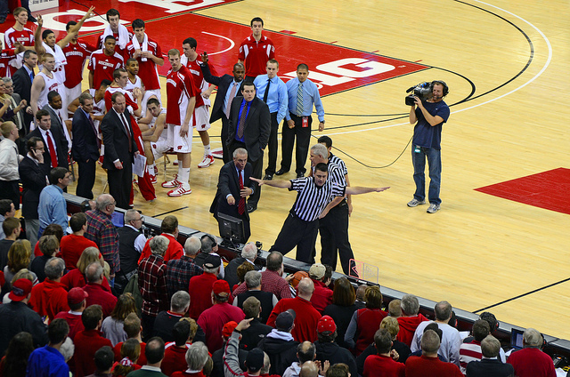

Despite its name, the Big 10 now graces us with 14 teams with the additions of Rutgers and Maryland to the fray this season. The Big Ten is totally up for grabs outside of Wisconsin, and teams 2-10 could reasonably finish anywhere.

14\. Rutgers Scarlett Knights

Last Year’s Record: 12-21 (5-13, AAC)

This Year’s Projected Big Ten Record: 2-16

Head Coach: Eddie Jordan

Key Players: Myles Mack, Kadeem Jack, Junior Etou

Since the turn of the millennium, Rutgers is 65-173 in conference play.

Let that sink in for a second. Rutgers is 100 games below .500 since the turn of the last century. That’s bad, and in a new league, it won’t get much better right off the bat for Eddie Jordan in the Big Ten.

Rutgers actually over-performed last season in the AAC, even if only slightly, but the bitter taste of the 92-31 defeat at the hands of Louisville in the AAC Tournament likely has taken any good will and thrown it out the door in New Jersey. Rutgers may definitely be the worst team in the Big Ten, but they aren’t totally devoid of talent, and Eddie Jordan will have his opportunity to prove the doubters wrong.

Myles Mack will be key for the Scarlet Knights, as he was a season ago. The now senior averaged 14.9 ppg, 4.3 apg, and led the AAC in free-throw percentage (.895) a season ago. He will anchor the backcourt and will be asked many different times to win games for Jordan and his teammates. Kadeem Jack will be able to help him out as well. The 6’9” C can finish around the rim and is getting some NBA attention heading into his senior season. A freak athlete, Jack will cause problems for bigs in the conference who aren’t able to combat his superior strength and agility. A third returner is Junior Etou, a 6-7 sophomore who should grow into his role this season. Etou is a good defender, but can’t really shoot from the perimeter. He will be asked to man the three spot this season for Rutgers.

Beyond those three names, there are simply too many questions on the rest of the roster to expect many results in 2014-15. Mack’s likely starting backcourt mate is JUCO transfer Bishop Daniels, a former Miami (FL) recruit. He was often injured for the Hurricanes and eventually left to find his game in the junior level. He is a play-maker, but has yet to prove himself at this level. Brooklyn native Mike Williams will come off the bench and could develop into a player later on in his career.

In the frontcourt, Jack will have to take on the brunt of the productivity, but he will be hoping that junior Greg Lewis shows more promise than he did a season ago. Beyond that, Jordan will look for anything he can get from three freshman big men, who all at least have the size to compete: 6’8” D.J. Foreman, 6’10” Ibrahima Diallo, and 6’11” Shaquille Doorson.

When speaking to the media, Jordan has been confident that his Rutgers team can surprise people in the Big Ten this season, but considering the lack of overall talent on the roster and the depth of the Big Ten, wins may be tough to come by for the time being.

13\. Penn State Nittany Lions

Last Year’s Record: 16-18 (6-12)

This Year’s Projected ACC Record: 4-14

Head Coach: Pat Chambers

Key Players: D.J. Newbill, Ross Travis, Isaiah Washington

There is some good news for Penn State fans: the team returns 70 percent of last year’s scoring and 80 percent of its rebounding from a season ago. The bad news? That team only went 16-18, bowed out to Siena in the CBI Quarterfinals, and featured one of the best players in the Big Ten, Tim Frazier… who graduated. That appears to mean that Penn State is headed for a long season.

If Penn State is going to finish in the Top Ten of the conference, it will be in large part because of the performance of their star shooting guard, D.J. Newbill. Newbill is already near the top twenty scorers in Nittany Lion history after only his first two seasons. He has the ability to do it all on the offensive end, shoot, drive and pass, and he will be asked to do all that and more this year. Newbill is a potential Big Ten All-First Team selection, so even if Penn State isn’t any good, Newbill certainly is.

Behind him, Ross Travis is the only other real returner of note. The big man comes back for his senior season after leading the team in rebounding and putting up an admirable 8.4 ppg. He will look to anchor the paint and provide a low post threat. John Johnson and Geno Thorpe will be the two guards asked to step up big time this year after being bench players a season ago. Johnson eventually found his way into the starting lineup last season and was finding his groove as the season went on, while Thorpe shot the ball extremely well in limited time. Neither Johnson or Thorpe is devoid of the ability to be adequate replacements for Fraizer, but it seems unlikely either of them will develop into stars either.

They may be better off putting the ball in the hands of freshman Isaiah Washington, who should be the team’s best newcomer. He is an elite level athlete who is talented on both ends of the floor. The growing pains will be there, but he should be able to provide a spark for Chambers. Down low, Travis will be joined by returners Donovon Jack and Brandon Taylor. Taylor is undersized but can step out and shoot the three ball, while Jack is an above-average shot-blocker. They are talented, but no experienced Penn State forward has any real size, which could be an achilles heel for Chambers when putting together his rotation.

If Penn State’s returners can prove to have superior chemistry and Newbill continues to come on strong, a top ten finish for Penn State isn’t out of the question. However, the overall talent is too lacking to expect an NCAA (or even NIT) birth.

12\. Purdue Boilermakers

Last Year’s Record: 15-17 (5-13)

This Year’s Projected Big Ten Record: 5-13

Head Coach: Matt Painter

Key Players: A.J. Hammons, Dakota Mathias, Bryson Scott

With both of the Johnson brothers (Terone and Ronnie) gone from the program, Matt Painter will now have to regroup behind stud center A.J. Hammons… and not much else.

For his part, Hammons is the real deal. He has NBA scouts talking and could be the best center in the league. He has now led the league in blocked-shots for two straight seasons, can score down low, and is an excellent rebounder. But does he have what it takes to be the team’s go-to player? That remains to be seen, as last season he largely took a second or even third option role behind the Johnsons’. Hammons will be doubled often and will need other players to step up and hit shots for Purdue to be successful.

Bryson Scott was Ronnie Johnson’s back-up a season ago, and now he will step into a starting role. Scott is an athletic guard, but doesn’t pass the ball all that well. He may be better off at the two spot, while Dakota Mathias, a talented freshman who Painter has described as “probably the best passer we’ve recruited at Purdue in the last 10 years,” can take over lead guard duties. Beyond those two, Raphael Davis is a returning starter at the 2/3 spots, who lacks any real punch but brings focus and leadership to the floor. Sophomore Kendall Stephens will need to be on his game as he will likely be the team’s primary three-point threat. P.J. Thompson has some potential as well to get into the mix in his freshman season.

Hammons’ only real help in the frontcourt may come from Vince Edwards, a freshman with a high basketball I.Q. and good passing ability. Jacquil Taylor and Isaac Hayes may play some, but it’s unlikely they will be ready for the speed of the Big Ten this early in their careers.

Painter has a good enough reputation where the fanbase will give him the benefit of the doubt after a down season. However, if Purdue finishes in the bottom three of the league again this year, which seems entirely likely, his seat could begin to get a little hot. Painter will need his young players to be ready early and Hammons to step-up his game for the NCAAs to be at all possible.

11\. Northwestern Wildcats

Last Year’s Record: 14-19 (6-12)

This Year’s Projected Big Ten Record: 6-12

Head Coach: Chris Collins

Key Players: JerShon Cobb, Alex Olah, Vic Law

Northwestern was horrible early and late in the Big Ten last season. Right in the middle they had an impressive stretch, including a shocking win over Wisconsin, which showed that this team has the potential to be a player in the league this season. Still, it will have to be done with replacing leading scorer Drew Crawford, who was the team’s heart and soul last season.

Replacing Crawford won’t be left up to just one or even two players, it will be a collective team effort for the Wildcats to find a new identity. Chris Collins has a decent group of returning players and a great recruiting class that should at least make things a little interesting in Evanston. The key returner in the backcourt will be senior JerShon Cobb, who averaged over 12 points-per-game a season ago playing second fiddle to Crawford. His season-ending injury last season was a large reason why Northwestern fell apart down the stretch. Tre Demps and Dave Sobolewski, two more veterans that played key roles a season ago, should at least hold down the fort until the young players are ready to take the reigns.

Those young guards are a major reason why NU fans are optimistic about Collins’ future. Vic Law is a combo shooting guard/small forward that was a top 100 recruit and could be a Northwestern legend if he sticks around for four seasons. He is a versatile athlete who can score in bunches. Johnnie Vassar and Bryant McIntosh will join Vic Law to make up a solid trio of incoming freshman, ready to enter Northwestern into a new era and break the infamous NCAA Tournament drought. Both are talented point guards who should get minutes this year to prep themselves for 2014-15.

Alex Olah is probably the team’s second best returner and has the potential for a 12/8 average in points and rebounds. The seven-footer finished third in the league a season ago in blocked shots. Sanjay Lumpkin is the returning power forward who should improve his game with the addition of a long-range jump shot. Jeremiah Kreisberg, a transfer from Yale, should be able to fill the back-up center role nicely.

Overall, this is a Northwestern team that should be more competitive. Still, unless the freshman can be stars right away, the Wildcats are probably one or two seasons from making it back to relevance in the Big Ten.

10\. Maryland Terrapins

Last Year’s Record: 17-15 (9-9, ACC)

This Year’s Projected Big Ten Record: 7-11

Head Coach: Mark Turgeon

Key Players: Dez Wells, Melo Trimble, Jake Layman

After losing five transfers from last year’s 17-15 team, Maryland will sport a different look this year, led by one of the best recruiting classes in the Big Ten. Despite the losses, Mark Turgeon has managed to pull in four top 100 recruits this season that will make or break the Terrapins fate in 2014-15. The class is led by Melo Trimble, rated in the top 40 prospects coming into the season. With the departure of Seth Allen, Trimble will start right away at point guard. If he can match his scoring ability and high energy from high school, he has the potential to be one of the best freshman in the league.

Dez Wells will be Trimble’s mentor in the backcourt and the senior will be asked to continue to be the man this season. Wells averaged 14.9 ppg a season ago and made the All-ACC third team. He may have the potential to go even higher than that in the B1G this season, as he is as good as anyone in the conference at attacking the basket. Jake Lyman and Evan Smotrycz will act as the floor spacers, and they do the job well, hitting over 100 three-pointers between the two of them last season.

Dion Wiley (another top 60 recruit) and North Carolina A&T transfer Richaud Pack will compliment the guard rotation and add a serious scoring punch off the bench. The weakness of Maryland, however, will be up front, as they lack any serious big men with experience. They will rely on sophomore Damonte Dodd and freshman Michal Cekovsky to man the middle, but both have serious questions about their game.

Maryland’s lack of any real size along with their inexperience is why I am picking a 10th place finish. However, this team has serious potential to sneak up on some of the big names in the Big Ten, and should be a real factor next season once their young players gain more experience.

9\. Indiana Hoosiers

Last Year’s Record: 17-15 (7-11)

This Year’s Projected Big Ten Record: 7-11

Head Coach: Tom Crean

Key Players: Yogi Ferrell, James Blackmon Jr., Troy Williams

Just two years ago, things were looking so rosy for Tom Crean and his Indiana program. With Cody Zeller and company, Indiana had a serious national title contender on their hands and Crean had restored the Hoosiers to their expected level of prominence. Now, Indiana is back to being a rebuilding team and there are questions about Crean’s long-term potential in Bloomington. This Indiana team isn’t lacking in talent, but they have lost so much from a season ago that the NCAA Tournament remains a difficult goal to achieve.

To get there, Yogi Ferrell will have to continue to dominant the landscape of the Big Ten. He was an absolute stand-out a season ago and took over when his team needed him. What he lacks in size, Ferrell makes up in raw athletic ability, scoring prowess, and team leadership. But who will join Ferrell as a legitimate threat for Indiana this season? Crean will first look to returner Troy Williams, a small forward who came on as a starter late last season. The 6’7” forward is a slasher who plays off Ferrell and James Blackmon Jr. well.

Blackmon Jr. is the key for Indiana. We know what Ferrell will bring to the table, but if Blackmon Jr. can be as good as advertised, it could launch Indiana’s position in the conference. Blackmon Jr. was described by many as the best pure shooter in the class of 2014, and if he can continue that trend, Indiana could win a lot of shootouts. Fellow freshman Robert Johnson is another excellent shooter who could add more depth, while Stanford Robinson is back as well to fill his role as a backup two guard.

Down low, losing Noah Vonleh and Will Sheehey will be devastating. There is no real obvious answer for Crean to turn to, and Indiana may very well play a four-guard set often this year. Hanner Mosquera-Perea is the only real viable option, but the junior averaged just 2.8 ppg and 2.1 rpg last season. He is raw and aggressive, but unproven. Beyond Mosquera-Perea, the next best thing may be power forward Devin Davis who looked lost in the shuffle at times last season. Freshman center Tim Priller may be asked to step in right away, whether he is ready or not.

Indiana lacks the overall depth that even last year’s team possessed, but Ferrell and Blackmon Jr. could lead the team to the promised land of the NCAA Tournament anyways.

8\. Michigan State Spartans

Last Year’s Record: 29-9 (12-6)

This Year’s Projected Big Ten Record: 9-9

Head Coach: Tom Izzo

Key Players: Branden Dawson, Denzel Valentine, Travis Trice

What?? Michigan State, 8th? I know. It’s hard to believe, but even Tom Izzo can’t be great every season, and it’s unlikely this current crop of players will be able to make a push towards the top five of the conference. It would be tough for any program to replace players like Gary Harris, Adreian Payne, and Keith Appling, so you can’t hold it against Michigan State if they have a down season. But Coach Izzo may still have a few tricks up his sleeve.

It’s not as if the Spartans will be totally without play-makers. Branden Dawson can now step into a leadership role and is already a double-digit scorer. Dawson will be the difference maker for Michigan State this season, and if he can develop as much as Izzo expects him to, watch out. Denzel Valentine is also a key returner who will be asked to play a larger role. He was the relief to Appling and Harris last year, but now he will take over the offense. Travis Trice will join him as co-captain, and he will be the heart and soul of the Spartans if he can stay healthy.

Alvin Ellis III will now get his chance to shine, while freshman Lourawls Nairn Jr. finishes out the backcourt rotation. If either of them can take over the sixth man role, Izzo will be pleased. Joining Dawson in the post will be returner Matt Costello, a quality big that knows his role, and Michigan State’s best freshman, Javon Bess, a forward with big-time scoring ability.

In a league as tough as the Big Ten, a team without any proven great players like Michigan State will be overlooked. However, don’t underestimate Izzo’s ability to get the most out of his team and use that perceived slight to his advantage. I expect Michigan State to find a way to sneak into the tournament once again this season.

7\. Iowa Hawkeyes

Last Year’s Record: 20-13 (9-9)

This Year’s Projected Big Ten Record: 9-9

Head Coach: Fran McCaffery

Key Players: Aaron White, Mike Gesell, Jarrod Uthoff

Despite breaking back into the NCAA Tournament, last year ended in disappointment for Iowa after they bowed out to NC State in the First Four. This season, Fran McCaffery’s team will once again be capable of making a run into the NCAA’s, but they will need to do so without the star power of Roy Devyn Marble.

Replacing Marble will not be an easy task, but Aaron White may just be up for the job. Playing as the second option to Marble last season, White put up 12.8 ppg and 6.7 rpg. He is a capable forward at 6-9 who can get around his defender from the perimeter, shoot the jumper, or post up. He will be Iowa’s go-to this season and will likely be an all-league performer. But will White have enough help to ensure a finish in the top half of the Big Ten for Iowa? Mike Gesell’s performance will largely shape up the answer to that question. We know that Gessell is a capable point guard who makes his teammates better, but can he increase his scoring when needed to? That will be the biggest thing to look out for, because if he can’t, Iowa may have a hard time putting the ball in the basket consistently.

Gesell and White will get some help from the supporting cast as several players who were in the rotation will return. Josh Oglesby is capable of increasing his scoring numbers when he is healthy, as he is perhaps the best pure shooter on the team. Sophomore Peter Jok and JUCO transfer Trey Dickerson will also factor into the backcourt rotation and are capable deep threats. In the post, McCaffery will look for a steady performance out of Adam Woodbury at the center position and Gabriel Olaseni at the power forward. Both showed flashes last season, but need to be more consistent in starting roles. The small forward position will likely be handled by Jarred Uthoff who finished last season with respectable numbers at 7.6 ppg.

Iowa doesn’t have the athletes to consistently beat the top teams in the conference, but a .500 record seems very doable. 9-9 in the Big Ten would put them on the bubble again, so McCaffery will need to get the most out of his non-conference schedule to go dancing again.

6\. Illinois Fighting Illini

Last Year’s Record: 20-15 (7-11)

This Year’s Projected Big Ten Record: 10-8

Head Coach: John Groce

Key Players: Rayvonte Rice, Nnanna Egwu, Aaron Cosby

John Groce got Illinois better as the season went along last year. This season he returns almost all of his starting lineup and adds several newcomers, which should make Illinois a potential Top 25 team in 2014-15. Illinois was an NIT team last year, but unless the roster drastically under-performs, Groce should easily get the Illini back in the tournament with the potential for a run once they get there.

It all starts with the unfortunately-named Rayvonte Rice, who has the potential to be one of the league’s best scorers. Simply put, Rice can do it all. He led the team a season ago in scoring (15.9) and steals, and was second in rebounding. The offense will run through him, but he will have plenty of help as well. Seton Hall transfer Aaron Cosby will be a key piece for Groce this season. The junior averaged over 12 points a game while playing with the Pirates, and could now start for Illinois.

Illinois was dealt a huge blow last week when starting point guard Tracy Abrams tore his ACL and is expected to miss the entire season. Abrams was a staple at the point and a three year starter. Still, Groce has positioned himself well for something like this, and has depth he can turn to. The likely replacement will be Oregon State transfer Ahmad Starks, who would have likely battled for minutes with Abrams anyway. He was another double-digit scorer in his old school and should be a more than adequate replacement in the starting lineup. Rice, Cosby, and Starks will be joined by Kendrick Nunn, who was an All-Freshman honoree a season ago, and is a deep threat that can score in big moments. Nunn and Cosby will likely share back-up point guard roles, but Groce could also turn to Jaylon Tate, who should make strides in his second season in college.

The forward position is also loaded as Groce will first look at Malcolm Hill to take on a larger role this year. He will likely shift over to the three-spot, where he is more effective and can play on the wing and hit three-pointers. Freshman Leron Black is easily the best recruit on this team and could start right away. He was a top 40 recruit and Mr. Basketball in the state of Tennessee, and if he can translate his game to a face-up four, he could elevate this offense. The middle is anchored by senior Nnanna Egwu, who will be one of the best defensive forces in the B1G this season. He doesn’t score well, but with so many perimeter options, he really doesn’t have to. Instead, Egwu makes himself valuable by rebounding with authority and closing up driving lanes in the middle with his long reach and athleticism. From there, Groce will patch together his bench with sophomores Maverick Morgan and Austin Colbert, and freshman Michael Finke.

Illinois was only 309th in the NCAA in scoring offense last season, but Groce is hoping his influx of new talent will help change that. Assuming that the scoring does increase and the defense remains dominant, Illinois should be able to make up for the loss of Abrams and be a serious player in the Big Ten this season.

5\. Michigan Wolverines

Last Year’s Record: 28-9 (15-3)

This Year’s Projected Big Ten Record: 11-7

Head Coach: John Beilein

Key Players: Caris LeVert, Derrick Walton Jr., Spike Albrecht

As I’ve mentioned previously, it’s tough for any program to lose talent early to the NBA, but Michigan was bit particularly hard by the draft bug this off-season. First, Big Ten Player of the Year, Nik Stauskas, left to go pro (and ended up in the lottery). Then, Glenn Robinson III joined him, making it so Michigan lost their two best players from a season ago. Michigan fans were at least hoping to see Mitch McGary back, but after he was suspended for drug use for the season, he also went pro, ensuring his time in a Michigan uniform was finished.

Even if one or two of those players had decided to return to Ann Arbor, Michigan likely would have been a co-favorite in the B1G this season with Wisconsin. Instead, John Belein will have to find a way to replace that talent with what’s leftover.

Fortunately, Michigan has plenty of talent still remaining on the roster that should keep them relevant in the Big Ten this season. Caris LeVert was totally raw his freshman season, but came on strong last year in his sophomore campaign as a natural scorer and play-maker. Now will be his chance to run the show, and if he can be more consistent, he has the potential to be an All-Big Ten performer.

It was unfair to ask Derrick Walton Jr. to try and replace Trey Burke, so fans expecting that were let down by his play last season. However, for what he is, Walton Jr. played very well for a freshman, limiting his turnovers and scoring when needed. Now he can take the next logical step forward with Stuaskas and Robinson III gone, and take a more primary role in the offense. His relief (and possible co-starter if Belein wants to play small) is Spike Albrecht, who can light it up and play under control. Fans may remember Albrecht from his shocking performance in the 2013 National Championship game, which gives a little sample size of what the junior is capable of.

Zak Irvin will start this season after having a role as a rotation player a season ago. He is a versatile small forward who can step out and knock down the three point shot or play in transition. Freshman Kameron Chatman will get minutes at the three and maybe four spots as an athletic wing with a skill-set that should translate well to Big Ten play.

The biggest question for Michigan is how they will be able to survive in the post. Not only is Michigan playing again with McGary, but they have lost long-time starter Jordan Morgan, who graduated, and his back-up Jon Horford, who transferred. Max Bielfeldt will be asked to step up, and if he can remain healthy, he has the ability to play the stretch four spot that should thrive under Beilein. However, he will need to prove himself, as the senior has never been asked to play a major role before now. Redshirt sophomore Mark Donnal and freshman Ricky Doyle may be asked to come in right away, and may have to play the undersized center position since Michigan lacks height. Freshman D.J. Wilson is more of a point forward, but may get minutes in the post as well. All three are talented but raw, and Beilein only needs one or two to emerge to fill out his rotation.

Michigan is unlikely to repeat the success they have had the past two seasons, but Beilein has gotten the most out of his roster every year at Michigan and the Wolverines still have Top 25 potential with this roster.

4\. Nebraska Cornhuskers

Last Year’s Record: 19-13 (11-7)

This Year’s Projected Big Ten Record: 12-6

Head Coach: Tim Miles

Key Players: Terran Petteway, Shavon Shields, Walter Pitchford

What?! Nebraska?? Fourth? Believe it. As unlikely as it may seem, Nebraska is in a better position heading into the season than Michigan, Michigan State, Indiana, Purdue, and Illinois. After starting 1-5 in the Big Ten last year, most figured it would be another down season for the Cornhuskers. However, Tim Miles and his team rallied to win 10 of their last 12 league games and snuck into the NCAA Tournament, breaking an infamous drought that dated back to 1998. Now, Miles has several key pieces returning and Nebraska figures to be a major player in the Big Ten conference this season.

It all starts with Big Ten scoring champion Terran Petteway, who was the Huskers first league scoring champ in nearly sixty years. Petteway averaged a gaudy 18.1 ppg a season ago, even more impressive when you consider Nebraska was ranked 274th nationally in scoring. Petteway can score from inside or out and stopping him will be the focal point for opposing coaches when playing Tim Miles’ club. He should get some help from returning Shavon Shields, who ranked in the top ten of the league in both scoring and rebounding, and eventually came on strong to give Nebraska a much needed second option on offense.

The point guard duties will be handled by Tai Webster, a returning starter from a season ago. Webster didn’t put up major numbers and often got lost in the shuffle, but he had an impressive offseason, playing international basketball with his native New Zealand, which should help him take major strides. His back-up, Benny Parker, also returns, and is an excellent defensive presence who can shut down opposing guards. Nick Fuller, a redshirt freshman, should factor into the rotation as well and could provide a major three-point spark that Miles is in desperate need of to play off Petteway and Shields’ penetration.

The post players from a season ago are largely back, although the Cornhuskers lost reserve forward Leslee Smith to a knee injury in the offseason. Because of that injury, Florida transfer Walter Pitchford will have to continue to play an important role. He was an extremely efficient shooter from both two and three-point ranges and should average double-digits this season. David Rivers came on strong in Nebraska’s final push for the NCAA Tournament, and the senior is back and should build on that momentum. Moses Abraham and Jake Hammond are two inexperienced big men who may get their chance right away to contribute.

Nebraska is a team that will once again struggle to score, but they should have enough firepower to finish in the upper echelon in the Big Ten thanks to their dominant defense.

3\. Minnesota Golden Gophers

Last Year’s Record: 25-13 (8-10)

This Year’s Projected Big Ten Record: 13-5

Head Coach: Richard Pitino

Key Players: Andre Hollins, Deandre Mathieu, Joey King

After a spirited run to the NIT Championship a season ago, the North Star state is buzzing about Richard Pitino’s potential to turn the Golden Gophers into a perennial contender. Minnesota doesn’t bring everybody back from a 25-win team. They will lose their best player, Austin Hollins, but they bring enough back that a top five finish in the league and an NCAA Tournament appearance seems entirely reasonable.

Andre Hollins (no relation to Austin) is back as the team’s leading scorer and senior leader. Hollins should take the role of primary scorer for Minnesota and up his numbers from an impressive season last year. His backcourt mate Deandre Mathieu, who led the team in assists and did a little bit of everything for Pitino, will provide consistence as the Golden Gophers’ glue man.

Behind them, the guard crop is talented but unproven. Carlos Morris was a Junior College All-American, but his game didn’t translate as well as he would have liked it a season ago. Daquein McNeil played sparingly last season, but should get more playing time this year to prove himself. Freshman Nate Mason is extremely talented and was highly recruited, but it’s tough for anyone to adjust to the speed of the game right away. If those three can contribute and make the necessary adjustments to their game, Pitino will have a deep guard rotation. If not, he will have to rely almost exclusively on his senior leaders.

In the frontcourt, high energy Joey King should continue to advance, being as he was one the most efficient offensive players and excellent defenders on the team a season ago. All 6-11 of Elliott Eliason, the starting center, is back and fills his role nicely of a shot-blocker and rebounder who can also score a little when needed. Completing the twin towers in the lane is 6-10 Maurice Walker, who provides Minnesota’s best post-scoring threat. 6-11 Bakary Konate may be their understudy, but has a long way to go to fully grasp the game. Still, if he can hone some of his athleticism, he could see minutes.

The fact that four of the five Golden Gophers’ starters are seniors (and the other is a junior) tells you why expectations are so high coming into this season. Hollins and Mathieu should provide stability, and the team should ride the momentum swing of a championship a season ago into an excellent performance in the Big Ten this year.

2\. Ohio State Buckeyes

Last Year’s Record: 25-10 (10-8)

Projected Big Ten Record: 14-4

Head Coach: Thad Matta

Key Players: Anthony Lee, D’Angelo Russell, Sam Thompson

Ohio State lost their leader Aaron Craft, and as polarizing as he is, you can’t argue that losing him is a net-positive for OSU. Still, Craft’s departure, along with that of Lenzelle Smith Jr. and LaQuinton Ross, opens up new doors for incoming freshman and role players from last season that can now bring the Buckeyes back to prominence.

The name on everyone’s radar in Columbus this season is D’Angelo Russell, ranked as the third best shooting guard in the class of 2014, and the highest rated recruit in the Big Ten. Russell, a lefty, will threaten opposing defenses from inside and out, as he is a capable spot-up shooter, but can also create for himself or his teammates. He should make losing Ross and Smith Jr., the team’s two prior leading scorers, less devastating than it might suggest.

Anthony Lee will also play a major role, and the transfer from Temple may be the team’s most ready top-notch scoring option. Lee, a 6’9″ big who was granted an immediate transfer, led the AAC in rebounding a season ago, and also put up 13.9 PPG. He will provide a senior presence in the post, and should be a reliable go-to when Ohio State needs a bucket.

Senior Sam Thompson is a returning starter who is capable of making a top play on any given night, but is also one of the team’s best shooters, while sophomore Marc Loving is another returning shooter that Matta will be hoping finds his rhythm much more consistently. Redshirt freshman Kam Williams was a previous top-100 recruit that could be an X-factor.

The point guard duties will be left to Shannon Scott after Craft has graduated. He had 119 assists and only 65 turnovers a season ago, showing that he should be able to ease into the role, however, will be tested this season much more than before.

Joining Lee in the post is starting center Amir Williams, who is a good defensive player that is limited offensively, but can shut down most other big men in the conference. Five-star freshman Keita Bates-Diop is a versatile big man who can play multiple positions and four-star Jae’Sean Tate will see minutes at the three.

Ohio State has the pieces to not only equal last year’s team, but surpass them. They will need Lee and Russell, who have never played a game in an OSU jersey, to meet expectations for them to get there, but Matta should have all he needs to get 25 wins out of this team.

\[caption id="attachment\_1355" align="alignnone" width="640"\] Bo Ryan and his 2012 Wisconsin Badgers. (Photo taken by Richard Hurd)\[/caption\]

 

1\. Wisconsin Badgers

Last Year’s Record: 30-8 (12-6)

This Year’s Projected Big Ten Record: 16-2

Head Coach: Bo Ryan

Key Players: Frank Kaminsky, Sam Dekker, Traevon Jackson

While the rest of the Big Ten is relatively open this season, one thing is for sure: the Wisconsin Badgers are the favorites, and it’s not even close. After many years of coming close, oh-so-close, Bo Ryan finally got his team back to the Final Four in 2014. The Badgers managed to combine a solid regular season with an inspired tournament run, including a minor upset of Arizona in the Elite Eight.

Other than a rough stretch in January where Wisconsin lost five out of six games, they went 29-3 last season, including a one-point heartbreaking loss to Kentucky in the Final Four. Had the Badgers managed to avoid the Harrison curse, you would figure that their bigs would have caused serious problems for Connecticut, and we easily could be talking about Wisconsin trying to defend their National Championship this season.

Alas, they are not, but their success a season ago has the Badgers fan base excited for all of the possibilities coming up this year. Michigan, Michigan State, and Ohio State (ed. note: Other teams too!) will all have something to say about Wisconsin winning the Big Ten in 2014-15, but you would have to be very convincing to argue that Bo Ryan’s group will not be the massive favorites this year. Like the other teams I’m projecting to make it to the Final Four, Wisconsin is aided in large part due to their returning talent. Frank Kaminsky and Sam Dekker are as good of a one-two punch as anyone else you’re likely to find in the nation. Kaminsky is a dominant big who has the potential to average 15 points and 10 rebounds, while Dekker is a slasher who can finish inside or hit the jumper.

For the first time in a long time, Ryan was forced to adjust his tempo a season ago. Now he has a team that not only like to get out and run, but a team that excels at it.

Aiding the dominant duo of Kaminsky and Dekker is Traevon Jackson, Josh Gasser, and Nigel Hayes. This means the Badgers will return five of their top six scorers from a season ago; only losing Ben Brust. It’s possible that Wisconsin will bump into a team in the NCAA Tournament that will outrun them, similar to what Oregon almost pulled off in the Round of 32. However, odds seem to be pointing in favor of Wisconsin’s size, experience, and scoring ability, being too much for anyone to handle in the regionals come March. With all of Wisconsin’s depth, experience, and overall talent, they should be not only the class of the Big Ten, but ranked among the top five or ten in the nation all season.
