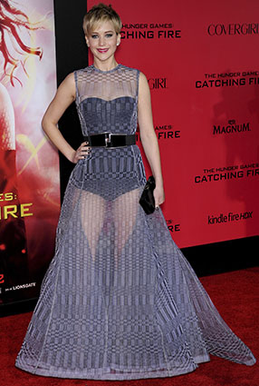
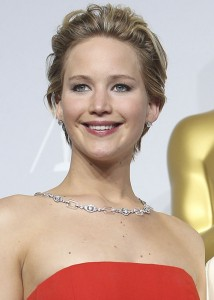

\[caption id="attachment\_1398" align="alignleft" width="286"\] (Photo provided by Bigstock Photo)\[/caption\]

_House at the End of the Street_ was released in the fall of 2012. Mostly a scarless horror movie, the film has two things going for it: what its star Jennifer Lawrence had accomplished before its release (_Winter’s Bone_, _X-Men: First Class_) and what should she would go on to do afterward. Lawrence has stared in five consecutive movies that have grossed over $100 million dollars: she won an academy award for the irresistible _Silver Linings Playbook,_ was nominated for her third oscar in _American Hustle_, was the driving force behind the lucrative _X-Men: Days of Future Past_ and has championed _The Hunger Games_ franchise toward more than $1 billion gross after its first two installments — and there are two more of them, as well as another _X-Men_.

Jennifer Lawrence is a blockbuster on two legs — a celestial talent, at 24, who is a large enough movie star already to caretake over dramas, comedies, independents and movie franchises alike for decades to come — and she figures to make a lot of people a lot of money in the process.

I bring up _HATES_ for a couple reasons. For starters, I’ve owned it on DVD ([shout out, Family Video!!](http://www.familyvideo.com)) long enough where not watching it has become embarrassing. But what interested me in buying the movie in the first place is not that I particularly enjoy horror movies, but because she’s in it. And that’s the point when it comes to Lawrence — she has mostly done brilliant work, but smack dab in the middle of her ascension to planet-status, she did a stinker of a movie. And while I’m sure they paid her fair wages to do so, for a beautiful, 22-year-old academy award nominee to do a low-budget horror picture to begin with seems dicey! (Girl, you didn't see Meryl Streep doing low-brow pictures. Chill.)

So why did she do it? I’d assume it was because she felt compelled to do so, dare I say it, artistically. (Oh, and we all cringe.) Call me a homer, call me a fan-boy, call me anything you want, but I’m going to say something anybody who saw _HATES_ before reading this column is not going to dig: I loved this movie. I loved it, I loved it, I loved it. Why? Because Jennifer Lawrence nailed it.

She’s 22, and she’s working her magic, and it’s incredible. Cruddy, horror movie script? Who needs it. She's intoxicating in every scene with her thousand-yard stare, extraterrestrial humanism (contradiction?) and her utter lack of a filter. _Oh, your parents were murdered by your little sister? Let me bring it up. Why? Because you don’t just want to talk about it. You NEED to talk about it — and I’m the perfect person to talk to. Spill the beans, orphan! Spill the beans!!!_

Anybody who can pull that off — being perfectly rude and disarmingly charming at the same time — is special.

_HATES_ comes up now, however, because of its natural figurative place in the conversation about the scariest stretch of Lawrence’s young life. This movie is the lone film that she has made that is deliberately (well, it _attempts_ to be) terrifying. With absolutely no regard for her life or the life of her friends and family, the world has dealt Lawrence the most terrifying scenario she has yet to face off camera, an event known perversely as The Fappening.

As Lawrence states in her heart-breaking feature for Vanity Fair this month, that stolen nude images of her were leaked online and spread like a virus was nothing less than a sexual crime. If she was a teenager, people would (probably) go to jail; and if she wasn’t famous this wouldn’t have happened. But being all of 24 and a wealthy movie star apparently makes it OK.

In the VF piece entitled “Both Huntress and Prey,” Lawrence says that we — all who looked at the stolen pictures of her — should cower our heads in fear. We should. We, the American public, are disgusting.

The terror, for Lawrence, does not exist solely in millions of people staring at her junk — which, to her credit, she is now capable of turning into a pun about proving she is not a hermaphrodite — but the same public that has anointed her into the next Streep, the very same audience that has made her dreams of performing in movies a reality, has so vehemently failed her. That in one moment, she can be lauded for her transformative performance as Tiffany in _Silver Linings,_ and the next, memes are being created about little boys jerking off to her bare flesh — like she is a rack of lamb at the local butcher.

The same world that celebrates her as an artist, but more to the point, as a refreshingly genuine role model for women of all ages, sold her for a quick buck on the internet like her ass is something that we own just because she’s famous.

_“Just the fact that somebody can be sexually exploited and violated, and the first thought that crosses somebody’s mind is to make a profit_,” she tells Sam Kashner. _“It’s so beyond me. I just can’t imagine being that detached from humanity.”_

Isn’t Lawrence the one that makes her profession from playing make believe? If so, then why does she appear to be only real person in a world of fakes and phonies?

This brings me back to _HATES_, a constructed universe where evil not only exists but is embodied by a nutty little girl who murders her parents. The film is like every other cheap fright-flick you’ve seen recently, chock full of archetypal characters — the slutty mother, the horny “boyfriend,” the ditzy best friend and the inquisitive police officer — and it surrounds Lawrence, the film’s centerpiece, with oblivious jerk-offs and fantastic scenarios. (Oh, Lawrence’s character has to walk home, in the rain, so she HAS to get into the car with the creepy neighbor whose family is dead??? Please continue to enlighten me on what will happen next.) But, as previously stated, this film has ONE GIANT FREAKING DIFFERENCE between it and all films that are built exactly the same, and its name is Jennifer Lawrence.

The movie is _like_ watching Michael Jordan play basketball with the Looney Tunes in American classic _Space Jam._ Jordan is literally the only professional athlete on the same court as a talking rooster and smelly projections of his own demons; similarly, Lawrence is spitting hot fire like an Oscar-winning actress should be while her horn-ball mother routinely abandons her at home to flirt with cops and doctors and genre trope after genre trope falls into place. At least in _Space Jam_, every character, including Jordan — and, most absurdly, Bill Murray — is in on the joke. Poor Lawrence is left to discover the true meaning of her character Elissa Cassidy (what a hideous name) all by her lonesome in a world that is, by design, out to destroy her. (See: _Cabin in the Woods_.)

On a sidebar: The closest comparison to watching Lawrence in _HATES?_ Watching the immortal Natalie Portman, who is, for context, the background on my cell phone and who holds the key to my heart, carry the stinking dead carcass of a movie which is _No Strings Attached_ to its concluding scene. Somebody told Portman’s agent that a romantic comedy following the phenomenal yet brooding _Black Swan_ would be good for her image. But when Portman hears Romantic Comedy, she thinks about Woody Allen and _When Harry Met Sally._ Well she didn’t just get something less intelligent, she got something written with the sludge of toxic waste, and cast next to Hollywood’s go-to douchebag, who couldn’t find Billy Crystall’s performance as Harry Burns if it woke up next to him. Here’s the final scene of the movie.

https://www.youtube.com/watch?v=KoabUMmRutk

How much gravitas does Portman have to put up with that dialogue? So much so that Ashton Kutcher cannot believe his eyes when she pulls actual tears from them. That’s the entire movie. Is she the world’s funniest person? No. But this film “works” — as in, you don’t _have_ to carve a hole in your stomach and empty out your intestines upon suffering through it — solely because of the charm and mystique of its lead performer.

Back on track... (Spoiler Alert from here on out people. Fair warning.) _HATES_ is an unbelievable movie to watch in the wake of the sexual crimes committed to Lawrence in real life. On screen, she is always “being watched” by a subject we are unsure about, a traditional trope of the genre. But how fitting, considering the entire world is constantly looking at her in real life too, yet it goes unnoticed because it is viewed as the territory of her job.

_“You expect paparazzi to be annoying,”_ she said to Kashner. _“You don’t expect them to be terrifying.”_

Where [Kanye West](http://www.huffingtonpost.com/2013/10/09/kanye-west-to-jimmy-kimmel_n_4074879.html) and others have often struggled to express to the masses just how insane it is that we treat our celebrities — our heroes, our icons — like caged animals, Lawrence states the issue as plainly and accurately as that. It is the paparazzi mentality that leads to the American public devouring nude photographs of its celebrities like cheeseburgers and beers without contemplating the criminal violations of privacy that Lawrence and many others are forced to deal with. (Then again, it’s also an American public that reelected a President after the Patriot Act blurred many of the lines between private and public. You could argue we have been well-seasoned.)

Kashner begins and ends the piece for VF with a quote that Lawrence, ironically, says about herself. In the context of her family having all boys for most of 50 years, Lawrence refers to herself as “a goddamn miracle.” Brilliantly, Kashner captures the resounding impact of this remark. She’s not a miracle simply because she’s so talented — that’s only a piece. Lawrence is a miracle because she is so talented and doesn’t expect anything more from the world. In the article, her_ Hunger Games_ co-star Woody Harrelson is quoted as to saying, “You know, it’s not terrible, people telling you you’re great; what’s terrible is when you start believing it. She never got fucked up.”

That’s why we all care so much about Lawrence, why we flock to her, and prod her and treat her like a caged bird — We struggle with how unbelievably real she is. That we have no fucking clue as a society how to then treat Lawrence like a person is beyond me. But that’s what the fuss is about. Here is this rambunctious ball of energy, this pretty, positive chatterbox of a woman. She says and does what she feels, and not what she is told to. She’s a strong woman not because of her stature, her looks or her talent — but because she can fall down on her way to accepting her Oscar, admit it was one of the most embarrassing moments of her life and then move on to talking about putting soy milk in her coffee. There is a fearlessness in Lawrence; and we all took that for granted when we let our obsession obliterate the line between curiosity and decency.

Keeping in mind that if you look hard enough, you can find exactly what you’re searching for, watching _HATES_ retrospectively is fascinating because of the parallels between Lawrence’s character and her real life nightmare this year. (There is even a “right on the nose” bit where other high schoolers approach her about joining their band. _“How do you know I’m in a band?” “We looked you up on Google. Yeah, nothing’s sacred anymore.”_ That is an ACTUAL sequence in this movie, I shit you not.)

The major plot of the movie centers around Lawrence’s character investing time in Ryan (played stoic and creepily by Max Thieriot) against the wishes of seemingly everyone in town. Elissa Cassidy and her mother moved into the town to discover there was a double homicide in a nearby home — Ryan’s parents killed by “Ryan’s sister” — and much to the chagrin of everyone, Ryan chooses to live in that house, alone, which drives down the market value of all the homes in the neighborhood. Elissa befriends Ryan, then begins to fall in puppy love with him, as she connects with him as an outsider in a town full of dickholes. What she doesn’t know is that Ryan is actually the man behind all the evil in town — he accidentally killed his sister growing up, then intentionally killed his parents, and now he kidnaps girls in town, chains them up in his basement and pretends they are his kin — and he swiftly turns on her once she figures him out. Act 3 of the film is essentially Elissa trying to break out of Ryan’s basement while one by one people looking for her show up at the house and Ryan knocks them off. Things are grave.

\[caption id="attachment\_1397" align="alignright" width="214"\] (Photo provided by Bigstock Photo)\[/caption\]

The process for Ryan in _HATES_ — capturing innocent girls, turning them into his “crazy sister” and disposing of them when necessary — draws parallels to the functionality of the American celebrity and how the public treats them. (Hint: We are Ryan.) We anoint them, then we drive them crazy but conveniently blame them for their shortcomings as a “role model” or person; or in the case of Lawrence, we just destroy their trust, and then we move on to the next Buzzfeed link while they have to call their father and explain why his little girl’s body is being passed around like a baseball card.

[Why do we hurt our celebrities?](http://www.thehighscreen.com/2014/10/on-the-run-gone-girl-a-psychopathic-defense-of-american-marriage/) [Do we do it to feel better about ourselves?](http://www.thehighscreen.com/2014/10/the-joe-mags-show-taylor-pangman-oct-9-2014/) Do we scratch at their lives to try and leave a mark like the giant ones they make on us every day? The hypocrisy is that we destroy Lawrence’s entire world with the mass communication of her nude photos, and then we justify it to ourselves because “they aren’t effected by me looking at this” — when we know better.

The most powerful couple scenes in _HATES_ are the film’s center point and its conclusion, which both involve Elissa Cassidy staring at a tree. In the film’s middle, leading up to the first kiss between Elissa and psycho Ryan, he explains to her that the world is full of secrets. _Everything is a secret._ He asks her to stare at the tree and then tell him what she sees.

“_A tree,”_ Lawrence says in a perfect “Dude, I’m not getting this” voice. _I see a face._ Ryan then tilts her head at a funny angle. Suddenly she can see it too: The tree now bears a resemblance to a human face.

Now let’s flash ahead, past his attempts at locking Elissa away in his basement and her shooting him to death with a slain officer’s gun. (You know, horror movie stuff.) She and her mother are on their way out of town when Mom finds Elissa staring at that tree. _What are you staring at?_

She asks her mother what she sees. "_A tree."_

And then, in a move only the best of the best can conjure up, Lawrence sheds a single tear down the left side of her face. She knows her mother is right; there never was a face, only what she wanted to believe was there. Mother and daughter leave town, the movie ends and the audience is left with the lasting image of Lawrence — this beautiful young woman completely and utterly disappointed by the world around her. It is heart-breaking.

As Lawrence told Kushner, she isn’t crying about the leaked photographs anymore, and while she is plenty angry at even her friends who admit to looking at the photos, she seems OK with moving forward — both as an individual and as an advocate for human decency. She is going to keep making movies, and doing interviews, and making us laugh, and cry, and think, and I’m sure she will continue to be an incredible role model to young people everywhere.

And that is a goddamn miracle because we don’t deserve it.
