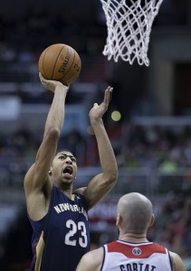

Taylor Nigrelli:

1) Who wins the East? Charlotte has depth, defense and an identity; Chicago added Pau Gasol, Nikola Mirotić and Doug McDermott and the comeback of Derrick Rose to go along with the league's toughest defense; and the Wizards should be a tough out once Bradley Beal returns. But none of those teams has LeBron. And until we see otherwise, that's all that matters in the East.

2) Who wins the West? Well it can't be the Spurs, right? They don't win in back-to-back years. Well your silly preconceived notions mean nothing to Big Timmy and his band of ballers. Duncan will spend another year defying logic, reason, science and all exaggerated claims of his demise. Kawhi Leonard will continue to be the best Popovich lab creation yet and they'll shoot ALLLL the three-pointers. And then they'll beat LeBron. Again.

3) Who wins MVP? Blake Griffin. With Kevin Durant hurt and the Spurs likely to rest their guys a lot, the Clips have a decent shot at the top seed in the West. And Blake made a mini-leap into super-stardom last year. He extended his mid-range game and played much better D. If Chris Paul's hurt again and the Clips keep winning anyway, Blake will have an excellent chance at MVP.

4) NBA Finals prediction? San Antonio sweeps Cleveland. Duncan, Popovich and Manu retire immediately after the game. Duncan goes up and hugs LeBron after the game and says, "OK, NOW this is your league."

5) Wild-crazy-ass bold prediction for the season? Both New York teams miss the playoffs. Then Phil Jackson retires and James Dolan's band plays at the retirement party. Meanwhile in Brooklyn, Mikhail Prokhorov loses too much money (if it's even possible) and decides to give up on the NBA. The Nets sell for more than the Clippers. Andrei Kirilenko is neither seen nor heard from again.

Tim Mullhaupt:

1) The East, while not as competitive as it's Western counterpart, shouldn't be a sure thing this season. The Bulls get Rose back; the Heat are about to let loose the guys ["Stephen Jay Smith"](http://youtu.be/7O6m79FdUlk?t=15s) locked in the 4th-quarter closet; and even the Knicks may have made coaching and schematic changes for the better. That said, give me LeBron's entourage up in Cleveland.

2) Wow this a tough call. Even tougher to bet against Pop's Spurs after their banishment of the Big Three. I'd say the Thunder could make a legitimate claim but Durant's going to miss at least a month. The Clippers have the talent and new and improved leadership in the front office, but I don't know if I'm totally sold. Count me in on Steve Kerr and the loaded Warriors bandwagon. The best uniforms in sports should be the best team in the West, despite the faint possibility of them playing in a [sparkling new toilet bowl](http://espn.go.com/nba/story/_/id/11583606/golden-state-warriors-flush-notion-toilet-bowl-design) in 2018.

3) LeBron. KD being out for a month makes a two-horse race a one-horse race. That's not to say guys like Steph Curry, Chris Paul, Blake Griffin or even Anthony Davis won't have MVP-caliber seasons, it's just that Cavs essentially let James dictate their offseason, and if the King is happy with his court, get out of the way or prepare to be run over.

4) Warriors over the Cavs in seven. I know I'm assuming a lot here. I know I'm expecting the Warriors to gel with Kerr quickly; their 6-2 preseason is a decent start. I'm also buying into fairy tales like "Andrew Bogut stays healthy" and "Golden State will not [totally regret passing on Kevin Love](http://www.pickinsplinters.com/?p=37647)" — but I don't know if there's another roster in this league I'm this comfortable with. Some may even say it's a bit much to place Finals expectations on LeBron and company in their first year together, but hey, he did it with the Heat, and while they'll net their fair share of growing pain losses, the Cavs have the offensive firepower to outscore any opponent. Why I picked the Warriors to win? Steph Curry is fire.

https://www.youtube.com/watch?v=1o2jn8OoNvs

5) The Spurs fail to make the Western Conference Finals following a loss in seven games to the battle-hardened Thunder, who then lose in seven to the surging Warriors. Tim Duncan rides off into the sunset with five rings, marking [the second pillar of a professional sport to retire](http://www.newyorker.com/magazine/2014/09/08/slong-jeet) in a matter of months.

Ross Bentley:

1) Cleveland, by default. Remember, Miami won the East the past four seasons and I'm not entirely sure this Big Three isn't better than that big three. Plus, their bench and supporting players should be the difference. But I do think there will be some bumps along the way, and they might struggle enough on the defensive end to not get the no. 1 seed. Chicago is probably the team to unseat them if it happens. Just know that I'm taking LeBron, Love and Kyrie in a 7-game series.

2) San Antonio Spurs. There's really only two ways this can go. One, the Spurs dominate again, hungry enough for one last title run and winning 60+ games en route to a top seed OR two, last year was their final big run, and the Thunder or Clippers (or Mavs: I can dream right?) finally knock them off. I'll take the former after what they did in the playoffs a season ago; it's impossible to pick against them. But who really knows? Manu, Parker, and Timmy can't do this forever... right? Still, with Leonard ready to take the next step into stardom, I still think SAS are the favorites.

3) I have a weird feeling this is going to be a "Derrick Rose" type of year. Not that I think D-Rose will come back in his first season in two years and put up MVP numbers, but it feels like someone that we don't expect is going to blitz through and win. KD or LeBron is the easy pick, but Durant is hurt and LeBron has a new team which almost certainly will truncate his counting stats — but will surely boost his already astronomical efficiency.

So who is left? I'll be a lone wolf here and pick Chris Paul. He's been the best point guard in the league for a long time now; he's due.

4) I don't think Cleveland is ready yet. I think they get to the NBA Finals and put up a fight but lose to whoever comes out of the West in five or six games; and since I picked the Spurs out West, I'm picking them to win it all. But I think OKC or the Clippers would beat them too. The Cavs time will come but they need a little more fine tuning before they get there, as did Miami in 2011 when they lost in the finals to Dallas.

5) My crazy prediction? The Philadelphia 76ers will be the worst team in NBA history. In an 82-game season, the '72-'73 Sixers still hold the record with only nine wins. This years Sixers will win eight games. 8-74, I'm calling it right now. Look at their roster?! Other than Michael Carter-Williams and (maybe) Nerlens Noel, none of their "best" players would crack the rotation of any good NBA team. This team is set up to fail, and fail they will. Good job owners, this is what you asked for when you voted down lottery reform.

\[caption id="attachment\_1487" align="alignnone" width="211"\] Anthony Davis. (Photo taken by Keith Allison)\[/caption\]

 

Elliott Altland:

1) Let’s not kid ourselves; there is only one true contender in the East. The Cleveland Cavaliers attempted to build slowly through the draft with young talent, but when Lebron is available and he wants you to trade away 1st round picks, you get Lebron and trade away those picks. Now he finds himself with a younger, and arguably more talented, Big Three and in immediate contention for a title. The Bulls, Wizards and Raptors all might challenge the new eastern superpower but will ultimately fall due to limited depth and talent.

2) Now this is a more interesting question. While the no. 8 seed in the East might again have a losing record (Knicks or Bucks?) the West won’t let teams in the playoffs that aren’t at least five games over .500. Ultimately, I see the West coming down to the Spurs, who have the best coach in the league and are the most dedicated and professional team, and the Clippers who are going all or nothing. The Spurs are the safe answer... so I am going to risk it and go with the Clippers to take the West. The team is just too young and talented to be held out from the championship game again.

3) LeBron won’t win MVP — with Kyrie Iriving dishing assists and Kevin Love eating boards, LeBron will probably have diminished counting stats across the board in his first year back in Cleveland. (There is just as good a chance he will dominate and score 40 a game... it’s LeBron). After an incredible run through the FIBA basketball tournament, I predict that Anthony Davis will come back and lead the Pelicans to new heights. Davis had a lot of time practicing with the world’s best, training for basketball supremacy that will begin to rear its lovely head. On top of that his biggest competition at power forward Kevin Love is probably going to have a slight decrease in production on a new team.

4) Clippers vs Cavaliers. Who will take home the trophy? The Clippers will pass, shoot and dunk their way to a 4-2 victory over the Cavs because of their coaching, youth and depth. Chris Paul has experience over Irving and will out dish him; Blake Griffen will run circles around Kevin Love; and DeAndre will be unguardable down low. (Like, seriously, who plays interior defense on this Cavs team?) The depth and youth of the Clippers bench have will out run the Cavs and beat them at the fast-paced game LeBron loves so much. Also Doc Rivers coaches that team, so ya.

5) The Spurs will not make it to the Western Championship game. While they are one of the most dominant forces in the NBA, reigning champions and have continued to defy time, the Spurs are finally in too difficult a conference to endure such a lengthy season followed by a grueling playoff run. Kevin Durant will be back in December rested and starving for basketball; the Warriors will be hungry and filled with high expectations behind new coach; and the Suns are a deep playoff contender that can out run everybody with an exceptional three-man point guard rotation. The West is too talented — the Spurs should try to switch conferences because they are getting too old to keep up with all the rising talent. (I didn’t even mention Portland, Houston or Dallas... Oh my God.)

Stuart Seidel:

1) Cavaliers. I don't really see anyone else having a chance with the talent on that team. Yes, they might stumble early to find their identity, but they do have LeBron and Love. I don't trust the Bulls or Rose's health. And after losing Lance Stephenson to Charlotte and Paul George for the season, gone are the Pacers as a conference contender. The NBA season is a long one — Cleveland will have time to figure it out by the All-Star break and will promptly run away with the East.

2) Spurs. Slow and steady wins the race, and with Durant out I think the Thunder will take too long to get going. Memphis and the Clippers are threats, sure, but they also have won a combined zero Western Conference Finals games with their current nuclei. And really, how can you pick against the defending champs?

3) LeBron. He is back home with great players around him. I see him exploding this year and putting the city of Cleveland on his back en route to winning his fifth MVP.

4) LeBron will get another shot at San Antonio but once again the Spurs will prevail. With the core still intact, Popovich at the helm and players like Leonard coming into their own, it will be too much for this newly assembled Cavaliers team to handle.

5) I think the Pelicans are going to be a contender this year. I like Jrue Holiday and the addition of Omer Asik. And I love Anthony Davis. I think Davis gets a real look this year at MVP, and behind his freakish frame, I think they finish in the Top 5 this year in the West.

Cole Frederick:

1) Chicago Bulls. Cleveland is probably the popular preseason pick, but as good as they'll be offensively, they might be just as bad on defense. If we learned anything during LeBron's tenure in Miami it's that chemistry is so important in order to win an NBA title. (We also learned Heat fans are terrible. Like, the worst.) Chicago's core group has been together in Tom Thibadeau's system for years. I love the additions of Pau, McDermott, and Mirotić. Everything hinges on whether Rose can stay healthy. If he can be 85 percent of what he was during his MVP season, Chicago is winning the East.

2) San Antonio Spurs. I’m not picking against the Spurs until Duncan and Ginobili retire. The Spurs are bringing back the exact same team that dominated Miami last year in the NBA Finals, and they added Kyle Anderson in the draft. Health is always a concern with an aging roster but Pop is brilliant in managing minutes. Oklahoma City didn’t get better in the offseason. The Clippers did, but I don’t trust them in the playoffs yet. I like Golden State’s potential as a sleeper in the West but the Spurs are still the favorite.

3) Russell Westbrook. If LeBron James plays 75 games, he’ll win the MVP; I just think James sits out 10-12 games throughout the year for rest, which would open the door for someone else to win the award. Durant will probably miss 20-25 games himself; and Chris Paul and Blake Griffin will split votes. So that leaves Westbrook and Steph Curry. I could totally see Russ putting up 30/8/8 while Durant is out. I’m the president of the Russell Westbrook Fan Club and I would love nothing more than for him to win MVP.

4) Spurs over Bulls in 5. Tim Duncan has accomplished just about every meaningful achievement a player could hope for in a career: NBA champion, MVP, Finals MVP, All-Star, All-NBA, All-Defensive Team, etc. He’s done everything except repeat as a champion. I think this is Timmy’s last year (and Manu’s). As a lifelong San Antonio fan maybe this is wishful thinking. I want my favorite player of all-time to go out as a champion; and if anyone deserves that it’s Tim Duncan. He’s one of the five greatest players in NBA history, and a sixth title might move him up further on that list. As long as the Spurs are healthy when the playoffs start, I like their chances of repeating for the first time in franchise history.

5) The Pelicans make the playoffs and the Trail Blazers are on the outside looking in. I couldn’t decide between this one and the Warriors making the Western Conference Finals. Ultimately, I decided on going with Anthony Davis, who will emerge as one of the five best players in all of basketball this season. I love the frontcourt of Davis, Omer Asik and Ryan Anderson. Jrue Holliday is an underrated point guard. Tyreke Evans and Eric Gordon are wild cards but I really like this New Orleans team. As for Portland, I just don’t see how this team got any better. The West is so tough and they have a weak bench. I think they miss the playoffs and LaMarcus Aldridge is playing elsewhere next season.

Kwame Belle:

1) This is very hard. I literally have no idea how this plays out. If pressed, I'm going with the Cavs. Do you realize that three of the most important pieces on the Bulls have leg parts made of mush? Happy Halloween.

2) Clippers. Not only are they the deepest team in the West, I also think they have the most to prove. OKC got worse and the Spurs... OK, can we talk about the Spurs for a minute? This is the same team that nearly got sent packing against a noticeably weaker Dallas team and then went on to face an OKC team that managed to half wiggle out of its 0-2 hole and make it interesting. I'm not discrediting their win in the NBA Finals but... The Spurs were FAR from dominate in the post-season.

That has nothing to do with this season but I’ve been wanting to say that for an entire offseason.

3) Chris Paul. Maybe Lebron. Ughhh. A win for either would be such a great warm fuzzy feeling for the NBA. OK, I’m going to say Chris Paul. His numbers will leap off the page and the Clips will have the best record in the NBA.

4) You know how Charles Barkley says nobody's an expert? Finals predictions always prove that. This year the "expert pick" is Spurs vs. Bulls or Spurs vs. Cavs, but I don't believe in any of those three. Actually I think this is going to be a random Finals. To prove the point, I'm going Clippers vs Wizards. ([Big shout, King Gortat!](http://grantland.com/the-triangle/answering-some-questions-about-the-wizards-offseason/))

5) So I had this epiphany while riding the train and thinking about what wild crazy ass prediction I was going to make. I'm going to cheat and give two. (Sorry editors in advance for blowing my word count.)

The first, which I think is every bit as plausible as my second, is seeing Blake Griffin catch that work like Kobe in '00. You know what happens to people who announce they aren't taking shit no more? They get fucked up. AGAIN.

But moving forward. My insanely accurate prediction for this season is... LeBron for DPOY. It's clear as day. I didn't even count it as my crazy ass prediction; this is just for record keeping purposes. LeBron is in lordship mode — this was supposed to say "leadership" but it autocorrected to lordship, which in this instance means the same thing. Cleveland is a young team with a horrible transition defense.

https://www.youtube.com/watch?v=Zj57Eyzfq5A

Did you see how D-Rose bodied them repeatedly on fastbreaks??? LeBron knows better than anyone, except perhaps new coach David Blatt, just how sus their team and individual defense is. The next best team defender might be Shawn Marion and then Hayward (Jesus Christ).

For the first time in three seasons, James' offense no longer has to operate through him exclusively to be efficient; this will leave LeBron free to supplant himself as Cleveland's defensive general. With no other worthy defenders, LeBron will take it upon himself to shutdown the opposing team's superstar scorer/hot hand. (This is where we roll back the tape and remember that's exactly how Miami beat Chicago in 2011 — you know, the last time James and Rose squared off in the playoffs.)

Joe Mags:

1) The Derrick Rose health narrative not withstanding, the Chicago Bulls were built from brick and mortar and the seed of Yannick Noah to be the most elite regular season team in the NBA. Can you imagine playing three games in four days on a road trip — you have sore legs, you're tired of fighting off the cold winter air and a gaggle of groupies in each city — and strolling into the United Center to see Joakim, Taj Gibson and Jimmy Butler smiling at you? The Bulls win no. 1 seeds when they have their full compliment of players; equipped with the greatest passing forward of his era (Gasol), Pau's Spanish understudy (Mirotić) and the second best rookie scorer from a loaded draft class (McDermott), this is the best Chicago team Thibbs has had to bark at. Once accompanied by home-court advantage throughout the playoffs, I believe the Cavaliers will be a few big men short of halting this empty-bellied Bulls team.

2) The Spurs are the Bulls equal (and then some) in regular season dominance; [San Antonio has perfected October-April](https://twitter.com/kpelton/status/456146689422680065). With that said, playing 100+ games in back-to-back seasons is brutal — far and away the most overlooked accomplishment of Miami's four-consecutive trips to the Finals — and a team as aged as San Antonio would have an uphill climb winning three consecutive East Finals, let alone the West. I think sharper talent (Clippers, healthy Thunder) or a fresher veteran-laden team (Mavericks) will prevail this season.

3) If LeBron James doesn't win the MVP award after (a) the letter, (b) [overseeing a shot to the heart of Cleveland's economy](http://thinkprogress.org/sports/2014/07/15/3460194/no-lebron-james-wont-bring-500-million-a-year-to-clevelands-economy/) and (c) guaranteeing the Cavaliers somewhere between 50-65 wins for seasons and seasons to come, I'll assume something went wrong on the set of _Space Jam 2_ and James is trapped in Tune World. (Sidebar: _Space Jam_ is an American classic. _Space Jam 2_ is a terrible idea.)

4) I outline exactly how [here](http://www.thehighscreen.com/2014/09/dallas-back-in-nba-finals-discussion/), but I believe the Dallas Mavericks are positioned brilliantly to repeat their fortunes of 2011. Let's call it, Mavericks over Bulls in six.

5)  You mean besides picking the Mavericks to win the title? I am begging for Russell Westbrook to average 35 points on 35 shots until Durant comes back. Absolutely. Begging.

We made it! NBA is back. Enjoy tonight's games...
