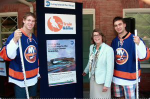

The Islanders are going to make the playoffs, and their final year in the Coliseum will be one to remember.

Yes, I know it’s still early in the NHL season, and I understand there are more than 70 games left. Yes, I know the Islanders have been irrelevant since the ’80s and no one born after 1990 even knows what the Islanders being relevant means. Yes, I know you think I’m crazy. But I don’t care what you say, the Islanders are on the upswing and it is going to start with this year, right before they move off Long Island and into [Barclays Center in 2015-16](http://www.newsday.com/sports/hockey/islanders/sources-islanders-won-t-leave-a-year-early-1.6858275).

The Islanders have not won a division championship since 1988. They’ve only made the playoffs eight times since then and advanced out of the first round only once. However, I think this year they will make the playoffs and advance out of the first round and its mostly due to Kyle Okposo and John Tavares guiding the Islanders into their own.

\[caption id="attachment\_1513" align="alignnone" width="300"\] This is the final season for the Islanders in Nassau County before moving to Brooklyn and into the Barclays Center. (Photo credit to Metropolitan Transportation)\[/caption\]

Another team 25 miles north west of the Nassau Coliseum is a team that also wears blue and orange, and is almost a mirror image of the Islanders. The New York Mets also suffer from being the little brother in New York City. The Islanders and Mets are both trying to find their identity and gain some traction to make up ground on their big bad rich counterparts. While I think the Mets are close, I think the Islanders are there.

Right now, the Islanders are sitting in third place of the Eastern Conference and first place of the Metropolitan Division. How are they doing it? Scoring goals, lots of goals. They are currently tied with the San Jose Sharks for the most goals thus far with 35. Most of that can be credited to Okposo and Tavares. Whether they are scoring or attracting the attention of other players they are helping the Islanders stay productive. If you watch highlights of their power play you will understand how well they cycle the puck, how well they change things up, and how much other teams worry about the two of them. Having those two on your team and at the prime ages of 24 and 26 is enough to have anyone excited.

Islanders defense and goaltending need to get straightened out. Going into last night’s game they had given up 242 shots through eight games, averaging a little over 30 per game. Last night against Winnipeg, they gave up another 30 en route to a 4-3 loss. You cannot consistently win giving up 30 shots a game — your goalies won’t last and you can’t rely on your offense. Their defense doesn't protect their goaltenders, often leaving them out to dry when they break down. The goalies have looked great at times but then minutes later they will collapse, and it’s usually because the defense is not helping.

So you’re probably thinking I need to make up my mind — do I like this team because of their offense or do I not like this team because of their defense? Well, obviously, I like this team if I am calling for Islanders fans to come out of hiding and go party in the one last time. Their offense is clicking, and that includes late offseason acquisition defensemen Danny Boychuk who seems to be rejuvenated playing in New York and is already making a whole lot of fans, including Garth Snow.

But that’s just it, offseason acquisitions is what a lot of this defense consists of. Players like Dan Boyle and Nick Leddy and even their goaltender Jaroslav Halak were all brought in over the past 6 months. Lubomir Visnovsky, a veteran defensemen, just came back from injury. It takes time for all this to gel. Goaltenders and defenseman have to be on the same page and that comes with time. The defensive pairings will get used to playing with each other and Halak will get used to playing behind them.

The defense will be fine, they have the talent, they just need the chemistry. They have a goalie who has shown flashes of greatness throughout his career in Halak, and their offense is already clicking and will only get better. Did you forget they have Okposo and Tavares? Those two give you an identity. Those two can help bring you out of a state of irrelevancy that the Islanders have experienced for more than 25 years.

Moving to a new arena next year also helps, I know a lot of Islanders fans won’t like to hear that, but it does. It gives them a home that is desirable to play in, which will help Garth Snow sign players to fill in around Okposo and Tavares. The Islanders have struggled for years but I think it’s important to a lot of Islanders fans to close out the final chapter of the Nassau Coliseum with happy memories, and the players understand this. They are playing with an extra desire this season, they are a young team peppered with veterans that’s eager to take the next step toward winning a cup and they want to do it in that building.

The Islanders have been in Uniondale since their founding in 1972 and had a lot of success during their first 15 years, winning four Conference Championships and four Stanley Cups. The past 25 years have been a quarter century to forget for Islanders fans. I think the fans and the players both deserve to celebrate some more in that building, and I think they will.
