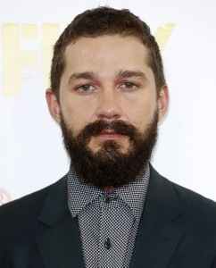

\[caption id="attachment\_1375" align="alignleft" width="242"\] **Shia LaBeouf: a human.** (Photo by Tim P. Whitby/Getty Images/Image.net)\[/caption\]

I would like to start off by apologizing for my recent behavior, and I would also like to thank Joe Manganiello for the opportunity to voice my regret to all of you. Let me get right to it then. I’m sorry woman at the Starbuck’s drive-thru for addressing you as “Yo Lady!” when you gave me the stink face after you demanded to speak to my manager because you did not like my tone. I’m sorry people of the party who I successfully tried to pick a fight with. I’m sorry that I am not brave enough to be any more specific about my personal failures, and I’m sorry that I lack the courage to recall any more of them — I have them stored comfortably beneath mouse chewed tarps and spider-webs in a damp, cold corner of my mind.

Unlike myself, Shia LaBeouf has been extraordinarily candid about his mistakes in recent days. I am not someone who follows celebrity news consistently or with much interest. However, I have at times spent considerable time watching celebrity interview videos of actors and actresses who I have (for one reason or another) become fascinated with. I assume that I have watched every interview that Heath Ledger ever did talking about the Joker or _The Dark Knight_. And every interview he did concerning the Bob Dylan sort-of, kind-of, not really biopic _I’m Not There_.

After I was enlightened to the fact that [Ryan Gosling is maybe the coolest guy ever](http://youtu.be/RWJd1jaYaeU?t=58s), I began to pay attention to what he had to say. My interest in Gosling was peaked by the films he has done with Derek Cianfrance (_Blue Valentine_, _The Place Beyond the Pines_) — Gosling interviews lead me to interviews with Cianfrance himself, as by a tangent.

In one interview, Cianfrance talked about the disjunction between what he sees in movies and what he observes around him in “real” life. To illustrate this disjunction as a problem for him as a person and as an artist, he spoke about the contradiction he remembers from his childhood of having been surrounded by family portraits in which everyone was captured with a smile on their faces. Conversely, however, Cinafrance the child found that this happy image of his family did not match reality. Smiles were in short supply, and fighting was a common feature of his domestic life. What Cinafrance is remarking on is the tension that exists between our realities and the images that we create and use to represent those realities — these two things all too often contradict one another.

Shia LaBeouf — in an explosive, strange, and perhaps inadvertent way — is bringing attention to the tension between reality and Hollywood. In the same way that the Egyptians built idols to their Gods, and in effect, created their Gods, the American citizenry uses Hollywood as its Olympus. Not only do the actors function as deities for us, but also the movies themselves create a world (an Olympus) for us to go to rather than be in our own reality.

This is what makes celebrity interviews so compelling to me sometimes. I watch Gosling talk about robbing banks, and Ledger talk about Dylan and chaos because I want to believe that they posses some secret that, if I only listen attentively enough for, I can acquire.

Shia LaBeouf, through his recent antics, is reminding us that this is not the case.

http://www.youtube.com/watch?feature=player\_embedded&v=jtAkNf\_b\_TM

The child actor turned Spielberg-co-signed movie star turned "psychopath" is truly none of those things; he is a person just like you and I — who happens to be really, really dope at acting.

http://www.youtube.com/watch?v=mwsOdsxDZh0

He, like you and I, has to work through his own set of personal problems and challenges every day. The perennial difference between Shia and us is that he has to work through these things while under near suffocating public scrutiny. To be sure, this is not intended as a defense of Shia LaBeouf — he does not need my personal support, and I do not feel personally inclined to offer it to him — I’m simply asserting the existing conditions of his reality as opposed to ours, or at least my own.

http://www.youtube.com/watch?feature=player\_embedded&v=yw3rIjzEuaY

As an actor, LaBeouf is becoming increasingly more captivating to pay attention to. This is because his actions are a confrontation and a result of the tension that exists between Hollywood and reality — of images and reality, which Derek Cianfrance speaks to directly. It is ironic that Cianfrance refers to the _Transformers_ movies as the type of cinema that is opposed to what he, as a director, wants to put on film; _Transformers_ is the precise movie through which LaBeouf earned his more relevant fame. Movies like _Transformers_ offer us a spectacle and a fantasy that is so other to any audience member’s reality. They allow us to sedate ourselves from what is discontenting us in our respective realities.

And, no surprise, it was around the time _Transformers_ blew up that LaBeouf's reputation off screen began to catch up with him on camera.

http://www.youtube.com/watch?feature=player\_embedded&v=KGAWg3pt0h0

By all indication, LaBeouf seems keen to shatter his blockbuster mask now. He seems to be interested in making the type of movie that allows him to put reality under a microscope: to seriously question the questions that are worth questioning, whatever those might be for him, and hopefully for us as well. That is exciting because, as recently as 2011 — after three _Transformers_ flicks, plus the remakes of _Indiana Jones_ and _Wall Street_ — could anyone have imagined he'd do _Charlie Countryman_ or _Nymphomaniac_?

A couple years ago, the Hollywood machine had inflated him into the next Harrison Ford. Now he is letting the air out — he recently threw a bag on his head that read ["I'm not famous anymore"](http://grantland.com/hollywood-prospectus/im-in-love-with-shia-labeouf/) — and just like that, he has morphed into the next Joaquin Phoenix.

Symbolically, I don’t think it will be long before Shia LaBeouf and Derek Cianfrance make a picture together. To me, it seems almost inevitable.

Fortunately for me, I do not have to make public apologies for things, and I make mistakes everyday. Sometimes I’m rude to people at work. I anger easily. These are characteristics of my personality that I am not too proud of. But they are there. And I assume they are there in everybody who I will ever meet. Shia LaBeouf has been on a personal crusade to honestly confront his own shortcomings. There’s a Shia LaBeouf in all of us, although, obviously, that person is not Shia LaBeouf at all. Honest.
