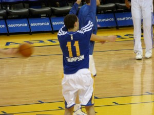

\[caption id="attachment\_1617" align="alignnone" width="300"\] Klay Thompson is, umm, really, real good. (Photo taken by Matthew Addie)\[/caption\]

 

There is not too much basketball to look over after six days of NBA action, however, there is reason to think there may be big movers in these power rankings. Another huge injury has hit us quick. This stage of my weekly power rankings is a bit of a progress tracker.

**30\. Sixers (0-3, Even) **Third year combo guard Tony Wroten is an early candidate to win the most improved player award — unless award season completely vetoes Philadelphia in year two of their takedown, which is possible. Wroten has a decent chance to lead this inexperienced team in scoring this year as he averages 19 points and 7.7 assists in Philly's first three games.

**29\. Magic (0-3, Down 1) **Seven-footer Nikola Vucevic is averaging a whopping 17.7 points and 15.7 rebounds through three games; the big man is [enjoying life with a meaty new extension](http://www.nba.com/magic/magic-sign-nikola-vucevic-contract-extension). Expect Vucevic to easily average a double-double for his third straight year. He should continue to be Orlando's first scoring option with Victor Oladipo (fractured jaw) sidelined for a month or so.

**28\. Lakers (0-4, Down 7) **The Lakers already look tired and frustrated. Their perimeter defense is horrendous (giving up 12.8 threes per game on 43.6 percent) and their Kobe Bryant-dependent offense does not make up for it. L.A.'s playoff chances may be far from attainable especially after highly regarded rookie big man Julius Randle went down for the year with a broken tibia.

**27\. Pistons (0-3, Down 5) **Detroit averages a league-low 86.7 points per game with a margin of -9.3. The Pistons were near last in several shooting categories last year but Stan Van Gundy hopes to change that with his inside-outside offensive strategy. Losing Jodie Meeks to a back injury for some time certainly does not help their case.

**26\. Bucks (1-2, Even) **The Bucks have actually played fairly well through three games with a margin of -0.3. The chemistry and growth of their young guys are already showing signs of improvement. Brandon Knight continues to make Detroit regret sending him away for Brandon Jennings.

**25\. Pacers (1-2, Down 1) **Indiana's lineup is obviously nothing like it was last year. It appears the coaching staff is taking its time to insert David West and George Hill back into action. Donald Sloan leads the team with over 35 minutes per game.

**24\. Jazz (1-2, Up 5) **Size is not much of a concern for this team. Although it will likely be a bottom seed in the West, its size advantage gives it an edge in the right matchup, evident in Utah's 118-91 blowout win over the Suns. Derrick Favors is establishing himself as a premiere post player (32 points, 9 rebounds, two blocks against Phoenix).

**23\. Timberwolves (1-2, Up 4) **The T'Wolves possess a winning margin of 0.3 as they are actually not far from being undefeated. They gave Memphis a hotly contested game in a four-point loss and fell to Chicago on a last-second foul that gave Jimmy Butler two shots at the line.

**22\. Celtics (1-1, Up 3) **Rajon Rondo likely separates the rebuilding Celtics from the bottom tier of teams in the East. The Celtics will not be a terribly inefficient team as long as he is healthy and running the offense. I truly believe they could make a run for the playoffs if they opt to keep Rondo, which seems unlikely to happen.

**21\. Thunder (1-2, Down 13) **It is not difficult to see why I am ranking OKC outside the top 20. This roster is simply not playoff worthy without Kevin Durant and Russell Westbrook. Inexperienced players like Andre Roberson and Perry Jones are being asked to carry a much heavier load after being low-priority bench players last year.

**20\. Nets (1-1, Down 1) **Kevin Garnett is off to strong start and is determined to play more like the old K.G. this season. (I wrote about why the veteran Hall-of-Famer is [crucial to Brooklyn's success](http://www.thehighscreen.com/2014/10/brooklyn-nets-how-much-does-kevin-garnett-have-left/) this year.) Joe Johnson remains a bonafide scorer when he is dialed in and serves as Brooklyn's first option (34 points, 8 rebounds, 6 assists in Brooklyn's 102-90 victory at Detroit).

**19\. Nuggets (1-1, Down 1) **The Nuggets beat a vulnerable Piston team and fell short to a depleted Thunder team. Therefore, they obviously have a lot to prove. A middle-of-the-pack team is not good enough to qualify for the playoffs in a superior Western Conference.

https://twitter.com/thatjoemags/status/529032128554860545

**18\. Kings (2-1, Up 5) **The Kings have not reached the postseason since the 2005-06 season but finally appear to be moving in the right direction. DeMarcus Cousins is an extremely gifted player that teams have to prepare for and beware of the huge impact he makes on a nightly basis. Even though it is more than difficult to lock up an All-Star spot in the West, I see Cousins making his first appearance this year.

**17\. Hornets (1-2, Down 5) **Charlotte is becoming a really fun team to watch for a change. The fans at Time Warner Cable Arena appear to be riled up while watching this more than capable team perform this season. Hornet newcomer Lance Stephenson may have had the season's first [dunk-of-the-year candidate with an emphatic throw-down](https://www.youtube.com/watch?v=cEzJV9RjCY0) over legit post defender Larry Sanders.

**16\. Knicks (2-1, Up 4) **I know it is really early and depth is not New York's strongest point. But for what it is worth, the Knicks have two promising wins over strong Eastern Conference opponents in Cleveland and Charlotte. Phil Jackson and Derek Fisher have worked together to implement a much better offensive system.

**15\. Pelicans (1-1, Up 1) **I know I was not shocked when Anthony Davis abused the Magic with an incredible season-opening performance (26 pts, 17 reb, 9 blk). That was followed by another top-notch effort (31 pts, 15 reb, 3 blk) in a close loss to Dallas. Davis looks to have claimed superstar status in his third year and should be an All-Star for years to come.

**14\. Hawks (1-1, Up 1) **This is one of the teams I am most curious about this season. [Al Horford is back at full strength](http://www.thehighscreen.com/2014/09/atlanta-hawks-overly-focused/) and its solid trio of Jeff Teague, Paul Millsap, and Horford will keep Atlanta very competitive when healthy. Kyle Korver hopes to be the league's top three-point threat again this season with eight triples in his first two games.

**13\. Suns (2-1, Up 4) **Phoenix was ranked just behind the first-place Rockets in fast break efficiency last year and has started this season on top. The Goran Dragic-led full-court attack is consistently productive. This perimeter oriented team remains a threat with [Eric Bledsoe starting alongside Dragic](http://www.thehighscreen.com/2014/09/eric-bledsoe-to-stay-in-phoenix/). In addition, Isaiah Thomas has immediately excelled as a scoring guard off the bench (18.7 PPG on 56.4 FG% in 23 MPG.)

**12\. Wizards (2-1, Up 1) **Even without Bradley Beal, the Wizards manage to be a fairly productive offensive team while shooting 51.5 percent to start the season. John Wall, the staple of this franchise, is a big reason for this as his skill, leadership and quickness improves the play of everyone around him.

**11\. Blazers (1-2, Down 6) **Portland was in a good position to put away the Warriors in the last minute of sunday night's game. But the sharpshooting Warriors can never be taken for granted. They forced a costly Portland turnover that ultimately led to [Klay Thompson's game-winning contested runner](https://www.youtube.com/watch?v=cEzJV9RjCY0) in the lane. Things do not get easier for the Blazers this week: vs. CLE, vs. DAL, @ LAC, vs. DEN.

**10\. Raptors (2-1, Down 1) **Toronto has attempted an incredibly high 40 free throws per game through its first three affairs. The Raptors excelled at getting to the line last season. They just have players who know how to force the action in guys like Kyle Lowry, DeMar DeRozan, and Jonas Valanciunas. Oh, [and they still have Drake](http://www.thehighscreen.com/2014/10/tuscan-leather-raptors-own-atlantic-drake-is-mvp/) lint rolling as team ambassador.

**9\. Rockets (3-0, Up 1) **Houston's first few games are filled with easy opponents: it has beaten the Lakers, Celtics and Jazz and looks to blow away the Sixers for a 4-0 start to the year. So far, Kevin McHale has done a good job adjusting to a new lineup with Patrick Beverley and Terrence Jones playing more minutes. On top of that, Trevor Ariza is off to another great start shooting the deep ball (3.3 3PM, 55.6 3P%).

**8\. Bulls (2-1, Down 5) **The city of Chicago ran into yet another scare as [Derrick Rose exited the Cleveland game with what thankfully ended up being a mildly sprained ankle](http://www.thehighscreen.com/2014/11/shots-missfired-cavs-bulls/). That is still not a good sign for Chicago as this franchise would have a tough time succeeding without a healthy Rose for another season.

**7\. Clippers (2-1, Down 5) **L.A.'s pedestrian performances in its first three games should not be a preview of what is to come from Lob City this season. It beat a shorthanded OKC team by only three and lost to the Kings by six at home. The questions I present: What is going to be different about the Chris Paul-led Clipps this year? Will they find more production on the wing? WIll Spencer Hawes benefit their bench as a backup big with high expectations?

**6\. Grizzlies (3-0, Up 8) **The Grizzlies being a top five team in the West for a month or so would not at all surprise me. They may not have the depth of youth of some of the other strong teams in the West. However, they are guaranteed to consistently play stellar defense (they held CHA to just 69 points on Sunday night.) [Marc Gasol](http://www.thehighscreen.com/2014/10/a-year-in-the-life-of-marc-gasol/) and Zach Randolph arguably remain the league's most powerful PF/C duo.

**5\. Cavaliers (1-1, Down 1) **It is clear LeBron James was filled with anxiety in his first Cleveland home game since 2010. It is very unlike James to commit eight turnovers and shoot 33.3 percent from the field. It should be seen as a positive that he got that experience past him. The King came back strong and led Cleveland to a 114-108 win at Chicago with 36 points, 8 rebounds and four steals.

https://twitter.com/ColeFred24/status/529133628014751745

**4\. Warriors (3-0, Up 3) **This could be a hit-or-miss type season for the Warriors. They show signs of being Western Conference contenders but we will have to wait and see how fatigue and injuries play out throughout the year. In my opinion, Klay Thompson has proved he has the tools to be [the league's next big superstar](https://www.youtube.com/watch?v=T_evRndonCc). The 24-year-old from Washington State is easily a top three shooting guard in the NBA.

**3\. Spurs (1-1, Down 2) **There really is not much to say about the defending champs this early in the season. They tend to take a low-profile approach until playoff basketball rolls around. The Big Three of Tony Parker, Manu Ginobili and Tim Duncan is still alive and running at a high level.

**2\. Heat (3-0, Up 9) **People need to understand Dwyane Wade and Chris Bosh have no choice but to take on a larger responsibility they were used to earlier in their career. Chris Bosh has already come out of his shell and is playing like the guy we saw in Toronto (25.7 pts, 11.3 reb) and Dwyane Wade is getting more touches while still having his minutes monitored.

**1\. Mavericks (2-1, Up 5) **The Mavs lost to their arch rival Spurs by just one point in the season opener in a game that easily could have gone either way. That game takes us back to the rich history of these two teams competing and most recently reminds us how [Dallas gave the 2014 champs all they could handle in the first round](http://www.thehighscreen.com/2014/09/dallas-back-in-nba-finals-discussion/). The Mavs could very well have the most prolific offensive attack with several options (Monta Ellis, Chandler Parsons, etc.) on a Dirk Nowitzki-led squad.

