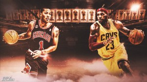

\[caption id="attachment\_1590" align="aligncenter" width="500"\] Artwork by Jake Morin.\[/caption\]

 

The Bulls and Cavaliers, in some order, were rightfully fixed atop every Eastern Conference prediction. The reasons why are self-explanatory. Chicago won the East in consecutive seasons in 2011 and 2012, amassing a 75.7 winning percentage the last two seasons where latter-day MVP Derrick Rose completed full seasons at point guard. The past two seasons have been trying for the Bulls, but the league’s premier defensive influence (Tom Thibodeau), reigning Defensive Player of the Year (Joakim Noah) and the scrupulous services of role players Taj Gibson, Jimmy Butler and Kirk Hinrich have enabled Chicago to remain a tough out in April and May.

With a resurgent Rose back on the floor, and Team Spain’s present and future (Pau Gasol and Nikola Mirotić) on board, as well as McBuckets, Chicago could double as the Association’s stingiest defense and most improved offense.

Cleveland, well, you know.

http://www.youtube.com/watch?v=Nn8KAAPrBSQ

The Bulls and Cavaliers debuted much differently against the Knicks — Chicago thrashed New York; Cleveland never got comfortable and was outdone by the scoring prowess of Carmelo Anthony — before doing battle in the United Center on Friday night. Scheduling these two teams to play on Halloween is more spectacle than reveal, more entertainment than preview of playoff series to come — neither team is particularly close to functioning at full gear. Even still, when you put a collection of the world’s most amazing athletes in the same venue and press play, really cool things will happen.

Friday night actually felt like the first battle, however small, of a bloody war between superpowers. These teams channeled the best (and worst) of themselves and delivered an OT romp that, eventually, netted Cleveland its first win of the redux-LeBron era. The game also delivered a controversial call that Chicago fans will hang onto for weeks. Let’s make sense of this late-October game, which included vintage LeBron James, Hinrich playing superhero ball (!) and Rose not playing the full game because of a (non-knee) injury.

Chicago Bulls

The first thing I noticed about the Bulls/Cavs game was the pacing and how it appeared to strongly favor Cleveland. The stats back that up. Chicago dominated New York slow and steady on Wednesday night, according to NBA.com, working at a pace of 89.84. That deliberate tempo led to the Bulls scorching the Knicks for a true-shooting percentage of 61.8 and 116.6 points per 100 possessions. Pau Gasol was wonderful: scoring 21 points on 7 for 11 shooting with 11 rebounds and a single turnover. Chicago’s young shooters off the bench, McDermott and Mirotić, debuted nicely, combining for 17 points. McDermott shot 5 for 9 from the field and 2 for 5 from three; Mirotić collected seven rebounds.

Pace is critical for the Bulls — their best passers are their starting big men; Rose is the team’s lone off-the-dribble creator; and Thibbs straddles the line between conservative and unimaginative offensively. The Bulls score points with patience and discipline and the occasional Rose flash-in-a-pan one-man fast break. It’s a proven formula, and as McDermott and Mirotić [sit in a baggy of water](http://pets.thenest.com/long-let-goldfish-bag-sit-new-water-11860.html) for much of their rookie campaigns, keeping the pacing low will help them find shots and stay involved.

So when Cleveland came to town and jacked the pace up to 98.26 — nearly 8.5 more possessions per 100 possessions — it screwed everything up. Even with the Cavaliers dearth of quality interior defenders, that rabbit run of a pace sent Chicago into an offensive funk — a funk that was mostly covered up by 25 strong minutes from Rose and an uncharacteristic 13 for 31 (41.9 percent) team performance from behind the line, but was a funk nonetheless.

Those two variables can be explained by the speed of the game. Rose showers at a pace around 98, and while his 50 percent shooting and 20 points were a plus, Cleveland may or may not have been banking on a “Rose can’t beat us by himself” strategy. The Bulls’ three-point barrage significantly dwarfed the Cavaliers effort (3 for 15), but the Cavs forced 19 turnovers and dominated on the inside, outscoring Chicago 58-44 in the paint. This surprising reversal of styles benefited Cleveland; Chicago wins one way and one way alone, and by forcing them away from their preferences, coach David Blatt and LeBron slowly picked the Bulls away one turnover at a time.

Gasol’s throwback performance from Wednesday night? Gone. He finished 6 for 18 from the field and missed nine shots inside the paint. The Spaniard did collect nine rebounds and six blocks over 37 minutes, but the Cavs out-rebounded the Bulls, 52-42, and Gasol was turned over three times. McDermott and Mirotić were even more disappointing. In a combined 21 minutes, the forwards missed all three of their shot attempts and failed to grab a board, assist or rebound; neither player even got off a shot inside the arc. It wasn’t the game for them at all, so much so that Tony Snell played 23 minutes — _their_ minutes — merely because he could hang around at that speed, and Mike Dunleavy played 40 minutes and guarded LeBron most of the night. These are bad breaks for Chicago.

That Rose [sprained both his ankles during the contest](http://espn.go.com/chicago/nba/story/_/id/11799505/derrick-rose-chicago-bulls-sprains-left-ankle-vs-cavaliers) was even worse. Rose couldn’t get to the rim after the left ankle sprain, leading to an average FGA distance of 24.2 feet on his final six shot attempts, per ESPN. I won’t speculate on the long-term effect of these ankle sprains for Rose, who confidently downplayed the injuries as a process of playing basketball. I watched the game, in Chicago, with a friend of mine who played college basketball and trains professional players — he could tell Rose sprained his ankle as soon as it happened. Basketball players suffer sprained ankles all the time; my friend estimates both of his ankles have suffered a sprain 25 times. There is no fully-formed opinion on Rose’s ankles to have after this weekend. If anything, Rose said it perfectly that it feels like “the gods are testing” him right now. Sitting out the team's next game against Minnesota seems like the correct approach; I'd be surprised if Rose missed much more time after that.

In the context of Saturday’s game, however, with Rose out, the pace of the game gradually surpassed the talent level on the floor for Chicago. The Bulls ran out of buckets by the end of overtime, and only made the extra session because of a Herculean effort by Hinrich, whose balls could be seen from the dark side of the moon on Halloween night.

Hinrich entered the game for Aaron Brooks with 5:48 remaining in the fourth and the game tied at 86. On Chicago’s next possession, the former Kansas Jayhawk hit a long two. Several minutes later, Hinrich banged consecutive “In Your Grill” three-pointers and gave the Bulls a 98-93 lead with 47 seconds left.

https://www.youtube.com/watch?v=gFLcmZxOFns

Woah. If this was the playoffs (or, more importantly, a Chicago victory) this performance could have earned “The Kirk Hinrich game” status.

The following night, on the road against the T’Wolves without Rose, Chicago was outscored by 13 points in the second half and committed 14 turnovers as a team (Gasol had five). A healthy Jimmy Butler (24 points, 11 for 15 FTA) got the major headlines for the 106-105 win, but it was a superb outing from Mirotić (28 minutes, 3 for 6 FGA, two 3PM, 12 points, 8 rebounds) off the bench that gave Chicago the victory. The performance from the rookie forward was impressive but comes in large part because of the suspect Minnesota defense. That the T’Wolves got the Bulls to go running with them (97.62 pace) in a game devoid of Rose is a sign that the Bulls have much work to do offensively, and a large reason why they nearly lost a game they shouldn’t have.

Cleveland Cavaliers

Through its first two games, Cleveland is shooting pathetically from several important areas on the floor: 6 for 27 (22.2 eFG%) between 10-14 feet; 7 for 21 (33.3 eFG%) between 15-19 feet; and 12 for 39 (30.8 percent) behind the arc. On the perimeter, the Cavs have clanked five of their first six right corner three-pointers and are shooting a ghastly 27.6 percent (8 for 29) on long-range shots above the break.

The Cavs were a trendy pick to be [the NBA’s most efficient offense in 2014-15](http://grantland.com/the-triangle/33-crazy-predictions-for-the-nba-season/); the challenge of assimilating three All-Stars, Dion Waiters and a rotation full of brand new teammates is simply going to take time.

As covered above, Cleveland’s victory can be boiled down to a combination of tactical execution in regard to the game’s pacing and Rose playing all of 25 minutes. (It also was granted the opportunity to extend the game to overtime with a generous blocking foul called against Taj Gibson — which resulted in a mighty continuation for Kyrie Irving and a complimentary free throw that knotted the game at 98.) The smart gameplan led to 25 points off Chicago turnovers and 21 fastbreak points — and the aforementioned 58 points in the paint.

Before the season began, you could have talked me into taking a bet Cleveland would not score 58 points in the paint in any game all season, let alone against Chicago. But the circumstances were unique — Rose was in and out; Chicago’s turnovers skyrocketed; and Cleveland’s best option as they tweak their rotations and spacing was to let LeBron barrel into the paint and see what happened. (That might be their best offensive option all season anyway.)

LeBron finished with 36 points on 14 for 30 shooting, which by itself is a fine night. According to ESPN, he drove to the basket 14 times more than in the season debut against the Knicks. He was 7 for 13 inside the restricted area on Friday, which is below his typical league-high standards, but still solid — and also helped get him to the line nine times. LeBron settled for 5 for 12 shooting from mid-range (41.7 percent); some of those shots will become drives and others will become traditional or hockey assists as the team learns where they need to be.

Irving’s shooting line was not as pretty as his cross-over — 6 for 17 FGA (35.3 percent) — but the 2014 All-Star game MVP was a perfect 10 for 10 at the charity stripe (including the controversial free throw at the end of the 4th quarter), and had his most success, by far, on the night whenever he ended up near the rim. He was 4 for 6 inside the restricted area; 1 for 8 on longer 2PA; and hit a single three-pointer.

Between James, Irving and Kevin Love, there are so many tweaks to make and lessons to learn that it doesn’t make sense to over pick at a small sample size of data. But, for the record, over 27 minutes in its first two games, the Cleveland starting lineup (Irving/James/Love/Varejao/Waiters) managed just 86.5 points per 100 possessions, and was outscored by a net rating of 4.6 points. So there is work to be done.

The Cavs best lineup during the Knicks/Bulls games? Swap Matthew Dellavedova and Tristan Thompson in for Waitors and Varejao and the Cavs posted a 124.5 OffRtg — in just 13 minutes. Again, small, small, SMALL sample sizes. But I’m not alone in the “Waiters is the perfect Jamal Crawford sixth-man and SHOULD NOT be starting” and ultimately, through injury or otherwise, the Cavs will end up relying on Love/Thompson front courts much of the time.

This was the first game of many between these [Central division rivals](http://www.thehighscreen.com/2014/10/the-joe-mags-show-zach-tennen-central-division/), and with each battle we will learn more about either team. In a similar vein as the recent Miami Heat/Indiana Pacers rivalry, these two teams are hyper-aware of the other — it would be unbelievable if either team went down before the East Finals this season. With every move these teams make this season, the question “How does this affect our matchup against (them)” will be omnipresent. On Friday, we learned both teams are as talented as we imagined they’d be, but have much adjusting to do over the coming months. I can’t wait for the next battle.
