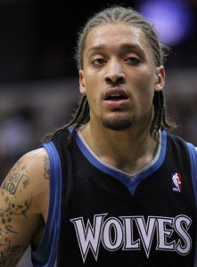

\[caption id="attachment\_1642" align="alignnone" width="221"\] Michael Beasely (Photo taken by Keith Allison)\[/caption\]

 

Michael Beasley certainly got a lot of hype as a special, gifted forward at Kansas State. He was an All-American player, arguably the nation's best player next to Derrick Rose. Beasley averaged 26 points, 12 rebounds and about 1.5 blocks in his lone year at KSU. Even when the Wildcats fell to Wisconsin in the round of 32, Michael Beasley was, without hesitation, on his way to the NBA.

Beasley was supremely more talented than his opponents [in high school](http://hsnewyork.scout.com/story/574927-michael-beasley-rings-up-50-points-at-is8) and college. Off the court, however, he was severely disadvantaged — if not plainly a magnet for trouble. Since his high school days, Beasley has been carded for carrying and using marijuana several times. It is a crime (in the majority of the United States) that has existed long enough for Beasley to place his career above the influence; and yet, time after time, drug use kept Beasley off the floor.

That is just one side of the problem, the other side being Beasley's apparent marijuana addiction affecting his work ethic and performance on the court.  Even after going through rehab a few years ago, Beasley was not able to separate himself from this drug.  Not to say marijuana is the main reason Beasley's services are no longer desired by an NBA team.  However, it certainly slowed him down in his journey to try and be a successful professional athlete.

Miami decided to part ways with its prized second pick just two years into Beasley's tenure with Miami.  What makes that extremely relevant is that was the off-season Dwyane Wade, Chris Bosh and LeBron James teamed up.  Pat Riley ultimately decided he did not want anything more to do with Beasley.  Miami instantly became a championship contender and all thoughts of Michael Beasley in a Heat uniform were washed away.

While Wade was enjoying his second and third championships in Miami, Beasley suddenly became a lesser asset than ever expected. Teams were not scrambling to sign him; his talents were simply not enough of a draw anymore. That sure was not the case during the draft in which most teams would have loved to add the Kansas State phenom.

Beasley ended up playing for the subpar Minnesota Timberwolves, a team that simply needed talent, during the 2010-11 season. He immediately took a significant role next to Kevin Love on an inexperienced, rebuilding franchise. Kurt Rambis, who had a dismal 32-132 record in his three years coaching the Wolves, gave Beasley the green light. The Wolves were anything but competitive in 2011 as they finished 17-65. But Beasley had himself a career year averaging 19.2 points and 5.6 rebounds.

The buzz around Beasley was beginning to become a bit more positive. Even Doc Rivers [lauded him.](http://sports.yahoo.com/nba/blog/ball_dont_lie/post/Doc-Rivers-thinks-Michael-Beasley-can-win-a-scor?urn=nba-303473)

The trouble off the floor eventually was too much to overcome. He went from filling up box scores to beating up, well, [himself](http://sports.yahoo.com/blogs/ball-dont-lie/michael-beasley-literally-beat-himself-during-2013-preseason-135109510--nba.html).

We can never be sure of Beasley's intentions after his career season. However, his next three years with Minnesota, Phoenix and Miami did not bode well for him. Beasley played nine minutes fewer per game after his breakout year. That seems quite odd, does it not? Since then, Beasley has fallen off the map. Well, not all the way off the map. Beasley followed the route of former NBA players like Gilbert Arenas and Metta World Peace and is currently with the Shanghai Sharks of the CBA.

Sports would not be what they are today without some overachievers and also your fair share of underachievers. Any professional sport is obviously super competitive and requires a certain amount of time and effort. If you are not willing to put in that time and effort, you may end up out of the NBA. And so it goes — Beasley goes from All-American to professional sports cautionary tale.

