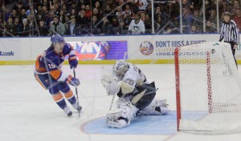

St. Louis is up, Los Angeles is down and Anaheim and Montreal are maintaining solid play — the NHL is awesome. So before we dive into Marc-Andre Fleury and his brand new cash-money, let's take a look at my NHL power rankings.

1\. Tampa Bay (last week: 8) – The Lightning already have seven guys with double-digit point totals while the team has scored a league-leading 60 goals.

\[caption id="attachment\_1799" align="alignleft" width="300"\] Marc-Andre Fleury in goal. (Photo credit to Mike Durkin)\[/caption\]

2\. Pittsburgh (16) – Getting stomped 5-0 by the Rangers hurts, but the Pens still have a league-best +23 goal differential.

3\. Vancouver (18) – The Canucks are somehow winning without very good goaltending – it’s good to see the Sedins being used properly again.

4\. Anaheim (1) – Corey Perry’s shooting percentage is an incredible 26.2 percent through the first month. I have a feeling that won’t last.

5\. Montreal (3) – Canadians have lost a total of four games in regulation this year… by a combined 18 goals.

6\. Nashville (7) – Pekka Rinne is an early Vezina candidate with that .934 save percentage.

 

7\. St. Louis (22) – Vlad Tarasenko looks less and less human with each impossibly-impressive goal.

https://www.youtube.com/watch?v=UQVnIKUd-6k

8\. New York Islanders (6) – No gimmick or regression-worthy weirdness here: just a good hockey team.

9\. Boston (15) – Not a great start for the Bruins, but hey: look at Seth Griffith’s no-look goal!

https://www.youtube.com/watch?v=s6mk6xhyzV8

10\. Los Angeles (2) – Justin Williams, Anze Kopitar, Marion Gaborik and Drew Doughty have combined for five goals so far this year.

11\. Detroit (12) –We've been telling Henrik Zetterberg he’s old [for](http://usatoday30.usatoday.com/sports/hockey/nhl/wings/2011-01-24-nicklas-lidstrom-red-wings-nhl-all-star-game_N.htm) [years](http://www.si.com/nhl/home-ice/2012/02/02/the-red-wings-roll-on). Doesn’t look like he got the memo.

12\. Calgary (13) – Mark Giordano and T.J. Brodie: the NHL’s next great defensive pairing.

13\. Chicago (9) – It’s too early to panic about either this or Derrick Rose’s ankles, Chicago fans. But the Bears, yeah, be afraid.

14\. Toronto (26) – Toronto’s surprisingly good early in the season? We know how this ends.

15\. Winnipeg (28) – Much-maligned Ondrej Pavelec had a pretty solid first month: [third in total saves and eighth in save-percentage](http://www.nhl.com/ice/player.htm?id=8471715&view=stats).

16\. Ottawa (14) – Terrible possession team. That’ll catch up to them.

17\. Washington (5) – Coverage of Ovechkin is moving toward LeBron James level of unfair criticism.

18\. San Jose (17) – I talked about [their streak of playoff success potentially coming to an end](http://www.thehighscreen.com/2014/10/nhl-power-rankings-a-swan-song-in-san-jose/) last week, and their situation hasn't changed much. Poor goaltending, a shaky bottom four on D and a bad fourth line equates to "Yikes" for their postseason chances in 2015.

19\. Philadelphia (20) – Hell of a start by Jakub Voracek.

https://www.youtube.com/watch?v=B9RLP7X7RgQ

20\. New York Rangers (21) – No reason to be concerned about Lundqvist just yet. Still early.

21\. Minnesota (4) – Great possession numbers thus far. Positive regression forthcoming.

22\. New Jersey (11) – They were [banking on Corey Schneider being better than this](http://sports.yahoo.com/blogs/nhl-puck-daddy/cory-schneider-lets-in-another-softy-vs--minnesota-wild--video-022457812.html).

23\. Florida (24) – They still have scoring woes but [no. 1 overall pick Aaron Ekblad looks pretty solid](http://insider.espn.go.com/nhl/story/_/id/11867766/progress-reports-jonathan-drouin-aaron-ekblad-other-top-15-prospects-nhl).

24\. Carolina (30) – Now that not ALL of their worthwhile players are hurt, they don’t look like Sabres South.

25\. Dallas (10) – Bad special teams + bad goaltending + shaky D = disappointing start.

26\. Edmonton (25) – They look better than they did early but [the Hall injury is killer](http://www.nhl.com/ice/news.htm?id=737342).

27\. Arizona (23) – NON. DESCRIPT.

28\. Colorado (27) – Quickly moving into [Connor McDavid territory](http://www.thehighscreen.com/2014/11/mcdavid-watch-part-ii-colorados-in-this-for-the-long-haul/), [busted hand and all](http://www.nytimes.com/2014/11/13/sports/hockey/connor-mcdavid-nhl-prospect-out-indefinitely-with-hand-injury.html?_r=0).

29\. Columbus (19) – The Bobrovsky injury was absolutely killer. What a fall.

30\. Buffalo (29) – 21 goals for. 60 goals against. One massive tank job.

About two weeks ago, I saw a tweet congratulating former Sabres (current Canucks) goalie Ryan Miller on his 300th win (he’s up to 305 now).

300? That’s top-30 all time with a few years left to play. Maybe he’ll be a Hall of Famer after all. Then I saw who will likely be next to 300: the much-maligned Marc-Andre Fleury. Yikes. That reminded me what a poor metric wins is to measure goalies.

Then the Penguins extended Fleury for [three years and WAY TOO much money](http://thehockeywriters.com/sober-second-thoughts-fleurys-new-contract/). The team’s Twitter justified the deal (obviously) by pointing to how many wins he has.

Much like goals against average and pitching wins in baseball, goalies wins have been thrown by the wayside as a useful stat. I don’t need to go into too much detail why – they’re team-driven numbers and don’t accurately measure a goaltender’s (or pitcher’s) ability.

Fleury just hasn’t been very good the past few years, especially in the playoffs. He’s been better in the early-goings this year but it’s been seven years since he posted a save percentage above .920. He’s generally in the bottom half of the league in that category. His playoff save percentage has been under .900 since the team’s Stanley Cup win in 2009. Fleury may very well end up Top 10 all time in wins. If he plays out his contract in Pittsburgh, it’s almost inevitable. But if they do win the Stanley Cup in that time, it will likely be in spite of him.
