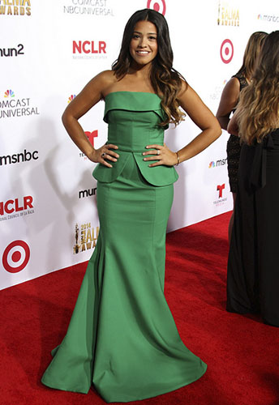
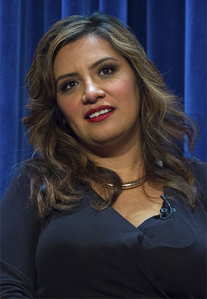

## When my brother requested that I watch _Jane the Virgin_ with him, I knew this show was different.

\[caption id="attachment\_1895" align="alignleft" width="344"\] Gina Rodriguez at the 2014 Alma Awards (Photo provided by [Richard Sandoval/Flickr](https://www.flickr.com/photos/hispaniclifestyle/15318745790/in/photolist-pkEzqJ-cPTXGW-cPTUaW-cPU1pQ-8VHGRy-8VHGXy-8VEDFP-8VEDxn-7Hkggg-oHYmQB-7FKdyC-fx9Sf6-ancRWe-9Q9B7w-pojMDG)))\[/caption\]

I practically learned to walk while watching _telenovelas, _but my brother will never admit to his otherwise notable appreciation for Latin romance (Trust me, Latino men are just as obsessed with William Levy’s life as your rice-loving grandmother). While _Jane the Virgin_ is based on a Venezuelan _novela, _it is not a Spanish soap opera — and thankfully it doesn’t resemble the crap that is General Hospital or any of the other English soap operas — it is the latest attempt to diversify TV and reach the growing Latino audience by The CW.

It wasn’t just my brother who showed interest in the show; much to my surprise, both my mother and sister were outraged I watched the fourth episode without them. I'm typically an introspective television viewer, tucked away from my family — our tastes seldom overlap. A show that I figured would be sour to their tastebuds, _Jane the Virgin_ strikes me as a show that is not only capable of bridging the gap between the neglected Latino audience and the white majority, but is unafraid in doing so.

Although often portrayed as monolithic, the Latino culture is a giant blend of things, often things with little in common with each other, but unified by being a part of something greater. This dynamic is evident in the universal appeal of _telenovelas_. When 7 p.m. rolls around, families in the Dominican Republic watch Mexican, Brazilian and Colombian soap operas in a harmonious interchange of cultures. To pretend that countries in Latin America live peacefully is of course naïve but soap operas have provided the representation of our culture that American television and film lacks.

Sure, Spanish soap operas (a) haven’t made any real advancement toward depicting Black or indigenous Latinos and (b) seem to be stuck on ancient patriarchal gender roles and rich/poor stereotypes but Latino communities come together to enjoy the craziness (see below) — whether they are in the states or in their home countries.

https://www.youtube.com/watch?v=OGJAUnNzbhE#t=235

_Jane the Virgin_ embraces the comedic, extroverted nature of the Latino culture. Gina Rodriguez _(Filly Brown_) is Jane Villanueva, an aspiring teacher with the seemingly perfect boyfriend, Michael (Brett Dier), and a loving family. Jane has worked hard to not repeat the same mistakes of her single mother, Xiomara (Andrea Navedo), and follows the strict rules of her conservative grandmother, Alba (Ivonne Coll). Jane (duh) is a virgin; her life is interrupted when she gets artificially inseminated by accident.

The baby’s father is Rafael (Justin Baldoni) a former bad boy whom Jane shared a passionate kiss with years ago who now owns and manages the hotel where Jane works. Rafael is married to Petra (Yael Grobglas), who thought it would be romantic to use Rafael’s only sperm sample (the dude is a cancer survivor) and get inseminated without telling him. Dr. Luisa (Yara Martinez) is not only Rafael’s sister but the unfortunate doctor (having a horrible day) who artificially inseminates the wrong person A.K.A. innocent Jane.

_Jane the Virgin_ is coming into a time where racial tensions are running high throughout the country. The Latino population is expected to surpass the [white majority by 2050](http://usatoday30.usatoday.com/news/nation/2008-02-11-population-study_N.htm) and whether anyone admits it or not the evident shift has a lot of people nervous, hence the rush to diversify the media. All the while, stereotypes of the criminal, gardener or maid continue to haunt us and studies have shown that people exposed to these negatives stereotypes in film and TV have a [hostile view of Latinos](http://www.latinodecisions.com/blog/2012/09/18/how-media-stereotypes-about-latinos-fuel-negative-attitudes-towards-latinos/).

Add in the immigration crisis at the border and even the efforts of [Guillermo del Toro’s _Book of Life_](http://www.thehighscreen.com/2014/10/colorful-innovative-the-book-of-life-honors-mexican-culture/) and Eva Longoria — who has single handedly made it [her mission](http://www.huffingtonpost.com/2014/10/14/eva-longoria-supernatural_n_5985962.html) to address the unfair representation of Latinos — can get lost in the noise. Just this Halloween I had to explain to someone on Instagram (yes, I’m that kind of person) why dressing up as a Chola is offensive — incase you don’t know, the chola term has roots as a racial slur used by the Spaniards and evolved into the common west coast association of Latino gangs.

Some people don’t even know that we have a National Hispanic Heritage Month (Sept. 15-Oct. 15). Hell, we still haven’t made up our minds on the [Hispanic vs. Latino](http://www.cnn.com/2014/05/03/living/hispanic-latino-identity/) debate (both created in the states and shoved down our throats).

_Jane the Virgin_ has not directly addressed any of the identity issues plaguing the Latino community. It’s playing it safe, clearly, to avoid alienating the white audience. Sure, we’ve gotten the deep-voiced narrator, the discovery of Jane’s estranged and now famous telenovela star father, and the occasional wisdom from Jane’s grandmother. Maybe this is all that the non-Latino audience can handle and for now it’s working.

This is the show that second and/or third generation Latinos in the states can not only watch alongside their families but can relate too. Jane is like us, balancing her traditions and her ambitions — her grandmother only speaks in Spanish and there are moments where she struggles to translate her thoughts voicing “I don’t even know how to say this in Spanish.”

Strategically or not, Jane is positioned between the saint (her grandma) and the whore (her mother), which is an all-too-real depiction of the identity crisis American media creates in Latina women. We find Jane, forced in-between these two archetypes of Latina women, as she watches _telenovelas_ and eats grilled cheese sandwiches (not a traditional Latin food, FYI) with her grandma, but takes influence from her free-spirited mom, making her tenacious yet non-judgmental.

The show addresses Jane’s virginity as a simple choice. In her own words “I’ve done everything right.” She took the responsibility that a lot of Latinos with immigrant parents feel, this hunger for success and need to prove that their hardships were worth it. We don’t know where her family originates (are they of a Bolivian or Peruvian background?), we don’t know if they are second or third generation Americans, and we don’t know how they make their _empanadas_ but we can relate to the small unifiers of Latinoness.

After last Monday’s episode of _Jane the Virgin_ and as if my household isn’t loud enough, my brother started furiously arguing over Jane’s decision to dump Michael and kiss Rafael all in one night. He’s team Michael; my sister and I are clearly team Rafael. How could she stay with Michael when he carelessly went behind her back? And she can’t change her feelings for Rafael, she’s already having his baby!

\[caption id="attachment\_1896" align="alignright" width="347"\] Cristela Alonzo (Photo provided by [Dominick D/Flickr](https://www.flickr.com/photos/idominick/15287935636/in/set-72157647810954956/))\[/caption\]

Then, there’s _Cristela_ which debuted the same week as _Jane the Virgin_ and is the icing on ABC’s recent diversity cake (while, hypocritically, [not covering](http://www.huffingtonpost.com/2014/11/19/networks-obama-immigration-speech_n_6188952.html?ncid=fcbklnkushpmg00000048&ir=Latino+Voices) Obama's latest immigration speech and executive action). Up until _Cristela_’s equal pay episode, I will admit that I watched it mainly to support Cristela Alonzo and the rest of the cast (Carlos Ponce is a Latino household name). Most of the jokes don’t work but the show is almost too real to function as a Network comedy — as in life, sometimes it's too heavy to squeeze out a chuckle. Cristela like Jane is ambitious with a plan for her life but unlike Jane, Cristela’s family are presented as brutes that don’t understand the importance of her unpaid internship to her law career. Her family values manual labor that puts cash in hand and gives her a hard time with her school efforts — a struggle between modernity and culture.

_Cristela_, however, is not shy about the discrimination and prejudice that she faces as a Mexican-American on a daily basis. Each episode has shown us the work environment that she faces as a woman of color. Cristela doesn’t look like Sofia Vergara and she makes no apologies for it. With jokes she shrugs off the inappropriate Mexican jokes by her boss and the many times that she is mistaken for the janitor or nanny.

But it wasn’t until the equal pay episode that _Cristela_ showed some real potential by stepping it up and addressing _machismo_ in the Latino culture and the wage gap for women in America. Cristela’s sister, Daniela (Maria Canals-Barrera), has been keeping from her family the fact that she makes more money than her husband, Felix (Carlos Ponce), in order to keep him feeling “manly.” Because he was raised to value himself as a provider and his wife can’t and shouldn’t make more money than him because women simply don’t work as well as men.

At work, Cristela’s integrity is tested when she is asked to defend a corporation refusing to pay women a fair wage. Cristela stays true to her morals at work and refuses to defend the corporation, but at home, they end up lying to Felix in order to bring everything back to "normal." A problematic solution for many reasons but mostly for reinforcing the gender roles extremely prevalent in Latino culture. The same gender roles also reinforced in the telenovelas we hold dear to our hearts.

_Cristela_ also shows us the role that wives such as Daniela have in keeping the establishment of the misogynistic patriarch. Between her grandma sharing outdated stories of “her village” and Daniela encouraging her daughters to value materialism, Cristela butt heads with her family with her "modern" thoughts in a way that sometimes feels exaggerated and unlikely.

_Cristela_ and _Jane the Virgin_ resemble [ABC’s _Black-ish_ and _How To Get Away With Murder_](http://www.thehighscreen.com/2014/10/the-future-of-black-representation-in-black-ish-how-to-get-away-with-murder/)and the conversation they spark about Blackness and feminism, in that within their differences they advance the discourse of the Latino experience.

 