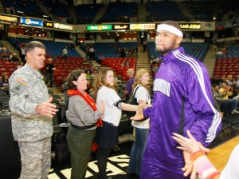

The NBA is correctly labeled as the major professional sports league with the least amount of parity, as there is little variance, year to year, of true-blue championship contenders. In a league where the majority of its teams make the playoffs each season, and 30 teams play 82 games from late-October to mid-April to wiggle into a 16-team, two conference playoff field, only nine different franchises have won the NBA Finals since 1980 — and eleven franchises have failed to make the Finals altogether.

The reality in basketball, from the playground to the NBA Finals, is the team with the best player in any given game has an unmistakable advantage. Spread that principle out over 82 games and four 7-game series and, more times than not, the NBA is won by the team with the best player(s) on it. Need proof? A team with LeBron James, Kobe Bryant, Tim Duncan or Shaquille O'Neal has appeared in the Finals every season since Michael Jordan retired in 1998.

If the outcomes are more or less predictable from season to season, what makes the NBA so exciting to cover — [quickly becoming a year-around job](http://grantland.com/the-triangle/draft-night-in-brooklyn-the-year-round-nba-is-born/) — then is the culture of basketball. Without going on and on, one of the more inticing qualities of the NBA is watching young players grow into themselves and find their place in the greater story of the sport. Legacy talk can quickly grow tired — Chris Paul is a great player; Carmelo Anthony is a great player; and yes, neither of these players have won championships — but what seems unique to the NBA is the proximity between its beginning and what is happening now. Perhaps it would be different if Bill Russell, the league's first dominant champion, was not still alive and [making unbelievable YouTube movies alongside 20-something All-Stars](https://www.youtube.com/watch?v=MLyvkBifQ3w), but thankfully that's not the case.

Babe Ruth isn't here to interact with Mike Trout, nor is Bart Starr making commercials with Aaron Rodgers. The NBA has the luxury of being able to watch its past, present and future all at once, like an open book on a nightstand, and it keeps all of its narratives alive.

One of basketball's greatest narratives is the up-and-coming contender, a process that so neatly fits into the historicity of the league, as many of its multi-time champions, namely the Bad Boy Pistons and Jordan's Bulls, had to overcome a nemesis before reaching the pinnacle. Up-and-coming contenders, by definition, are usually led by a rising star — a young player whose talents are evident but whose inexperience, youth and/or limitations represent an obstacle. Those players I listed above, the ones who have combined for 23 NBA Finals appearances, entered the league with high expectations that matched their undeniable skills, and they eventually graduated from rising stars to red supergiants.

Enter James Naismith’s one true favored son: [Boogie Cousins](http://www.thehighscreen.com/2014/11/demarcus-cousins-boogie-wonderland/).

https://www.youtube.com/watch?v=taaL9DrkI7Q&feature=youtu.be

in 2014, DeMarcus Cousins very neatly fits into this desirable narrative: an ultra-talented lottery pick with obvious question marks (namely: his overall attitude) is drafted to a perennial loser that has longed for a player of his abilities; after several disappointing seasons stuck in the lottery, Cousins (and teammate Rudy Gay) are selected to Team USA to "learn how to win" from Coach K; and Boogie and Rudy bring themonolith from _2001: A Space __Odyssey_ back with them to Sacramento, and the team is suddenly a force to be reckoned with in the grueling Western Conference. Many basketball fans filled their shopping carts full of Kings stock after their impressive 5-1 start this season, and even through 17 games, Cousins appears to be a fringe MVP candidate and sure-thing first-time All-Star.

But the good vibrations surrounding the Kings have calmed a bit in the later half of November, as Sacramento finds itself hovering around .500 in a loaded West. It is unclear if the team is capable of climbing back into the playoff picture, let alone if it is really good enough to be compared with the Phoenix Suns, New Orleans Pelicans and Oklahoma City Thunder, all teams that could _miss_ the postseason. As contrived as the question is, we have reached the point in the season where we must ask ourselves if the Kings are "for real" or not. At 9-8, is the 2014-15 campaign too early in their "rise" to make the postseason, or are there foundational holes in this roster that must be addressed before making the playoffs — or finishing above .500 in this gauntlet conference — is obtainable?

\[caption id="attachment\_1662" align="alignleft" width="300"\] The Wonder: Boogie Cousins. (Photo credit to U.S. Army Corps of Engineers)\[/caption\]

What I didn't realize until researching this piece was a statistical anomaly that changed my entire perception of the first 17 games of the Kings' season. Each team plays its own conference 52 times and the opposite conference 30 times. Sacramento has already played 16 games against the West, the much more challenging of the two conferences, and just a single game, a 15-point victory against the Chicago Bulls, against the inferior East. It should be noted that Sacramento has played an enormously difficult opening schedule, as West teams already have to play conference opponents more frequently than East teams, and in the case of the Kings, 94 percent of their games have come from the Mr. Hyde portion of the NBA.

Sacramento has been streaky this season: winning 5 of 6 games, then losing three straight to West playoff contenders; winning 4 out of 5, then once again falling to West playoff contenders three straight games. But bad luck aside, what is proving to be a long-term cause for concern is the team's mediocrity overall on both ends of the floor. The Kings are 15th in OffRtg (104.3) and 19th in DefRtg (104.4), per NBA.com.

The team is brilliant in some regards and lousy in others, and this imbalance has led to their current standing. The Kings are the NBA's best rebounding team, pulling down 55.1 percent of its overall rebounding chances, including 28.9 percent on the offensive glass. But this is a horrendous passing team — as of Monday, Sacramento is third-worst in assist percentage, second-worst in assist-turnover ratio and worst in the league in assist ratio — with equally disappointing turnover figures. The Kings are committing 16.8 turnovers per 100 possessions, and forcing just 12.1 turnovers, second-lowest in the NBA.

Sacramento has appropriately been praised for its arrival as the NBA's premiere foul-shooting force, getting to the line more often then even the league's "smartest" teams because, well, Boogie Cousins is a monster. The team is first in FTA rate at 40.9 percent, an outstanding figure, with the gap between 1st and 2nd (5.9 percent) equal to the gap between 2nd and 13th. The Kings are scoring 25.3 percent of their points at the charity strip; any and all metaphors involving Sacramento purchasing real estate at the foul line are welcomed — they've earned it.

Of course, there is a way to dampen the power of those figures, which is to peek at the Kings scoring figures from everywhere else on the floor. This is a lackluster perimeter shooting team, even with Ben McLemore beginning to validate his high draft status the past few weeks, as no team scores less of its points from 3-point land. The Kings make it no secret they want to get the ball inside, either to take close-range shots or feverishly gather more free throw attempts, and only Minnesota and Memphis take a higher percentage of its shots from inside the arc. Sacramento is 4th in the NBA in points in the paint.

Here's a key difference, however, between them and a great West team. Memphis, arguably the NBA's best team and aided by a premier frontcourt, is elite in both its number of 2PA and its percentage of points made from 2-pointers, which makes sense with their array of great finishers and shot makers. Sacramento is not as blessed — with all of their attempts from 2-pointers, the Kings are only 11th in percentage of points made from such shots, meaning they are leaving points off the board. A combination of mediocre shooting and a dearth of 3-point looks, the Kings are a below-average eFG% team at 48.6, per NBA.com.

Offensively, the Kings might be better than their 15th overall ranking considering they have played 94 percent of their games against the West, and their physical style of play should make a killing against less-willing participants from the East. Defense is a whole other story for the Kings, as there appears to be a giant hole on this end of the floor — literally, all too often the Kings abandon their responsibility of protecting the paint, and they surrender easy buckets.

http://youtu.be/sMtQlf0fGxg

Sacramento is allowing 45.4 points in the paint to its opponents per game, 4th-worst in the NBA, affectively canceling out their own production inside. Watch San Antonio reverse the ball to a weak-side full of opportunity — choosing a Kawhi Leonard cut to the rim over an open three point look from [the NBA's top perimeter shooter this season](http://www.si.com/nba/2014/12/01/tony-parker-spurs-three-point-shooting-historic-start), Tony Parker.

http://youtu.be/YajsfUNClL4

These two beautiful plays by Memphis came toward the end of [the most controversial game of the young season](http://espn.go.com/nba/story/_/id/11949326/nba-denies-sacramento-kings-protest-last-second-loss-memphis-grizzlies-nov-13), as the Grizzlies overcame a hellacious 38-16 first quarter deficit to win on a game-winning shot from Courtney Lee. (The Kings challenged the call, to no avail.) As the game tightened over the final three quarters — Memphis, by my count, had nine missed layups or sloppy turnovers underneath the basket in the opening quarter — it simply became too easy for Memphis to get their desired shot. Look how simple these Vince Carter designed corner 3-pointers were:

http://youtu.be/rfueTqMvlHY

http://youtu.be/fqIJXhGTC4E

A large part of everything the Kings do, Cousins might have the most absurd on/off court splits in basketball. When Boogie is on the floor, the Kings score 109.4 points per 100 possessions and have a DefRtg of 98.3, which means the Kings are clicking at a Memphis/Golden State level when their best player is plugging up the lane and throwing grown men around down low. Here's the problem: Cousins hasn't learned how to play 48 minutes per game, and unless he becomes the first player in NBA history to do that — he won't — the Kings have to occasionally play lineups without him, and they get scorched when this happens. For starters, the Kings only manage 96.9 points per 100 possessions without him, per NBA.com, a hideous mark. But the more critical issue might be defensively, where the Kings struggle to defend when Cousins is _playing_ most nights, and when he leaves the floor it can get ugly.

Sacramento has no shortage of journeyman forwards on roster. Depending on the matchup, head coach Mike Malone has used a combination of Omri Casspi, Carl Landry, Reggie Evans, Derrick Williams and Ryan Hollins off the bench when the Cousins/Jason Thompson/Rudy Gay frontcourt sits. The issue for Malone is not the availability of these forwards, of course, but the productivity, and through 17 games, it is evident that if Cousins and Gay are both sitting, Sacramento might as well be playing defense in a blindfold.

While the team's starting lineup (Darren Collison, McLemore, Gay, Thompson, Cousins) has held opponents to a DefRtg of 86.8 over 188 minutes — an outstanding mark — the forward combination of Casspi and Landry are being torched for a 116.3 DefRtg over 162 minutes. When second unit cogs Landry, Evans and lottery pick Nik Stauskas share the floor together, opponents are shooting 56.5 percent from the field and the Kings are surrendering nearly 11 3PM/48 minutes. Watch the Sacramento second-unit get gashed in transition here:

http://youtu.be/u88L9GLA0Ng

Cousins has been improving as a defensive player each season, as most big men do, but the struggles of Sacramento's second unit forwards have highlighted what Cousins does well — take up a ton of space and deny passing lanes. Look how easy it is for Memphis to get the ball to Marc Gasol in the paint against Landry, who simply is not qualified to guard Gasol one-on-one.

http://youtu.be/ctyYm\_rh0Ag

The Kings do not have another player who can significantly protect the rim, and that problem is exacerbated when backup guards are in the game: the combination of Stauskas and Ramon Sessions is allowing (gulp) 121.6 points per 100 possessions over 115 minutes.

Back to Boogie — 82games.com estimates [he might be worth something like 30.7 points per 100 possessions](http://www.82games.com/1415/14SAC13.HTM) to the Kings. What's the difference between this season and his past years with the team? He has a much better awareness of game situation and his role in what the team is doing on both ends. He is a highly skilled defensive player, improving against the pick-and-roll each season, although he fouls way too much (up to 4.7 per game from 3.8 last year).

His turnovers have increased annually with higher usage, sure, but what's cool is Boogie has shed a more narrow interpretation of how he fits into his team's offensive plans. In previous seasons [he looked like Lance Stephenson currently does with Charlotte](http://grantland.com/the-triangle/charlotte-hornets-lance-stephenson-problems-how-they-might-fix-it/) — hands in the air, genuinely confused each and every time another player takes a shot without running it by him. Now Boogie is a hungry, hungry hippo starving for rebounds and trips to the charity stripe. He has all but eliminated senseless long-range shots from his game, although he remains an unimpressive mid-range shooter (28 percent, per NBA.com), however necessary taking those shots may be. Never before have we seen Boogie so willing to get another teammate involved in the offense, let alone another post player:

http://youtu.be/QYBf7pyN7ug

And while his assist numbers are steady, he has both a general understanding of where teammates like Collison and McLemore are on the floor and a desire to actually include them in what he is doing:

http://youtu.be/NJV0pfePEGw

He's becoming an Apache helicopter in the post, and he's athletic enough to get to the rim off the drive, which means in order to guard him one-on-one, you either need Anthony Davis (Sidebar: New Orleans primarily guarded Boogie with Omer Asik, which didn't work out very well for the Pellies) or a mad genius to invent a wide-based, freak power forward who can stay in front of Boogie without being pushed over. Get out of my way, Marc!

http://youtu.be/arT88q2bxUw

Cousins and Gay are setting high marks in foul shooting this season. Boogie is making 6.7 FTM per game at a clip of nearly 81 percent, one of just five players with at least 100 FTM and shooting that well. Gay is making 5.8 of 6.7 FTA per game, both career-highs, and is doing so on 86.1 percent shooting, a personal best. The small forward who recently [inked a three-year extension](http://grantland.com/the-triangle/the-mutually-beneficial-pairing-of-rudy-gay-and-the-kings/) to stay in Sacramento is scoring .343 points per touch, according to Sports VU player tracking data at NBA.com, a higher figure than James Harden and LeBron James. Gay (9th) and Boogie (6th) are the best duo in this category, reeking havoc on opponents who are not big enough to keep them away from the hoop.

There is plenty to say about Sacramento's correct, thus far, investment in Collison as its starting point guard. Many critiques of the Kings decision to replace Isaiah Thomas as lead guard failed to factor in the tense state of affairs between Cousins and Thomas, and how well-recieved Collison has been during his surprisingly well-traveled NBA career (five teams, five years). Thompson is underwhelming in many facets of the game considering he is a starter on a Western Conference team, but he plays well alongside Cousins, and similarly to Collison, gelling with Cousins/Gay is mandatory for any player looking to fit in Sacramento. (You hear that? It sounds like organization structure.)

After drafting Stauskas in June, there was a nervousness outside Sacramento as to what McLemore's future with the team would be — they are both undersize shooting guards with plus range, seemingly the same player and impossible to play at the same time. (In the long-term, the team might need to move Stauskas in search of a more well rounded second-unit wing piece.) But McLemore has gotten hot from the field over the past few weeks, locking himself into the starting lineup and showing promising signs as a two-way scoring guard.

McLemore has earned 35.6 minutes per game over the team's past seven outings, scoring 13 ppg on 50 percent shooting from the field. He is taking and making more shots by the week, as he has nine multi-3PM games this season and five games with three or more long-range bombs. This development is critical for the Kings moving forward, and perhaps that's why they risked "wasting" a second lottery pick on the position — they needed either McLemore or Stauskas to be a willing contributor this season in order to pass as a competent offense. You have to wonder if the team would still be gathering all of those foul shots each night without a shooter like McLemore to spread the floor. I almost don't want to think about it.

As I mentioned before, the Kings have played an inordinate number of games already against its own conference. But with that stretch behind them, Sacramento has the benefit of playing 44.6 percent of its remaining games against the East (29 games). That's approximately 8 percent (or 5.2 games) more than the average West team will play against the East over the rest of the season. If the Kings take advantage of that lighter load over the next four-and-a-half months, perhaps it will be enough to pull ahead of the Pellies and Suns, the other two/thirds of the face of the playoff reform debate.

Something does need to change — I found [Tom Ziller's recent proposal particularly captivating](http://www.sbnation.com/nba/2014/11/26/7280545/nba-schedule-reform-regions-map-playoffs) — and Sacramento, even more so than New Orleans and Phoenix, appear to be the poster team for why. The scheduling burden on West teams is, simply, more rigorous than in the East, as teams are more spread out in the West and the games themselves are more taxing. Sacramento is lucky to have a winning record heading into its contest with Toronto tonight; they were a Boogie Cousins sprained ankle away from being 6-11 and out of the playoff race.

If the question is whether or not the Kings can break into the playoff field in 2014-15 — to begin their "rise" as an "up-and-coming contender" — I'm not so sure they are good enough yet. But that might have more to do with the current playoff system, which 10 out of the past 12 seasons has yielded at least one East playoff team worse than the West's best lottery team. The Kings almost certainly will have a Top 16 record overall, and a duo in Cousins and Gay that really shouldn't be sitting at home in late-April watching Milwaukee or Orlando get swept in round one.

The season is far, far from over in Sacramento, of course. But the recent failed protest of their last-second loss to Memphis may prove to be analogous to their relationship to the West playoffs: Sacramento is a good team, sure, but regardless of the complaints and the circumstances, they might not be ready to win just yet.
