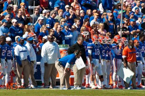
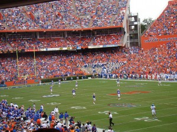
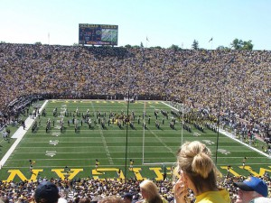
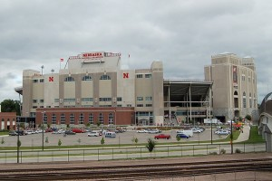

_Note: This piece was written before [Florida hired Jim McElwain](http://sports.usatoday.com/2014/12/04/jim-mcelwain-florida-gators-coach/) and [Nebraska hired Mike Riley](http://www.sbnation.com/college-football/2014/12/4/7334131/mike-riley-nebraska-football-coach) this week. We decided that since both schools made bad hires, we'd press on, and hopefully save Michigan from the embarassment that Florida and Nebraska will be suffering for the next three years or less._

Three of the most prestigious head coaching positions in college football recently became available, as Florida, Michigan and Nebraska all parted ways with head coaches over the weekend. While Michigan and Nebraska aren’t quite what they used to be — powerhouses programs that have fallen back to the pack as the SEC has risen to prominence — they are still two of the best 25 jobs in college football. Due to its location and conference affiliation, Florida is probably one of the five best jobs in America.

I’ve decided to play the role of athletic director for each of these schools. The goal? Find the best and most logical fit for the Gators, Wolverines, and Cornhuskers.

In order to find out whom each school should consider and ultimately hire, the first step is evaluating how they got to this point.

\[caption id="attachment\_2011" align="alignleft" width="300"\] (Photo taken by kimandmike, CC)\[/caption\]

**Florida**

Florida Athletic Director Jeremy Foley takes pride in finding the next big thing in coaching. He did it successfully with Urban Meyer in 2005; he has also failed twice with Ron Zook and most recently Will Muschamp.

After coordinating elite defenses at LSU, Auburn and Texas, Muschamp was supposed to be the next great College Football head coach. While Muschamp was at Texas, Mack Brown named him coach-in-waiting; Muschamp eventually couldn’t wait any longer, and Foley hired him to take over for Meyer. In retrospect, Foley probably should’ve hired Charlie Strong, although Strong wasn’t proven as a head coach yet either.

Muschamp’s tenure at Florida did include an 11-2 season and a Sugar Bowl berth (where he eventually lost to Strong’s Louisville Cardinals), but that season turned out to be the outlier in his four-year stint as Florida’s head coach. Muschamp’s other three seasons included records of 7-6, 6-5 and 4-8 — [Florida’s first losing season in more than three decades](http://bigstory.ap.org/article/3384651afaf747e5832948cfbaa00b75/florida-hopes-send-muschamp-out-win-fsu).

**Michigan**

When Brady Hoke took over for Rich Rodridguez, the Wolverines thought they had finally found a “Michigan Man” to take them back to the promise land. After Hoke’s inaugural season finished with an 11-2 record and a Sugar Bowl win, it seemed like Michigan was in good hands.

Unfortunately for Hoke, he was never able to match that success. Even worse, he never even came close. Hoke followed that 11-2 season with seasons of 8-5, 7-6 and 5-7. The worst part for Michigan fans? The coach they fired for Hoke, Rodriguez, is currently 10-2 and coaching in the Pac-12 title game on Friday.

**Nebraska**

Ever since Tom Osborne retired after a legendary career, Nebraska has almost always been out of the national spotlight. Frank Solich had a couple of great seasons following Osborne, but he was never able to win a national title. Bo Pelini’s seven-year tenure at Nebraska was extremely consistent. Since his first year in 2008, here are Nebraska’s season-by-season records: 9-4, 10-4, 10-4, 9-4, 10-4, 9-4, 9-3 — Pelini never had a bad team at Nebraska. In fact, he actually had two or three really good teams.

The problem with Pelini is that he never seemed to win a big game. Whether it was Big 10 or Big 12 title games, or even regular season games against ranked opponents, Nebraska always came up short under Pelini. (The biggest win of his tenure? The [Ndamukong Suh-for-Heisman game](https://www.youtube.com/watch?v=hYc0fAN2C_4) against Texas. No surprise, then, [Suh rushed to Pelini's defense](http://www.foxsports.com/detroit/story/suh-unhappy-with-firing-of-former-coach-pelini-120314) this week after his firing.)

**The Solution**

For each school, I’ll list the following candidates: The Longshot – The candidate who will probably say no, but they’re at least worth asking; The Stay-Away – Do NOT hire this guy; The Contenders – The shortlist of candidates who I would consider; and The Answer – The perfect fit that should ultimately be hired (not Allen Iverson).

(Again, this exercise is hypothetical for Florida and Nebraska. Just remember that I was right when these coaches are assistants somewhere else in 2018.)

\[caption id="attachment\_2008" align="alignleft" width="300"\] (Photo taken by Bryan McDonald, CC)\[/caption\]

**Florida**

The Longshot – Chip Kelly (Philadelphia Eagles)

He’s already denied having any interest in the job, but he’s worth $7-8 million per year. He’d win multiple championships at Florida. Kelly would get the same level of skill players as he did at Oregon, except he’d have SEC linemen to go with them. It’ll never happen, but the Gators would run college football if it did.

The Stay-Away – Jim McElwain (Colorado State)

Wait, you’re telling me Florida actually hired Jim McElwain? And they paid a $7.5 million buyout in order to do so? (Takes a deep breath...)

McElwain has turned around Colorado State’s program, but this isn’t the hire Florida needs. McElwain will win a fair amount of games in Gainesville, but I don’t think he’ll take the Gators back to the elite level they were at under Urban Meyer and Steve Spurrier. He won’t out-recruit Jimbo Fisher at Florida State, and Florida will probably stay behind half a dozen other SEC schools.

I suppose Jeremy Foley could’ve done worse. He could’ve given Muschamp a contract extension or rehired Ron Zook. Those definitely would have been worse. But as recently as a few years ago, I thought Foley was the best AD in all of college sports. After two mediocre hires for football, he might not be the best AD in his own conference anymore.

The Contenders – Bob Stoops (Oklahoma), Brian Kelly (Notre Dame), Rich Rodriguez (Arizona), Josh McDaniels (New England Patriots offensive coordinator)

Stoops has ties to Florida, but he’s ripped the SEC so much that it would be hard to see him coaching in the league. Kelly might be looking to leave Notre Dame after a rough finish to the season, but I always felt like he was destined for the NFL. Rodriguez would be a fantastic hire for Florida, but I could see where Foley and Gator fans would be apprehensive given what happened at Michigan.

The Answer – Mike Gundy (Oklahoma State)

https://www.youtube.com/watch?v=aoMmbUmKN0E

Gundy’s credentials:

1) He’s a man.

2) He’s at least 40 years old.

What more do you need?

Seriously though, Gundy checks all the boxes for Florida. He’s a young, offensive-minded coach that can recruit, and he’s proven he can win at a high level. Oklahoma State is struggling this year with a very young roster, but the Cowboys have won plenty under Gundy in recent years.

Rumors have circulated that Gundy, an Oklahoma State alum, is [tired of dealing with T. Boone Pickens in Stillwater](http://grantland.com/the-triangle/mike-gundy-oklahoma-state-football/). Now would be the perfect time for him to leave. Gundy nearly took Oklahoma State to the national title game in 2011, and he’s been even more successful in Stillwater than his predecessor Les Miles. Out of all the realistic options, Gundy would be the best hire for Florida, and he would take the Gators back to being the favorites in the SEC East.

\[caption id="attachment\_2009" align="alignleft" width="300"\] (Photo taken by allison, CC)\[/caption\]

**Michigan**

The Longshots – Jim Harbaugh (San Francisco 49ers), John Harbaugh (Baltimore Ravens)

It’s unlikely that Jim will be with San Francisco next season, but I’d be surprised if he came back to college. He’s an NFL guy, and I think he’ll find another team in the league (maybe one of the New York teams). John is a more interesting candidate. If the Ravens make the playoffs, this probably won’t happen. If they miss, I think this would be a great fit for Michigan. It’s likely that both Harbaugh’s stay in the NFL though.

The Stay-Away – Greg Schiano

I’ve seen several [Schiano-to-Michigan](http://www.cbssports.com/collegefootball/eye-on-college-football/24865645/crunching-the-candidates-would-greg-schiano-work-at-michigan) rumors in the last week, and I can’t figure out why. Schiano was solid at Rutgers, and he was terrible with Tampa Bay. I think Schiano would do well at a mid-level job, but he would be mediocre at Michigan.

The Contenders – Rich Rodriguez (Arizona), Dan Mullen (Mississippi State), Les Miles (LSU)

Oh yeah, Michigan already fired Rich Rodriguez. Whoops. They probably should’ve given Rich Rod one more year, but at least they hired a Michigan Man to take his place.

Mullen has done well at Mississippi State and he’d win at Michigan. I’m just not sure he’d be the right fit. Miles played at Michigan, but at 61, he might be too old to start over again. Plus, LSU will be loaded next year.

The Answer – David Shaw (Stanford)

If Michigan can’t get Jim Harbaugh, why not go after his protégé? Shaw has had tremendous success at Stanford by continuing down the same path Harbaugh created in Palo Alto. Shaw is 41-12 in four years at Stanford, and while two of those great seasons can be attributed to Andrew Luck, the Cardinal still went 11-3 a season ago.

It might be hard to convince Shaw to leave his alma mater, but I think he has taken Stanford as far as they can go in the Pac-12. His next step might be the NFL, but he would be a home run hire for Michigan.

\[caption id="attachment\_2010" align="alignleft" width="300"\] (Photo taken by wht\_wolf9653, CC)\[/caption\]

**Nebraska**

The Longshot – Mark Richt (Georgia)

Richt is a Nebraska native, and I’ve always thought he would be a good fit in Lincoln. Georgia failed to meet expectations yet again this year, and while he won’t be fired, a change of scenery might be what Richt needs.

Then again, if Richt knows he won’t be fired after a 9-win season, why would he ever leave Georgia? He’ll always get elite talent, and he’s going to win around 10 games per year. It’s baffling that Georgia hasn’t won the East the past two years, and apparently winning 9 games a year isn’t good enough at Nebraska.

The Stay-Away – Mike Riley (Oregon State)

Um, I don’t get this. Nebraska officially hired Riley on Thursday, and at first I thought it was a joke.

https://www.youtube.com/watch?v=hu54VhQKUqk

Riley’s name was never mentioned by anyone as a candidate. He’s had _some_ success at Oregon State, but he was 5-7 this year and the program was trending downward. I actually wouldn’t have been surprised if Riley was fired — and now he is in charge of a quasi-Blue Blood football school.

Personality wise, Riley is the exact opposite of Bo Pelini. Riley is thought of as one of the nicest people in college football. However, Pelini is a better coach; I really wish Oregon State would hire Pelini just so we could compare the two. It’s not like age was the reasoning behind the hire either. Riley is 61, which is a bit old for a coach who is taking over a high profile job. Riley couldn’t recruit well enough to compete annually at Oregon State, and I don’t see that changing at Nebraska.

The Contenders – Scott Frost (Oregon offensive coordinator), Troy Calhoun (Air Force)

I thought Frost was going to get the job. The Oregon OC hasn’t been a head coach yet, so it’s impossible to gauge how successful he’d be, but he would’ve made a lot of sense at Nebraska. Frost was the quarterback on the last Nebraska team to win a national title in 1997. He is a reminder of what Nebraska football used to be, and he would’ve ignited a fan base that is desperate for a spark.

Calhoun would’ve made sense because of his triple option attack at Air Force. Nebraska was known for the triple option under Osborne and Solich, and they haven’t been dominant on offense since they abandoned that philosophy.

The Answer – Paul Johnson (Georgia Tech)

Johnson also runs the triple option at Georgia Tech, and he’s done it quite well. The Yellow Jackets are 10-2 this year with a chance at an ACC title on Saturday. Not many schools run the triple option anymore, but Georgia Tech’s offensive attack is one of the toughest offenses to stop in all of college football. Nebraska football is synonymous with the triple option.

Instead, the Cornhuskers opted to go with Mike Riley. Like Jim McElwain at Florida, there were probably worse options available, but Nebraska didn’t make the hire they needed to regain national prominence. So gear up, Gators and Cornhuskers fans, we'll be doing this again in three years or so, woo!

