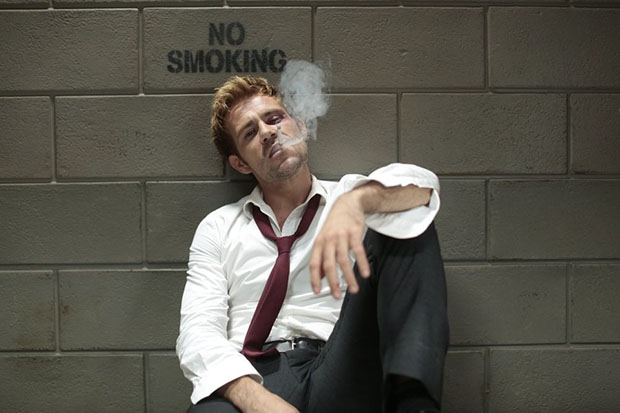

\[caption id="attachment\_1989" align="aligncenter" width="620"\] Matt Ryan as John Constantine -- Photo by: (Daniel McFadden/NBC)\[/caption\]

Once the envy of all the networks for its Thursday evening empire, NBC is no longer defined by its cutting edge content, but by its dangerous combination of insipidity and impatience.

It’s been announced that _Constantine’s_ production plan has been cut short, taking the season from the planned twenty-two episodes to a now, somewhat ominous, thirteen episodes. For committed viewers of this show (raises hand) this news has to come as a bit of a reality check. To this point, those of us who are watching _Constantine_ have been placed in a trance.

The pilot episode established a world and a foundation we could spend much more than 22 episodes within. Then with each episode, we learn but a tiny sliver more than the preview week — whether it be about John or Zedd. Six episodes into the season and we know next to nothing, the show fulfilling little of the promise it made after its pilot. And so the network's decision to cut the season in half — episode six, “Rage of Caliban,” effectively the mid-season point — has awoken us to a chilly realization: nothing much has happened.

Sure, characters have been developed and supernatural powers have been explored, but that's not exactly breaking new ground for a prime time television show about the supernatural. The question "What is the point of watching?" means death for any program, particularly in today's landscape where there are infinite viewing options on multiple platforms. That I have watched six hours of this show and still don't know anything about the supposedly great evil Manny, angel and the King of Entrances, told us about in episode one — that is a problem.

As we saw from “A Feast for Friends” and “Danse Vaudou,” _Constantine_ is going to have a wealth of “friends” and guests coming on to the show. But none of these characters have been as [interesting and as threatening as Papa Midnite](http://www.thehighscreen.com/2014/11/constantine-episode-3/). To this point, Mr. Midnite hasn’t exactly been John’s nemesis, and it seems like if anything, John has been getting in the way of Midnite’s plans.

Let this stand as a resounding cry from the fans of this show: We need more Papa Midnite. He is more than a reoccurring character; he may the bridge to a much more interesting show. There is some juicy information surrounding Midnite and it starts with his sister. John mentions it just briefly, but Papa Midnite knows about playing with the souls of the innocent and the one he lost was his sister Cedella.

John’s other compatriots, Zedd and Chas, still remain a mystery. Their fates don’t have to be fully explored but it’d pay some dividends to dig a little deeper into either of their back-stories. Both have been touched on: Zedd (or whatever her real name is) is still a relative unknown and John doesn’t trust her for good reason. Chas’ research on Zedd led to no results and Detective Morrigan only revealed a missing child report that was years past.

Then there’s Chas himself. First, he was called a survivalist, which told us… well it told us nothing. Then next thing you know he’s surviving multiple stab wounds and an electrocution.

The only character we’ve been given an appropriate amount of distance from is Manny, John’s constant companion. He’s been acting like Herald for a few episodes now, but what else can you expect from an angel? Interestingly enough, it’s refreshing to see _Constantine_ take a fresh approach to angels. Unlike the prepubescent flock following God in _Supernatural_, Manny plays this angel as a sort of manager who can only give John so much before he has to show him a little tough love.

With this new thirteen-episode announcement things have become simple and so much more complicated for executive producers Daniel Cerone and David S. Goyer. They’ve got to stick to a chain of events and ride that sucker into another next season. The halt doesn’t mean there’s no hope for a season two, it just means the window is becoming smaller and smaller. Following through with even one character arch might convince NBC that _Constantine’s_ ratings will improve and, in a larger context, that pressing the reset button on so many shows, year after year, is only sinking the failing network further into a hole.

 