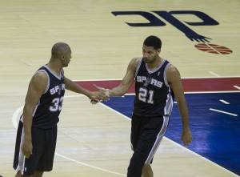
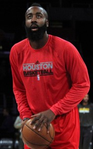

Injuries to Kevin Durant and Russell Westbrook created what appeared to be one of the most interesting early-season question marks in recent memory: Can the Oklahoma City Thunder climb back into the West standings after beginning the season 3-12? Many of us debated this point, with the majority opinion being the Thunder could snap the No. 8 seed if everything worked out perfectly. _How insulting_, others argued, _the Thunder barely making the playoffs? There's no way they miss the post-season; they'll finish higher than the eighth-seed._

Well, with an 11-5 record since late-November and Durant and Westbrook setting the world on fire, the Thunder appear to be a sure thing for the post-season, only two games back of Phoenix for the No. 8 seed. Zach Lowe recently placed [Oklahoma City atop his Western Conference power rankings](%20http://grantland.com/the-triangle/the-nbas-western-conference-power-rankings/), and while you can certainly argue that the Warriors have runaway as the favorites out West, the point is that Oklahoma City is comfortable back where they belong in the conversation — as Finals contenders.

So aside from future injuries and the health of key players like Andrew Bogut, Dwight Howard and the core in San Antonio, we already have a pretty clear picture of who the eight playoff teams out West are going to be.  Scariest of all, each and every one of these teams has the potential to compete in the conference finals.

**Oklahoma City Thunder:**

_The good: _Russell Westbrook and Kevin Durant. The two have proven to be unstoppable and both can drop 40 points on any given night. In limited games this season, they have both been around the top three in the NBA in PER.

_The bad: _Critics accuse Westbrook of taking away too many shot attempts from Durant.  However, that is just Westbrook's nature as an incredibly gifted scoring guard.  Its supporting cast has ultimately failed to put OKC over the top these last couple years.  Will Andre Roberson, Jeremy Lamb, Steven Adams, etc. cut it?

\[caption id="attachment\_999" align="alignleft" width="300"\] Duncan, Diaw. (Photo taken by Keith Allison)\[/caption\]

**San Antonio Spurs:**

_The good: _Experience, experience and more experience. Tim Duncan (highest PER among starting power forwards from contenders) is still playing at a high level. San Antonio has probably the NBA's best perimeter defender in Kawhi Leonard — just look at what he did to LeBron in last year's finals.

_The bad: _Gregg Popovich wants to assure you the Spurs will easily make it out of the first-round. However, that should be far from easy this year as most of these other teams have the tools to defeat them. Just look at their recent stretch: [the Spurs are the first team in NBA history to lose two straight triple-overtime games](http://www.nytimes.com/2014/12/20/sports/basketball/nba-roundup.html?_r=0).

**Golden State Warriors:**

_The good: _Most teams that live by the three also die by it.  But Golden State has two factors that negate that: First off, the Warriors are excellent on the defensive end (first in opponent field goal percentage). Secondly, led by the unstoppable backcourt of Steph Curry and Klay Thompson, the Warriors consistently create and knock down shots and seldom take a night off.

_The bad:_ Bogut is constantly hurt and it's pretty clear the Warriors need his paint presence on both ends to make a championship run. Who knows how last spring would have turned out if Bogut was active against the Clippers?

**Memphis Grizzlies:**

_The good:_ Grit-N-Grind offer overwhelming post and perimeter defense to a point where opponents just run out of energy. Memphis has been in the top five in opponent floor percentage in each of the past three seasons.

_The bad: _Although the Grizz have gradually improved on offense, they can be stagnant at times.  Courtney Lee is shooting over 54 percent from deep and Memphis has to be thankful for his perimeter presence. Outside of him, and a recent resurgence from Vince Carter, the Grizz rank just 28th in 3PM and 3PA.

\[caption id="attachment\_1738" align="alignright" width="188"\] James Harden. (Photo from Wikipedia, eligible for re-use, CC)\[/caption\]

**Houston Rockets:**

_The good: _James Harden has established himself as [an unstoppable force on the offensive end](http://www.thehighscreen.com/2014/12/giving-mvp-to-beard-james-harden/). He currently leads the league in scoring, and meanwhile, whether you know it or not, Howard is still among the game's most undeniable defensive presences.

_The bad: _Houston is the only team in the group without an All-Star caliber point guard — one of the more interesting factors of the Rajon Rondo trade. That being said, Patrick Beverley is capable of defending just about any opposing point guard. Houston is dead last in bench scoring averaging a lousy 21.4 points per game.

**Portland Trail Blazers:**

_The good: _The Blazers have the hardest big man to defend in LaMarcus Aldridge and an ultimate clutch performer in Damian Lillard. (Not to be confused with [Darius Lillard](http://ftw.usatoday.com/2014/12/state-farm-steph-curry-damian-lillard-sue-bird-john-stockton-chris-paul).) Aldridge and Lillard both rank in the top ten in Hollinger's estimated wins added. On top of that, Lillard leads the league in fourth quarter points per game.

_The bad: _Bench play has been Portland's one glaring weakness since it has become a player in the West last year. The Blazers have one of the league's strongest starting lineups but rank just 25th in bench points. They are second to last in FTA per FGA, and as a team could stand to get easier shots instead of relying so heavily on perimeter shooting.

**Los Angeles Clippers:**

_The good: _Chris Paul has possessed the best assist-turnover ratio in the NBA five of the past six years. This year his assist-turnover ratio is an exceptional 4.75. That explains why the Clippers are third is assists per field goals made.  Paul's outstanding vision and penetration is also a reason the Clippers are first in shooting efficiency.

_The bad: _The Clippers will likely continue to have trouble getting past the conference semifinals until they find an adequate wing starter. They have tried several different players over the years including Jared Dudley, Caron Butler, Matt Barnes (still on the team), etc. — none of these guys have provided the two-way value this team needs.

**Dallas Mavericks:**

_The good: _Rick Carlisle leads a nearly unstoppable offensive attack year-in and year-out and that is only going to get stronger with the recent acquisition of Rondo. The Mavs lead the league in points per game as well as two-point percentage. Monta Ellis is a perfect fit alongside Dirk Nowitzki and now the Mavs employ an All-Star caliber starting lineup.

_The bad: _The Mavs do not rely on defensive stops (29th in opponent three-point percentage and last in opponent fast break points). Getting Tyson Chandler back was huge for the Mavs as he single-handedly holds down the paint on defense. The Mavs are just as talented as anyone out West, and Rondo should definitely improve their perimeter defense. Thing is, he is going to have to if Dallas wants to compete in May and June.
