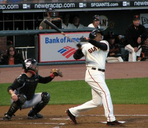

The results of the 2015 Baseball Writers Association of America Hall of Fame vote will be released Tuesday, likely setting off debate, name-calling and questions of how viable the [current system](http://www.beyondtheboxscore.com/2013/1/10/3857368/2013-baseball-hall-of-fame-vote-how-much-do-bbwaas-secret-ballots) is.

The issues are [well-documented](http://www.sandiegoreader.com/weblogs/game-day/2012/nov/15/headley-not-an-mpv-and-why-the-bbwaa-sucks/). The voting is anonymous, unless the voter chooses to reveal his picks. Some of the voters don’t even cover baseball anymore. There’s a 10-player limit on the ballot (which has caused some prominent voters to [abstain](http://deadspin.com/buster-olney-is-fed-up-with-hall-of-fame-voting-1666860847) in protest). Many of the voters haven’t embraced modern statistical analysis, and the controversy of the Steroid Era has only grown as more and more marked players are eligible for the Hall.

I don’t have a Hall of Fame vote just yet; one summer of occasionally covering Triple-A baseball didn’t quite catch the committees attention. What I do have is hundreds of hours of experience debating the issues surrounding the Hall of Fame vote with myself and others. Once the BBWAA comes around and gives me a vote, I’ll know where to stand on these issues. For now, a fake ballot will suffice.

For starters, the 10-player limit has to go. The fear is if voters are allowed to vote for unlimited players, they’ll do just that, littering the Hall with underserving candidates (like Phil Rizzuto and Luis Aparicio, apparently). The thought that the 10-player limit is the only thing preventing anarchy in the voting ranks is both irrational and shows a disturbing lack of faith in voters — for all the wrong reasons.

The limit won’t come up as an issue every year, but it has this winter. Many feel there are more than 10 worthy candidates (hence the abstaining in protest). This is partially due to a backlog caused by the Steroid Era and general disagreement about who should and shouldn’t be a Hall of Famer. The BBWAA has elected just 13 players in the past nine years and just 24 since the turn of the century. That’s an absurdly low pace considering all the deserving candidates that have been left out in the past few years.

Steroid usage is the most complicated issue in who should get in or not — regardless of how cut and dry some like to make it out to be. Should admission to using illegal performance-enhancing drugs keep an otherwise deserving candidate out of the Hall? That, in itself, is a difficult question to answer. But many of those on the ballot have neither admitted to using PEDs or been caught doing them. Some have been named in investigations or accused of doing them, but others such as Jeff Bagwell and Mike Piazza seem to have lost votes [due to mostly baseless speculation](http://deadspin.com/5164923/mike-piazzas-bacne-was-legendary-and-suspicious). I’d vote for players strictly based on their credentials until there’s some type of ruling from either the Hall itself or the BBWAA leadership on this.

After considering all of that, here’s who I’d vote into the Hall of Fame this year.

**Jeff Bagwell: .297/.408/.540 batting line, 79.6 WAR, 449 home runs, 1401 walks 1993 MVP**

In the past, it would have been perfectly acceptable to look at Bagwell’s 449 home runs and .297 batting average as “almost good enough." But there’s too much information out there now to let that type of narrow-minded analysis fly. A quick look at Bagwell’s walk and on-base numbers give you an indication of the type of dynamic offensive player he was. And whatever PED suspicions voters have of Bagwell aren’t backed by any solid evidence.

**Craig Biggio: .281/.363/.433 batting line, 65.1 WAR, 3,000 hit club**

It’s really astounding Biggio isn’t in yet. He fell just three votes short last year, but I can’t figure out why more than 25 percent of voters would leave him off their ballots. Between hits, walks and hit by pitches, fewer than 20 players in the history of baseball (which is pretty long) have been on-base more than Biggio. He was essentially a small market Derek Jeter, without the endorsement deals or playoff success. He’ll likely get in this year and deserves it.

\[caption id="attachment\_2169" align="alignright" width="300"\] Barry Bonds (Photo provided by Kevin Rushforth, http://www.flickr.com/photos/kevinrushforth/225833857/in/photolist-nVoZzs-dL2acy-zdZpT-nK6Qk-kXsxc-Fyekn-8QzaLK-cQp5m-DXUGt-2AyFVW-2ubfcX-8QChUj-8QCfjL-5j6SZZ-8SYi7U-etm9xD-c1bEn-c18FH-2jpsZH-c1bFs)\[/caption\]

**Barry Bonds: .298/.444/.607 batting line, 162.4 WAR, 762 home runs, 514 steals, 2558 walks, seven MVP’s**

Barry Bonds is the best position player not named Ted Williams or Babe Ruth. Do yourself a favor and check out his [Baseball Reference page](http://www.baseball-reference.com/players/b/bondsba01.shtml). Performance-enhancing drug use or not, Bonds was special and an inescapable part of the history of baseball. (See: Roger Clemens).

**Roger Clemens: 140.3 WAR, 3.12 ERA, 143 ERA+, seven Cy Young Awards, 354 wins, 4672 strike outs**

He dominated from the first Reagan administration to the second Bush administration, with very few injuries or struggle in-between. The numbers really say it all for Clemens, but steroid suspicions will likely keep him out. Like Bonds, though, it is irresponsible for the Hall of Fame to pretend he wasn't the best pitcher of their era; the sport allowed steroids to corrupt the game, and we can't pick-and-choose what parts of the sport to remember.

**Randy Johnson: 104.3 WAR, 3.12 ERA, 135 ERA+, 303 wins, Five Cy Young Awards 4875 strike outs**

Johnson had a strange career. He didn’t hit his stride until his late 20’s and won more games in his 40’s than he did in his 20’s. He hit his peak from ages 36 to 39, winning four consecutive NL Cy Young Awards. He pitched well into his 40’s and struck out more batters than anyone other than Nolan Ryan. He led the league in strikeouts nine times, including throwing 290 at age 41 in 2004. He won’t get 100 percent of the vote but he should.

**Pedro Martinez: 86 WAR, 2.93 ERA, 154 ERA+, Three Cy Young Awards, 3154 strike outs**

Many pitchers had more longevity than Pedro, but none dominated like he did in his prime. No one. Pedro pitched through the Steroid Era like it was the late sixties. He put up ERA’s of 2.07 and 1.74 while winning back-to-back Cy Young’s in 1999 and 2000 in the AL East in the heart of the most dominant offensive-era in baseball history. For perspective, Roger Clemens finished second in the American lead in ERA in 2000 at 3.70. Pedro beat him by nearly two full runs. He also led the league in with a .737 WHIP. Martinez struggled with some injury issues after signing with New York, eventually retiring after he struggled in the 2009 World Series with the Phillies. But his 1999 and 2000 seasons will stand the test of time as the best two season-stretch for any pitcher in baseball history.

**Mike Mussina: 83 WAR, 3.68 ERA, 123 ERA+, 270 wins, 2,813 strike outs**

Mussina’s done the seemingly impossible – he’s become underrated after spending much of his career as a Yankee. His 83 WAR is 24th all-time for pitchers, ahead of 37 Hall of Famers. It situates him just behind Fergie Jenkins and just ahead of Bob Gibson. Mussina pitched for 18 years and posted at least above-average numbers in 16 of those seasons. In his final season in 2008, at age 39, he pitched 200 innings and posted a 3.37 ERA. He was consistently one of the best pitchers in baseball and put up solid numbers despite pitching through the steroid era in the AL East. He deserves a spot in the Hall.

**Curt Schilling: 79.9 WAR, 3.46 ERA, 127 ERA+, 216 wins, 2001 World Series co-MVP, 3,116 strike outs**

Don’t be fooled by Schilling’s relatively low win total, and not just because won/loss stats are team-dependent and have no place in individual assessment. Schilling was consistently very good from the early ‘90s through the mid-2000’s. In addition to being a Hall-of-Fame caliber regular season pitcher, he dominated in the playoffs too. He put up a 2.23 ERA in 133 playoff innings, pitching for four World Series teams, including three champions. Schilling’s regular season numbers are good enough to get him in the Hall, but his postseason numbers put him over the top.

**Tim Raines: .294/.385/.425 batting line, 69.1 WAR, 808 stolen bases, 1,330 walks**

Raines is unequivocally the most underrated player on the ballot. He made it to first more than 3,800 times in his career and stole more than 800 bases. Throw in 700 extra-base hits and I’m wondering what I’m missing here.

**Larry Walker: .313/.400/.565 batting line, 72.6 WAR, 383 home runs, 1997 NL MVP**

Anyone who’s familiar with the reputation of Coors Field (and playing baseball in Colorado in general) knows these numbers should come with an asterisk. Walker played much of his career in baseball’s most hitter-friendly park. So, how inflated are his numbers? Should he even be a Hall of Famer? Yes. Walker put up a .278/.370/.495 batting line on the road throughout his career to go along with his otherworldly .348/.491/.637 home numbers. He may be a borderline guy, but I’d put him in.

…

Because of the 10-person limit, I’d only be able to vote for those guys. But there are a few other guys I’d at least consider voting for.

**Mike Piazza: .308/.377/.545 batting line, 59.4 WAR, 427 home runs**

One of the great hitting catchers of all-time. His numbers are slightly inflated by the era he played in, but impressive nonetheless. Steroid speculation may be keeping him out, but he’s never been specifically tied to them.

**John Smoltz: 66.5 WAR, 3.33 ERA, 125 ERA+, 154 saves and 213 wins, 1996 NL Cy Young**

The only pitcher ever to record 200 wins and 150 saves. Smoltz is a Hall-of-Fame-caliber guy but not until Johnson/Martinez/Schilling/Clemens all make it in.

**Sammy Sosa: .273/.344/.534 batting line, 58.4 WAR, 609 home runs, 1998 NL MVP**

I’d consider voting for Sosa but I’m not sure I’d actually do it. Sosa really only had six above-average seasons after a forgettable start to his career. He sits between Chuck Finley and Tim Hudson in career WAR, which should tell you all you need to know. Sosa had some transcendent seasons, but just a very good career.

**Mark McGwire: .263/.394/.588 batting line, 62 WAR, 583 home runs, 1317 walks**

McGwire had almost as many walks (1317) as hits (1626). As crazy as it sounds, McGwire is really a borderline Hall candidate. He was a great home run hitter, but he might not have been an overall good enough player to get in.

**Jeff Kent: 55.2 WAR, .290/356/.500 batting line, 377 home runs, 2000 NL MVP**

If the Hall of Very Good was a real place, Kent would be in it. He might still get in the Hall of Fame, but not until a lot of other guys get in before him.

That’s all for now. Here’s to hoping three or more guys get in this year.

