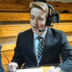

_Monday night was just another weekday evening in the long, winding road which is the NBA regular season. Then Adrian Wojnarowski did that thing where he tweeted something the oracle from 300 told him, and the entire basketball universe spun out of control. Oh, and then Twitter broke. Here are the initial reactions from The High Screen staff on the experience of last night's instant-classic 3-way trade between the Cleveland Cavaliers, New York Knicks and Oklahoma City Thunder.   _

* * *

Before this extraordinary basketball season began, one of the prominent questions floating around the game was which team had the NBA's best backcourt. Now, depending on where you stand on the whole San Antonio thing, there is the correct answer (Golden State, which has only become more obvious since the season began) and then there is any other answer.

But, much like how rappers are supposed to proclaim themselves as the best in the world (See: [Kendrick Lamar on "Control"](http://www.thehighscreen.com/2014/12/j-cole-autobiography-2014-forest-hills-drive/)) or how it's every son's obligation to broadcast their Mother's home-cooking as the most delicious food they've ever tasted — can't wait for your next tray of lasagna, Ma — every guard with a microphone aimed at their mouth is supposed to say their team's backcourt is the best. So, when Bradley Beal announced that he and John Wall were the best backcourt in the NBA, everyone understood where that comment came from, acknowledged it, and moved on. Well, everyone except Dion Waiters.

_"That's nonsense,"_ Waiters said. _"He's not messing with me and Ky (Kyrie Irving). [I think me and Ky are the best backcourt](http://espn.go.com/nba/story/_/id/11618576/dion-waiters-cleveland-cavaliers-says-kyrie-irving-nba-best-backcourt), young backcourt. That's all."_

Well, about that. Turns out Cleveland was willing to roll the dice on breaking up basketball's "best backcourt" just two months into year three. Let the record show that Irving/Waiters, the NBA's most outspoken combination of shoot-first point guard and shoot-first shooting guard, never appeared in a playoff game, fine, but they DID explicitly deny what appeared to be a fist fight in the locker room after one of the team's 49 losses last season.

https://www.youtube.com/watch?v=Lcai3gDlgf4

Isn't that what championships are made of?

But let's not bury the lead here — J.R. Smith has finally done what he has so clearly set out to do from the moment he entered this league. He has come close before, folks: we all remember [the pipe dreams](http://deadspin.com/5986076/ladies-jr-smiths-twitter-come-on-will-have-you-sopping-wet) of his social media conquests of yesteryear; his work in [the maintenance of his opponent's shoe laces](https://www.youtube.com/watch?v=ot4v225WmTM) are, naturally, the stuff of legend; and his escapades with Queen Rihanna are biblical.

But now, ladies and gentleman, Smith has finally done it. He. Broke. Twitter.

(I'll wait for you to sit down from your standing ovations.)

Through sheer willpower and want-to, the gravity of this moment in Smith's career sent the Internet back to 2006. Without Twitter for something like 40-50 minutes, we all were left to, like, think about things slowly and, like, not read what other people thought about things nobody knew yet and, like, like... (My brain exploded because I thought about a Twitter-less planet for too long.)

We're all proud of you, J.R., truly, madly, deeply. But please, don't break Twitter again. It scared me.

**Joe Mags **

 

 

 

* * *

 

When I saw the alert scroll on my screen Sunday that [Kyrie Irving was going out with a back injury](http://www.ohio.com/blogs/cleveland-cavaliers/cleveland-cavaliers-1.275356/kyrie-irving-will-not-play-monday-at-sixers-will-remain-in-cleveland-with-back-injury-1.555140), I cringed. Cleveland has been a mess this season, and that team minus Lebron and Kyrie would go from mediocre to plain bad, real quick.

To my surprise — to _everyone's_ surprise — not 24 hours later the Cavaliers did something about it. Cleveland lands a pair of wings who fill much different roles, and who perhaps have a lot to prove now that they are freed from the sinking ship on 7th Avenue. It gives them a stout defender/energy man in Shumpert, and a streaky shooter who wants to prove he’s worth a new start in J.R. Smith.

This blockbuster trade gives Oklahoma City what they have badly needed: a legitimate third scorer. He has greatly improved his jump-shooting, sure, but let's face it, Serge Ibaka can't be one of your go-to scorers if you're trying to win the West. And Jackson — who the basketball universe thought was going to be traded to the Knicks before discovering on 40-minute-broken-Twitter-delay he was staying put in OKC — might be the league's most overqualified backup point guard. But Waiters provides something they haven't had since James Harden in terms of a scorer off the pine. Right now OKC is on the outside of the playoffs looking in, and this could be an important piece they need to keep up with the many high powered offenses at the top of the West.

The Knicks get.. well they get [three players they already know they want to waive](https://twitter.com/HowardBeck/status/552290721605361666), but their future cap space becomes a bit more flexible. The Knicks are definitely the most interesting part of this trade. To me, this move says WE GIVE UP, and if you're the Knicks, why not? We all knew that this was going to be a wildcard year for New York, and while I don’t think anyone saw the collapse happening this fast, the bright spot here is that Phil Jackson is taking action, making dope basketball decisions and setting the team up for the future — something none of his predecessors were going to do.

But the landmark of this deal is how shocking it was; not even Twitter could handle it. If you honestly say you saw this trade coming, please put an application in with ESPN and put me down as a reference.

**Alain Pierre-Lys **

 

 

 

* * *

 

When it was first announced that Dion Waiters would be traded, I wasn't surprised. I called it before the season. Waiters is a chucker. His style of play didn't mesh well with anything Cleveland wanted to do. I was immediately curious as to what team would be taking a chance on Waiters. The team that traded for Waiters, I reasoned, must be a contender that doesn't need another jump shooter. So who could it be?

Oklahoma City... Wait, what? This is a team that lives and dies by the jumper, and it's a team that already struggles with floor spacing. Waiters to OKC makes absolutely zero sense.

So, who did Cleveland acquire to replace Waiters? In an all-time WTF moment, the Cavs traded for The Immortal J.R. Smith. Yes, [that J.R. Smith.](http://www.nba.com/video/channels/nba_tv/2014/11/14/20141114-starters-worst-week-jr-smith.nba/) The Cavs also acquired Iman Shumpert, but that actually makes some basketball sense, and honestly, the arrival of Smith is more fun to discuss.

The most comical aspect of this trade is that Cleveland essentially traded Waiters for the exact same player, except that Smith is older and much more set in his ways and that contract. Both Smith and Waiters are Chemistry Assassins, and they moonlight as Coach Killers.

Twitter even crashed because it couldn't handle this trade. Reggie Jackson was supposed to be traded to the Knicks, and for about an hour I thought that was the case. As it turns out, Jackson — who would've been the best asset in the entire trade — is staying put, and the Knicks are only receiving a second rounder. (What, do they think they're the 76ers now or something?)

This was one of those rare trades where every team lost. The Thunder and Cavs traded for players who are biologically programmed, it would seem, to derail their lofty end-of-the-year goals, and the Knicks basically dumped a semi-valuable asset for a second round pick. If I had to declare a winner, at gunpoint, it would be New York because of all the cap space they'll free up for next summer. But who am I kidding? The real winners of this trade are me and you. J.R. Smith on a contender? Dion Waiters and Russ Westbrook inevitably fighting in the locker room? Fans of the NBA and fans of unintentional comedy are winners today.

** Cole Frederick**

 

 

 

* * *

Annnnnnnnnnd the Knicks have given up all hope for the season.

The Cavaliers acquire two decent players in Shumpert and Smith, but what's sort-of perplexing is how this trade completely fails to address the biggest issue preventing them from being the championship caliber team they are supposed to be. This trade does nothing to reenforce their power forward or center positions. While these two players will likely combine to give the Cavs more than Waiters has been providing — his 8-point, 0-14 FGA stinker against Dallas appears to have been a final straw for Cleveland — after losing Anderson Varejao for the season, this team desperately needs height to bolster their front court. This trade doesn’t do anything to help them there, and I don’t see it having much impact on their already disappointing 19-16 season.

The Thunder are the only real winners in this trade. They acquire a quality role player to push them into the playoffs, of which they are currently not qualified for; the Western Conference is a war-zone. Look, Dion Waiters isn't perfect — he's having a mediocre year with a slight slump in scoring. But coming off the bench with LeBron, Irving and Kevin Love ahead of you isn't exactly a recipe for getting a ton of scoring opportunities, and I'm not sure Waiters was ever going to be the Mike Miller or Rashard Lewis off-the-bench contributor fans wanted him to be within LeBron's master plan.

Oklahoma City is relatively healthy for the first time all season, and now the have the luxury of choosing from Jeremy Lamb, Anthony Morrow, Perry Jones, Reggie Jackson, Ish Smith and Dion Waiters — a murderer's row of "Put me in, coach" athletes. Dion will provide scoring, ball handling and ridiculous step-backs and take some of the pressure off Jackson. This is an excellent move for the Thunder, and we can bet to see them long into the spring because of it.

**Elliot Altland **

 

 

 

* * *

 

Let the 2's fly. The locker room issues of J.R. Smith and Dion Waiters are well-documented. Could a change of scenery be just what the doctor ordered? Smith heading to Cleveland to play with LeBron and the underwhelming Cavs could help reignite the Cav's 17th-ranked offense. Smith can bolster the Bron-less offense for the next two weeks while his travel partner and still-teammate Iman Shumpert can provide the defense that Smith lacks. That said, assuming there's not a lab in Northern Ohio that can morph the players into one, the Cavs are trying to patch a bad cut with two small band-aids. They do get a nifty protected first rounder down the road — a pick that Knicks fans were falsely promised through premature tweets — so it should be interesting to see who LeBron uses the selection on.

The Thunder get the aforementioned Waiters who, under the tutelage of Kevin Durant, could maybe unlock the potential he flashed at the beginning of his young career — or at least that's what the notes on Sam Presti's desk probably say, right next to a framed photo of James Harden with the caption "miss you."

Here's the thing: Waiters isn't Harden. But given the recent success, or lackthereof, the OKC program has had at finding another Harden, Waiters has a pretty good chance at standing out amongst a group of players (namely Jeremy Lamb, Andre Roberson and Perry Jones) who do a lot of the same things. It wouldn't shock me if Waiters' career trajectory takes a positive turn, and whether Jackson stays or goes, that spot in the Thunder rotation is shared as is.

The Knicks continue to clear cap room while stockpiling some fringe prospects. I don't expect Alex Kirk or Lance Thompson to be long-term answers, but at this point there's nothing that can be lost in taking a pair of flyers. Lou Amundson is just a guy at 32. Add in a future second round pick from Cleveland and the Knicks are at least getting a few stabs at a future turnaround.

**Tim Mullhaupt**

 

 

 

* * *

 

What a weird trade. We all know that all of these guys are talented, but the question becomes do they fit at all with their new teams? I like Shumpert better for the Cavs than Smith. With Shumpert, they have a young piece who is an excellent perimeter defender. LeBron, Shumpert and [Shawn Marion](http://bloguin.com/crossoverchronicles/2014-articles/shawn-marion-the-matrix-evolution-of-small-forward-position.html) give them three guys who excel at perimeter defense, something very few teams in the East can claim.

The best case scenario for the Cavs with J.R. is that he becomes their Jamal Crawford, and reverts back to his Sixth Man of The Year days. They hope he can become their secret weapon off the bench and provide them with an additional scoring punch from behind the arc. But Smith is not just a spot-up shooter, and you know he’s going to take his share of bad shots. Is he going to be able to handle being the fourth option offensively for a chance at winning? It remains to be seen.. but signs would point to no.

As for Waiters, I’m not entirely sure what the Thunder’s logic is here either. Waiters clearly struggled with his role being adjusted in Cleveland with LeBron and Kevin Love coming in, so how is he going to react to playing with Russell Westbrook and Kevin Durant, two of the most ball dominate players in the NBA?

Waiters excels when he has the ball in his hands and can create. For a guy who has had [success in his career spotting up on the perimeter](http://www.fearthesword.com/2013/11/29/5156294/2013-14-cavs-season-dion-waiters-is-a-legitimate-spot-up-shooting), he clearly is not interested in spending large chunks of time on the floor _without_ having the basketball. He also isn’t James Harden, one of the game's greatest playmakers and creative passers, so if Thunder fans are expecting him to replicate that dynamic (or even Kevin Martin's) they’re going to be disappointed. Is he an improvement over Andre Roberson though? Sure. If Scott Brooks and company can convince him to buy into their system, he could be effective. But like Smith, I question his maturity considering he was such a headache in Cleveland.

And the Knicks? What is there to say. Phil Jackson obviously believes he can get free agents to come to New York and play with Carmelo Anthony and their upcoming top five draft pick. Considering they just gave up arguably their second and third best players, it’s really tough to say they aren’t tanking at this point. Losing Shumpert might hurt more than they expect in the long run, and while flexibility is nice, you would have liked to see New York get at least SOMETHING back that can help them right now. Remember, there were reports they almost traded Shumpert to Oklahoma City last season for a first round pick. How different would things be for both teams if that trade got done?

**Ross Bentley **

 

 

 

 

* * *

 

Let's Go Knicks. This is exactly the type of trade I hope Knicks-era Phil becomes known for, as he has upgraded our disastrous perimeter defense without losing any sure buckets from a scarily anemic offense. Offensively, Phil and Derek's Triangle has suffered from a myriad of personnel and talent complications, but Monday's trade has exponentially improved the Knicks in one key area: removing J.R. Smith's nonsense. Losing Shump and Shump's hair is a bitter pill to swallow; but convincing another organization to take J.R. Smith, his wobbly basketball consciousness and that contract is worth it.

Outside of Manhattan.. Holy Crap! The Oklahoma City Thunder made a basketball-first trade that netted them NBA-ready talent! Good job, fellas. Waiters is excellent protection for soon-to-be unrestricted free-agent Reggie Jackson, who inevitably is going to take somebody's overpay and leave town. Waiters hasn't figured it all out yet — and perhaps the problem is he thinks he has — but Waiters might be as good, if not better, than Jackson could ever hope to be.

And now Cleveland. If I'm LeBron, I'm setting up an emergency session with Deepak Chopra, because it would take cataclysmic portions of mindfulness not to freak out. This team is struggling nightly to defend the perimeter and to create sensible offensive movement; the sharks are starting to smell Blatt's job in the water — and you bring in J.R. Smith?!?! Perhaps the same obstacle that led to LeBron's "college experience" lingers on four years later in Cleveland: its incompetent front office. Any front office that is even in the position to get 3 of the last 4 top overall picks shouldn't be trusted to build a championship pedigree team.

****

**Kwame Belle**

 

 

 

* * *

 

Around 7:30 PM on Monday night, Yahoo! Sports basketball reporter Adrian Wojnarowski tweeted that Cleveland had pulled Dion Waiters out of the game because he was involved in a trade. Minutes later, he tweeted that Oklahoma City was a possible landing spot for Waiters. Not long after, he tweeted that New York was sending J.R. Smith to Cleveland as part of the deal. Directly after that, he tweeted that Iman Shumpert was also headed to the Cavs.

This all happened in roughly 15 minutes, with each tweet spaced out by a few moments in time. This gave Twitter the chance to collectively freak out over each aspect of the trade as each piece of news broke. Woj posted a piece in which he discussed where all the pieces ended up and immediately moved on to other news.

This is NBA reporting in 2015. Only tonight, it wasn’t.

Twitter broke down just after Woj’s J.R. Smith tweet (coincidence?), forcing people to actively search the internet for the odds and ends of the finalized deal. Twitter does not have mass server issues very often. Big time NBA trades like this do not happen very often. As we move further into the information age, it seems perfectly reasonable that this may have been the last major trade where people (read: basketball fans who use Twitter) had to manually search to find the details of a major NBA news story.

As for the trade itself, I offer my condolences to Cleveland’s fan base and anyone attempting to stop Oklahoma City’s offense in the playoffs.

**Taylor Nigrelli **

 

 

 

* * *

 

[I wrote last week](http://www.thehighscreen.com/2014/12/nba-west-expected-eight/) about how the Thunder are suddenly safe bets to make the postseason after struggling so mightily to stay afloat in November. Oklahoma City is 13-4 over their last 17 games; they are really, really good.

So with that said, this trade may be exactly what Oklahoma City needs to put it over the top in the West. If the Thunder decide to hold on to Reggie Jackson too — it's reported that Monday's deal [puts them over the luxury tax line](https://twitter.com/royceyoung/status/552289438047666176), a place we all know they have tried to avoid in the past — they have a backcourt that is too much for any team to handle. Dion Waiters can be viewed as the first real replacement of James Harden; at the very least, Waiters is the first player of that elite offensive ability they have brought in since the infamous Harden trade. Waiters plays with great intensity with the basketball and can score in spurts, alleviating pressure from Durant and Westbrook when defenses hone in on them.

As for Cleveland, trading Waiters for two players of lesser value is certainly a risk, but it's been painfully clear they needed to make a change. Iman Shumpert could be part of the solution to their defensive woes, although they still desperately need a big man to protect the rim in the wake of the Anderson Varejao injury. I am not quite sure what they want to accomplish with JR Smith; I don't see him bringing much (good) to the table.

Clearly New York is in the process of unloading everyone outside of Carmelo Anthony. The Knicks are hoping for the top pick in the 2015 draft and counting on adding a couple high-caliber free agents this summer with the money they have made available through this move and others. Good luck!

**Zach Tennen**
