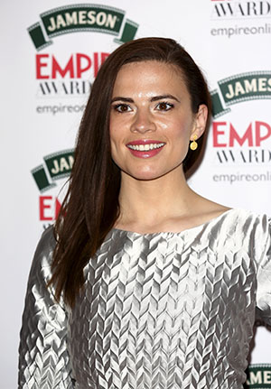

## Marvel is at the point where nothing they can do can be taken lightly.

_Warning: spoilers below_

Their recent success has gone beyond the big screen and captured fans through a massively successful prime-time program _Agents of S.H.I.E.LD_., another round of successful films and an [ambitious schedule that lays plans all the way until 2019](http://abcnews.go.com/Entertainment/marvel-announces-captain-america-civil-war-ton-upcoming/story?id=26517287). So the premiere of _Agent Carter_ has high expectations and a lot going for it.

Viewers may be wondering what this can add to the marvel universe but thanks to _Agents of S.H.I.EL.D_., Captain America and Captain America: The Winter Soldier we’ve never needed anymore answers. Hydra’s presence is not only real but it’s active, and according to the Captain America films it’s never ended. It’s almost like Marvel has been teasing us with appearances from Hayley Atwell who plays Agent Carter. She’s been featured in a flashback for _Agents of S.H.I.E.L.D._ which turned out to be real footage of the show, [and she was aged up in The Winter Soldier for one last conversation with Cap](https://www.youtube.com/watch?v=brm4yJv3ewA).

What Marvel understands is that no character need go to waste, since they have so many resources at hand not only do they not have to let a character go but they can use something other than their cinematic influence to keep a character alive. [Take the Marvel One Shots for example, it gave us what we wanted to know, what was next for Peggy Carter?](http://www.dailymotion.com/video/x1viter_marvel-one-shot-agent-carter-2013_shortfilms) Thanks to that we know that Howard Stark and Carter became the founding members of shield, which is where this show is leading up to.

\[caption id="attachment\_2259" align="alignright" width="300"\] Hayley Atwell attends the Jameson Empire Awards 2014 (Photo by Tim P. Whitby/Getty Images for Jameson)\[/caption\]

But releasing a show with the tag Marvel doesn’t just put us in our seats, the question I want answers to is, “What are we going to get out of this?” _Agents of S.H.I.E.L.D._ seems to be fueling the 2018 movie [_The Inhumans_](http://www.slashfilm.com/who-are-the-inhumans/) (if you don’t believe me look into Skye’s real name), each one-shot has led to something either trivially relevant or serious and then there’s _Agent Carter._

Yes, I’ll say it now, this two-hour premiere was fantastic. The two-hour format allotted for a lot of room to develop the situation Agent Carter has found herself in, she’s not the war-hero we saw in the first Captain America. The harsh gender-typing of the U.S. gov’t has relegated her to a role of secretary which is a monumental waste of her talents. All the while her male counterparts Agents Thompson and Sousa played by Chad Michael Murray and Enver Gjokaj respectively, track down a case destined for Agent Carter but don’t worry the writers, who are a brain trust collected from many corners of the marvel universe, found a way to give us two sides to this story. The S.S.R. which is led by Chief Roger Dooley (Shea Wingham) is hunting down Howard Stark, portrayed by Dominic Cooper who will play a reoccurring role, who has been named a traitor and while Carter knows this not to be true there is still a big problem, which is so Marvel by the way. The weapons Stark created during World War II have been stolen and so far all we know is the phrase, “Leviathan is coming.” Peggy isn’t alone though, she’s being helped by none other than Edwin Jarvis, Stark’s Butler and his son’s future tutor and A.I.

My guess is that this will manifest itself in the Hydra re-awakening that happens in modern times, and that’s where _Agent Carter_ makes waves. Since we know how it all turns out for Carter, this show actually does offer a wealth of experiences to tap into. The writers only have to do their peers' work justice, and respect the timeline Marvel has established.

With that said, this isn’t a pass to send _Agent Carter_ to space, which would…. okay it be would be really cool, but we know where this Agent eventually hangs their hat. So Agent Carter will most definitely holds hints for all future Marvel projects. Pay attention to mentions of people who are perceived as “special” because this may lead directly to an Inhuman or _Agents of S.H.I.E.L.D._ reference, and since it’s post World War II, there may be a few tesseract or infinity stone references.

As mentioned above, the expectations surrounding _Agent Carter_ are considerable but for reasons alluded to, it’s completely justified. _Agent Carter_ gives us a female lead to do something other than ogle at (sorry Boring Black Widow). We already have reasons to respect _Agent Carter_ and hopefully by the end of this series those stay intact.

