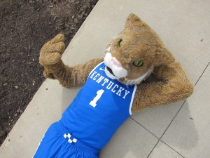

Psst, guys, guess what? It’s January. The NCAA Tournament is only two months away. College Basketball is about to start conference play.

I know you are all busy with the NFL Playoffs, College bowl games, and [crazy NBA trades](http://www.thehighscreen.com/2015/01/j-r-smith-killed-twitter/), but if you’re not a habitual College Basketball watcher, now might be a good time to pick it back up.

After all, it’s been a pretty wild start to the season, with [upsets](http://www.njit.edu/features/sceneandheard/michigan.php) running rampant, and parody spreading throughout the nation, save for a few [dominant](http://espn.go.com/ncb/recap?gameId=400593228) teams at the top.

You know we’re in the thick of things when Joe Lunardi, ESPN’s resident Bracketoligist, releases his first [bracket](http://espn.go.com/mens-college-basketball/bracketology) of the season. While I’m no Doctor of Bracketology like Lunardi — although I do have a degree from St. Joseph’s University in Bracketology ([I’m not kidding](https://twitter.com/thatjoemags/status/553651848704294912)) — I’ll do my best to breakdown what you need to know from the first of many mock brackets released this season. (Note: This bracketology was released Monday morning January 5th. For those unfamiliar, teams in all CAPS simulate conference champions, while lowercase teams are at large bids.)

\[caption id="attachment\_2267" align="alignright" width="300"\] Kentucky could run the table en route to earning a top seed. ([Photo provided by Megan Robertson](http://www.flickr.com/photos/megrobertson/6777099456/in/photolist-o3E7Jx-bjSpym-bxMgTx-bxMgYe-bxMh7V-o3EcfB-nLbyWg-nLaMkQ-nLaY4b-o3EdDD-nLaWN5-nLbBjn-o3EcZH-nL9fUv-o5rsJe-o1AhwQ-o3n2JH-o3E92T-o3CJEp-nLaHRp))\[/caption\]

**MIDWEST**

1. KENTUCKY vs. 16 EASTERN ILLINOIS/CHATTANOOGA

8. Ohio State vs. 9 CINCINNATI

5. Notre Dame vs. 12. HARVARD

4. West Virginia vs. 13. STONY BROOK

6. Baylor vs. 11. BUFFALO

3. Utah vs. 14. UC SANTA BARBARA

7. St. John’s vs. 10. Georgia

2. Louisville vs. 15. CLEVELAND STATE

**Empire State of Mind**:  First off, let’s send a big shout out to the great state of New York who sends three teams to the tournament in this mock region, including St. John’s, who’s comfortably back in the field this season after picking up wins in the non-conference over Minnesota and Syracuse. Still, they might want to correct that 0-3 mark in the Big East sooner rather than later. After a hot start in the non-league, the Red Storm have faded quick in Big East play. They need to right the ship ASAP if they want to stay in the field.

**Irish Surprise**: Notre Dame was listed as a 5 seed in this mock bracket, but after beating UNC on their home court Monday, they will shoot even further up. Projected to be near the bottom of the ACC at the beginning of the season, Mike Brey’s team has been one of the most pleasant surprises in the NCAA this year, at 15-1 and with a 3-0 mark already in ACC play.

**The Utes have arrived**: Utah is one of the best, least talked about teams in the country and currently sit at #10 in the AP Poll. Larry Krystkowiak deserves a ton of credit for getting his team into a great position to compete in the Pac-12, and Utah could seriously challenge Arizona by year’s end.

**Bluegrass Rematch**: If you haven’t been paying attention, the Kentucky Wildcats is absolutely dominant this season. John Calipari’s squad is so deep they were running out two five-man platoon groups earlier this season. They already have wins over Kansas, Providence, Texas, North Carolina, and yes, Louisville, the team who sits as the #2 seed in this mock bracket.  Despite the close-call versus Ole Miss this week, Kentucky remains unbeaten and the number one team in the country.

While there’s still obviously a very long way to go, it wouldn’t be surprising if Kentucky ran the table and got the number one overall seed, while Louisville survived a tough ACC slate to remain on the two or three line. If that were the case, would the committee be able to resist putting the two in-state rivals in the same region for a potential rematch that would send one to the Final Four? Doubtful.

**WEST**

1. WISCONSIN vs. 16. NORTH DAKOTA STATE

8. Arkansas vs. 9. Washington

5. Iowa State vs. 12. UTEP

4. North Carolina vs. 13. EASTERN WASHINGTON

6. Northern Iowa vs. 11. TEMPLE

3. Texas vs. 14. North Carolina Central

7. Colorado State vs. 10. Brigham Young

2. Arizona vs. 15. Texas Southern

**Tar Heels Slipping**: Going into the season, many thought North Carolina had enough talent to be a Final Four team. They still might be, but here they are in January already with four losses and only a four seed in the first Bracketology. They have all the talent to make a run, but UNC still hasn’t put all the pieces together at this point.

**Cinderella’s To Watch**: This region features at least two or three teams that you need to keep an eye on. Wichita State will get all the attention out of the Missouri Valley, but Northern Iowa is a legitimate Top 25 team that could do a lot of damage if they make the tournament. As can Colorado State of the Mountain West Conference, who suffered their first loss of the season just this weekend.

BYU, UTEP, and Temple are also dangerous teams with signature wins already on their resume that could be bracket busters if they get in. Let’s see how these teams react to the grind of conference play, but they are all teams to keep an eye on.

**Two Final Four Favorites**: I think eventually Arizona will play their way back on to the one line, and Wisconsin should be able to stay there.

Duke and Kentucky have been the two dominant teams in the country this season, but both the Badgers and Wildcats are veteran-laden squads that defend, and can grind out a win against anybody. They will both be upset a time or two in their tough league schedules, but when push comes to shove I would be very surprised at least one of these two teams didn’t make the Final Four.

**EAST**

1\. DUKE vs. 16. COLGATE/MONMOUTH

8. Stanford vs. 9. Georgetown

5. VCU vs. 12. GEORGIA STATE

4. OKLAHOMA vs. 13. STEPHEN F. AUSTIN

6. Old Dominion vs. 11. South Carolina/Xavier

3. Maryland vs. 14. HOFSTRA

7. Iowa vs. 10. Southern Methodist

2. Villanova vs. 15. St. Francis (PA)

**Dukie Dominance**: Make no mistake, Duke has been just as good as Kentucky has thus far this season. They have a trio of the best freshman in the country, led by Jahlil Okafor, the projected top pick in next year’s NBA Draft.

However, it will be very curious to see how they react to ACC play.  The ACC can throw 5 or 6 teams at you that could potentially make the Final Four, and by the end of the month, Duke will have had road games against Louisville, St. John’s, (not in the ACC but could still upset them), Notre Dame, and Virginia. If they somehow come out of that unscathed, watch out.

**Fear the Turtle**:  Former ACC member Maryland who now has jumped to the Big Ten, has been another excellent surprise this year. The Terrapins already have amassed five Top-100 RPI wins and their only blemish is a single-digit loss to unbeaten Virginia.

It is a huge shock to see them all the way up to a number three seed, but they absolutely deserve it based on their play thus far. I would expect them to drop off a bit in the Big Ten, but a top three finish seems entirely possible. Melo Trimble and Dez Wells are names to look out for for the remainder of the season. The Terapins however lost just this week against Illinois. How they will they react to their first Big Ten loss? That will be a very interesting story line in one of the nations best leagues going forward.

**Oh, what might have been**: Have you ever heard of Emmanuel Mudiay? If you haven’t yet, you will soon. If you aren’t caught up, he was a top five recruit who had originally committed to SMU this season to play for legendary coach Larry Brown, but backed out and instead decided to play a year in China before going to the NBA.

Regardless of how it turns out for Muiday, it’s turning out terribly for SMU. The Mustangs looked like a potential Final Four team with him in the mix, but without him they are barely hanging on to an at-large spot in the first Bracketology.  SMU struggles to score, just 140th in the nation, something Muiday would have assuredly fixed. They have talent in other areas, but without Muiday, they are nothing more than a bubble team, who already has four losses and plays in a terrible conference.  With him? Who knows. But I’m sure Larry Brown wishes he could have found out.

**South Carolina sighting**: South Carolina!!! Joey Brackets, rightfully so, has included Frank Martin’s South Carolina Gamecocks, traditionally one of the worst power conference programs, among his final four teams to qualify as at large in the NCAA Field.

This comes on the heels of a shocking win over Iowa State, but South Carolina also has wins over Clemson and Oklahoma State. Nothing that blows you away, but for South Carolina, it’s a start. The Gamecocks couldn’t knock off Florida in their first conference game, but the fact that they are even in the discussion is still incredible.

Say what you will about Frank Martin’s antics, but he has his program going in the right direction for the first time in a long time, and with the SEC down this season, his team should have several more opportunities to pick up victories.

**SOUTH**

1. Virginia vs. 16. SOUTH CAROLINA UPSTATE

8. George Washington vs. 9. LSU

5. Seton Hall vs. 12. SAINT MARY’S

4. WICHITA STATE vs. 13. WYOMING

6. Butler vs. 11. Michigan State/Syracuse

3. Kansas vs. 14. Coastal Carolina

7. San Diego State vs. 10. Providence

2. Gonzaga vs. 15. NEW MEXICO STATE

**Virginia Cavaliers > Cleveland Cavaliers:** Okay, maybe too far. Still, what an unbelievable season it has been thus far for Virginia. Despite losing Joe Harris (who ironically now plays for the Cleveland version of the Cavs), Virginia looks just as good if not better than they did last season when they won both the regular season and ACC tournament championships.

No, UVA doesn’t have the athletes of Kentucky or Duke. They don’t have the pedigree and experience of Wisconsin and Arizona. They are perhaps more susceptible to an upset in the tournament if they don’t shoot well. That’s all true.  But all that considered, pay attention to Virginia. If nothing else, they deserve that.

**Look out for the Bulldogs**: Is this Mark Few’s best team ever? Maybe. Adam Morrison (and Kelly Olynyk) might have something to say about that, but I don’t remember a Gonzaga team ever being so deep as the one they have right now.

The Bulldogs are a couple of misses away from not having lost to Arizona and being undefeated right now, and I wouldn’t be the least bit shocked to see them end up finally breaking through to the Final Four.  Someone in the WCC is going to have to play a perfect game to upset them, so they could end up going into the NCAA Tournament with a 33-1, or worst 32-2 record. Kentucky transfer Kyle Wiltjer has been a godsend to this team, and pair him up with Kevin Pangos? Forget it.

**Big East is Wide Open: **If you’re counting, that’s seven Big East teams that Lunardi has included in the first draft of the tournament field. Villanova remains the favorites, but they have already shown vulnerability, losing to Seton Hall in their first Big East game.

The Pirates appeared to then be potential favorites, but they lost on Tuesday against Xavier. The aforementioned St. John’s had a tremendous start to their season but is 0-3 already in league play.

Depaul, of all teams, is the current leader in the Big East. I don’t expect the Blue Demons to remain their by seasons end, but it is indicative of a league where legitimately anyone could beat anyone on any given night. The Big East is nowhere near what it was in its heyday, but this new version is not a conference to take lightly by any means.

**Cuse and Sparty are in… for now**: You didn’t read that incorrectly. According to Joe Lunardi, Michigan State and Syracuse would be among the final four teams to get an at large birth if the tournament started today, and would play each other in the first four in Dayton.

It seems odd, that two teams who are not only used to making the tournament, but winning once they get there, are scratching and clawing to every win just to ensure a birth, but it’s not all that surprising when you look at the roster. They are both extremely young, not terribly deep, and lost a ton of talent from last season.

Syracuse fans are hoping and praying that loss to Villanova won’t come back to haunt them, but they will need to upset at least two or three top level ACC teams to ensure a bid.

Meanwhile Michigan State is hoping their top notch out-of-conference schedule will make up for their lack of signature wins. Like Cuse however, they will need a few more big wins before they can begin to feel at all safe.

**On the bubble**

Georgia

Providence

BYU

SMU

**Last Four In**

Xavier

South Carolina

Syracuse

Michigan State

**First Four Out**

Dayton

Indiana

UConn

Oklahoma State

**Next Four Out**

Minnesota

TCU

Miami

UNLV

**Missed Opportunities**: Two teams on the “Next Four Out” line that could be kicking themselves come tournament time are Minnesota and Miami. Both have shown flashes of being dangerous teams thus far this season, but missed out on prime opportunities to help out their meddling resumes.

Minnesota missed chances in the non-league against Louisville and St. John’s, and then started 0-2 in Big Ten play. Still, they had #22 Ohio State on the ropes heading into overtime on their home floor but couldn’t get the job done.

Miami, in desperate need of a signature win, had several opportunities late to knock off Viriginia, on the road as well, but ended up falling short. That will be one that Jim Larranagga’s squad will be kicking themselves about two months from now if their name isn’t called on Selection Sunday.

**Huskies Wimpering**: There, finally, are the defending champion UConn Huskies in the first version of Bracketology, currently the third team out of the tournament.  It’s been a rough year in the post-Shabazz Napier era in Bridgeport, and Kevin Ollie’s team just has been unable to pick up the wins they needed to have.

The worse news? They have very few chances to improve their resume playing in the AAC. Only wins over Cincinnati or SMU would help them much at all at this point. For the second time in three seasons, a defending champion could very well be on the outside looking in to the NCAA Tournament.

So there you have it, the first bracketology of the season. With still two months of moving and shaking ahead, expect most, if not all of this to change by March, but it is great to see where everyone stands at this point in the season.

With conference play kicking off, now is the time for teams to really begin emerging from the pack, so if you can, treat yourself to some excellent college basketball in between NFL playoff games this week.

Ross Bentley (@ImRossBentley) is a staff writer for The High Screen. He is a Graduate Sports Journalism student at Quinnipiac University and a graduate of SUNY Oswego.
