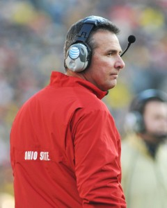

After watching the two semifinal games of the inaugural College Football Playoff on New Year’s Day, I felt robbed. One of the two games was a [blowout](https://www.youtube.com/watch?v=7cias2waLdc), and the other was an amazing football game from start to finish. I enjoyed both games immensely, but I felt cheated when I remembered that this was the first time we’ve ever had a playoff system in college football.

Believe it or not, there was a time when [the Southeastern Conference wasn’t expected to be in the championship](http://www.thehighscreen.com/2014/10/sick-of-sec-bias-me-too/) every season. The first time I remember anyone mentioning a playoff system was in 2004. USC embarrassed Oklahoma in the BCS National Championship Game, 55-19, and an undefeated Auburn team was left out despite navigating through a difficult SEC schedule unblemished. Between 1998 and 2005, the SEC only won two BCS national titles, while teams from every other major conference won at least one title.

Auburn wasn’t the only unbeaten team left out in 2004. The Utah Utes were also 11-0, and while they probably wouldn’t have made the playoffs anyway due to a weak schedule, they would’ve at least been considered for the fourth spot. The Utes had Alex Smith at quarterback, and Smith benefitted greatly from his head coach’s mastermind spread offense.

Smith’s coach that year was, of course, Urban Meyer.

\[caption id="attachment\_2278" align="alignright" width="240"\] Urban Meyer. ([Photo provided by Adam Glanzman](https://www.flickr.com/photos/adamglanzman/11144230674/))\[/caption\]

Meyer’s journey to becoming the best head coach in college football started at Bowling Green in 2001. He was 17-6 in two years with the Falcons before accepting the Utah job. After finishing 22-2 at Utah, Meyer was hired by Jeremy Foley to replace Ron Zook at the University of Florida.

Florida’s football program became nationally prominent in the '90s under the direction of head coach Steve Spurrier. Spurrier’s Fun ‘n’ Gun offense was revolutionary in the SEC, and the Gators won six conference titles and one national championship. After the Spurrier era ended in 2001, defensive minded head coach Ron Zook took over. [The results weren’t great](http://fireronzook.blogspot.com).

Meyer was in charge of revitalizing the Gators in 2005, and he had instant success in Gainesville. The Gators were 9-3 in 2005, and they returned a plethora of starters in 2006. Florida also added a freshman quarterback by the name of Tim Tebow.

Chris Leak received the majority of the snaps at quarterback for Florida in 2006, but you could see the impact Tebow was going to make on Meyer’s offense. Meyer’s version of the spread utilizes mobile quarterbacks by running the read option. While the quarterback is almost always in the shotgun, it’s still primarily a run oriented scheme.

http://youtu.be/lGkqxqp6EIM

Florida finished the regular season 11-1 in 2006, and after winning a SEC title, they snuck into the BCS title game to play Ohio State. The Buckeyes had beaten Michigan, 42-39, in a memorable No. 1 vs. 2 matchup to end the regular season, but the Wolverines were left out in favor of the Gators. Despite being big underdogs, Florida embarrassed Ohio State, 41-14, in the BCS National Championship Game.

Meyer’s Gators took a step back in 2007, but his offense was better than ever. Tim Tebow won the Heisman trophy — [the first underclassman to ever win the award](http://sports.espn.go.com/ncf/news/story?id=3146714), something we take [for](https://www.youtube.com/watch?v=Ou68SK20Ne4) [granted](https://www.youtube.com/watch?v=eNTvq7MgKts) [now](https://www.youtube.com/watch?v=LbSvz43QVo4) — and although Florida finished the year 9-4, the pieces were in place for another title run in 2008.

https://www.youtube.com/watch?v=YP6OTF0SwP4

The 2008 version of Florida was probably Meyer’s best team, and although they lost to Ole Miss, they still managed to win the SEC East. Their opponent in the SEC title game was undefeated Alabama. Bama was in Year 2 of the Saban Era, and they were already back to being nationally relevant. Florida beat Alabama in the 2008 SEC title, and Meyer went on to win his second BCS national title. But the rise of Nick Saban’s program in Tuscaloosa soon became a problem for Meyer’s Gators.

2009 was basically a reversal of 2008 for Florida and Alabama. In 2009, the Gators went undefeated in the regular season. Tim Tebow was back for his senior season, but this version of the Gators was missing two important pieces from the 2008 team. First, Percy Harvin opted to enter the NFL Draft after the 2008 season. While Tebow received most of the accolades, Harvin was what elevated the offense. Harvin was a great receiver, and he could also challenge defenses on jet sweeps. His absence was very noticeable in 2009. I watched that Florida team play in person twice, and the offense never seemed to click.

Second, after the 2008 season, Meyer’s offense coordinator Dan Mullen left to take the head coaching job at Mississippi State. Mullen had worked with Meyer since they were at Bowling Green. While it was Meyer’s offense, Mullen was responsible for most of the play-calling. During Meyer’s last two seasons in Gainesville, his offenses weren’t nearly as potent without Mullen. It wasn’t until Meyer took the Ohio State job that he was finally able to recalibrate his offense back into a dominant force again.

Shortly after Alabama manhandled Florida, 32-13, in the 2009 SEC Championship Game, Meyer checked into a Gainesville hospital with chest pains. While his health didn’t keep him sidelined for long, it had a noticeable impact on him throughout the next year. He coached at Florida for one more season — the Gators went 8-5 in 2010, which was Meyer’s worst season as a head coach — and then Meyer resigned to spend more time with his family and to rest.

https://www.youtube.com/watch?v=Dvj4Ilhv0Os

When Meyer resurfaced a year later as the top candidate for the Ohio State job, it didn’t come as a surprise to many. He was the perfect candidate for the job, but there were some concerns about his health and how it would impact him at another high profile job. But the Ohio State job made sense for Meyer for a number of reasons. For starters, he’s from Toledo. The Big 10 was down at the time, and Ohio State had talent in place to make a resurgence to the top of the conference standings.

It didn’t take long for Meyer to have success in Columbus. The Buckeyes went undefeated in his first year, but they missed an opportunity to play for a national title due to a one-year [bowl ban](http://newsfeed.time.com/2011/12/20/ohio-state-hit-with-one-year-bowl-ban-over-bribery-scandal/). Had they been eligible, they likely would’ve played undefeated Notre Dame, and Alabama would’ve been left out. (Sidebar: Can you imagine that Alabama team being left out in favor of Ohio State and Notre Dame? The state of Alabama might not have survived.)

Last year, the Buckeyes rolled through the Big 10 yet again, and Urban Meyer was 24-0 in Columbus in two regular seasons. All Ohio State had to do was defeat Michigan State in the Big 10 title game, and the Buckeyes would’ve played for a national championship. Alas, Ohio State lost, which allowed a one-loss Auburn team to make the championship game.

Before the 2014 season even started, the Buckeyes lost quarterback Braxton Miller for the season — the perfect fit for Meyer’s spread offense. While he struggled with accuracy in the passing game, he was lethal in the read option. Miller’s replacement, J.T. Barrett, began the season slowly. Ohio State lost 35-21 at home against lowly Virginia Tech, and [I thought the Buckeyes’ chances were over in September](http://www.thehighscreen.com/2014/09/college-football-week-three-preview/).

After the loss, Barrett began to improve each game. By the time Ohio State throttled Michigan State on the road, Barrett’s name was being mentioned as a Heisman candidate. Like Miller and Tebow, Barrett had a strong grasp of the read options principles, and he became increasingly more accurate throwing the ball as the season progressed. More importantly for Ohio State, the defense began to play much better as well. Meyer had recruited extremely well the past two years, and his young roster improved tremendously by the end of the year.

Unfortunately, Barrett broke his ankle in the regular season finale against Michigan. Taking his place was third-stringer Cardale Jones. The concern swelled to an all-time high outside Columbus. How could this team win the conference championship behind a third-string QB? Many wondered aloud if the College Football Playoff committee, in their first, precedent setting season, would kick Ohio State out of the Top 4 in favor of teams with a better chance to compete for the ultimate prize.

But Meyer's club ended any concern over if they could hang around in January. In the Big 10 Championship Game against Wisconsin, Jones and the Buckeyes obliterated the Badgers, 59-0. Their performance was so impressive that they jumped TCU and Baylor and reached the playoffs.

Of course, not many gave Ohio State a chance against mighty Alabama in the Sugar Bowl. After all, Saban had forced Meyer out of the SEC, and the SEC was vastly superior to the Big 10. When ‘Bama led 21-6 in the second quarter, I almost turned the TV off. I had seen this movie before. I watched the Alabama-Florida game in 2009.

What happened at the end of the first half and for the rest of the game was the most surprising thing I’ve seen in college football all year. The Buckeyes rattled off 28 straight points, and the Crimson Tide had no answer for Cardale Jones or Evan Spencer. The final score of 42-35 was a bit deceiving because the game really wasn’t that close. Meyer’s Buckeyes dominated the line of scrimmage on both sides of the ball. They gashed Alabama on the ground, lit them up through the air, and held them in check defensively.

This season has been Urban Meyer’s finest coaching job yet, and that’s saying something given his overall career record of 141-26 (not a typo). If God had told me before the season that Ohio State would be playing for a national title despite losing to Virginia Tech by 14 AND losing two quarterbacks in the regular season, I probably would’ve stopped watching football.

Meyer took back the “Best Coach in College Football” belt from Nick Saban on New Year’s Day. Even if the Buckeyes lose to Oregon – and they should – what Meyer has accomplished this season will be remembered as one of the best coaching jobs in college football history.

The scariest part of Meyer’s success this season? Ohio State will be even better next year. This train is only getting started.
