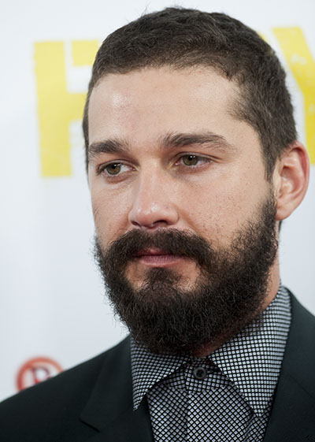

https://www.youtube.com/watch?v=KWZGAExj-es

Over the past weekend, I have had the privilege of watching the music video for Sia’s "Elastic Heart" more times than I would like to admit. Watching the video has been a privilege, nonetheless. 

It opens on a dome cage. Two figures, yet unknown to us, stand at opposite sides, facing one another from a distance. There is much to be said about cages, but not much that hasn't been said before. I could tell you that cages restrict movement, but you, of course, already know this. Your dog knows this; his howls and his pathetic, adorable, utter reluctance to be put in a cage inform us that a cage is an awful place to be. However, after his howls cease, after he halts the crescendo of his clawing at the bars of his cage, there is peace, and sleep. 

I’m not sure how much we should factor in [Shia Labeouf’s recent history](http://www.thehighscreen.com/2014/10/will-the-real-shia-labeouf-please-stand-up/) to our interpretation of Sia’s music video, but his presence is intentional. The presence of Maddie Ziegler, the young dance phenomenon, is intentional as well. A former child star, Shia LaBeouf is now becoming an accomplished adult actor. Maddie Ziegler is a child star of the present moment. 

In the same way that our past and present as individuals are antagonistic to one another, Shia LaBeouf and Maddie Ziegler are antagonistic to one another; as metaphoric figures, at least. Looking into her own future as both an individual and a child star, Maddie must feel a foreboding that her individual path and her career will lead her to similar pitfalls that have consumed many of the child actors that have gone before her. Through Maddie, Shia LaBeouf is perhaps reminded of his youth, when his public image was celebrated without being scorned; when he was innocent, and free from mistakes that carried with them harsh repercussions. As a child, Shia was, and Maddie is, unfamiliar with the nightmarish idea that the mind and the world are cages confined within one another.

When I first saw the video, I thought to myself, “Why are Shia LaBeouf and Maddie Ziegler fighting each other?” I considered, briefly, that the answer might be presented as a simple deferral to a primitive territorial war. Isn’t this primitive instinct what excites the allure of a cage match? This space is mine, not yours, and I’m going to prove that to you. Grrr. I thought of the beta fish that I recently bought, and how the territorial instinct is so hyper-realized in this species of animal that if I were to put two together in the same bowl, they would destroy one another. 

However, Shia and Maddie are not fighting each other. Instead, they are engaged in what appears to be a supremely dramatic dance off. But, there is something about the way they both dance that lends itself to being called a fight.

\[caption id="attachment\_2297" align="alignright" width="400"\] (Photo by Dave J Hogan/Getty Images for BFI)\[/caption\]

This is not as true for Shia as it is for Maddie. Shia seems to try to communicate with Maddie. Maddie, however, defends herself from what Shia might share with her about his experience of the world. I believe that this strikes at the heart of what Sia’s video is expressing. Maddie does not want to become what Shia has become. She believes that avoiding him will protect her from his fate. She is, after all, lithe enough to still weave in and out of her cage. Her youth prevents her from seeing what she is up against. 

The first time that Maddie releases herself from the cage, she reveals to Shia several of her different faces. It seems as if she is taunting him. And she might be, but Shia’s outrage is not the result of being taunted by her, but of being shown by Maddie the various projections of herself in the future that she naively plans to become. Then, Maddie returns to Shia in the cage, and the inversion of their bodies together allows Shia to see the cage (the world) as he saw it when he was Maddie’s age. This is a reconciliation. In Shia’s arms, Maddie removes each of Shia’s faces: the bright-eyed Louis Stevens, the cocky Mutt Williams, the raging madman, and finally, the perplexed. Maddie acknowledges these with a deep sigh. Not yet realizing the reality of their inevitable doom as human beings, Maddie leads Shia to the edge of the cage where she escapes from, yet again, but where flight is not an option to Shia. Maddie stays with him long after Shia has released his grip on her. She has realized, it seems, that there is no where for her to go, either. Et ego in arcadia.

Postscript: I want to acknowledge the accusations against Sia’s "Elastic Heart" video as depicting pedophilia. I have only seen the headlines of these accusations because I will not give them the time it takes to follow their hyperlinks. Simply stated: An interpretation of this video as pedophilia is a superficial reading of it. If anything, it indicates the taboo we have imposed on our own bodies. There is nothing sexual about Shia LaBeouf or Maddie Ziegler’s bodies, except for the fact that they are bodies. This taboo against our own bodies is what gives power to metaphors that equate our minds with cages. 

Post-postscript: To be fair, though, when I first saw Shia and Maddie half-naked together, I thought it was kind of weird. Okay, okay, I thought that it resembled pedophilia. But then, in the five and a half minutes of the video, I remembered that it is art, and I remembered that I’m a grownup, not a gossip columnist. 

Post-post-postscript: ^That was a figurative shot at gossip columnists. It was not a literal assault.
