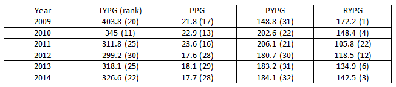
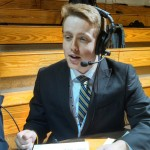
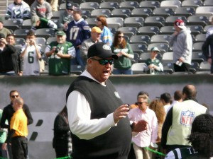

_On Monday, the [Buffalo Bills hired Rex Ryan as their next head coac](http://www.usatoday.com/story/sports/nfl/bills/2015/01/11/rex-ryan-bills-head-coach/21590405/)h. That leaves the New York Jets, who let Ryan go after [six up-and-down seasons under the helm and in the headlines](http://grantland.com/features/rexs-last-stand/), without a head coach for next season. Funny enough, the Jets, who play the Bills twice-a-year, may be hiring former Bills head coach Doug Marrone, who opted out of his contract in Buffalo in December. What does this all mean? Well, for starters, the AFC East is going to be much-see-TV next season. For more on the apparent coaching carousel in the North East, The High Screen staff offers their take._

* * *

Rex Ryan trip up the Thruway actually improves his situation dramatically on paper. Let’s review: a smaller media magnifying glass? Check. [A defensive line that’s even better](http://www.boston.com/sports/football/patriots/extra_points/2014/10/bill_belichick_buffalo_bills_defensive_line_is_har.html) than the Jets elite unit of recent years? Check. A heady secondary? Yup. An elite wide receiver?

https://www.youtube.com/watch?v=Kj1k\_uIByio

You bet. There are most certainly areas of need that must be addressed in the offseason for the Bills, but it’s easy to see why Ryan jumped at the chance to begin the difficult process of deciding which wings are the Queen’s City’s best. That and, you know, establishing consecutive winning seasons, unseating the Patriots, winning a Superbowl, etc.

Look, I think Rex can work wonders with what is already a tremendous defense. The Bills have a front seven that will only be bolstered by the return of players like [Kiko Alonso](http://www.buffalobills.com/news/article-1/Kiko-Alonso-progressing-but-a-lot-of-ground-to-cover/f8091c76-7e2e-4a61-987b-3e133075026f) next season. I don’t doubt that the secondary will only benefit from employing more aggressive schemes, but where the Bills have struggled is on offense. Rex doesn’t do offense.

Not a pretty sight. To be fair, the running game was always a primary focus of a Ryan-led Jets offense. Everything else is… frightening. Now let’s not pin all the blame for the Jets six-year offensive drought solely on Rex. Woody Johnson and Tannenbaum/Idzik made the sorry decisions of hiring coordinators and personnel that employed Tim Tebow and the wildcat. It’s not like the Jets were entirely devoid of offensive talent either. At one point, Mark Sanchez looked like he was well on his way to becoming the franchise quarterback the Jets traded up to grab in the ’09 draft. Santonio Holmes did actually play up to the $50 million plus the Jets put in his contract in its early stages. The offensive line was borderline elite and the Jets were only a skill player or two away from transforming into a juggernaut.

Then came the Super Bowl guarantee, Santonio Holmes’ professional meltdown, the butt fumble, Tim Tebow and Tony Sporano, and [the headband](http://thenypost.files.wordpress.com/2013/09/sanchez9.jpg). We know the rest of the story.

So where does that leave the Bills? In desperate need of a creative and savvy offensive coordinator. It appears they feel the answer is [49ers offensive coordinator Greg Roman](http://profootballtalk.nbcsports.com/2015/01/11/report-greg-roman-expected-to-join-rex-ryan-in-buffalo). Forgive me if I’m not doing cartwheels. Roman oversaw the noticeable regression of Colin Kaepernick this season as the 49ers “loaded” offense sputtered its way to an 8-8 record. The passing offense ranked 30th in the league in 2014, even with an arsenal of Michael Crabtree, Anquan Boldin, Stevie Johnson and Vernon Davis, who was terribly under-utilized in 2014. Roman and his compatriots shouldn’t get the full brunt of the blame, but it certainly doesn’t fill me with hope looking at a Buffalo roster with less offensive playmakers than San Francisco had a year ago, and a better quarterback to boot.

Speaking of which, who _is_ playing QB for Buffalo next season? Are they going to have an option that is any better than peak-Sanchez, or even Eagles-Sanchez? EJ Manuel just doesn’t seem to be the right guy. Buffalo’s would-be first round pick was traded last year in order to land Watkins. That essentially eliminates any chance the Bills have at the first two tiers of quarterbacks in this year’s draft. If Brett Hundley (UCLA) or Garrett Grayson (Colorado State) are available to them in the second round, they need to run to the podium. Both are raw, but with the right set up around them, could be polished into gems.

C.J. Spiller's body has failed him in recent years, and Fred Jackson is officially "Fred Jackson, the NFL's oldest running back." Finding a feature back to pair with Spiller like T.J. Yeldon (Alabama ) or Melvin Gordon (Wisconsin), in the event they fall to the second round, could also go a long way in reducing the workload and expectations of any rookie quarterback the Bills may acquire. Scott Chandler and receivers like Robert Woods and Chris Hogan provide any potential quarterback with great tools, but finding one may be the hardest task facing any NFL GM in 2015.

It's with this in mind that I hesitate in giving Buffalo my vote of confidence in 2015, given Ryan and Roman’s recent track record with quarterback development. There’s a defense in place to minimize mistakes made by whichever signal caller they give the starting job too, and even a solid set of skill players to limit the number of mistakes they will inevitably make, but the case can be made that the circumstances at quarterback in Western New York next season are oddly similar to that of Jets (Sanchez, Geno Smith) and San Francisco (Kaepernick) — if not painfully worse.

The bottom line is this: the Bills will be saved by one thing: a decent quarterback. Ryan and Roman can conquer a lot of their demons and critics if they can avoid past mistakes and create an environment that lends itself to the development of a young quarterback. The rest of the team is in a good place, but until the Bills draft a franchise signal-caller, Lombardi himself could stroll the sideline and this team would still be perpetually stuck on the outside of the postseason looking in.

**Tim Mullhaupt** 

 

 

 

* * *

 

Part of the curriculum for a journalism degree at Ole Miss requires foreign language classes. I took two Spanish classes and [didn't do so well](https://www.youtube.com/watch?v=uOpjYE-iPnY). I was relieved, to say the least, when those two introduction classes were finished.

As a Patriots fan, I felt the exact same way when the Jets fired Rex Ryan.

After I took the first two Spanish classes, however, my adviser told me I had to take two more advanced level Spanish courses. I wasn't really thrilled about that nuisance coming back into my life, and the uphill climb it meant for me to finish my degree sometime this century.

That's how I feel about the Buffalo Bills hiring Rex Ryan.

\[caption id="attachment\_2309" align="alignright" width="300"\] Rex Ryan. ([Photo provided by Marianne O'Leary](http://www.flickr.com/photos/marianne_oleary/6274195289/in/photolist-ayqTER-a6xcAH-fPTiRD-6PUycy-86Cxnq-ayqUrD-aAuo79-9JR2j-4CnsoB-iJLN1B-aWEDZ-37BfK-jJxxak-jJwxKH-jJyVCW-ar53qG-jJxjZZ-jJyNpY-jJzvDJ-jJyQQu))\[/caption\]

I don't like Rex Ryan being "back" in the AFC East. The Jets were 4-12 this year, and they probably had less talent than almost anyone in the league. Yet somehow they lost to the Patriots twice by a combined three points, and they probably should've won both games. The Jets, specifically on defense, played hard every snap for Ryan. Ryan's defensive schemes gave Brady and the Patriots trouble almost every time they met.

Ryan's teams in Buffalo are going to be even better defensively. The Bills were nasty on that side this year, and that was under the tutelage of none other than Jim Schwartz. (Funny side note: Schwartz is a defensive guy, yet his Lions teams were terrible on defense. Jim Caldwell is an offensive guy, and the Lions are a bad offensive team and great on defense. Go figure. [Detroit vs. Everybody](https://www.youtube.com/watch?v=vjUgJ6Cw5PU).)

The problem for Ryan in Buffalo will be the same as it was in New York. He has no quarterback, and the offensive line is suspect at best. He does have a solid collection of running backs, and the receiving corps, led by Watkins and his freakish hand-eye coordination, is better than anything he had in New York.

But Buffalo is still going to struggle to score. Manuel probably isn't the answer at QB, and the Bills don't have a first round pick this year.

I don't think Ryan's arrival in Buffalo signifies a changing of the guard in the AFC East, but it keeps pressure on New England. I'm convinced Rex took this job just so he could face the Pats and the Jets four times a year. The Jets are going to be awful, and the Bills will give the Pats fits every game.

The biggest losers though? That's Miami. The Dolphins are talented, but they decided to keep Joe Philbin for another year. They're talented enough to finish second in the East and make the playoffs, but I think Ryan will have Buffalo in that spot the next few years. And if he can ever find a quarterback — big if, but still — then the Bills will be able to challenge New England for the AFC East.

 ** Cole Frederick**

 

 

 

* * *

For the past fourteen NFL seasons, the Buffalo Bills have employed Greg Williams, Mike Mularkey, Dick Jauron, Perry Fewell (on an interim basis), Chan Gailey and Doug Marrone as head coaches.

In addition to each hire failing to make a playoff appearance, each brought to the table a bland, uninteresting aura to the organization. Jauron was impossibly dull; Chan was folksy and caring, but uninspiring. It wasn’t until Marrone was hired that the trend of nice guys in over their heads was broken with a guy who was both incompetent and unlikable.

I’m not sure Rex Ryan will work out in Buffalo. I’m not even sure he’s a great coach. I am sure, however, [that he will be interesting](http://ftw.usatoday.com/2014/03/rex-ryan-reveals-the-fate-of-his-mark-sanchez-tattoo).

When there’s a big-time, fun, nationally televised football or hockey game on, I’ll often see tweets from Bills and Sabres fans saying something to the effect of “it’s like watching a completely different sport.” They’re right.

It’s not just that the Bills haven’t won, it’s how irrelevant they’ve been this century. Aside from the Terrell Owens experiment, the team went years without employing a marquee player. They finished 7-9 three times in a row then 6-10 three years in a row. They once fielded a team coached by Jauron with Trent Edwards at quarterback and Lee Evans as the top… I’m sorry. I fell asleep in the middle of that sentence.

Then things began to change a little. Terry Pegula bought the Sabres and started throwing around some money. The Bills signed Mario Williams and drafted Marcel Dareus third overall. The Sabres tore apart teams that weren’t good enough to compete in the playoffs but were too good to net a solid draft pick. They stockpiled the best prospect pool in hockey. The Bills hired Jim Schwartz and fielded one of the NFL’s best defenses. Now this Rex hire…

Again, I’m not sure Ryan will be a great fit. No one is. The Bills still don’t have a quarterback or a first-round pick. But a Buffalo fan can’t help but daydream of a fall day where the Ryan and Bills defense dominates some over-matched offense in the afternoon [while Connor McDavid and friends take to the First Niagara Center at night.](http://www.thehighscreen.com/2015/01/dishonor-for-connor-setting-the-odds-at-the-halfway-mark-for-landing-mcdavid/)

Some things haven’t changed in Buffalo – [we’re still relying on hope](http://www.thehighscreen.com/2014/09/buffalo-bills-new-owner/). The difference is now our dreams don’t seem so far-fetched.

**Taylor Nigrelli **
