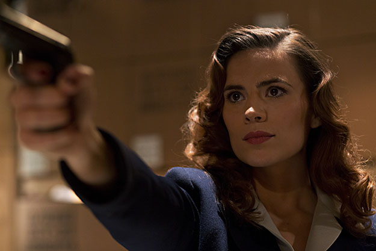

\[caption id="attachment\_2355" align="aligncenter" width="625"\] (Photo provided by Marvel-Image.net)\[/caption\]

_Warning spoilers below_

Marvel’s Agent Carter is presenting itself in a strange fashion. Starting out with a [two-hour premiere](http://www.thehighscreen.com/2015/01/marvels-agent-carter-adds-another-strong-female-lead-abc-legacy/), the show came out with a bang and threw us right into Peggy Carter’s day to day worries. But the two week break is coming as a surprise. Is this going to be a miniseries or do the writers have a long term plan in the works? These are valuable questions but honestly they don’t know the answers themselves.

Peggy brought another solid hour of intrigue this week and the implications of this episode may be enough to build a decent amount of suspense to justify this two weak break. The episode gave us a deeper connection to the rest of Peggy’s supporting cast and may have uncovered a few mysteries only to supply a few more.

Peggy’s office is one of the most interesting aspects of this show. She’s still being deferred to her desk hugging role but we’re seeing at what personal cost. Chief Dooley (Shea Whigham) seems almost obsessed with Howard Stark at this point. He’s got a team of credible agents headed by the poster boy for '40s police work, Agent Jack Thompson (Chad Michael Murray, of course). Agent Thompson seems almost too good to be true. He’s got contacts in Moscow, works the phones almost as well as he interrogates suspects and has an attitude to match his talents.

Daniel Sousa, who was crippled during the war, is probably the smartest person in the S.S.R., and he’s probably one of the only people that can begin to understand Agent Carter’s plight. He’s constantly reminded of his leg and is one of the few people who treats Peggy with respect from the start. He’s also a strong candidate for the mystery of Peggy’s future husband. Agent Kzeminski even probes Sousa for information.

This episode focuses on Edwin Jarvis. Jarvis has been a great source of wit and his scenes with Peggy have been some of the best moments of the show. “Time and Tide” puts Jarvis in the hot seat and we’re allowed to learn about his character and the constant shadow that is Howard Stark. Agent Thompson’s interrogation brings to light allegations of treason against Jarvis from his time in the military. Before Thompson could dig further, Peggy strategically blunders which forces the S.S. R. to release Jarvis. What’s revealed later is that Jarvis’ wife, Anna, was a Jewish woman during the war and Jarvis fabricated paperwork to bring her to safety and was charged with treason when his supervising officer, a general, found out. Howard Stark, who was familiar with this particular general, heard this story and used his resources to secure Jarvis’ safety and soon employed him.

This is a moment that almost demands a pause. There’s something about the Stark family that seems true from tree to apple. They’re incredibly kind but somehow manage to surprise you which every instance of it. It’s with this information we can understand Jarvis’ devotion to the Stark family which we know spans decades and generations.

The moment of the episode though was the ruthless murder of Agent Kzeminski and the only witness of Peggy and Jarvis’ raid of a boat that was harboring some of the stolen Stark technology. It was planned, calculated and executed precision. What’s even more disturbing is that this mysterious figure was watching Peggy and Jarvis the whole time. The result of this may not end up hurting Peggy in the long run. Chief Dooley’s resolve has hardened because now Stark has taken one of his own and we see an incredibly sincere side of the Chief. He cares about his agents a great deal and it’ll be interesting to see where this takes his investigation since he’s ready to push things into a new gear.

Even if the writers of Agent Carter aren’t sure where this series is going, it’s clear that they’re using a minimalist approach and resisting the urge to produce 22 episodes or even 16. The two week break will allow us to break down some of the things we know are coming and with the quality of these first three episodes we’re sure to be in for a treat come January 27th.
