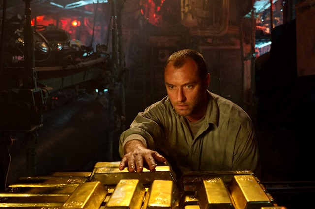
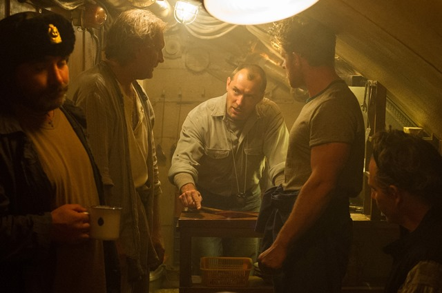

\[caption id="attachment\_2399" align="aligncenter" width="640"\] Jude Law is submarine captain, Robinson. (Photo provided by Focus Features)\[/caption\]

## Underlying themes of money, redemption and the politics of blue-collar jobs are present in the seemingly simple submarine thriller, _Black Sea._

Academy Award winning director Kevin Macdonald (_The Last King of Scotland_) always wanted to make a submarine movie. _Black Sea, _out this weekend, is the result of collaborations with playwright and screenwriter Dennis Kelly as well as actor Jude Law.

“He \[Dennis Kelly\] came up with a script, and then he’d written this wonderful character of Robinson and I sent it to Jude,” explained Macdonald this past week. “Jude and I talked about it over quite a long period, a few weeks, a few months and it was a rare experience for me to sort off really work with an actor to create the character. The character came out of our discussions and out of rehearsals and various versions of the script.”

The film follows Robinson (Law), an ex-navy submarine captain laid off from the company he has worked at for more than 11 years. Alone and desperate — Robinson’s job cost him his wife and child — he agrees to lead a hunt for a German U-boat full of World War II gold lost in the Black Sea. A half-Russian, half British crew of misfits, with a sole American banker (working as the face of the mysterious backer of the trip), embarks in a vintage Russian submarine.

For Law, the attraction to playing Robinson came from the film's themes of hardship and struggle that are ever-present today.

“We all sacrifice our time away from family and the place we often want to be to do the job that we need to support the family that we want to be with,” said Law. “Equally, I am sure we all know people who have incredible skill sets that are no longer relevant.”

There is a tendency in cinema to turn the sea into a fetish of freedom and adventure. In _Black Sea_, the threat of death hangs in the air like a mist — the sea is intimidating, terrible, real. Claustrophobia is constant; the panic of close quarters was something that Macdonald set out to explore and even filmed the first couple of weeks in an actual submarine. With the struggle between life and death all around them, the diverse cast of characters crammed into such a small space becomes a frenzy of cultural tensions and frustrations.

Led by Blackie (Konstantin Khabenskiy), the Russian cast also includes young and reserved Morozov (Grigory Dobrygin), the ears of the submarine, Baba (sergey Veksler), Levchenko (Sergey Kolesnikov) and Zaytsev (Sergey Puskepalis). The British crew includes the deranged Fraser (Ben Mendelsohn), Peters (David Threlfall), Reynolds (Michael Smiley) and the youngest member Tobin (newcomer Bobby Schofield). Then there is Daniels (Scoot McNairy), forced by his employer to accompany the group and keep an eye out on the search. Daniels ends up living up to all of the expectations and stereotypes of money hungry bankers. He serves as a physical reminder to these men of the unfair treatment they have received in the hands of the powerful.

On the surface level, these men are all similar outcasts (and all white) struggling to blend in a modern world but their nationality and background becomes a source of conflict. A few of the Russians barely speak English, making communication with the English men difficult in a place where one wrong dial turn can lead to catastrophe. There is a lack of trust and cultural division among these men that ultimately leads them all to fend for themselves.

“The idea of having a half Russian cast was very appealing to me because obviously these guys are old enough all to have been in the navy during the cold war and they would have been in submarines sort of spying on each other, listening to each other and now here they are having to collaborate,” Macdonald said.

 

\[caption id="attachment\_2401" align="aligncenter" width="640"\] (Photo provided by Focus Features)\[/caption\]

_Black Sea_ depicts the basic physical effects of greed and money as these men come to understand that less of them means more money. Death takes over and the submarine becomes volatile, accentuating the claustrophobia and tension of being trapped at the bottom of the ocean. _Black Sea_ features a Law that we have never seen before. Macdonald admits to being initially skeptical of casting Law due to his image of the romantic type lead.

“He convinced me just by being passionate about it and dedicating a huge part of his life for several months to it,” Macdonald said. “He went to the gym and put on this very sailor’s physique, shaved his head… put on this accent, which is a very hard Aberdeen, very specific Scottish accent, and it’s that total immersion that makes you as a the director feel, 'Wow, this is someone you want to work with.'”

As Robinson, Law is not only the leader of his crew but he is responsible for keeping them together and ensuring they don’t destroy the mission. Law is almost unrecognizable — rough, desperate, existential. He finds hope in Tobin, a first timer to submarines who he takes under his wings as a representation of his lost family.

Law says working with Macdonald was about the opportunity to collaborate in adding the small details of Robinson’s character.

“There are many things to this \[movie\] that layer itself just under the fact that it’s also a fantastic thriller and a heist movie,” Law said. “It’s very easy when you’re an actor and you are presented with a really great script, and the right great part, and there were wonderful characters in this drama and really it’s just like filling in the gaps and you can make those leaps.”

Law relates to the notion of redemption after remembering sitting in front of a headmaster who told him that his dreams of being an actor were foolish.

“That sense of someone trying to beat you down, beat down your dreams is quite a vivid memory,” said Law.

Betrayal and escalating suspense mark _Black Sea_ a submarine movie but it is the ongoing commentary on underdogs being taken advantage off that resonates off the screen. Above all else, Macdonald’s main purpose was to make a film that interests him.

“This film is not a film that’s going to compete with Interstellar; it’s not a huge film,” said Macdonald, who believes that submarine films are just realistic space films. “It’s a small old-fashioned B-movie with action and suspense. It’s character based and I think there should be room for that kind of movie as well.”
