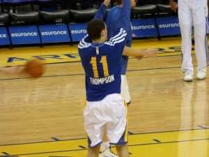

_As the NBA quickly approaches the All-Star break and trade deadline, here's a look at where all 30 teams stand._

\[caption id="attachment\_1617" align="alignleft" width="300"\] Klay Thompson. (Photo taken by Matthew Addie)\[/caption\]

**30\. Sixers **(8-37)

**29\. Lakers **(12-33): It's probably fair to assume Kobe Bryant will add no more rings to his legacy and fall one short of Michael Jordan. Retirement may be his best option after suffering [another season-ending injury.](http://espn.go.com/los-angeles/nba/story/_/id/12217628/kobe-bryant-los-angeles-lakers-season-torn-rotator-cuff)

**28\. T'Wolves **(7-37): Minnesota may be starting over, but months removed from the Kevin Love trade, it looks like [they have walked away with a gem.](http://grantland.com/the-triangle/andrew-wiggins-kevin-love-timberwolves-rookies/)

**27\. Knicks **(8-37): Carmelo Anthony is rightfully demonstrating patience during this difficult season. Melo spent his spare time [scouting 2015's top draftee Jahlil Okafor](http://nypost.com/2015/01/25/carmelo-raves-about-okafor-whos-big-fan-of-melo/) the other day. Good for him!

**26\. Magic **(15-33)

**25\. Pacers **(16-30)

**24\. Celtics **(16-27): They are 7-13 since trading Rajon Rondo, which speaks to two things: the strong coaching of Brad Stevens and valiant effort from their young core of players. Oh, and Marcus Smart.

https://www.youtube.com/watch?v=Q6Z5-\_G6H3M

**23\. Jazz **(16-29)

**22\. Nets **(18-26): [This whole team is a disaster.](http://www.bloomberg.com/news/2015-01-13/prokhorov-said-to-explore-sale-of-brooklyn-nets-basketball-team.html) Deron Williams, Joe Johnson and Brook Lopez's contracts add up to over $58 million this season. This overpaid mess of a team is mostly unwatchable.

**21\. Kings **(16-27): DeMarcus Cousins (24.2 points, 12.6 rebounds, 1.6 blocks, 1.4 steals) puts up superstar numbers but [isn't guaranteed a spot on the All-Star team](http://www.nba.com/kings/Cousins-should-be-an-all-star).  That speaks to the rugged competition in the West.

**20\. Nuggets **(18-27): They may be the next team to start from scratch. I don't see why not — they're stuck in mediocrity, they have valuable trade assets and could continue to acquire first round picks.

**19\. Bucks **(22-22): They are largely expected to dip below .500 and stay there at some point. The Cavs have passed them and teams such as Brooklyn, Charlotte, Detroit and Miami could give them trouble securing a playoff spot. Here's to hoping [we figure out what happened to LARRY SANDERS!](http://bloguin.com/crossoverchronicles/2015-articles/seen-last-larry-sanders.html).

**18\. Hornets **(19-26): Terrible news came along right after Al Jefferson's return: Kemba Walker has a torn meniscus (same injury as Gilbert Arenas and Brandon Roy) and [will need to have surgery](http://espn.go.com/nba/story/_/id/12231424/kemba-walker-charlotte-hornets-torn-lateral-meniscus-left-knee), keeping him out a minimum of six weeks. One of the strongest defenses in the league has been dealing with injuries and setbacks all season — not to mention a disappointing few months from Lance Stephenson.

**17\. Pistons **(17-28): Brandon Jennings was playing the [best basketball of his career](https://www.youtube.com/watch?v=Klkqb4tGw4c) before being diagnosed with a torn achilles. He averaged more than 20 points and almost seven assists with just 2.1 turnovers over the last month. Detroit's fan-base is hopeful Jennings will return to his previous form next season.

**16\. Heat **(20-24)

**15\. Pelicans **(24-21): Anthony Davis leads the league in PER with a 31.3 rating.  The next player, Kevin Durant, is 2.6 points behind Davis. Not to mention the Pelicans and Thunder are fighting with Phoenix for the final playoff spot in the West. [What's that Davis?](http://i0.wp.com/espngrantland.files.wordpress.com/2015/01/davis-screaming.gif) Oh yeah, Davis is hungry to make his first post-season debut this spring.

**14\. Suns **(26-20): They are only 2.5 games ahead of the Thunder. I say only because we all know how quickly [OKC can make a furious run](http://www.thehighscreen.com/2014/12/nba-west-expected-eight/). Phoenix's next five games: WSH, CHI, GST, MEM, POR. Jeez.

**13\. Thunder **(23-22): Something to keep an eye on: Russell Westbrook attempts three more shots per game than Durant and makes 0.4 fewer. OKC ranks 26th in assists per game and 27th in assists per field goal made.

**12\. Bulls **(29-17): The duo of Pau Gasol and Jimmy Butler has been Chicago's most dependable source of two-way value. Who would have expected those two to be more likely All-Star bets than Derrick Rose and Joakim Noah?

**11\. Cavaliers **(25-20)

**10\. Raptors **(29-15): Sometimes it can be tricky for a star player to immediately fit in after an extended period of absence. However, this is a [career first for DeMar DeRozan](http://news.nationalpost.com/2015/01/26/toronto-raptors-demar-derozan-looking-more-like-himself-after-injury-but-hes-not-there-yet/) and he's handling himself just fine. Toronto, however, does have a bit of work to do on the defensive end, where they have below-average much of the season.

**9\. Rockets **(31-14): We know about James Harden and Dwight Howard, but Trevor Ariza's up-and-down season has gone mostly unnoticed. Yes, he is a clear upgrade defensively over what they had a season ago, but his shooting woes are becoming a problem — he's 32.4 percent on 3PA compared to 40.7 percent last year in Washington.

**8\. Wizards **(30-15): John Wall (17.2 points, 10.2 assists, 2.0 steals) likely isn't going to win MVP but he's in the conversation at the very least. It is truly amazing to watch [how Wall uses his quickness and instincts to get every teammate involved](http://grantland.com/the-triangle/the-grantland-basketball-hour-zach-lowe-breaks-down-john-walls-secret-superpower/).

**7\. Spurs **(29-17): Finals MVP Kawhi Leonard's healthy return obviously [makes an immense difference (5-1 since return)](http://bloguin.com/crossoverchronicles/2015-articles/spurs-slipping-west-standings.html). In this year's conference, though, the Spurs can no longer sit out players without worrying about missing the playoffs.

**6\. Mavericks **(30-14): Rajon Rondo [has not been a spark plug](http://espn.go.com/dallas/nba/story/_/id/12227243/dallas-mavericks-coach-rick-carlisle-calls-rajon-rondo-benching-aberration) since arriving in Dallas. He's averaging only 7.2 assists, shooting under 42 percent from the field and connecting on _26 percent_ of his free throws. But the Mavs are markably better on the defensive end with their new floor general, which was likely their main goal.

**5\. Clippers **(30-14): They are one of the hottest teams in the league and could very well be looking at a seven-game winning streak with two beatable opponents (UTA, NOP) next in line.

**4\. Blazers **(32-13): There are many clutch players in this league but few show the combination of [skill, passion, and effort Damian Lillard plays with](http://www.sbnation.com/nba/2015/1/13/7536729/damian-lillard-mvp-stephen-curry). He has become a fan favorite across the country.

**3\. Grizzlies **(32-12): With enough perimeter production, Zach Randolph and Marc Gasol are capable of beating just about anyone. The Grizzlies are first in points in the paint per game but just 28th in threes per game — [they know who they are](http://espn.go.com/blog/truehoop/post/_/id/72068/grit-grind-and-something-much-more).

**2\. Hawks **(37-8): Mike Budenholzer's squad has been a 48-minute masterpiece. They should have three All-Stars in Al Horford, Paul Millsap and Jeff Teague. I'm still not ready to put them atop the league despite a 16-game winning streak.

**1\. Warriors **(36-6): It's now 100 percent safe to say Steve Kerr has a firm grip on this team. We can talk all day about Klay Thompson's record-setting quarter the other night.

https://www.youtube.com/watch?v=Wxjsz92v53M

However, I am most impressed by the variety of effective lineups Kerr is able to throw out there. This isn't just the NBA's best team, but the deepest and most versatile team.

