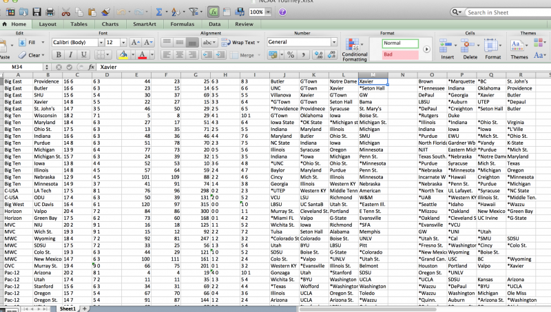

Apparently there was some kind of big football game this weekend. I didn't catch it because I was too busy watching Quinnipiac and Niagara play a double-overtime thriller, reminiscent of some of the greatest basketball games ever played (what's hyperbole?). Oh well, I guess a lot of people watched it.

I also heard it was the last one of the season, so it's probably time for all of you to start paying attention to college basketball now. After all, don't you deserve [Warren Buffet's $1 billion](http://espn.go.com/mens-college-basketball/story/_/id/10328805/1-billion-offered-perfect-tournament-bracket)? At the very least, it's time to unseat Karen from accounting from atop her throne as Office Pool Queen.

If you haven't been tuning in, you've missed a lot, but there's still time to catch up. And what better way than taking a look at my first full bracketology report for the season?

Even hardcore fans may have a hard time keeping up with 80+ teams who have a legitimate shot at the NCAA field, and while their play on the court certainly helps a team's NCAA fate, it can all fall down to a few puny numbers. Data like RPI, BPI, SOS, Top-50 Win's, Sub-100 losses — it's all insider hoopla that only nerds like me care about. But I've done the dirty work for you: just look at this beautiful excel sheet with all of those precious numbers — best win's, worst losses, it's all there.

Marvelous isn't it?

Don't ask me how, but I made sense of all those numbers to give you a fresh look at how the tournament selection committee might decide to form the bracket if it was done today. With still over a month of the season left to play out, this will all change a lot as we keep digging into the depths of conference play. Still for you newcomers, or even dedicated fans who just need a refresher, here is my first projected bracketology field of 2015.

EAST

MIDWEST

SOUTH

WEST

1\. Virginia

1\. Kentucky

1\. Duke

1\. Gonzaga

2\. Villanova

2\. Wisconsin

2\. Kansas

2\. Arizona

3\. Louisville

3\. Iowa State

3\. Notre Dame

3\. VCU

4\. Utah

4\. Maryland

4\. West Virginia

4\. North Carolina

5\. Butler

5\. Northern Iowa

5\. Georgetown

5\. Baylor

6\. Oklahoma

6\. Providence

6\. Indiana

6\. Wichita State

7\. SMU

7\. Stanford

7\. San Diego State

7\. Arkansas

8\. Cincinatti

8\. Xavier

8\. Ohio State

8\. Seton Hall

9\. Texas

9\. Dayton

9\. Georgia

9\. Michigan State

10\. Texas A&M

10\. LSU

10\. Iowa

10\. Oklahoma State

11\. Tennessee

11\. Miami (FL)

11\. St. John’s

11\. NC State

12\. SFA

12\. Ole Miss

12\. Wofford

12\. Colorado St.

13\. Iona

12\. Davidson

13\. Murray State

12\. GW

14\. Akron

13\. Georgia State

14\. William & Mary

13\. Valparaiso

15\. North Carolina Central

14\. Yale

15\. South Dakota State

14\. UC Davis

16\. Alabama State16. Saint Francis (NY)

15\. High Point16. Albany

16\. Bucknell16. Sacramento State

15\. Florida Gulf Coast16. New Mexico State

**Last 10 Teams In**

1. Davidson
2. George Washington
3. Ole Miss
4. Colorado State
5. Miami (FL)
6. North Carolina State
7. St. John’s
8. Tennessee
9. Oklahoma State
10. Iowa

**First Ten Teams Out**

1. Temple
2. Old Dominion
3. Ole Miss
4. UCLA
5. Florida
6. Syracuse
7. Illinois
8. Washington
9. Clemson
10. BYU

So there you have it. A couple of notes on things to look at.

**#1 Seeds in Flux**

Virginia and Kentucky are basically locks at this point, but Gonzaga and Duke still have a lot of work to do to secure those final two No. 1's. The Blue Devils have an impressive resume, but two losses to mediocre teams drag them down. The Bulldogs, meanwhile, suffer through a continuous slate of mediocrity in the WCC, messing with their computer numbers.

If either of them stumble any more, look for Arizona and Kansas (No. 1 in the RPI) to take their spots.

**Risers and Fallers**

A few teams on the rise include West Virginia, who is performing like it could be the second best team in the Big 12; Northern Iowa, who might be the best mid-major in the land after clubbing conference foe Wichita State; and Xavier, who was a bubble team a week ago but has aided its strong computer numbers with some quality wins in the Big East.

Teams on the decline at the moment include Utah and Maryland, two early season successes that suffered through recent questionable upset defeats; Texas, who some had predicted was a Final Four team before the year started but is currently only 3-5 in the Big 12; and Miami, who has played its way on to the bubble with back-to-back losses to non-NCAA Tournament teams.

**On the Bubble**

As you can see we have a pretty crowded bubble. The good news for the 10 teams I listed? One or two solid wins could point them in the right direction. The bad news? One or two bad losses could knock them way out. That goes just as much for the last teams in. Three of the first four include "mid-majors" — although the strength of the A-10 could be considered a high major depending on who you talk to — who have much more opportunity for trap games that would destroy their resume, and far less chances to pick up resume-defining wins in conference.

**Top 5 Games to Watch on 2/3**

Now that you know where everyone stands, maybe tonight is a good night to check out some quality college basketball. What else is on on a Tuesday night? Here are five of the biggest games to watch with NCAA Tournament implications.

**1\. #15 West Virginia vs. #21 Oklahoma**

**8:00, ESPN2**

There is only one matchup featuring ranked teams tonight and it comes out of one of the best leagues in the country: The Big 12. The aforementioned Mountaineers are 18-3 overall and riding a three game winning streak. Juwan Staten is one of the most explosive veteran players in the country, but doesn't get a lot of the same love that others do. The Sooners have tons of talent but are struggling a bit at just 5-4 in the Big 12. Lon Kruger's squad could really use a signature victory to cement their resume and tonight they have a prime opportunity to get it.

**2\. Georgia vs. #1 Kentucky**

**7:00, ESPNU**

Will tonight be the night that the Wildcats' dream of a perfect season finally ends? Probably not. The No. 1 team in the country is an 18-point favorite at home against Georgia.

But I wouldn't count out the Bulldogs completely. Georgia is a solid team (projected as a No. 9 seed in my bracketology). They've already had a couple of good wins over Seton Hall and Ole Miss, and Mark Fox will have his boys ready to go. Other than a home meeting late in the season against Arkansas, this might be the toughest test remaining for UK in their quest for a perfect regular season, so it's worth a watch.

**3\. Indiana vs. #5 Wisconsin**

**7:00, ESPN**

Bracketologists are divided on Indiana's place in the projected field, but at 16-6, Tom Crean deserves a lot of credit for getting this Hoosiers team to where they are. Considering the [controversial offseason](http://espnevansville.com/iu-basketball-controversy-indianpolis-star-columnist-gregg-doyle-discusses-whats-wrong-in-bloomington-audio/) that the Indiana program experienced, along with Crean's inability to consistently make deep tourney runs, many believed he was coaching for his job this season. If that was the case, it looks like he has bought himself at least another year in Bloomington.

As for tonight's game, Crean will have his hands full. Still playing without Traevon Jackson, Wisconsin hasn't missed a beat since their shocking loss at Rutgers. They struggled a bit with Michigan but still won in OT and sandwiched that between two wins over Iowa.

Indiana will have to find a way to limit Frank Kaminsky (17.6 ppg, 53% FG), one of the best players in the country if they want to pull off the road upset.

**4\. #9 Louisville vs. Miami (FL)**

**8:00, ESPN3**

Coming off the heels of a tremendous comeback win over North Carolina, Montrezl Harrell and Louisville look to keep up their momentum against Sheldon McClellan and Miami. Miami has shown that it's capable of hanging with anyone (OT loss @Virginia, win @Duke) but its resume is seriously lacking. The Hurricanes are barely in the RPI Top 50 (and below the top 50 in BPI) and other than Duke their best win is over NC State.

They barely avoided the first four in my projection but if the Canes don't start winning games soon they are in danger of falling out of the field altogether. But if they can score a win over Louisville, it will more than make up for their two head-scratching losses against Georgia Tech and Florida State.

As for the Cardinals, they're still in the mix for a No. 1 seed, but need to avoid landmines like this one if they want to have a legitimate chance.

**5\. St. John's vs. #22 Butler**

**7:00, FS1**

Chris Holtmann deserves some serious attention for Coach of the Year. The current Butler interim HC took over for Brandon Miller because of a health issue in October just weeks before the start of the season. All he has done since then was take a team projected to finish near the bottom of the Big East, and catapult them into a 16-6 record and a chance at a Top 5 or 6 seed in the NCAA Tournament.

The Bulldogs play typical Butler style: smart, disciplined, hard-nosed defense. They don't have the athletes that some teams do, but their style can still translate into wins top tier teams as we saw when they beat UNC in the Bahamas. They also have wins over Georgetown and Xavier already in league play.

Their opponents tonight is St. John's, another bubble team looking for a big win to boost its tournament chances. The Red Storm had a great non-confernece portion of their season, but have been swallowed up by the quality Big East thus far with only a 3-5 league record. They're still in today, but barely. Their two wins over Providence are saving them, but a win over a solid Butler team will make them feel much better.

Ross Bentley ([@ImRossBentley](https://twitter.com/ImRossBentley)) is a staff writer for The High Screen. He is a Graduate Sports Journalism student at Quinnipiac University and a graduate of SUNY Oswego.
