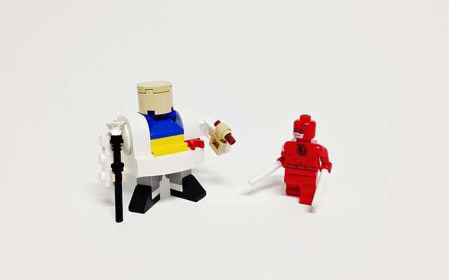

https://www.youtube.com/watch?v=VK1mrTQd8D0

While I am a fan of _Agents of Shield_ and _Agent Carter_, neither show has been able to hook and immerse me the way _The Flash_ and _Arrow_ have. DC has been the truly dominant television force giving us those two great shows, developing cult hit _Constantine_, the up and coming _iZombie_, and soon-to-be introduced _Supergirl_ into the Arrow/Flash universe.

Marvel’s plan to dominate television instead involves using Netflix to release four different shows and then a team up show. Netflix plans to give Daredevil, AKA Jessica Jones, Luke Cage and Iron Fist their own shows and then [bring all the characters together for _The Defenders_](http://screenrant.com/marvel-netflix-deal-tv-shows-daredevil-luke-cage-iron-fist-jessica-jones/). Unlike what DC television is doing — creating separate shows with connected episodes — Marvel is instead taking the same approach to TV as it did to the movies. Each character will receive an entire season for themselves, and then they will all come together (like phase one did with _The Avengers_) for an entire season working as a team.

While this all sounds very promising, I am skeptical — not of the concept, but of the characters Marvel choose to focus on in this universe. We live in a post-Affleck world where _Daredevil_ was forever tainted by a terrible movie. Daredevil is coming to Netflix on April 10; I should have been excited for weeks and months, but the Affleck adaptation and the campy nature of Marvel's other television shows have swallowed any of my expectations.

But then I watched the first trailer (above) and everything changed.

Netflix has a proven track record of creating dark and gritty dramas (_House of Cards_, _Peaky Blinders_) and in retrospect I shouldn’t have doubted them. The _Daredevil_ trailer doesn’t just look good; it feels, sounds and appears phenomenal. Charlie Cox was one of my favorite characters on _Boardwalk Empire,_ but now after seeing him in action and listening to his monologue I have no doubt that his Matt Murdock (Daredevil) interpretation will blow his past work out of the water.

Daredevil doesn’t have super powers and he isn’t a billionaire: he is a blind lawyer that learns to fight the crime he couldn’t put away. The trailer does a great job of alluding to the dark and realistic tone that the show is going to set. This isn’t a man who can take a bullet and keep walking; this is a hero who will bleed and get knocked down but finds the will to keep standing back up. From the trailer and [show runner Steven S. DeKnight's comments](http://www.blastr.com/2015-2-4/daredevils-steven-s-deknight-explains-how-matt-murdock-batman-without-money%E2%80%99), the show will have a very _The_ _Dark Knight_ vibe to how they approach the hero and what his physical limitations will be.

The trailer showed the quality that we can expect from the show in terms of production value and camera work, and [Netflix continues to show that it can rival HBO](http://time.com/3675669/netflix-hbo/) in those standards. The action sequences all looked natural, the special effects realistic; considering the human nature of Daredevil and his villains, I think the viewer can expect this quality throughout the season. The supporting cast of Deborah Ann Woll (_True Blood_), Foggy Nelson (_The Butterfly Effect_) and Scott Glenn (_The Leftovers_) provides a lot of confidence that the show will be powerful from a narrative perspective.

\[caption id="attachment\_2483" align="aligncenter" width="640"\] Daredevil and Kingpin. (Photo provided by Tim Lydy)\[/caption\]

_Daredevil_ will feature the rise of Kingpin, a dominant Marvel villain. Portrayed by actor Vincent D’Onofrio (Law & Order: Criminal Intent), Kingpin is a powerful foe whose driving force is ambiguous — he doesn't run on pure evil, rather something a bit more complicated. The strength of any superhero property ultimately rests on the strength of the villain they combat, and Daredevil got a talented actor for a complex villain inspiring a lot of hope for the show.

In terms of production quality, narrative focus, the interpretation of the character and casting, _Daredevil_ looks almost too good to be true. While casting news has been slowly released over the last year, it wasn’t until this trailer that I officially jumped on the hype train. If you are a fan of _The Dark Knight_\-style superhero interpretation, then _Daredevil_ is definitely a show you should keep on your radar.

