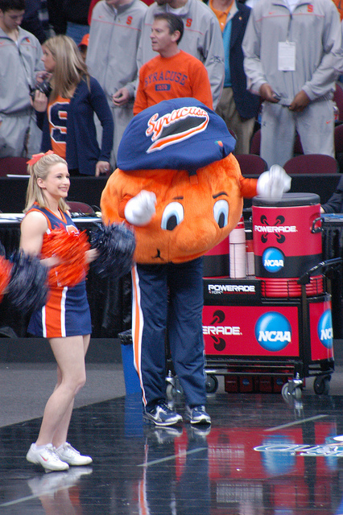

\[caption id="attachment\_2521" align="alignleft" width="426"\] Orange Basketball. [(Provided by Bill Bryan)](http://www.flickr.com/photos/clecameraguy/11214739665/in/photolist-i61tor-8z92s5-e6HuJV-e6P9V1-e6P9Qw-e6P9Lu-bLrQ94-bxx9uj-bLrQsH-4q52N-oyMqCk-6jBUFh-oyMqX8-5J6sXq-7CnDBD-fHqxv3-7zuRkB-5J6tzY-9tQMnX-9tTJNb-9tQMFB-9tTJuE-9tTJh1-9tTK6u-9tQLVp-9tTKxu-9tTKcs-9tQMgV-ain7wg-k3x9dk-oz4Ffi-7eEAyQ-7zyuwh-5J29BR-e6HuFg-e6HuC6-e6HuAz-e6P9HQ-e6HuGg-7zuQma-7zywEY-7zyufj-7zuSt8-7zuVyH-7zuTuZ-7zyvX7-7zuLmH-7zyuEy-7zuJPX-7zytP7)\[/caption\]

Another weird, crazy week in college basketball. My beloved Syracuse Orange won't be going to the NCAA Tournament this year, and it has nothing to do with their performance on the court ([okay, it has a little to do with that](http://www.sportsonearth.com/article/108431192/syracuse-orangemen-self-imposed-ban-jim-boeheim-ncaa)).

SU's self-imposed one-year ban from postseason play has cleared up a spot on the bubble for some lucky team to move up, but it doesn't appear that many are intent on seizing the opportunity.

It was a puzzling week for teams on the bubble as many of them suffered (Stephen A. Smith voice) _highly questionable_ losses.

Every year bubble studiers from around the globe chime in. "The bubble is weak this year," they say, or "this is the weakest bubble ever!" What they don't realize, it seems, is that the bubble is _never _good. It's hard to find 68 teams deserving of a spot in the tournament, "deserving" at least in the traditional sense of the word.

This is what the bubble is. It's a large collection of teams with deeply flawed resumes, grasping at the positives and trying to sweep the negatives under the rug. Like it or not, a team like UCLA or Miami or LSU is going to be in, and a team that's probably better, like an Old Dominion or Wofford or Stephen F. Austin, is going to miss out. It's the way of the world. Better to accept it than to question it.

That said, it's still crowded as hell down there. There are probably 10-12 teams that didn't make the cut this week that could jump all the way in next week if they put together a solid string of victories. Just look at Illinois. The [seventh team out just a week ago](http://www.thehighscreen.com/2015/02/since-u-been-gone-welcome-back-to-college-basketball-america/), the Fighting Illini got a nice boost from the computers and a decent win over Michigan State and the bumped all the way up to an 11-seed.

The NCAA tournament is weird.

**This week's projected bracket**

EAST

MIDWEST

SOUTH

WEST

1\. Virginia (ACC)

1\. Kentucky (SEC)

1\. Duke

1\. Gonzaga (WCC)

2\. Villanova (Big East)

2\. Wisconsin (Big Ten)

2\. Kansas (Big 12)

2\. Arizona (Pac-12)

3\. Louisville

3\. Iowa State

3\. Notre Dame

3\. North Carolina ⇧

4\. Utah

4\. Maryland

4\. Baylor ⇧

4\. VCU (A-10) ⬇

5\. Butler

5\. Northern Iowa (MVC)

5\. Georgetown

5\. Oklahoma ⇧

6\. West Virginia ⬇

6\. Providence

6\. Wichita State

6\. Indiana

7\. SMU (AAC)

7\. Cincinnati ⇧

7\. Ohio State ⇧

7\. Arkansas

8\. Georgia ⇧

8\. Xavier

8\. Oklahoma State ⇧

8\. Stanford ⬇

9\. Iowa ⇧

9\. Texas

9\. San Diego State (MWC)

9\. Michigan State

10\. Texas A&M

10\. Dayton ⬇

10\. LSU

10\. Seton Hall ⬇

11\. Illinois ⇧

11\. LSU ⬇

11\. Purdue ⇧

11\. Colorado State ⇧

12\. SFA (Southland)

12\. Miami (FL) ⬇

12\. Murray State (OVC)

12\. Temple\*

13\. Iona (MAAC)

12\. George Washington

13\. Wofford (Southern)

12\. UCLA\*

14\. Akron (MAC)

13\. Harvard (Ivy)\*

14\. William & Mary (Colonial)

13\. Valparaiso (Horizon)

15\. North Carolina Central (MEAC)

14\. UL Monroe\* (Sun Belt)

15\. North Dakota State\* (Summit)

14\. UC Davis (Big West)

16\. Alabama State (SWAC)16. Saint Francis (NY) (NEC)

15\. High Point (Big South)16. Albany (A-East)

16\. Bucknell (Patriot)16. Sacramento State (Big Sky)

15\. Florida Gulf Coast (A-Sun)16. New Mexico State (WCC)

\*=new entrant

⇧=rising

⬇=falling

**First 10 Out **

1. Old Dominion
2. St. John’s
3. Davidson
4. North Carolina State
5. Boise State
6. Oregon
7. Rhode Island
8. Clemson
9. Tennessee
10. UMass

**Last 10 In**

1. UCLA
2. George Washington
3. Temple
4. Miami (FL)
5. LSU
6. Colorado State
7. Illinois
8. Purdue
9. Seton Hall
10. Texas A&M

**Five Games to Watch on 2/10**

**#10 Notre Dame @ Clemson **

7:00, ESPN2

The Fighting Irish got absolutely exposed by Duke this weekend, and now they are looking to bounce back on the road against Clemson.

Clemson is an intriguing team in terms of NCAA Tournament potential. They don't have great numbers and have some ugly ugly losses (Gardner Webb and Winthrop... ouch). But they have some quality wins over Arkansas, and fellow bubble teams LSU, NC State and "would be bubble team" Syracuse. A win over ND would put the Tigers in serious contention.

As for ND, they've surprisingly won four games already on the road in the ACC, but with a sub-100 SOS they still will need to rack up victories to secure a top four seed.

**Georgetown @ Seton Hall**

7:00, FS1

Suddenly, Seton Hall is a bubble team.

It all happened so quickly I wouldn't blame you if you missed it. The Pirates were in pretty good shape before they decided to lose back-to-back games against Marquette and DePaul, two resume killers in the Big East.

They're still okay for now thanks in large part due to their win over Villanova, but they would be inclined to beat Georgetown again (after a thrilling OT win the first time around) if they want us to forget about their missteps.

**#1 Kentucky @ LSU**

7:00, ESPN

I feel like this will be a weekly thing now. Kentucky will be undefeated, going on the road to play a middle-of-the-pack SEC team and pundits everywhere will wonder if this is the place the dream dies.

Does LSU have a chance here? Sure why not. If Florida can give the Wildcats a game than LSU certainly can. The Tigers are a sneaky efficient offensive group, but there are major questions defensively, and UK will exploit their weaknesses.

The good news is that it's a no-lose scenario for LSU. If they win, they get national attention and put themselves in great bubble shape. If they lose, so what? Everyone loses to Kentucky.

**Cincinnati**** @ Temple **

7:30, CBSS

There are no ranked matchups tonight, but what we do get is several fringe bubble teams getting a chance to prove themselves.

Temple, is in the field right now largely due to their walloping of Kansas, the current #1 team in the RPI.

The Owls have been up and down in the AAC and are in deserpate need of another signature win. It's good news then, that they host Cincinnati tonight, a team that's currently in a tie with them for third place in the American.

**New Mexico @ Colorado State **

11:00, ESPNU

Why bother watching another boring episode of SportsCenter before bed, when you can catch some quality real basketball action on the U?

Colorado State is a team that had an amazing non-confernece run, only to be punched in the mouth a bit in MWC play. They still are 20-4 though, and have a serious chance to do damage if they get to the NCAA Tournament.

To get there however, they need to avoid bad losses from here on out. It's debatable if New Mexico would qualify as a "bad loss" but it certainly wouldn't help. The Lobos are firmly out of the tournament discussion this season after three straight trips, but they are still a dangerous foe behind Cullen Neal.
