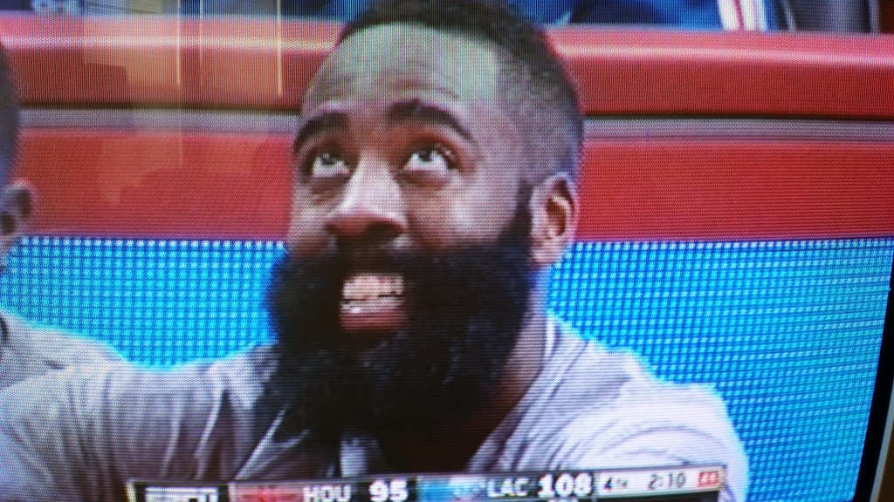

The narrative is right there if you want it bad enough. Go ahead, say it. Tell me that the Rockets lost Wednesday night because of their addiction to the long ball, their neurotic, overly calculated mental-hoops. Enlighten me, oh, Round Mound, on why the Clippers are a real basketball team — _"they are tuuuurifcally talented,"_ [Chuck might say](http://www.nba.com/video/channels/tnt_overtime/2015/02/11/20150210-inside-chuck-analytics.nba/) — and how the Rockets are playing some divergent spectacle of the sport you excelled at decades ago.

Houston bricked a cataclysmic 36 triples on Wednesday, finishing the 110-95 loss against Los Angeles with a flurry of rushed bombs in an attempt to accelerate a comeback; this was coupled with a prolonged Hack-a-Jordan sequence, the kind of theatre only the dirtiest of child predators should be forced to sit through. That Jordan was terrible from the charity stripe (12-26 FTA) in a 15-point victory goes a long way to describe how unpleasant the Rockets performed. Harden, [forever the avatar for Morey ball](http://grantland.com/the-triangle/future-of-basketball-james-harden-daryl-morey-houston-rockets/), finished with a rancid stat line — 3 for 13 FGA, 0-7 3pA, five turnovers — and managed just 3-5 shooting from the line, something like half his usual attempts. In a word, it was an ugly game for the MVP candidate.

\[caption id="attachment\_10898" align="aligncenter" width="627"\] What a mean mug. He must have seen his stat line against the Clippers Wednesday night.\[/caption\]

In a week where Charles Barkley literally called the general manager of a winning NBA team an idiot on national television, then proceeded to insinuate the entire advanced stats community — as if all of us writers are getting together on Tuesday nights to share long strings of code and compare calculators — was a bunch of pathetic dweebs who can't get girls, this game and its outcome was particularly disappointing. I wish no ill will toward the Clippers, and I'm not really into the Rockets, but it is easy to see how someone like Barkley would revel in the result of this game: _See, I told you those 3-ball shooting knuckleheads aren't a good team. I told all those funny lookin' writers that they ain't got no business in a player's game._

**Want to keep reading? Head over to [Crossover Chronicles](http://bloguin.com/crossoverchronicles/?p=10896)!**

