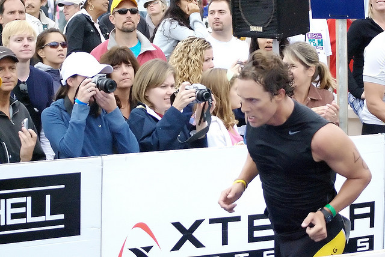

\[caption id="attachment\_2617" align="aligncenter" width="640"\] Matthew McConaughey (Photo provided by Denise Cross Photography)\[/caption\]

In November of 2014, it was reported by the Lincoln Motor Company that [its sales were up 25 percent in October](http://www.hollywoodreporter.com/news/lincoln-sales-surge-matthew-mcconaughey-745926), or since the infamous advertisements starring Matthew McConaughey began. McConaughey’s persona in the Lincoln advertisements is reminiscent to the character he plays on HBO’s _True Detective —_ nihilistic and detached. The director of the ads is Nicholas Winding Refn, who begot 2011’s _Drive_, and who was later responsible for 2013’s _Only God Forgives_. The legacy that Refn has started for himself, and the recent development of McConaughey’s career, are eerily compatible. 

Refn and McConaughey have made five Lincoln commercials together. They are titled: “Intro,” “I Just Liked It,” “Diner,” “Bull,” and “Balance.” They are not detached from one another.  Although each commercial is complete unto itself, their succession from "Intro," to "Balance" depicts McConaughey as a wandering man, struggling toward the realization of a personal and social epiphany.

https://www.youtube.com/watch?v=NcGhLcVqxf0

As the name suggests, “Intro,” presents the themes, which pull back on the viewer like an undertow throughout the advertisement campaign. Movement is its major theme. This might seem redundant to mention; we are discussing a car commercial, after-all. However, like all great American advertisement campaigns, Lincoln is not selling cars to the people, it is selling the people an identity.

Footnote: It is worth mentioning that Acura has been utilizing a campaign strategy that is antithetical to Lincoln’s; the slogan of which is: [“I sell cars. You sell you.”](https://www.youtube.com/watch?v=DmZTB0jcJTk) I have only ever seen these commercials between web-episodes of Jerry Seinfeld’s “Comedians in Cars Getting Coffee.” This is not to say that they do not air elsewhere (I don’t watch much television), but the (seemingly) intentionally restricted broadcast of these Acura commercials, combined with the stated fulfillment of the consumer’s perceived desire not to be sold an identity, is, in fact, still selling the consumer an identity. Acura is selling consumers the identity of a consumer who does not want to purchase an identity. This is classic American advertisement irony.

Movement is the major theme of Lincoln’s advertisement campaign.  Any brand of car can move (we hope), so what Lincoln is selling is personal movement. In “Intro,” McConaughey’s monologue begins: “Sometimes you gotta go back to actually go forward.”  A counterclockwise elliptic rotation of his index finger against his thumb accompanies his philosophy.  This hand gesture, and the apparent symbolism of it, are present throughout the advertisement campaign.  He dismisses the notions that you should go back for sentimental purposes, or to grapple with ghosts. The latter notion can also serve as a meta-joke on his role in _Ghosts of Girlfriends Past_, which represents the collection of romantic comedies that the adolescence of his career was defined by.

https://www.youtube.com/watch?v=u4lklnkk8SU

Meta-humor is an important device that is used in these commercials. In “I Just Liked It,” McConaughey says, “I’ve been driving a Lincoln since long before anyone paid me to drive one.” He is referring to his presence in the enterprise of Lincoln advertising. He breaks the fourth wall, and lets the viewer know that he knows that this is a commercial, which effectively draws attention to the fact that Matthew McConaughey is in a Lincoln commercial. He sort of sticks out his tongue after he says this, perhaps spitting out the bitter flavor of the lie he has told. Or, perhaps, the swift flick of his tongue is innocuous, and Matthew McConaughey really has driven a Lincoln before. Either way, the meta style blurs the lines between the McConaughey the viewer watches in the commercials, and the McConaughey who drives who-knows-what when no one is behind a screen to bear witness. 

http://youtu.be/XBVzg\_Bt6x8

By the time the third installment, “Diner,” appeared, we were no longer sure if we should laugh at McConaughey’s commercials — or rather, _when_ we should laugh. As host of _Saturday Night Live_, Jim Carrey played the role of McConaughey in [three lampoons of the Lincoln commercials](http://www.nbc.com/saturday-night-live/video/lincoln-ad/2822120). Each of Carrey’s three digital shorts asked the commercials the same question: _Who is McConaughey talking to?_ Respectively in each short, Carrey as McConaughey is talking to a booger, two kids who are supposedly not his, and the gentleman from the Allstate commercials.

Each of these three entities are the same entity because they share the property of having been created either by McConaughey or by the automotive industry that McConaughey represents. (I want you to laugh at this syllogism). McConaughey’s booger was produced by the waste in his nose; the kids were produced by his genes; and All State is only possible because automobiles have made insurance necessary. To push this absurd conclusion further (do we really need to?), if human beings are indeed an evolutionary mistake — as Carrey's McConaughey declares, backing up the assertions made by  [Rust Cohle](http://www.imdb.com/character/ch0390328/?ref_=tt_cl_t1) on True Detective — then a booger is no different than offspring. Furthermore (yes, furthermore), automobiles, an extension and realization of human potential for movement, are superficial vermin, and the mission of Allstate to alleviate the problems that occur when something goes wrong with them is absurd because there is already something false about automobiles — it is inherent to their (our) nature. Moving on. 

“Diner” sets McConaughey outside of his Lincoln for the first and only time in his series of Lincoln commercials. The viewer finds him pondering something, but this time he isn’t letting us know what that is. We can’t help but laugh at the morbid seriousness that sets the mood of the commercial. In fact, this morbid seriousness is part of the joke. Suddenly, a downpour of rain stops. This abrupt transition from pouring rain to silence is unusual in nature; however, this narrative stratagem is not unfamiliar to director, Nicholas Winding Refn, who has a schtick for defamiliarization. McConaughey clinks his glass of water with his thumb. The glass of water is a symbol of humanity’s ability to bring order to nature. With it we contain the water for our own purposes, which nature can only release. Lakes, oceans, and ponds can never be consumed at once by our brother, the bear. (Are you laughing yet?) McConaughey interprets the unusual shift in the weather as a sign that it is time for him to begin moving forward. “There we go,” he says, as he opens the moon roof of his Lincoln.

http://youtu.be/FoGGDKV88Fg

“Bull,” depicts McConaughey’s communion with a bull in the road, which he calls either “Old Cyrus,” or “Osiris.” Whatever these possible names refer to, it is clear that McConaughey recognizes the bull (or thinks he recognizes the bull — we're in strange territory). His reconciliation and communion with nature precedes the final chapter of the campaign, “Balance.” 

http://youtu.be/UoSLA9sReD0

Much of Lincoln's advertisement campaign is supposed to be funny, so laugh all you want to, but McConaughey’s final lines in “Balance” resonate as a steadfast truth — as something to live by. He says: “You gotta find that balance, where taking care of yourself takes care of more than just yourself.” I’ll admit, I laugh every time I hear him say that because of the way he delivers the final “yourself.” I laugh because it sounds as if McConaughey was put behind the seat of a Lincoln, and behind Refn’s cameras, without a script; it sounds as if he’s making this stuff up. I think that’s where the truth behind what Lincoln is selling to us lies. None of us have a script to read from. Lincoln seems to be saying, _We get that. So where is forward for you? Where is forward for all of us?_

Although each commercial is complete unto itself, their succession from "Intro" to "Balance" depicts McConaughey as a wandering man, struggling toward the realization of a personal and social epiphany. "Balance" is the realization of his epiphany. In a way, it is an epiphany for all of us.

Lincoln is an American automotive industry. Through its commercials, it is speaking directly to Americans, as well as to the people in the markets that it wants to establish abroad. It wants to sell us an American narrative, but Americans, as well as the rest of the world, have grown weary of that narrative, for important intellectual and emotional reasons; so Lincoln has disguised that narrative.

Consider again McConaughey’s monologue from the first commercial, “Intro.” He says, “I know there are those who say you can’t go back. Yes, you can. You just have to look in the right place.” Compare this to Barrack Obama’s slogan in the 2008 Presidential Election: “Yes we can.”  In 2008, Obama told America that we can go forward.  The collective is always composed by the individual. Individual responsibility produces collective progress. The way forward is always two steps forward, and one step back, on and on and on.  But to tell you that flat-out in our age of irony and simulacra sounds either cliche, pretentious or naive.  Behind the style, behind the verbosity, Lincoln is selling you America. Are you buying?

https://www.youtube.com/watch?v=UTHlXb0PXh4

