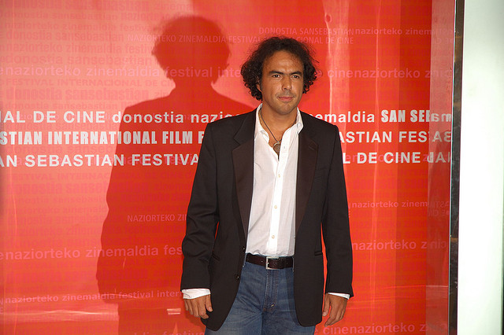

_**“Eloquence, at its highest pitch, leaves little room for reason or reflection, but addresses itself entirely to the desires and affections, captivating the willing hearers, and subduing their understanding.”**_ _**\-David Hume**_

A rather small, public broadcaster in Australia, known as the Special Broadcasting Service (SBS), aired a debate about a decade ago. The broadcast, dubbed Reel Drama, gathered all of Australia’s most influential film minds, mixed them in with youthful dreamers, senile critics and effectively opened the floodgates to a discourse concerning the future of Australian cinema – which, at the time, was considered to be in a tragic state.

One particular filmmaker’s malignant opinions have leeched on to me since the debate. David Caesar, sadly prominent in Australia, entered into a spat with a film critic named Megan Spenser and the ensuing dialogue followed:

_David Caesar: ... I mean, I want to see something that has a beginning, middle and the end and tells me something I didn’t know before._ _Megan Spenser: I’ve got to say, I don’t. I want to see a whole range of films. I want to see depressing; I want to see meaningful. I want to see experimental. I want to see representational. I want to see younger people’s films and voices on screen._ _Caesar: And how many other people in Australia want to do that?_ _Spenser: Sorry?_ _Caesar: I mean how many people want to do it? If we want to have a box \[office hit\] – I mean how many people are going to go and see..._ _Spenser: … I want to see a whole range of films._ _Caesar: I know, but we don’t make a whole range of films._ _Spenser: Well we should make more, shouldn’t we? And for less money._

Caesar is not a monster for these thoughts (says the “politically correct” writer who actually does think he’s a monster), nor do I wish to strike an argument about “this type of film” verse “that type of film.” My agenda concentrates on the subtext of their exchange – the mass audience as a determinant factor of content.

What does this have to do with Alejandro Iñárritu’s _Birdman_?

https://www.youtube.com/watch?v=uJfLoE6hanc

See, I left my apartment in West Hollywood on Oscar Sunday at around 10:00 p.m., drove to the Arclight Cinema on Sunset Boulevard and purchased tickets to an 11:00pm showing of _Birdman_. To my delight, I entered an idyll nine hundred seat Cinerama dome and found that only one other seat was to be filled in this massive space and that seat was for my coat. The next two-and-a-half hours can only be described as what Jesus – I’m sorry – Jason Mraz once said, [“a beautiful mess.”](https://www.youtube.com/watch?v=ZRmGuQfIHkE) It was an empty theater, yet Lubezki’s cinematography imprisoned me in what felt like a singular take, spanning the course of three claustrophobic nights. It was late on a Sunday and I was exhausted, yet I knew insomnia was going to plague my subsequent night of sleep. I was intensely gratified throughout, yet I sobbed for inexplicable reasons at numerous moments. Exceptional. Sensational. Relevant.

Relevant.

Do understand one thing before I continue – positing _Birdman_ as the inspirational force, or as the critical peripeteia to my nascent conclusions about film and the relationship with its viewers, in no way means that _Birdman_ is the decisive text for such a discourse; but Riggan Thompson’s (Michael Keaton) lamentable ennui as a disillusioned icon, simply struck a loose chord within me right before it snapped. Thank you, Iñárritu.

Riggan schizophrenically entrenches himself between the authentic artist and selling out to the lowest common denominator. His judge? The audience. (Everyone reading this just looked around like Peter Griffin before he says, “Uuuh, Lois? Do you think this guy just figured out that the audience drives content? Talk about being late to the party. He’s pretty excited about it. He’s going on and on. What a yam. It’s sad. Hey… Hey, hey, hey… Hey. Hey, Lois?... Butts.”)

Anyway, there is no revelation. I get that. But when do we seriously question the pecking order of, what I have dubbed, “audience masturbation before artist creation?” Film today, and perhaps always, is privy to the oddest critique of any art form. Often, intellectual “snobs” demote film from the ranks of music, theatre, literature, painting, photography and other such muses. Telling filmmakers that they are not artists or that they do not create art is a curiously popular thing to do; it is infuriating, or at least it should be to all filmmakers. For example, you ever think about an intriguing difference between screenplays and stage plays? That only one of them is eligible for a Pulitzer? That, I feel, encompasses the peculiar relationship between the respect for film and art. “Yeah, but a stage play stands on its own as drama. A screenplay only serves the larger film.” Funny, I thought that plays were also written to “serve a larger performance,” created from prose and dialogue. Anyway, you get the picture. (Nobody laughed at that pun, but you all acknowledged it.)

Here is the sick part: filmmakers submit to this proposition. Sam Mendes, director of the timeless — and, because of its own heavily debated Best Picture victory, severely underrated — American Beauty, famously said: “Paintings, novels, poetry, music are all superior art forms. But theater and film can steal from all of them.” Sam, American Beauty is phenomenal, but you are a complete jackass. If any random person said that to me, I would respect their insight and proceed to pick their brain, but when a filmic role model says that about his own craft, I find him utterly egregious. “Hey, my name is Peja Stojakovic.\* Soccer, Cricket, Rugby and Volleyball are all superior sports, but Football and Basketball can steal from all of them.” Peja! What are you saying?!

\* I thought Peja would be appropriate for the metaphor: he is not an all-time great, but a multi-year all-star with a ring and a few special games behind the arc… Sam Mendes made American Beauty. They are the same people. \*

https://www.youtube.com/watch?v=GAyNFLXF-\_k

Factors for this perception of film? Well, for one, Mendes followers walk around places, but another reason is the “audience masturbation before artist creation” conundrum. (Uh, Lois? He…uh…he said it, again). Imagine a photographer that pauses before snapping a photo of a live birth and thinks, “Wait, will museum goers from the age of 18-35 pay money to look at my photo?” Well, fuck. The baby is born and the miracle is over. Think of a painter that ponders, “Well, what if they don’t like it? Forget it, I am going to make coloring books instead.” The next great masterpiece was just trashed. Or, how about a musician that ceases a composition halfway through the first movement because, “No one will enjoy this but me and a few of my high friends.” Stephen A. Smith, I didn’t hear you! “THAT IS ASENINE.”

No, an artist’s work simply cannot be enslaved to an audience’s expectation — and a perceived one at that. Art, however you describe it, is a personal expression of the artist. Art influences the viewer first and foremost, not the other way around, otherwise the product is simply a consumer item created from demand. Photographs are not that. Paintings are not that. Literature is not a conglomeration of stories others want to hear, it is a library of stories that writers want to share. Music is an immediate sensational experience that affects human experience from a particular musician’s aural perspectives. Musicians don’t just produce repeated noise patterns with good movement and play them over and over until audiences want more of the same thing… Oh. Wait. That does happen. Sorry, music seems to have also been stolen by the lowest common denominator, but that isn’t a part of my pay grade.

https://www.youtube.com/watch?v=CcCw1ggftuQ

Listen, even old satirists like Dada – whose sole purpose was to disavow high art and subvert intellectual snobbery – produced intimate and polemic works. Believe me, he did not care about audience reception. He simply had a personal fascination and acted upon it. By doing so, he altered and progressed artistic thinking, like any great piece does. None of these art forms exist in order to fulfill audience desire. They exist because some creative minds think in ways that others never will. Some close their eyes and meditate, but others paint a massive ceiling and, in turn, the populous seeks out what it has not experienced. At least, that practice manifests when “creation actually precedes the viewer’s pleasure.”

Backwards, though, is the film industry, where the first question asked in so many pre-production meetings is, “What is our audience?” Boom. Enter the pigeonhole. There are now only so many options. Can you blame most audiences’ myopic tastes? Absolutely not. If you only speak English to a man for his whole life, he will never learn another language. Mass audience’s see a few different formulaic schemes their whole life and very soon they become unaware and inhospitable to subversive formulas. Now, with that in mind, take a wide snapshot of today’s cinema landscape and tell me what you see. I see something that looks like the Paramount logo mounted between the legs of an androgynous human with “Please Me” written in bold face – sort of like when Larry Flynt, publisher of The Hustler Magazine, ran for president with the logo of a woman straddling the White House – too much entertainment porn.

I mean, just imagine if I walked up to Kobe Bryant and said, “Hey, I think you should shoot less often, you know? It would be better for your game.” Yeah, kind of like how the Lakers are supposedly better without him. (Lois? The…uh… Lakers. Is that a team? You know, is that a team that plays sports?) No! The audience receives, learns, critiques, judges, hates, loves, cries, laughs, sleeps during, ignores and dreams about the creative subject, but does not and cannot control its creation; that entirely defeats the purpose.

“But, audiences just won’t show up, then. Film is driven by money and without these audiences, we lose everything!”

That seems to make sense, expect it doesn’t. Sure, the syntax is sound, but what if diverse styles of films were moneymakers. What if there was a balance between any and all styles, just like the balance between multifarious painting movements, poetic structures and lyrical genres? The audience would then be searching and anticipating something unknown, rather than expecting what has been comfortable, and the art is free to grow – finally.

Patricia Arquette wants equal pay for all genders. That’s great. I want equal representation for film as a respected art form and not just a communicative, corporate empire. Although the victim of my pontification appears to be the audience, the true culprits of this issue are “the powers that be.” Was that ambiguous? Hell yes. Why? Because, it adds flare to the punch line of my following example. Like, seriously, there’ll be jazz hands. Whiplash (See? Jazz hands) grossed about $135,000 on opening weekend. Transformers: Age of Extinction produced somewhere in the ballpark of $100,000,000. What are the differences between these two films? Well, everything. But what is the only difference that matters? Steven Spielberg.

Before people start dawning my conspiracy cape, let me clarify that Spielberg simply represents the ubiquitous “powers that be.” There are many of him, in one capacity or another, and most of them act similarly. In this scenario, he just happens to be the figurehead because he is one of many producers for Michael Bay’s movie. Alright, now we’re coming around the home stretch.

Will Spielberg ever lose money at this point in his career? No. Does he have a massive following? Try billions of people. So, in an imperfect world, if Spielberg (or someone of his elk) decided to fund Whiplash (or a film of its elk) and only ten percent of his following showed up to see it, how much money does Whiplash still make? In relation to its exponentially tighter budget, all math points to Spielberg making bank on opening weekend. More importantly, Steven just introduced millions to a new type of film. Already, our snapshot of the cinematic landscape resembles a more equitable future.

Hey, Transformers should still be made, but if you epitomize a generation in any particular field, then you carry an immense responsibility. Spielberg and his contemporaries control the masses and if their recent track records are any indication, I fear loss.

\[caption id="attachment\_2622" align="alignright" width="640"\] Alejandro Iñárritu (Photo provided by Mario Antonio Pena Zapatería)\[/caption\]

I feel Riggan’s strain as he stands before his daughter, Sam (Emma Stone), allowing her to dismember his illusion and expose his ego, telling him his efforts for recognition and artistic elevation are lost on all but himself. Birdman’s relevance to the immediacy of this discourse intensifies its timeless importance. Riggan rejects the masses of film, but cannot stomach the bitter critics of theater, stuck between two audiences of great evils, trying to masturbate the audience before creating authentically. Yes. Yes. Yes! That is the story of every internal voice in every artist’s head in every corner of today’s world – the doubt, the disillusionment, the self pity, the realization that perhaps we are just critics – and through our curiosities and pulsing fears, we push through it anyway.

David Caesar breaks my heart. Make your films, but do not tell me “no one wants to see new things.” No one knows that they even have that option. And Mr. Mendes, film is only considered inferior because we continue to treat it that way – shame on you. When I see the camera speaking to an audience in Birdman, as cameras should do, instead of regurgitated dialogue, I am hopeful. When I experience a film that adds actual texture to a movie’s sensory palette, like Whiplash, allowing me to feel elements on the screen because of meticulous editing and hyper-real cinematography, I feel rejuvenated. When I see temporal illusions shattered by extraordinary patience in Boyhood, I watch in awe. When I see a flawless homage to still tableaus in Ida, I ache for more. I find filmmakers that treat film as the most important art they have. These filmmakers are few and far between, though, and even fewer and far between are their films. When more filmmakers begin to respect themselves and their own expertise – placing their fresh ingenuity before an audience’s (and this means every single one of us) dull expectations, then perhaps audiences will reciprocate that respect, creating an entirely new vicious circle.

“I would remove your eyeballs… place them in my skull and see the streets the way I used to see them when I was your age,” says Mike Shiner (Edward Norton) in Birdman. If only everyone wanted to do the same with our filmic artists’ eyeballs. Holy shit, that would be something.
