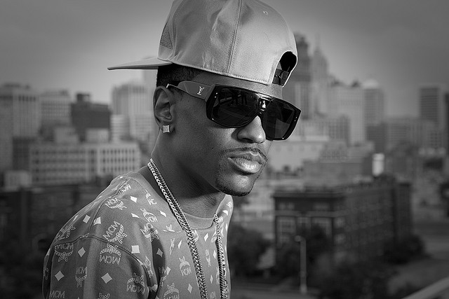

# _Dark Sky Paradise _brings out Big Sean's best qualities and verses.

Coming off _Hall of Fame_, Big Sean did nothing to move from the G.O.O.D. Music on deck circle. It was a lukewarm release that left fans wanting just a little bit more. This was mainly due to the release of _Detroit_, the highly successful mix-tape that was used as a lead-up to _Hall of Fame. _What fans loved about _Detroit_ was its combination of sincerity and charisma. _Dark Sky Paradise_ captures that energy again.

From the first track, "Dark Sky (Skyscrapers)," we're given an insight into the album's thesis: he charcoal black production sets the tone for an introspective look into Big Sean's life. His father, his relationships and his status are growing to be bigger influences on his life at this juncture — instead, of you know, big asses — and he's no longer afraid to share that with listeners. _"I done had a Roley longer than I had relationships / I'm embarrassed to say that shit."_ Big Sean approaches Dark Sky Paradise with the candor fans respect and have come to expect.

_Dark Sky Paradise_ can be split perfectly into two, six-song acts. The first being the attention grabber. [Singles "I Don't Fuck With You" and "Paradise" were released in early fall of 2014 when Big Sean switched his management to Roc Nation](http://radio.com/2014/09/12/big-sean-signs-roc-nation-four-new-songs-listen/) and were considered gems at the time. But their popularity clearly spoke to the power of association — Kanye West is the executive producer of _Dark Sky Paradise_, and IDFWY features another smash hit beat/sample from the Hall of Famer. "Paradise" is an extended version which features another word play ridden verse that does not disappoint and "I Don't Fuck With You," [which is assumed to be about Big Sean's relationship with Naya Rivers](https://www.youtube.com/watch?v=xHg_RNa4pEc&t=2m20s), enjoyed a long run on the Billboard charts and was a no-brainer as an inclusion.

The third single "Blessings," which features Drake, another powerful association, and West, details Big Sean and Drake's appreciation of their success and status, a radio success since it's release.

https://www.youtube.com/watch?v=Bo0WMtwoqtY

The rest of the first half is crafted just as well as the singles. ["All Your Fault"](https://www.youtube.com/watch?v=3puundZvLNA) is another classic Big Sean and West collaboration for the annals of G.O.O.D. Music. West undeniably steals the show with his verse, which includes a Walt Disney reference, a Tom Cruise reference and mentions the injustices surrounding the Eric Garner murder. "Play No Games," is a perfectly mellow track that shows off Big Sean's romantic side put to a sample of new jack R&B group Guy.

\[caption id="attachment\_2607" align="alignright" width="640"\] Big Sean (Photo provided by Dante Marshall of dantemarshall.com/)\[/caption\]

The second half of the album switches up, and is Big Sean taking a strong stab at the sincerity that has been missing from much of his previous accomplishments. "Win Some Lose Some" is one of the most raw looks at himself that Big Sean has released to date. The chorus features uncredited vocals from Jhene Aiko (credited on the album elsewhere) and the song's outro is handled by [Big Sean's father, who is caught in a candid conversation](http://youtu.be/Z1ssp8qSVNU?t=8m43s) and tells Big Sean what his fans already knew, "That's why people love you Sean, because you talk to them from your heart."

"Stay Down" is Big Sean's obligatory crew cut. The song doesn't stand out among others but it does continue one of the major themes of the album, his roots and his origins. Featuring a pretty slick use of wordplay, this track is for exactly what he's rapping about, those who stay down through hard times. "I Know" is where we find the aforementioned Aiko collaboration; this track is an interesting take on a hard relationship told from the views of both parties with Sean and Aiko playing the roles.

"Deep" brings Lil Wayne back for a second album collaboration in a row, and it's a standout. Big Sean addresses his concerns with being underrated and these sentiments are bolstered by Lil Wayne. _"I feel like Sean don't get enough Shine/ Is it because he ain't got the tattoos? He ain't throwin' up signs."_ (Take that hip-hop neophytes with your incredulous Lil Wayne sucks arguments). Big Sean is respected and appreciated and with a closer look, he's certainly underrated. Perhaps it's the combination of his clean image and his positive attitude. Could a mainstream artist that was responsible for elevating Flo-Rida to prominence have questionable judge of character?

"One Man Can Change the World" is Big Sean's heartfelt dedication to [his grandmother who passed away in late 2014](http://www.billboard.com/articles/columns/the-juice/6415136/big-sean-grandma-dies). The song features West and John Legend, who both take turns performing the chorus. The features are a perfect touch on a song like this. Sean, Legend and West — three long-tenured G.O.O.D. Music artists — all add their personal flair to the chorus. The song is the full package, perfect minimal production and features that only add to the honesty of the work.

_Dark Sky Paradise _isn't Big Sean's masterpiece, and at 12 tracks and roughly 50 minutes it's on the shorter end (but that's to be expected when Kanye West is your executive producer). The deluxe version features three new songs including features from PARTNEXTDOOR and Big's boo Ariana Grande. The songs aren't mind blowing but as a whole they're worth a listen. Big Sean should count this as another successful release and another step forward in the right direction. He's raised the bar with each album so far and as a G.O.O.D. Music artist, he continues to build and utilize his unlimited number of resources.

