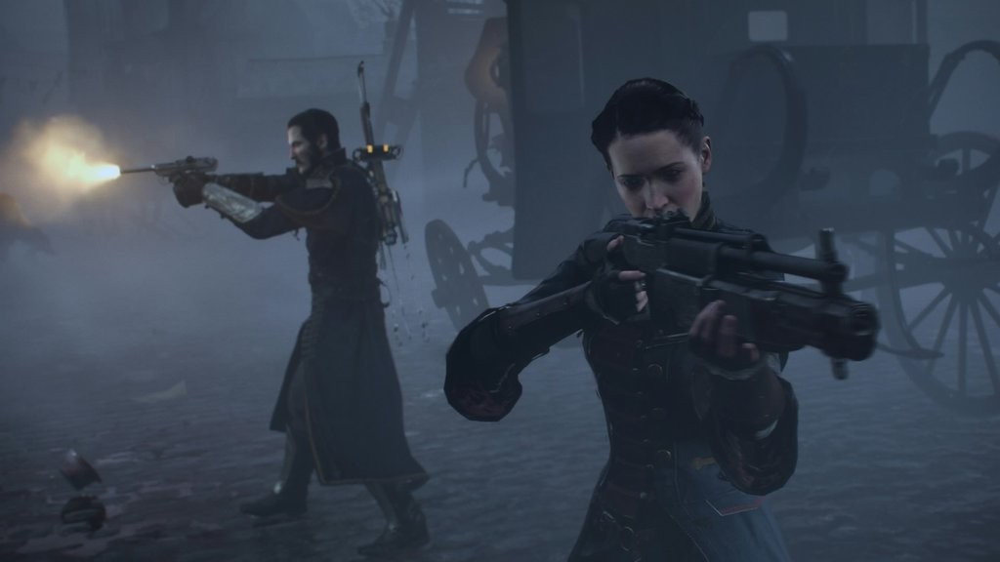

As the price of video games has steadily risen, a growing conversation has developed over the value that gamers deserve from a full price retail experience. This conversation measures the length of a game in contrast to the price, and compares games of the same price based upon length. These talks are dangerous because they promote filler and uninspired sequences that dilute the experience of games.

This dilemma is critical when discussing _The Order: 1886_, a full priced retail release for PS4 advertising as a triple-A blockbuster shooter — a game that only lasts 7-9 hours and is devoid of any replay value. This unfortunately isn’t the greatest problem with _The Order_, a game which suffers from flawed gameplay mechanics and poor pacing. _The Order_ isn’t a terrible game — it is likely a great building block for the future of its franchise — but its flaws should otherwise demand a lower price. And yet, here we are.

_The Order_ is a linear third-person cover based shooter from developer Ready at Dawn. A PS4 exclusive, _The Order_ is [Ready at Dawn’s first ever console game](http://www.foxnews.com/tech/2015/02/20/order-1886-leaps-into-world-blockbuster-video-games/), and may very well be the greatest-looking game of all-time. The game is focused on graphical fidelity and telling a complex narrative; the player follows the Knights of the Round Table in London as they hunt for werewolves and a growing rebel threat using futuristic technology. Though a fantasy title, _The Order_ is an alternate history game that grounds itself with a realistic interpretation of 1886 London while still managing to introduce radios and zeppelins.

_The Order: 1886_ is an unarguably beautiful and captivating game that builds a grounded sense of realism due to its stellar visual quality. Playing through _The Order_ is as close to a movie experience as we have seen yet from games; the texture and world creation set the bar for the industry. This unparalleled visual fidelity partnered with _The Order’s_ sound quality creates a highly immersive game, even in the world’s fantasy setting. The characters lip synching is near flawless, and the facial animations and voice work are incredible.

_The Order_ is, without a doubt, stunning to look at with seamless integration from cut scenes to gameplay; each character is extremely detailed and unique with intricate facial animations and impressive hair and clothing animation. The world itself, while visually stunning, is more of a beautiful background then an interactive world. When environments contain collectibles and are destructible, the world is as immersive as a film. But more often than not, the background is nothing more than a visual set piece with little player involvement.

This level of separation between player and world is heightened by subpar gameplay mechanics. _The Order_ most obviously stands as Sony’s third-person person counter toward _Gears of War_, and in this regard gameplay in _The Order_ feels stiff and unpolished. Transitioning between cover isn’t a smooth and seamless process that one would expect from a cover based shooter, and gunplay varies from unique and innovative to boring and repetitive.

_The Order_ brings to the table a small collection of unique and engaging weapons (such as the [Tesla and Thermite Rifle's](http://www.techtimes.com/articles/12867/20140812/nikola-tesla-secretly-created-weapons-arthurian-knights-order-1886.htm)) but then supplies the player for most of the game with generic and uninspired tools of destruction — basic pistols and automatic rifles. Considering _The Order’s_ narrative, having classic weapons wouldn’t be a problem if the game hand't heavily advertised the more unique collection, only to let player's down with a handful of sequences to use them. The guns control just fine compared to industry standards but lack the punch and weight that can be found in other titles. With that in mind, _The Order_ succeeds again at producing stunningly horrific visuals of enemies losing body parts or being set aflame and highly cinematic melee finishers; but what we are _seeing_ is far superior to what we are _doing_ — sort-of a pivotal aspect of video-gaming, don't you think?

\[caption id="attachment\_2663" align="alignleft" width="620"\] The Order: 1886 (Image provided by godzmask.deviantart.com)\[/caption\]

While _The Order’s_ combat is generic and repetitive, at worst, the lycan sequences are specifically in need of the most improvement. Separate from the normal cover based combat, these sequences that see our werewolf hunters actually fighting lycans are painfully boring and unoriginal. (Which should be impossible when "lycans" and "werewolf hunters" are involved.) Fights with these mighty creatures, which stand as the focus of the games narrative, either occur in quick time event boss battles or warehouse skirmishes. In the warehouse sections, the player stands against a wall taking down charging lycans one at a time. The quick time event boss battles, while visually stunning in its physical combat and violent nature, are button mashing cut scenes with almost no player control or involvement. (Marshawn Lynch would be particularly good at this and I don't mean that as a compliment.)

http://youtu.be/MNpkSyryQz4?t=1m37s

This is a prime example of _The Order’s_ biggest flaw — while the world is stunning visually it loses its sense of immersion because it limits player control interactivity. This isn’t a shot against linear games; titles like _Uncharted_ prove that great experiences can come in a linear narriatively driven format. _The Order_ fails to meet the heights of its fellow Playstation exclusives because even when the player has control, the developer is still dictating every interaction, never relinquishing to the player a sense of freedom.

In a narrative sense, the game triumphs due to such a heavy emphasis on its cinematic presentation. As a result of the attention given to animation and voice work, _The Order_ successfully builds a unique and engaging world with complex characters. _The Order_ chooses to drop the player into the world without giving context, allowing the narrative to slowly unfold and develop over the course of the campaign — similar to a good film. The feature both fails and succeeds, however, for the game — while it's engaging, as a player, to slowly learn more about this detailed world without it being hand-fed, it’s jarring to have common but vital information purposefully withheld for the majority of a game.

The alternate history created by _The Order_ is detailed and engaging. Ready at Dawn stayed very true in many aspects to the 1886 industrial revolution London, while managing to cohesively integrate the Knights of the Round Table with futuristic technology and werewolves. The best reason to purchase _The Order_ is because of the game's ability to craft a narrative of substance; from character creation to its character driven narrative, _The Order_ is a captivating experience.

Like almost everything else in _The Order_, however, its great narrative is not without fault. While many have had issues with the amount of questions and plot threads left unanswered in _The Order’s_ narrative, I find that the game (like many movies, television shows and books before it) left plenty for the sequel to explore. A game should not be faulted for not answering every player question; developing a sense of suspense and leaving questions unanswered is a common part of the entertainment experience in other mediums and games should be no different.

The issue I found within _The Order’s_ narrative was its struggles with pacing. _The Order_ seems to cut too much on its journey. The beginning of the game takes the player from scene to scene only cutting out small portions of travel time; in contrast, the end of the game is jumping around from scene to scene giving the player fairly limited control and skipping large gaps in time. While I commend the game for only providing the player with experiences that were important to the overall narrative, this change in pacing is jarring and takes away from one of the game’s best aspects: it's narrative strength.

In addition to the pacing, the collectibles in _The Order_ were hit or miss. Having narrative collectibles in games is pivotal for world creation and managing secondary stories. _The Order_ has some of these collectibles which flesh out its interesting world, but for some reason also includes a plethora of collectibles which add nothing to the experience and waste the players time. With everything _The Order_ manages to do right (unique guns, immersive world, narrative strength) it is also clumsy (repetitive combat, lack of interactivity, poor pacing).

Ultimately, it’s difficult to recommend _The Order: 1886_ at a full retail price. Even as one of the greatest looking games ever made, its lack of polish or replay value is undeniable. This creates a lack of connection between player and game, and nothing as pretty as _The Order_ should be reduced to something so repetitive and dull and still cost the same amount of money as the latest _Grand Theft Auto_. _The Order: 1886_ has the type of narrative that Ready at Dawn can build a skyscraper franchise with, that much is true, featuring a unique alternate history. Let's hope that future installments of _The Order_ take us closer to the clouds.
