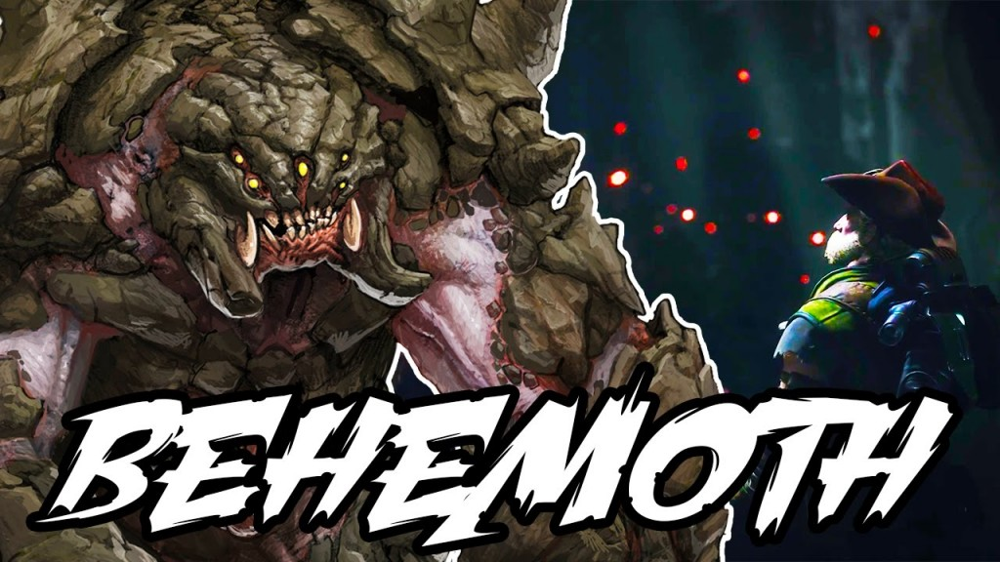

In an industry over saturated with first-person multiplayer shooters, _Evolve_ stands out. While games like _Titanfall_, _Advanced Warefare_, _Destiny_ and _Battlefield Hardline_ straddles the line of originality and predictability, _Evolve_ completely differentiates itself. A first-person shooter that, for the most part, is wholly multiplayer, _Evolve_ provides countless hours of entertainment.

Evolve is a 4v1 multiplayer shooter with no single player campaign (but can be played offline with bots): four players take the role of the hunters, each one playing as a different class and working together to take on the monster; the other player is the monster, a great beast of the planet Shear that hunts wildlife in order to level up gaining new abilities and additional health. This 4v1 gameplay spans a few different game modes — why not more? Ultimately _Evolve_’s biggest weakness is its limited pool of gameplay variety.

It’s not fair to fault _Evolve_ for not having a single player experience; the game focused on fine tuning competitive and balanced multiplayer gameplay, and there are dozens of other successful games that have taken this approach. The difference though is that other multiplayer-only games usually have a large variety of game modes for players to experience. _Evolve_ contains only four different game modes, and the player can only experience three of them by playing through an hour-long evacuation playlist. At any point players can jump into a game of Hunt, but in order to experience Defend, Nest or Rescue, players need to wade through Evacuation — a playlist of these game modes which takes around 40 minutes to an hour. Imagine if the previews at the movie theater took that long? (Actually, they might already.)

The actual game modes themselves are engaging. Hunt, as the flagship mode, finds our four hunters scouring after the monster across one of the games 12 maps. By far the most balanced mode, Hunt stays fresh after hours of play because the variety of match combinations in terms of the monster hunted, the map played on, and which four of the 12 hunters are paired together.

\[caption id="attachment\_2676" align="alignleft" width="620"\] Evolve's Behemoth. (Photo provided by evolvegame.ru)\[/caption\]

Nest and Rescue change the experience by making the Monster a secondary objective; in Nest the hunter team must destroy six monster eggs, which can all be hatched to produce a small minion, while the Monster attempts to last 10 minutes without all eggs being destroyed. Rescue finds our hunters attempting to save five downed colonists while the monster must kill five colonists, and the first to accomplish this wins. Defend, unlike the other game modes, starts the monster at level 3 and provides the monster with 2 respawning minions (level 1 monsters) and then has the Monster attempting to destroy an evacuation ship before time runs out.

Each game mode is like nothing done before in other multiplayer shooters, and this intangible property of something truly unique is _Evolve_’s greatest strength. The game modes shuffle player strategy as well make certain characters and abilities more or less viable; players are forced to change their style when going into Hunt as compared to Defend, helping to keep the game [Bubbreeze](http://grantland.com/hollywood-prospectus/netflix-nbc-tina-fey-unbreakable-kimmy-schmidt-review/) fresh for hours.

After putting upward of 30 hours into the game, though, the good vibrations begin to wane. _Evolve_’s lack of diversity of game modes takes away from the overall experience. From gameplay and character creation to world creation, _Evolve_ is a well polished and addicting game; if it wasn’t for this lack of game mode variety, _Evolve_ would be one of this year’s best titles. Evolve uses the CryEngine (as seen in _Crysis_ or _Ryse: Son of Rome_) to create beautifully detailed landscapes. Visually impressive, _Evolve_ is highly immersive for the hunters as they track the monster through forest or desert. The variety in level design is refreshing, though similar map types tend to blend together; jumping from a forest to a blizzard keeps matches feeling unique, but when you play one desert map after another it’s hard to really distinguish the differences.

The world in _Evolve_ is full of life; plant and wildlife roam the planet Shear’s surface serving as obstacles to the hunters and food for the monster. The wildlife of _Evolve_ each have unique characteristics, are highly detailed and well designed, and are controlled with some of the best AI mechanics seen in video games. The creatures will respond to the player differently based on whether they are hunter or monster, and based on the level of the monster. The best aspect of this world is that as the monster roams through it, leaving permanent impressions of their presence; the monster will alert birds, send animals running, leave tracks, destroy plant life and create a host of visual cues as to its locations. This makes the player feel like they actually have a presence in the world. This interconnectivity with a beautiful world creates a deeper level of engagement then just playing a cinematic experience with no world interaction.

The player controls the monster in third-person, creating a natural separation to the immersive experience found with the hunters, but still manages to be just as enjoyable. Controlling the monster is an empowering experience that is most akin to being in control of a video game boss. Each monster (Goliath, Kracken, and Wraith) controls in a different way; strategy and basic gameplay vary drastically between the three monsters with some valuing stealth and long distance while others get up close and personal. Playing the monster requires the player to go online alone, but it’s incredibly fun to outsmart four opponents even if they are strangers — like a souped-up [The Most Dangerous Game](http://en.wikipedia.org/wiki/The_Most_Dangerous_Game) with none of the consequences.

https://youtu.be/3m\_AfFK-A5s?t=5s

Every monster is incredibly detailed with a host of unique and interesting powers, and at the moment only the Wraith seems to be truly overpowered. Jumping back into the hunters is where _Evolve_ really shines. Playing the monster is incredibly fun, but working as a cohesive team to bring down the monster provides a much bigger sense of accomplishment. This is coupled with the fact that hunters are controlled in first-person making for a much more immersive experience into the detailed world of Shear.

There are currently 12 different hunters separated into 4 classes (medic, support, trapper, assault); one of the most impressive parts of _Evolve_ is that every hunter is viable and every class necessary to win. Having a weak assault is just as detrimental to the team as having a weak medic; the support is by far the least important class (as it serves as a half trapper, half assault) but a calculated use of the support cloaking ability stands as the difference between many wins and losses.

Not only is every hunter viable in _Evolve_, but each one is unique and interesting. Maybe because there is no background or detailed story given to the player that the desire to learn more about the characters is amplified, but the little learned from in-game character interactions has me hungry for more. The characters interact with each other both before and during the match, in dialogues that can be repeated, but with so many different possible combinations that I’m still hearing new ones. Past the great character design (both in terms of graphical appearance and unique personalities) each character plays drastically different.

Each class has three different hunters, and while each hunter in a class contains one identical ability, the other three abilities are entirely unique. While you begin the game with a basic group of four hunters and one monster, the characters unlocked through gameplay are no stronger or more viable then the starting group. Certain characters are better for different game modes (i.e. Maggie for Hunt and Griffen for Nest) but no character in a class is definitively stronger than the rest. The weapons and abilities in _Evolve_ vary from regular shooter rifles and smg’s to more interesting rail cannon’s and arc rifles. In order to defeat the most competent monster players, the hunter has to successfully use all of their abilities as they all have purpose and importance.

Multiplayer shooter gamers will find all of the tight controls and incredible graphics that they look for in a title with _Evolve_, and the game delivers on a multiplayer experience that is distinct, instead of the same team deathmatch with varying weapons and abilities. Playing as the monster is an empowering experience while taking it down provides a sense of accomplishment rarely found in multiplayer games. Players will find themselves spending hours testing all of _Evolve_’s different characters, but will leave a bit disappointed due to the limited amount of game variety provided at launch. Hopefully this means additional game modes will soon grace Evolve, but until then let the Hunt begin.

